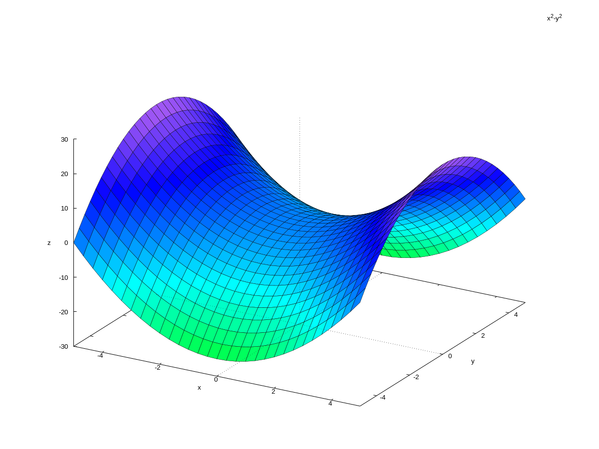
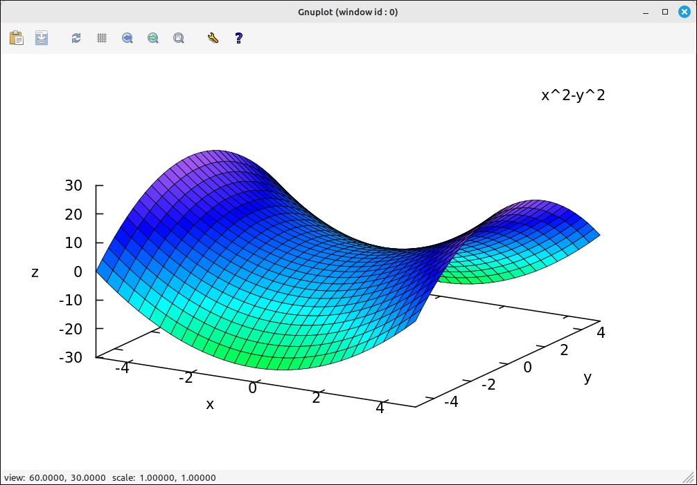

3D Graphs
=========

As with the 2D plots there are several different types of plots you can create with wxMaxima.  We will not go over all of them here but discuss them as needed in the tutorials.  For now we will do some simple plots that you will use most often.

plot3d and wxplot3d
-------------------

To do a 3D plot you can use the menu system to input one or you can use the command (either ``plot3d`` or ``wxplot3d``).  Using the menu will bring up a dialog box with the following options.

- **Expression:** This is the expression that will be plotted.  It can be any legitimate Maxima expression, including CAS input and output designations.
- **Variable:** This is the first independent variable.  The user can also set the range of the viewable portion of the axis.
- **Variable:** This is the second independent variable.  The user can also set the range of the viewable portion of the axis.
- **Grid:** This sets the number of plotted points in each of the two directions to form the surface.
- **Format:** This sets the place the image is displayed.  If inline, the image will be placed in the workspace with all the other outputs.  If gnuplot, the image will be put into an external "gmuplot" window.  The  gmuplot window has more features for manipulating the image but the inline keeps the image with the rest of the calculations.  If xmaxima, the image will be put into an external "xmaxima" window, this has some options but the gmuplot window has more facilities.
- **Options:** This drop-down box has several other options for the plot.
- **File:** This designates if the image is to be saved to a file.  If left blank the image is plotted on the screen.  The file type is eps (encapsulated postscript), you can use image processing software to change it to another file format such as png, jpg, etc.

For example, if we plot :math:`f(x, y) = x^2 - y^2` with the default options, inline, wxMaxima creates the command,

.. code-block:: maxima

    wxplot3d(x^2-y^2, [x,-5,5], [y,-5,5])

and the following image would be added to the workspace,

    :math:`z = x^2-y^2` Inline Plot Example

Note that this is a static image.  Had we used the gmuplot format we would have gotten the following command,

.. code-block:: maxima

    plot3d(x^2-y^2, [x,-5,5], [y,-5,5], [plot_format,gnuplot])

The image would be placed in a new window and no image added to the workspace,

    :math:`z = x^2-y^2` gmuplot Plot Example

Note that the new window has a toolbar for some zooming options, plot options, as well as file saving and clipboard copying.  You can also click and drag the image to rotate the camera around the image.

.. note::

    Specifying other options in the dialog will add in other parameters to the command.  There are many other options for plotting, you should consult the Maxima help system or online resources for details.

