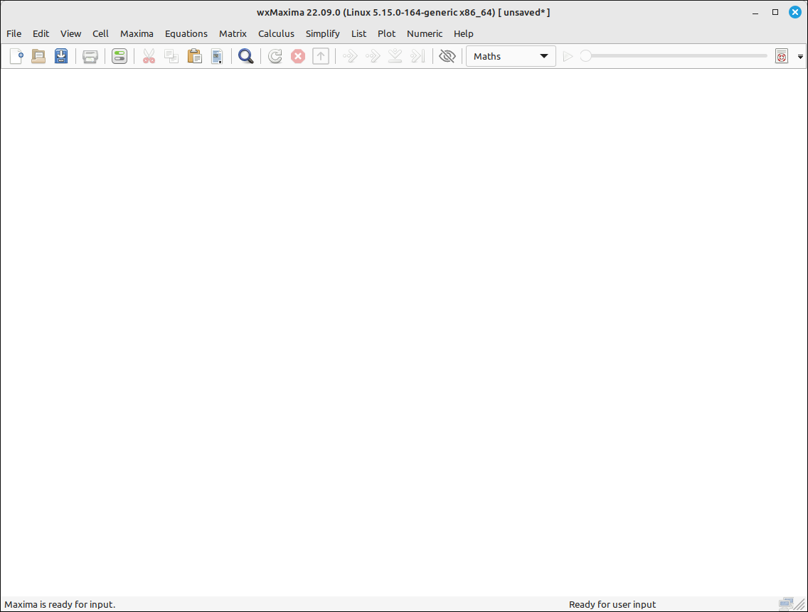

Introduction to Maxima
======================

Maxima is a full-featured computer algebra system (CAS). A CAS is a program that can solve mathematical problems by rearranging formulas and finding a formula that solves the problem as opposed to just outputting the numeric value of the result. In other words, Maxima can serve as a calculator that gives numerical representations of variables, and it can also provide analytical solutions. Furthermore, it offers a range of numerical methods of analysis for equations or systems of equations that cannot be solved analytically. Extensive documentation for Maxima is available in the internet or as part of wxMaxima’s help menu. Pressing the Help key (on most systems the F1 key) causes wxMaxima’s context-sensitive help feature to automatically jump to Maxima’s manual page for the command at the cursor.

wxMaxima is a graphical user interface that provides the full functionality and flexibility of Maxima. wxMaxima offers users a graphical display and many features that make working with Maxima easier. For example wxMaxima allows one to export any cell’s contents (or, if that is needed, any part of a formula, as well) as text, as LaTeX or as MathML specification at a simple right-click. Indeed, an entire workbook can be exported, either as a HTML file or as a LaTeX file. Documentation for wxMaxima, including workbooks to illustrate aspects of its use, is online at the wxMaxima help site, as well as via the help menu. The calculations that are entered in wxMaxima are performed by the Maxima command- line tool in the background.

Program Installation
--------------------

To download wxMaxima (use the including Gnuplot+Maxima versions) for your platform go to `Maxima Download <https://wxmaxima-developers.github.io/wxmaxima/download.html>`_.

Program Layout
--------------

wxMaxima might have an old-school feel to it, it is what we might call a classical CAS.  It is a calculation device, pure and simple, with not a lot of fancy graphical user interface frills you may be used to. On the other hand, what it may lack in user interface it more than makes up for in computational power.  It is command driven with input and output cells that contain the user's input and the resulting output.  Some cells can also contain text to give the workspace a document feel to it. wxMaxima does include an extensive menu system that covers nearly everything we will need in these tutorials.  The menu options open up dialog boxes that help the user formulate the command syntax.  These menu options and subsequent dialogs are not needed, they are just a convenience, the user can input the commands directly into the input cell.

When the program is first run it will have a lot of sidebars on the work area, these contain shortcuts for many of the most used operations.  We have removed them for this tutorial to leave the workspace uncluttered.  The sidebars can be turned on and off using the ``View > Sidebars`` menu option.

    Maxima Layout

