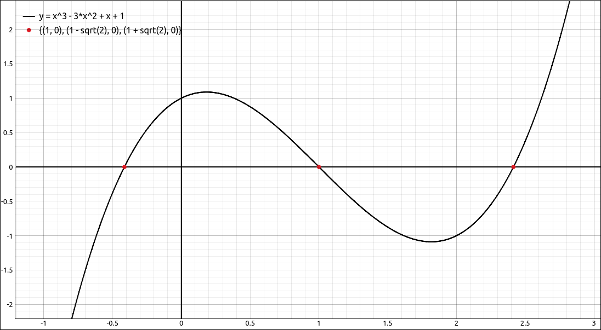
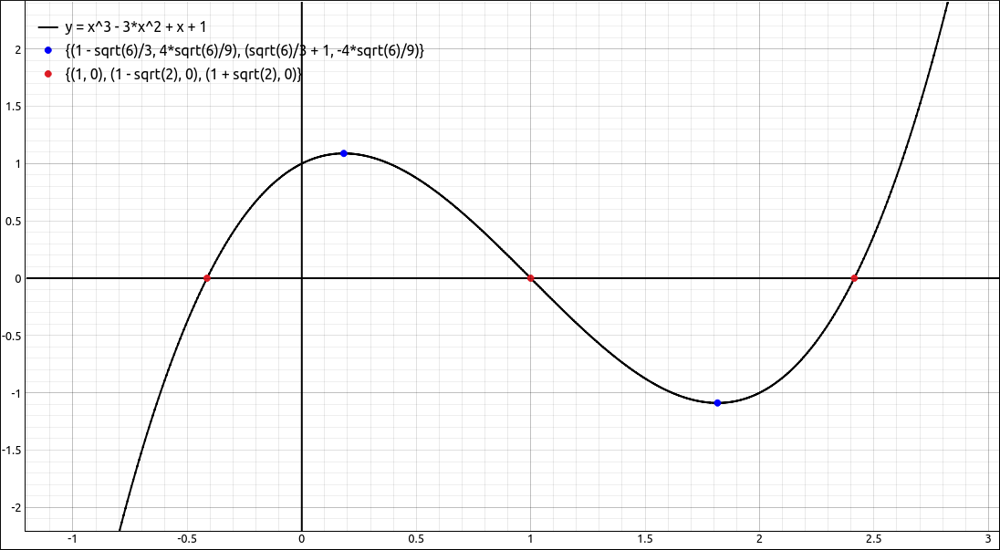

:index:`Approximation and Evaluation`
=====================================

These options allow the user to get a numeric approximation to an expression as well as one to a specified precision.  The user can also evaluate an expression at numeric values or use it to substitute other expressions into an expression.

:index:`Approximate`
--------------------

The Approximate option will approximate the currently selected item to the number of decimal places that is currently set in the preferences.

For example, if we input ``pi`` into the CAS and then select ``Algebra > Approximate`` we get ``3.14159265358979``.

:index:`Approximate to Precision`
---------------------------------

This option allows the user to override the number of decimal places from the preferences and approximate an expression to a different number of places.  When this option is selected a dialog box will appear asking for the number of decimal places.

For example, if we input ``pi`` into the CAS and then select ``Algebra > Approximate to Precision`` and then input 50 for the number of decimal places we get

``3.1415926535897932384626433832795028841971693993751``.

:index:`Evaluate`
-----------------

This allows the user to evaluate and substitute one expression for another.  When selected a dialog box will appear asking the user for a variable or list of variables and an expression or a list of expressions to substitute.  This tool is more general than just substituting for expression variables, we will look at several examples.

- Say we have ``sin(x)`` in the CAS.  If we evaluate this with ``x`` as the variable and ``pi/4`` as the expression we get :math:`\frac{\sqrt{2}}{2}`.

- Say we have ``sin(x)`` in the CAS.  If we evaluate this with ``x`` as the variable and ``pi/12`` as the expression we get :math:`- \frac{\sqrt{2}}{4} + \frac{\sqrt{6}}{4}`.

- Say we have ``sin(x)`` in the CAS.  If we evaluate this with ``x`` as the variable and ``(t-1)^2`` as the expression we get :math:`\sin{\left(\left(t - 1\right)^{2} \right)}`.

We can substitute for several variables at one time, just place a comma between the variables and a comma between each expression.  Here you want the number of variables and the number of expressions to match.

- Say we have ``x^2 + cos(y)`` in the CAS.  For the variables we will input ``x, y`` and for the expressions we input ``3, pi/3`` we get :math:`\frac{19}{2}`.  Note that you can also use list notation, that is, ``[x, y]`` and ``[3, pi/3]``.

This can also be extended to as many variables as you would like.  Also you do not need to substitute for all the variables in the expression.

- Say we have ``x^2 + cos(y)`` in the CAS.  For the variables we will input ``x`` and for the expressions we input ``3`` we get :math:`\cos{\left(y \right)} + 9`.

As we pointed out above, this evaluator is more general than evaluating expressions at its variables.

- Say we have ``-x^2 + (x^2 + 3*x + 2)^2 + 1`` in the CAS, that is, :math:`- x^{2} + \left(x^{2} + 3 x + 2\right)^{2} + 1`.  For the variables we will input ``x^2 + 3*x + 2`` and for the expressions we input ``t+3`` we get :math:`- x^{2} + \left(t + 3\right)^{2} + 1`.

:index:`Evaluate at List`
-------------------------

This allows the user to evaluate and substitute into one expression each entry of a list.  The option has the ability to return a list of results or ordered pairs of inputs and outputs.  When selected a dialog box will appear asking the user for a variable and a list of values to substitute. The inputs for these can be CAS entries as well as literal lists.  This tool is more general than just substituting for expression variables, we can also replace subexpressions with list entries.  For example, say we have ``sin(x)`` in the CAS.  If we evaluate this with ``x`` as the variable and ``[pi/6, pi/4, pi/3, pi, 3*pi/4]`` as the list of expressions, using a list output, we get

.. math::
    \left[ \frac{1}{2}, \  \frac{\sqrt{2}}{2}, \  \frac{\sqrt{3}}{2}, \  0, \  \frac{\sqrt{2}}{2}\right]

If we do the same with ordered pair output we get,

.. math::
    \left[ \left[ \frac{\pi}{6}, \  \frac{1}{2}\right], \  \left[ \frac{\pi}{4}, \  \frac{\sqrt{2}}{2}\right], \  \left[ \frac{\pi}{3}, \  \frac{\sqrt{3}}{2}\right], \  \left[ \pi, \  0\right], \  \left[ \frac{3 \pi}{4}, \  \frac{\sqrt{2}}{2}\right]\right]

As we pointed out above, this evaluator is more general than evaluating expressions at its variables.  For example, say we had :math:`\sin{\left(x \right)} + \cos{\left(x \right)}` in the CAS and we used this option with the variable :math:`\sin(x)` and the list :math:`[1, 2, 3]`, the result would be,

.. math::
    \left[ \cos{\left(x \right)} + 1, \  \cos{\left(x \right)} + 2, \  \cos{\left(x \right)} + 3\right]

In general, this option does not simplify the results of the substitutions it makes, invoking Simplify ot a special simplify option will simplify the entries of the resulting lists.

This option comes in handy to create points or lists of functional values.  The same can be done with the spreadsheet tool but takes a few more steps.  The spreadsheet tool is much more versatile then this option but this option is easier than the spreadsheet for small manipulations.  For example, input :math:`x^{3} - 3 x^{2} + x + 1` into the CAS, and select the solve option to find its *x*-intercepts, the result is, :math:`\left[ 1, \  1 - \sqrt{2}, \  1 + \sqrt{2}\right].`  Now select the polynomial and then this option, for the list input the CAS designation to the list of solutions, let the outputs be ordered pairs.  The result is,

.. math::
    \left[ \left[ 1, \  0\right], \  \left[ 1 - \sqrt{2}, \  - \sqrt{2} - 3 \left(1 - \sqrt{2}\right)^{2} + \left(1 - \sqrt{2}\right)^{3} + 2\right], \  \left[ 1 + \sqrt{2}, \  - 3 \left(1 + \sqrt{2}\right)^{2} + \sqrt{2} + 2 + \left(1 + \sqrt{2}\right)^{3}\right]\right]

which simplifies to

.. math::
    \left[ \left[ 1, \  0\right], \  \left[ 1 - \sqrt{2}, \  0\right], \  \left[ 1 + \sqrt{2}, \  0\right]\right]

Graphing the polynomial and this last output, as a point set, gives,

    Polynomial and Zeros Point Set

In addition, we could take the derivative of the polynomial giving :math:`3 x^{2} - 6 x + 1`, solve it, giving :math:`\left[ 1 - \frac{\sqrt{6}}{3}, \  \frac{\sqrt{6}}{3} + 1\right]`.  Now evaluate the original function at this list with ordered pairs and simplify, giving,

.. math::
    \left[ \left[ 1 - \frac{\sqrt{6}}{3}, \  \frac{4 \sqrt{6}}{9}\right], \  \left[ \frac{\sqrt{6}}{3} + 1, \  - \frac{4 \sqrt{6}}{9}\right]\right]

Plot this along with the rest of the plots and we see,

    Polynomial, Zeros, and Extrema Point Sets

