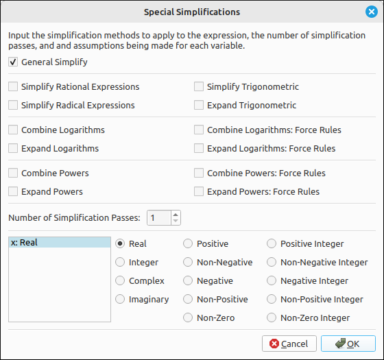

:index:`Simplification`
=======================

One of the most used options will be to simplify expressions.  This program offers several ways to simplify expression, including lists, matrices, and piece wise defined expressions. The Simplify option is a general simplify routine and the Special Simplifications allows more control over what is manipulated.

:index:`Simplify`
-----------------

This is a general simplifying function that will be sufficient for the majority of expressions you need to simplify.  Simply select the item in the CAS you want to simplify and then select this option.  The simplified version will be loaded as a new expression in the CAS.  This option works on simple expressions, matrices, and lists of these.

:index:`Simplify Assuming Real Variables`
-----------------------------------------

This is a general simplifying function as with Simplify except that it will assume that all variables represent real numbers.  The SymPy computer algebra system was designed to process expressions assuming that the variables represent complex numbers.  The system does allow the user to select specific domains for individual variables and a more detailed tool for doing this is the Special Simplifications.  This option will assume that all variables represent real numbers and is quicker than selecting the Special Simplifications option.  Simply select the item in the CAS you want to simplify and then select this option.  The simplified version will be loaded as a new expression in the CAS.  This option works on simple expressions, matrices, and lists of these.

:index:`Special Simplifications`
--------------------------------

The special simplification options are for fine tuning the methods used for the simplifications.  When this option is selected the following dialog box will appear.  The top portion is the set of special methods that can be applied and the bottom portion is the assumptions that you can specify for the variables.

    Special Simplifications Dialog Box

Simplification Methods
^^^^^^^^^^^^^^^^^^^^^^

General Simplify
""""""""""""""""

This is simply a general simplification method that incorporates several of the methods below.  In most cases this will produce a reasonable, but possibly not complete, simplification of the expression.

Simplify Rational Expressions
"""""""""""""""""""""""""""""

This will simplify rational expression.

For example,

.. math::
    \frac{1}{y} + \frac{1}{x}

simplifies to

.. math::

    \frac{x + y}{x y}

Simplify Radical Expressions
""""""""""""""""""""""""""""

This will simplify expressions that contain radicals.

For example, the expression, ``((2 + 2*sqrt(2))*x + (2 + sqrt(8))*y)/(2 + sqrt(2))``

.. math::

    \frac{x \left(2 + 2 \sqrt{2}\right) + y \left(2 + 2 \sqrt{2}\right)}{\sqrt{2} + 2}

simplifies to

.. math::

    \sqrt{2} \left(x + y\right)

Simplify Trigonometric
""""""""""""""""""""""

The Simplify Trigonometric option will combine trigonometric identities when possible.

For example, if we start with the expression,

.. math::

    \sin{\left(x \right)} \cos{\left(y \right)} + \sin{\left(y \right)} \cos{\left(x \right)}

This option will produce,

.. math::

    \sin{\left(x + y \right)}

Expand Trigonometric
""""""""""""""""""""

The Expand Trigonometric option will expand trigonometric identities when possible.

For example, if we start with the expression,

.. math::

    \sin{\left(x + y \right)}

This option will produce,

.. math::

    \sin{\left(x \right)} \cos{\left(y \right)} + \sin{\left(y \right)} \cos{\left(x \right)}

Combine Logarithms
""""""""""""""""""

This option will combine logarithms when possible.  It applies the two identities :math:`\log_b(x) + \log_b(y) = \log_b(x y)` and :math:`a\log_b(x) = \log_b(x^a)` if the variables are in the correct domains.  There are two options that combine logarithms, the ``Combine Logarithms`` option will check the validity of the domains for the variables and the ``Combine Logarithms: Force Rules`` will skip the domain checks and apply the above identities to the expression.  In this case, keep in mind that you are assuming that these rules apply to your expression.

For example, if we have the expression,

.. math::

    a \ln{\left(x \right)} + \ln{\left(y \right)} - \ln{\left(z \right)}

this option will produce,

.. math::

    \ln{\left(\frac{x^{a} y}{z} \right)}

Expand Logarithms
"""""""""""""""""

This option will expand logarithms when possible.  It applies the two identities :math:`\log_b(x) + \log_b(y) = \log_b(x y)` and :math:`a\log_b(x) = \log_b(x^a)` if the variables are in the correct domains.  There are two options that expand logarithms, the ``Expand Logarithms`` option will check the validity of the domains for the variables and the ``Expand Logarithms: Force Rules`` will skip the domain checks and apply the above identities to the expression.  In this case, keep in mind that you are assuming that these rules apply to your expression.

For example, if we have the expression,

.. math::

    \ln{\left(\frac{x^{a} y}{z} \right)}

this option will produce,

.. math::

    a \ln{\left(x \right)} + \ln{\left(y \right)} - \ln{\left(z \right)}

Combine Powers
""""""""""""""

This option will combine powers when possible.  It applies the two identities :math:`x^a y^a = (x y)^a` and :math:`x^a x^b = x^{a+b}` if the variables are in the correct domains.  There are two options that combine powers, the ``Combine Powers`` option will check the validity of the domains for the variables and the ``Combine Powers: Force Rules`` will skip the domain checks and apply the above identities to the expression.  In this case, keep in mind that you are assuming that these rules apply to your expression.

For example, if we have the expression,

.. math::

    n^{y} n^{z} x^{y} x^{z}

this option will produce,

.. math::

    \left(n x\right)^{y + z}

Expand Powers
"""""""""""""

This option will expand powers when possible.  It applies the two identities :math:`x^a y^a = (x y)^a` and :math:`x^a x^b = x^{a+b}` if the variables are in the correct domains.  There are two options that expand powers, the ``Expand Powers`` option will check the validity of the domains for the variables and the ``Expand Powers: Force Rules`` will skip the domain checks and apply the above identities to the expression.  In this case, keep in mind that you are assuming that these rules apply to your expression.

For example, if we have the expression,

.. math::

    \left(n x\right)^{y + z}

this option will produce,

.. math::

    n^{y + z} x^{y + z}

Note that it does not always expand the expression completely.  Another example, if we change ``n`` to ``3`` we have,

.. math::

    \left(3 x\right)^{y + z}

applying this option we get,

.. math::

    3^{y + z} x^{y + z}

then applying this option again results in,

.. math::

    3^{y} 3^{z} x^{y + z}

Passes
^^^^^^

The number of simplification passes is simply the number of times the simplification is executed.  In some cases doing a couple simplifications in a row produces a better outcome.  In these cases a first pass puts the expression into a form that a second pass can reduce further.  On the other hand, it is possible that the first pass puts the expression into a form that the second pass will produce an error.  In these cases the first pass reduced the expression to a form that did not make sense for the second pass.

Variable Assumptions
^^^^^^^^^^^^^^^^^^^^

.. include:: ../CLAE/VariableAssumptionsLow.md

:index:`Simplification Methods`
-------------------------------

These are the same options as with the Special Simplifications above, and the addition of rewriting options.  The difference is that these options will invoke only one simplification method and will not use any assumptions on the variables.  These options can be quicker for the user since they eliminate the use of the dialog box.

Simplify
^^^^^^^^

This is simply a general simplification method that incorporates several of the methods below.  In most cases this will produce a reasonable, but possibly not complete, simplification of the expression.

Simplify Rational Expressions
^^^^^^^^^^^^^^^^^^^^^^^^^^^^^

This will simplify rational expression.

For example,

.. math::
    \frac{1}{y} + \frac{1}{x}

simplifies to

.. math::

    \frac{x + y}{x y}

Simplify Radical Expressions
^^^^^^^^^^^^^^^^^^^^^^^^^^^^

This will simplify expressions that contain radicals.

For example, the expression, ``((2 + 2*sqrt(2))*x + (2 + sqrt(8))*y)/(2 + sqrt(2))``

.. math::

    \frac{x \left(2 + 2 \sqrt{2}\right) + y \left(2 + 2 \sqrt{2}\right)}{\sqrt{2} + 2}

simplifies to

.. math::

    \sqrt{2} \left(x + y\right)

Simplify Logarithmic Expressions
^^^^^^^^^^^^^^^^^^^^^^^^^^^^^^^^

This option will combine logarithms when possible.  It applies the two identities :math:`\log_b(x) + \log_b(y) = \log_b(x y)` and :math:`a\log_b(x) = \log_b(x^a)` if the arguments are in the correct domains.  If the arguments have undefined variables in them it is unlikely that that program will do any simplification to the expression.  If you know that these rules apply to your expressions then you can select ``Simplify Logarithmic Expressions (Force Rules)`` instead to ensure the application of these rules.

Expand Logarithmic Expressions
^^^^^^^^^^^^^^^^^^^^^^^^^^^^^^

This option will expand logarithms when possible.  It applies the two identities :math:`\log_b(x) + \log_b(y) = \log_b(x y)` and :math:`a\log_b(x) = \log_b(x^a)` if the arguments are in the correct domains.  If the arguments have undefined variables in them it is unlikely that that program will do any expansion to the expression.  If you know that these rules apply to your expressions then you can select ``Expand Logarithmic Expressions (Force Rules)`` instead to ensure the application of these rules.

Simplify Trigonometric Expressions
^^^^^^^^^^^^^^^^^^^^^^^^^^^^^^^^^^

The Simplify Trigonometric option will combine trigonometric identities when possible.

For example, if we start with the expression,

.. math::

    \sin{\left(x \right)} \cos{\left(y \right)} + \sin{\left(y \right)} \cos{\left(x \right)}

This option will produce,

.. math::

    \sin{\left(x + y \right)}

Expand Trigonometric Expressions
^^^^^^^^^^^^^^^^^^^^^^^^^^^^^^^^

The Expand Trigonometric option will expand trigonometric identities when possible.

For example, if we start with the expression,

.. math::

    \sin{\left(x + y \right)}

This option will produce,

.. math::

    \sin{\left(x \right)} \cos{\left(y \right)} + \sin{\left(y \right)} \cos{\left(x \right)}

Simplify Powers
^^^^^^^^^^^^^^^

This option will combine powers when possible.  It applies the two identities :math:`x^a y^a = (x y)^a` and :math:`x^a x^b = x^{a+b}` if the variables are in the correct domains.  If the expression has undefined variables, it is unlikely that that program will do any simplification to the expression.  If you know that these rules apply to your expressions then you can select ``Simplify Powers (Force Rules)`` instead to ensure the application of these rules.

Expand Powers
^^^^^^^^^^^^^

This option will expand powers when possible.  It applies the two identities :math:`x^a y^a = (x y)^a` and :math:`x^a x^b = x^{a+b}` if the variables are in the correct domains.  If the expression has undefined variables, it is unlikely that that program will do any expansion to the expression.  If you know that these rules apply to your expressions then you can select ``Expand Powers (Force Rules)`` instead to ensure the application of these rules.

Simplify Logarithmic Expressions (Force Rules)
^^^^^^^^^^^^^^^^^^^^^^^^^^^^^^^^^^^^^^^^^^^^^^

This option will combine logarithms when possible.  It applies the two identities :math:`\log_b(x) + \log_b(y) = \log_b(x y)` and :math:`a\log_b(x) = \log_b(x^a)`, note that these rules are applied no matter what the domains of the variables.  This option should be used only when you can assume that the above rules apply to the expressions. For example, if we have the expression,

.. math::

    a \ln{\left(x \right)} + \ln{\left(y \right)} - \ln{\left(z \right)}

this option will produce,

.. math::

    \ln{\left(\frac{x^{a} y}{z} \right)}

Expand Logarithmic Expressions (Force Rules)
^^^^^^^^^^^^^^^^^^^^^^^^^^^^^^^^^^^^^^^^^^^^

This option will expand logarithms when possible.  It applies the two identities :math:`\log_b(x) + \log_b(y) = \log_b(x y)` and :math:`a\log_b(x) = \log_b(x^a)`, note that these rules are applied no matter what the domains of the variables.  This option should be used only when you can assume that the above rules apply to the expressions. For example, if we have the expression,

.. math::

    \ln{\left(\frac{x^{a} y}{z} \right)}

this option will produce,

.. math::

    a \ln{\left(x \right)} + \ln{\left(y \right)} - \ln{\left(z \right)}

Simplify Powers (Force Rules)
^^^^^^^^^^^^^^^^^^^^^^^^^^^^^

This option will combine powers when possible.  It applies the two identities :math:`x^a y^a = (x y)^a` and :math:`x^a x^b = x^{a+b}`, note that these rules are applied no matter what the domains of the variables.  This option should be used only when you can assume that the above rules apply to the expressions. For example, if we have the expression,

.. math::

    n^{y} n^{z} x^{y} x^{z}

this option will produce,

.. math::

    \left(n x\right)^{y + z}

Expand Powers (Force Rules)
^^^^^^^^^^^^^^^^^^^^^^^^^^^

This option will expand powers when possible.  It applies the two identities :math:`x^a y^a = (x y)^a` and :math:`x^a x^b = x^{a+b}`, note that these rules are applied no matter what the domains of the variables.  This option should be used only when you can assume that the above rules apply to the expressions. For example, if we have the expression,

.. math::

    \left(n x\right)^{y + z}

this option will produce,

.. math::

    n^{y + z} x^{y + z}

Note that it does not always expand the expression completely.  Another example, if we change ``n`` to ``3`` we have,

.. math::

    \left(3 x\right)^{y + z}

applying this option we get,

.. math::

    3^{y + z} x^{y + z}

then applying this option again results in,

.. math::

    3^{y} 3^{z} x^{y + z}

Rewrite
^^^^^^^

Rewrite is a special option that allows the user to apply identities to functions in an expression to rewrite them in terms of other functions.  When this option is selected a dialog box will appear allowing the user to select the new function to use. For example, say we have ``tanh(x)`` in the CAS, and we selected this option.  In the list of functions select ``exp`` (for exponential functions), the result is,

.. math::
    \frac{e^{x} - e^{- x}}{e^{x} + e^{- x}}

This comes in handy for trigonometric functions and for hyperbolic functions.  Many algorithms in SymPy will return hyperbolic functions as answers but the user may wish to work with their exponential function definitions.

Advanced Rewrite
^^^^^^^^^^^^^^^^

The Advanced Rewrite option allows the user to do rewriting of expressions using identities selectively. The Rewrite option above works globally by do all possible replacements to the new function.  With this option the user can select which function to rewrite. When this option is selected a dialog box will appear allowing the user to input the functions to replace and the function used for replacement.  The functions to replace can be a single function or list of functions separated by commas.  The function used for replacement is a single function.  When typing in the functions you use the function name without any arguments.  For example, ``sin``, ``cos``, ``tanh``, etc.

For example, if we have the expression,

.. math::
    \sin{\left(x \right)} + \cos{\left(x \right)} + \tan{\left(x \right)}

in the CAS and we did a Rewrite with ``exp`` as above, the result would be

.. math::
    \frac{i \left(- e^{i x} + e^{- i x}\right)}{e^{i x} + e^{- i x}} - \frac{i \left(e^{i x} - e^{- i x}\right)}{2} + \frac{e^{i x}}{2} + \frac{e^{- i x}}{2}

on the other hand, if we did an Advanced Rewrite, used ``sin, cos`` for the functions to replace and ``exp`` as the function used for replacement, the result is,

.. math::
    - \frac{i \left(e^{i x} - e^{- i x}\right)}{2} + \frac{e^{i x}}{2} + \tan{\left(x \right)} + \frac{e^{- i x}}{2}

Note that in this case the ``tan(x)`` was not altered.  Also note that with Rewrite and Advanced Rewrite the program not rewrite the expression in the form you expect or desire.

:index:`Numeric Simplification`
^^^^^^^^^^^^^^^^^^^^^^^^^^^^^^^

This option attempts to convert decimal approximations into exact expressions that sre close to the decimal approximation.  The range of possible values is limited and these calculations can take some time to complete, even for a relatively simple number. It does, however, give the user a hint at what the approximation might be in exact form.  Note that it is possible that an exact result is returned that is not the mathematical equivalent to the result of the process the approximation was derived.  This option will at the very least convert the decimal expression into a fraction.  Some examples,

- 5.8598744820488384738 is converted to :math:`e + \pi`.
- 7.5531177825718304862 is converted to :math:`\frac{37765588912859152431}{5000000000000000000}`, it came from :math:`- 3 e + 5 \pi`.
- 0.33333333333333333 is converted to :math:`\frac{1}{3}`.
- 0.71428571428571428571 is converted to :math:`\frac{5}{7}`.
- 1.0471975511965977462 is converted to :math:`\frac{\pi}{3}`.
- 3.4651179781941923787 is converted to :math:`\frac{\sqrt{7} \left(21 - 2 \sqrt{35}\right)}{7}` which simplifies to :math:`- 2 \sqrt{5} + 3 \sqrt{7}`.
