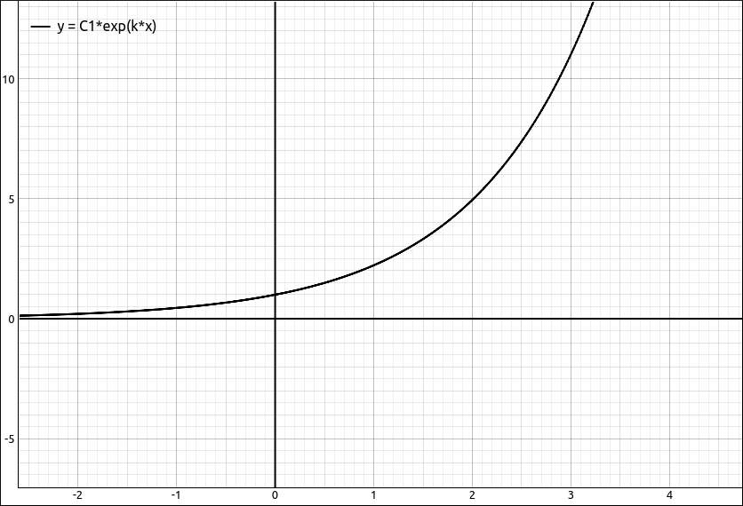
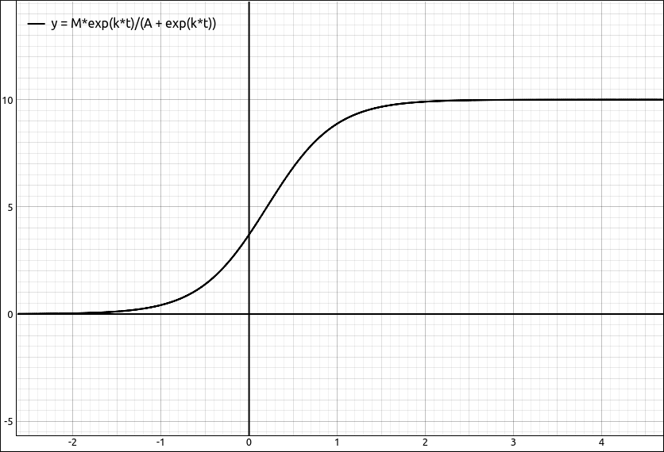

:index:`Ordinary Differential Equations`
========================================

A quick jaunt into Differential Equations is usually done in most Calculus sequences at some point.  This tool is for solving Ordinary Differential Equations (ODE) for those that are normally encountered in Calculus.  Although it can also be used for an introductory Differential Equations class it was not designed to accommodate all the topics seen in one of those courses.

Inputting a Differential Equation into the CAS
----------------------------------------------

The hardest part about using this tool is inputting a differential equation into the CAS.  The syntax here is a cumbersome.

To input the derivative of a function you need to designate a "variable" as a function and then use the ``diff`` syntax to denote a derivative.  The easiest way to designate a "variable" as a function is to use functional notation.  For example, ``f(x)`` will designate ``f`` as a function with independent variable ``x``.  As in mathematics, the name of the function and the independent variable are irrelevant, so ``g(x)``, ``f(t)``, ``g(t)``, and ``george(john)`` are all legitimate functional expressions.  To designate the derivative we add ``.diff(x, n)`` at then end of the expression, where ``x`` is the independent variable and ``n`` is the order of the derivative.  So for example, if we wanted the second derivative of ``f`` with respect to ``x`` we would use the syntax ``f(x).diff(x, 2)``.  The program (really SymPy) also accepts another notation ``Derivative(fct, (var, n))`` where ``fct`` is the function, ``var`` is your independent variable, and ``n`` is the order of the derivative.  So for example, if we wanted the second derivative of ``f`` with respect to ``x`` we could also use the syntax ``Derivative(f(x), (x, 2))``. They are not much different in length and complexity, use whichever you prefer.

As with all equations in this program we assume the equation is equal to 0.  So if we wanted the differential equation :math:`\frac{d^{2}}{d x^{2}} f{\left(x \right)} = f{\left(x \right)}` we would input it as :math:`\frac{d^{2}}{d x^{2}} f{\left(x \right)}- f{\left(x \right)}`, that is, ``f(x).diff(x, 2) - f(x)`` or ``Derivative(f(x), (x, 2)) - f(x)``.

A few examples, 

**Exponential Growth Equation**: :math:`\frac{d}{d x} f{\left(x \right)} = k f{\left(x \right)}` should be altered to :math:`- k f{\left(x \right)} + \frac{d}{d x} f{\left(x \right)}` and can be input as either ``f(x).diff(x)-k*f(x)`` or ``-k*f(x) + Derivative(f(x), x)``.  Note that you can drop the derivative order if it is just the first derivative.

**The Logistic Differential Equation**: :math:`\frac{d}{d t} f{\left(t \right)} = k \left(1 - \frac{f{\left(t \right)}}{M}\right) f{\left(t \right)}`, manipulated to :math:`- k \left(1 - \frac{f{\left(t \right)}}{M}\right) f{\left(t \right)} + \frac{d}{d t} f{\left(t \right)}` can be input with ``f(t).diff(t)-k*f(t)*(1-f(t)/M)``.

**Oscillatory Motion**: :math:`\frac{d^{2}}{d x^{2}} f{\left(x \right)} = -k f{\left(x \right)}` manipulated to :math:`k f{\left(x \right)} + \frac{d^{2}}{d x^{2}} f{\left(x \right)}` can be input as ``k*f(x) + f(x).diff(x, 2)``.

Using the ODE Solver
--------------------

The ODE solver can solve single differential equations as well as systems of differential equations.  Although systems of differential equations are usually not studied in an introductory Calculus sequence this option allows you to solve these systems.

Solving Single Differential Equations
^^^^^^^^^^^^^^^^^^^^^^^^^^^^^^^^^^^^^

Once the ODE is input into the CAS the use of the solver is fairly easy.  When you select this option a dialog box will appear asking the user to specify the function to be solved for, usually this is automatically filled in.  There is also a variable assumptions selection at the bottom.  For more about variable assumptions see the discussion at the bottom of this page.  In most cases you will leave the assumptions alone (everything real) but sometimes you may need to change these.

The output is in the form of an equation, for example, :math:`f{\left(x \right)} = C_{1} e^{- x} + C_{2} e^{x}`.  Most of the time you will want the right hand side of the equation to work with.  To extract the right hand side select ``Algebra > Equations > Right Hand Side``

We will look at several examples.

**Exponential Growth Equation**: :math:`\frac{d}{d x} f{\left(x \right)} = k f{\left(x \right)}` should be altered to :math:`- k f{\left(x \right)} + \frac{d}{d x} f{\left(x \right)}` and can be input as either ``f(x).diff(x)-k*f(x)`` or ``-k*f(x) + Derivative(f(x), x)``.  Note that you can drop the derivative order if it is just the first derivative.  Solving this with the ODE Solver we get the exponential growth equation, :math:`f{\left(x \right)} = C_{1} e^{k x}`.  If we extract the right hand side and then graph the expression we get

    :math:`f{\left(x \right)} = C_{1} e^{k x}`

as well as a slider for the ``C1`` constant that allows the user to see the family of solutions to the differential equation.

**The Logistic Differential Equation**: :math:`\frac{d}{d t} f{\left(t \right)} = k \left(1 - \frac{f{\left(t \right)}}{M}\right) f{\left(t \right)}`, manipulated to :math:`- k \left(1 - \frac{f{\left(t \right)}}{M}\right) f{\left(t \right)} + \frac{d}{d t} f{\left(t \right)}` can be input with ``f(t).diff(t)-k*f(t)*(1-f(t)/M)``.  If we solve this we get,

.. math::
    \frac{M e^{C_{1} M + k t}}{e^{C_{1} M + k t} - 1}

This is not the standard form for the logistic equation.  If you studied logistic growth you are probably expecting something like

.. math::
    \frac{M}{1 + Ae^{-k t}}

Computer Algebra Systems do not always give us expressions in the form we want them in.  We can get closer to what we expect by doing the substitution that we would have done by hand, almost.  If you work through solving the differential equation by hand there is point where you make the substitution :math:`A = -e^{-C_1M}`.  We can do an equivalent substitution here to simplify the expression the program gave us.  Do ``Algebra > Evaluate``, in the variable input we will input the expression :math:`e^{-C_1M}` which can be done with ``E^(-C1*M)`` or ``exp(-C1*M)`` and in the expression input we will put in ``-A``, this returns

.. math::
    - \frac{M e^{k t}}{A \left(-1 - \frac{e^{k t}}{A}\right)}

which simplifies to

.. math::
    \frac{M e^{k t}}{A + e^{k t}}

This is not exactly the form we were aiming for but it is close.  This form also graphs nicely and allows the user to manipulate the graph with sliders for ``M``, ``A``, and ``k``.

    Logistic Curve

It would be better not to have to do some fancy substitutions but it does show that the evaluator is much more powerful than just substituting values into variables.

**Oscillatory Motion**: :math:`\frac{d^{2}}{d x^{2}} f{\left(x \right)} = -k f{\left(x \right)}` manipulated to :math:`k f{\left(x \right)} + \frac{d^{2}}{d x^{2}} f{\left(x \right)}` can be input as ``k*f(x) + f(x).diff(x, 2)``. Solving this differential equation gives us the expected,

.. math::
    f{\left(x \right)} = C_{1} e^{- x \sqrt{- k}} + C_{2} e^{x \sqrt{- k}}

**A First Order Linear Equation**: Say we wish to solve the first order linear equation  :math:`\frac{d}{d x} f{\left(x \right)} - 3 x^{2} f{\left(x \right)} = x^{2}`.  Manipulate this to :math:`- 3 x^{2} f{\left(x \right)} - x^{2} + \frac{d}{d x} f{\left(x \right)}`, which can be input as ``f(x).diff(x) - 3*x^2*f(x) - x^2``.  The ODE solver returns

.. math::
    f{\left(x \right)} = C_{1} e^{x^{3}} - \frac{1}{3}

Solving Systems of Differential Equations
^^^^^^^^^^^^^^^^^^^^^^^^^^^^^^^^^^^^^^^^^

To solve a simultaneous system of differential equations place the differential equations into a list and then invoke the solver.  Each of the differential equations in the list follow the same syntax as is given above for single differential equations.  When the option is invoked the ODE dialog box will appear with a list of functions that were found in the system.  In most cases you will not need to alter this list and simply click OK to solve the system.

When you input a system into the CAS you can input it in one statement or do it in a piecemeal fashion.  For example, say we wanted to solve the system,

.. math::
    \left[ g{\left(x \right)} + \frac{d}{d x} f{\left(x \right)}, \  f{\left(x \right)} + \frac{d}{d x} g{\left(x \right)}\right]

We could input, ``[g(x) + f(x).diff(x), f(x) + g(x).diff(x)]`` or we could input the two differential equations separately,  ``g(x) + f(x).diff(x)`` and ``f(x) + g(x).diff(x)`` and then create a list from these with an expression like ``[R1, R2]``.  As long as the system is in a list before we try to solve it.

When we select the ``Calculus > Solve ODE`` option the function list will look like ``[f(x), g(x)]`` which is good and does not need to be altered.  Clicking OK gives us the result,

.. math::
    \left[ \left[ f{\left(x \right)} = C_{1} e^{- x} - C_{2} e^{x}, \  g{\left(x \right)} = C_{1} e^{- x} + C_{2} e^{x}\right]\right]

Note that it is a list of lists of equations.  If you need to extract the expressions you can use a combination of options from the Edit menu (list manipulation section) to do so.

.. note::

    This will also work on systems of differential equations that are in an :math:`n \times 1` matrix.  For example, the example above could be input as a matrix,

    .. math::
        \left[\begin{array}{c}g{\left(x \right)} + \frac{d}{d x} f{\left(x \right)}\\f{\left(x \right)} + \frac{d}{d x} g{\left(x \right)}\end{array}\right]

    then the solver will return,

    .. math::
        \left[ f{\left(x \right)} = C_{1} e^{- x} - C_{2} e^{x}, \  g{\left(x \right)} = C_{1} e^{- x} + C_{2} e^{x}\right]

Using the ODE Solution Checker
------------------------------

The ODE solutions checker is a convenient tool for checking if an expression or equation satisfies a differential equation.  You can use the evaluation tool from the Algebra menu to do that same thing but the ODE solution checker  uses a stronger set of simplification methods and will, in general, return a better solution.

Checking Solutions to Single Differential Equations
^^^^^^^^^^^^^^^^^^^^^^^^^^^^^^^^^^^^^^^^^^^^^^^^^^^

For a single ODE solution you simply select the differential equation and then select ``Calculus > Check ODE Solution``, a dialog box will appear asking for the function or list of functions and an expression or list or expressions.  Since we are dealing with a single ODE there should only be one function and one expression or equation. When dealing with systems od ODEs there will be lists of them.

The function should be automatically detected and filled in, if not input the function that is being checked, for example, ``f(x)``, ``g(x)``, etc.  For the expression either input the expression you wish to check or more often the CAS designation of the solution you wish to check.  The expression can be either an expression or an equation.

For example, say we input the differential equation ``2*x*f(x)*(2*f(x) + 1) - f(x).diff(x)``, which is,

.. math::
    2 x \left(2 f{\left(x \right)} + 1\right) f{\left(x \right)} - \frac{d}{d x} f{\left(x \right)}

If we do ``Calculus > Solve ODE`` we get the solution, in equation form,

.. math::
    f{\left(x \right)} = \frac{e^{C_{1} + x^{2}}}{2 - 2 e^{C_{1} + x^{2}}}

If we assume that the differential equation came in as ``R1`` and the above solution was ``R2``, to check the solution, select ``R1`` and in the expression input of the checking dialog box input ``R2`` the result is, :math:`\left( \text{True}, \  0\right)`.  The first entry is true or false, true meaning that the solution checks and if it were false that would have meant that the solution did not check.  The second entry in the tuple is the result of the expression after the function has been substituted into the differential equation and simplified.

We could have also just input the expression on the right hand side of the solution equation.  If we select the solution equation then select ``Algebra > Equations > Right Hand Side`` it will extract the right hand side expression, assume it came in as ``R4``.  If we select the differential equation and then ``Calculus > Check ODE Solution``, and then input ``R4`` into the expression input we get the same result.

You do not need to use a CAS result in this option, you can also simply input the expression.  For example,  if we gave the same differential equation to GeoGebra the result would be,

.. math::
    \frac{e^{x^{2}}}{C_{1} - 2 e^{x^{2}}}

If we wished to check this solution we could select the differential equation and then select ``Calculus > Check ODE Solution``, and then input ``exp(x^2)/(C1 - 2*exp(x^2))``, we get the same result :math:`\left( \text{True}, \  0\right)`.

.. note::

    Several notes about the ODE solution checker.

    - First, it may return false even if the solution is a solution to the ODE, it depends if the simplification is powerful enough to return exactly 0 for the check.  In these cases you can also check the solution graphically.  Extract the second expression using options from the Edit manu, and graph it, if it is equivalently 0, that is, graphs as the *x*-axis then the expression should have reduced to 0 and returned true.

    - We could have checked the solution using the evaluation option from the Algebra menu.  Select the differential equation, then select ``Algebra > Evaluate``, input the function ``f(x)`` and the expression for the solution.  Note here we cannot use the equation.  We can still use CAS results.  Then select ``Algebra > Simplify`` to simplify the expression.  You may need to simplify the expression several times.  If the result is 0 then the solution checks.  As with the checker it is possible that the solution is valid but the simplification does not return 0 bt an expression that is equivalently 0.  The above example is a good example of this.  If we use the evaluation if the Algebra menu for this equation and solution we get,

    .. math::
        \frac{2 x \left(1 + \frac{2 e^{C_{1} + x^{2}}}{2 - 2 e^{C_{1} + x^{2}}}\right) e^{C_{1} + x^{2}}}{2 - 2 e^{C_{1} + x^{2}}} - \frac{\partial}{\partial x} \frac{e^{C_{1} + x^{2}}}{2 - 2 e^{C_{1} + x^{2}}}

    which simplifies to

    .. math::
        \frac{x}{4 \sinh^{2}{\left(\frac{C_{1}}{2} + \frac{x^{2}}{2} \right)}} + \frac{x e^{C_{1} + x^{2}}}{e^{C_{1} + x^{2}} - 1} - \frac{x e^{2 C_{1} + 2 x^{2}}}{\left(e^{C_{1} + x^{2}} - 1\right)^{2}}

    and then

    .. math::
        - \frac{x \left(4 e^{C_{1} + x^{2}} \sinh^{2}{\left(\frac{C_{1}}{2} + \frac{x^{2}}{2} \right)} + 2 e^{C_{1} + x^{2}} - e^{2 C_{1} + 2 x^{2}} - 1\right)}{\left(2 \cosh{\left(C_{1} + x^{2} \right)} - 2\right) \left(- 2 e^{C_{1} + x^{2}} + e^{2 C_{1} + 2 x^{2}} + 1\right)}

    if we graph this we get,

    .. figure:: Images/DE003.png
        :alt: Graphic Solution Check

        Graphic Solution Check

    Which appears to be equivalently 0 (for any value of :math:`C_1`) so we would graphically conclude that we have a solution.

    Clearly the algebraic methods in the solution checker are stronger than those of the simplify methods.

Checking Solutions to Systems of Differential Equations
^^^^^^^^^^^^^^^^^^^^^^^^^^^^^^^^^^^^^^^^^^^^^^^^^^^^^^^

Checking the solutions to a system of differential equations is the same as checking a single solution except that we now have lists of functions and expressions.   So in the functions input we have a list of functions and in the expressions input we have a list of expressions or solution equations.

For example, take the system of differential equations we used above, ``[g(x) + f(x).diff(x), f(x) + g(x).diff(x)]``.

.. math::
    \left[ g{\left(x \right)} + \frac{d}{d x} f{\left(x \right)}, \  f{\left(x \right)} + \frac{d}{d x} g{\left(x \right)}\right]

The ODE solver gives us,

.. math::
    \left[ \left[ f{\left(x \right)} = C_{1} e^{- x} - C_{2} e^{x}, \  g{\left(x \right)} = C_{1} e^{- x} + C_{2} e^{x}\right]\right]

Using ``Edit > Extract from List > Extract All List Entries`` it givs us,

.. math::
    \left[ f{\left(x \right)} = C_{1} e^{- x} - C_{2} e^{x}, \  g{\left(x \right)} = C_{1} e^{- x} + C_{2} e^{x}\right]

Assume this is ``R3``.  Select the differential equation, and then select ``Calculus > Check ODE Solution``, the functions input should already have ``[f(x), g(x)]`` in it, which is what we want.  Input ``R3`` for the expressions and click OK.  The result is :math:`\left( \text{True}, \  \left[ 0, \  0\right]\right)`.  As with the single solution output the True means that the equations checked and the two 0s are the results from evaluation and simplification.  We could have also used a list of expressions and not equations.  For example, if we do ``Algebra > Equations > Right Hand Side`` on the solution we will get just the list of expressions,

.. math::
    \left[ C_{1} e^{- x} - C_{2} e^{x}, \  C_{1} e^{- x} + C_{2} e^{x}\right]

Assume this is ``R5``.  If we redo our check using ``R5`` in place of ``R3`` above we get the same result. In this case the program assigns expressions to functions by position.  That is, the function list was ``[f(x), g(x)]`` and the expression list was :math:`\left[ C_{1} e^{- x} - C_{2} e^{x}, \  C_{1} e^{- x} + C_{2} e^{x}\right]` so the program assigns the first expression to ``f(x)`` and the second to ``g(x)``.  That is, it checks the solutions,

.. math::
    \left[ f(x) = C_{1} e^{- x} - C_{2} e^{x}, \  g(x) =  C_{1} e^{- x} + C_{2} e^{x}\right]

.. note::

    As with checking single expressions the program may return false even if the solution is a solution to the ODE system, it again depends if the simplification is powerful enough to return exactly 0 for the check.  In these cases you can also check the solution graphically.  Extract the second expressions using options from the Edit manu, and graph them, if they are equivalently 0, that is, graphs as the *x*-axis then the expressions should have reduced to exactly 0 and the check returned true.

Variable Assumptions
--------------------

.. include:: ../CLAE/VariableAssumptions.md

