:index:`Numeric Curve Fitting`
==============================

There are many different ways to represent data (especially experimental data) as a function or curve that hopefully gives a trend or description of the data.  One of the more prominent methods is to use least squares analysis on a set of data to fit a particular function to the data so as to minimize the sum of the squares of the differences between the data and the prediction given by the function.  All the methods in this submenu use least squares analysis to fit particular curves and the general curve fit allows the user to input their own function to fit.  All of these options will work only on numeric matrices that are n X 2.  So each row represents a point on the plane, the x coordinate is in the first column and the corresponding y coordinate is in column 2.

:index:`General Curve Fit`
--------------------------

This will fit a general curve that is input by the user to a set of numeric data given as an n X 2 matrix where each row represents a point on the plane, the x coordinate is in the first column and the corresponding y coordinate is in column 2.  When the user selects this option a dialog box will appear asking the user for a function to fit the data to.  The expression can be any valid expression including CAS workspace entries.  The restriction here is that x must represent the independent variable and the constants to be solved for are other legitimate variable names.  So for example, ``a*x+b`` would do a linear fit (sometimes called the best line fit), ``a*x^2+b*x+c`` would fit a parabola to the data, ``a*x+b+c*sin(d*x+e)`` would do a combination of a straight line fit and a sine curve fit. For example, lets take the following data, which was created in the 2-D graphics system with the Shift-Click point set interface,

.. math::
    \left[\begin{array}{cc}-5.31348013063019 & 0.286885245901635\\-4.79613282891971 & 3.5655737704918\\-1.98176350761471 & 5.24590163934426\\0.956769166100816 & 3.72950819672131\\2.61228053157435 & -2.00819672131148\\5.07485368771623 & 1.80327868852459\\8.57212144727908 & 2.5\\8.57212144727908 & 7.45901639344262\end{array}\right]

The graph of the data is below,

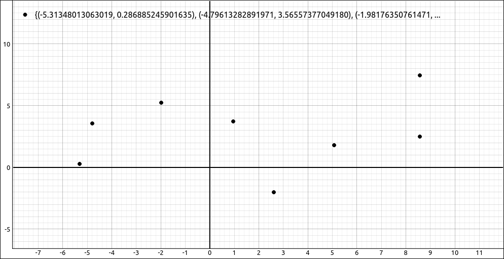

    Data Plot

If we fit this with ``a*x+b`` we get the result, :math:`0.118582773056728 x + 2.61972079220591`.  Note that it automatically fills in the values for a and b so we do not need to do any substitutions. Graphing this curve with the data gives,

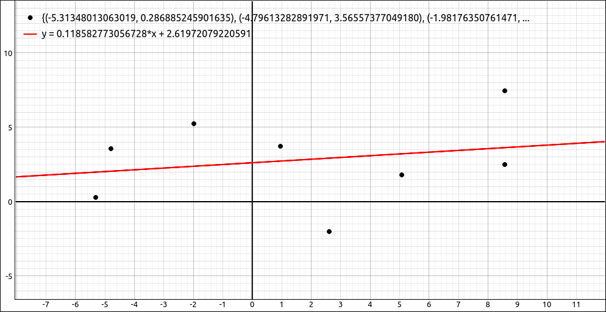

    Linear Curve Fit

If we fit this with ``a*x^2 + b*x + c`` we get the result, :math:`0.0376759221326552 x^{2} - 0.0124061182065538 x + 1.73433865232564`. Graphing this curve with the data gives,

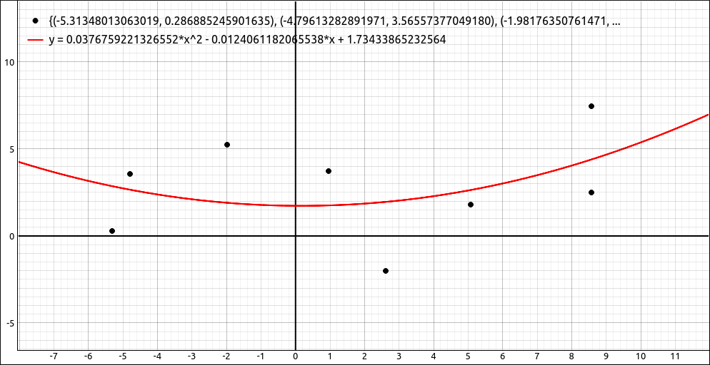

    Quadratic Curve Fit

If we fit this with ``a*x+b+c*sin(d*x+e)`` we get the result,

.. math::
    - 0.107021608117385 x + 3.26745748317642 \sin{\left(0.644677012654187 x + 2.6903659610499 \right)} + 2.85405246983397

Graphing this curve with the data gives,

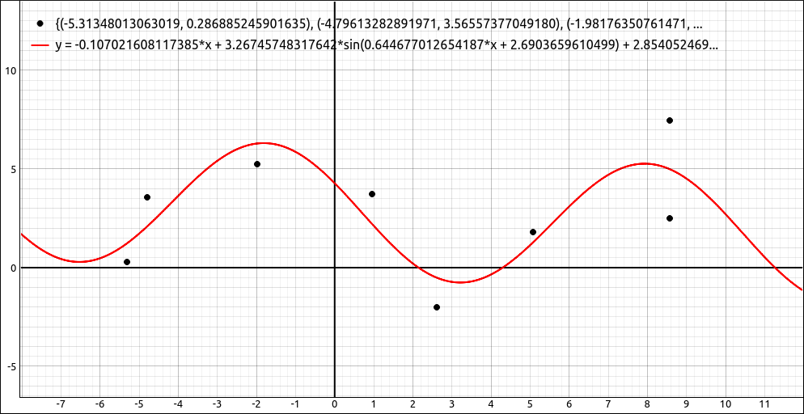

    General Curve Fit

.. note::
    With this and the more specific curve fits below you may use a fit function that is incompatible with the data set, in these cases the program will return an error.

:index:`Linear Fit`
-------------------

This will fit a straight line to the data set, that is, the function ``a*x+b``.  For example, if we use the same data as in the above example,

.. math::
    \left[\begin{array}{cc}-5.31348013063019 & 0.286885245901635\\-4.79613282891971 & 3.5655737704918\\-1.98176350761471 & 5.24590163934426\\0.956769166100816 & 3.72950819672131\\2.61228053157435 & -2.00819672131148\\5.07485368771623 & 1.80327868852459\\8.57212144727908 & 2.5\\8.57212144727908 & 7.45901639344262\end{array}\right]

we get the same result from this option as we did doing a general fit with ``a*x+b``, :math:`0.118582773056728 x + 2.61972079220591`.  Graphing this curve with the data gives,

    Linear Curve Fit

:index:`Polynomial Curve Fit`
-----------------------------

This will fit a polynomial curve to the data set.  When this option is selected a dialog box will open asking the user to input the degree of the polynomial, the selector ranges from degree 1 to 20, which should be enough for most purposes.  For example, say we have the following data set,

.. math::
    \left[\begin{array}{cc}-5.70666407993016 & -3.0327868852459\\-5.14792899408284 & -0.368852459016397\\-3.98907103825137 & 3.19672131147541\\-1.89898793934103 & 2.90983606557377\\-0.698742199372719 & 6.72131147540983\\1.82591263297442 & 7.17213114754098\\2.65366831571119 & 3.89344262295082\\4.59889417014259 & 3.23770491803278\\4.14362854463737 & -1.80327868852459\\6.39926278009506 & -2.37704918032787\\7.33048792317392 & 1.9672131147541\\8.57212144727908 & 7.33606557377049\\7.20632457076341 & 5.61475409836065\end{array}\right]

The graph of the data is below,

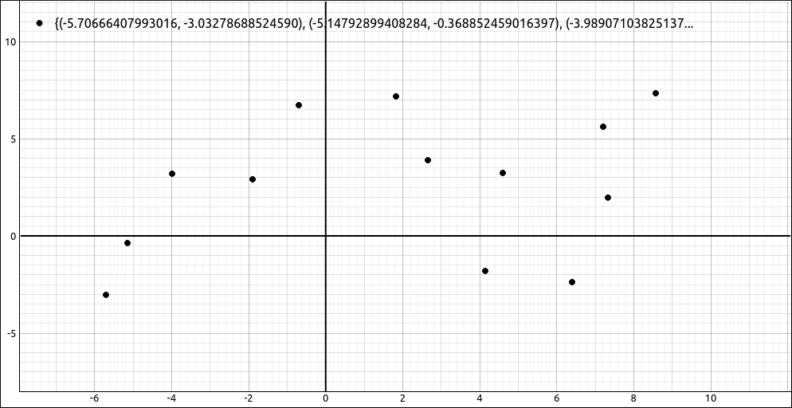

    Data Set

If we do a degree 3 polynomial fit to the data we get,

.. math::
    0.0359648647379016 x^{3} - 0.206513794340373 x^{2} - 0.772143937133485 x + 5.63944122076458

Graphing this curve with the data gives,

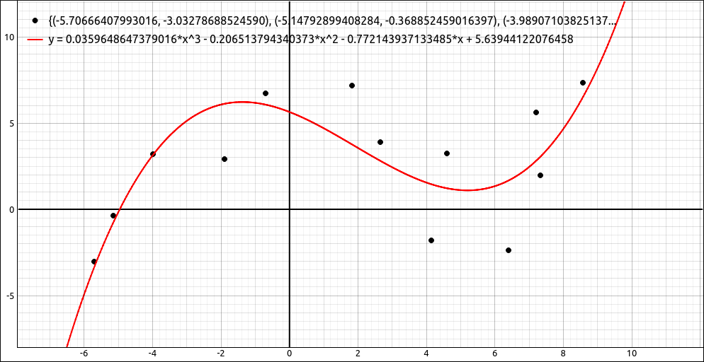

    Polynomial Curve Fit

:index:`Exponential Curve Fit`
------------------------------

This will fit an exponential curve of the form :math:`a e^{bx}` to the data set.  For example, say we have the data,

.. math::
    \left[\begin{array}{cc}-5.80197896957101 & 1.35658914728682\\-3.77710226744005 & 3.13953488372093\\-2.32792580415025 & 2.28682170542636\\1.22553429076585 & 4.14728682170543\\1.90049319147617 & 7.98449612403101\\3.15115233102764 & 10.4651162790698\\3.90551816123329 & 12.6744186046512\\3.8188022687202 & 14.0233406551682\\3.97378106403875 & 19.5304734772006\\6.29846299381698 & 21.2854938270791\end{array}\right]

and we fit an exponential curve, we get,

.. math::
    5.59394816739758 e^{0.224634138018481 x}

Graphing this curve with the data gives,

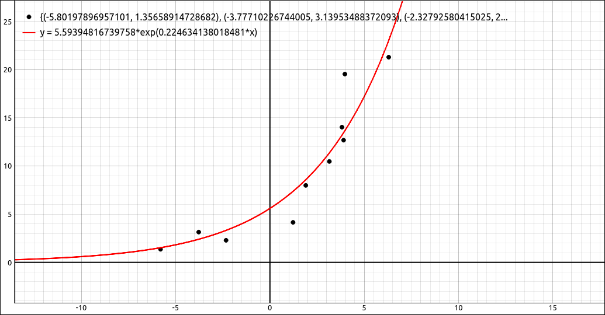

    Exponential Curve Fit

:index:`Power Curve Fit`
------------------------

This will fit a power curve of the form :math:`a x^{b}` to the data set.  For example, say we have the data,

.. math::
    \left[\begin{array}{cc}2.08303976115246 & 1.19353671812567\\3.53984043714682 & 3.61425444209596\\7.13534848853715 & 1.55664437672121\\7.41431032011053 & 5.49031067817294\\6.05049692130731 & 10.1501922968158\\7.69327215168392 & 13.4181612241756\\10.141937117717 & 18.6227043307118\\9.02608979142344 & 22.7984424045605\\0.874205157667785 & 3.61425444209596\end{array}\right]

and we fit a power curve, we get,

.. math::
    0.0785837311599283 x^{2.41533141416445}

Graphing this curve with the data gives,

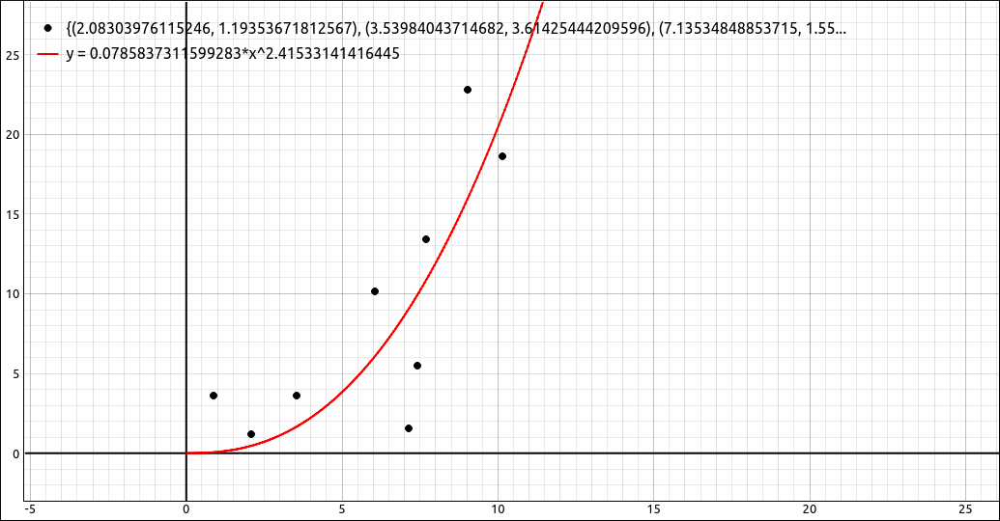

    Power Curve Fit

:index:`Logistic Curve Fit`
---------------------------

This will fit a logistic curve of the form :math:`\displaystyle \frac{M}{1 + a e^{-kx}}` to the data set.  For example, say we have the data,

.. math::
    \left[\begin{array}{cc}0.874205157667776 & 1.37509054742343\\2.98191677400004 & 1.49612643362195\\4.15975561842101 & 1.55664437672121\\4.87265807688633 & 3.19062884040115\\6.17447995756214 & 3.19062884040115\\6.51543330726295 & 6.15600805226476\\6.29846299381698 & 8.39517194693728\\7.78625942887504 & 11.6631408742972\\8.5921491645315 & 10.3922640692128\\9.36704314112424 & 16.4440583791385\\10.0799455995896 & 20.317206737491\\11.4437589983928 & 21.3460117701783\\13.9234197234896 & 23.2825859493546\\16.4340762076501 & 22.3142988597665\\20.1225715362315 & 23.9482833234464\\23.1601559244751 & 23.3431038924538\\18.5107920649186 & 23.1615500631561\\16.8370210754783 & 24.3719089251412\end{array}\right]

and we fit a logistic curve, we get,

.. math::
    \frac{23.6561499531308}{1 + 164.765131259028 e^{- 0.629452963546344 x}}

Graphing this curve with the data gives,

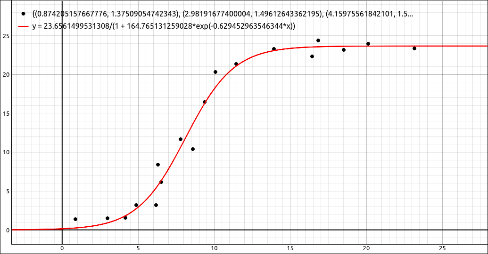

    Logistic Curve Fit

:index:`Sine Curve Fit`
-----------------------

This will fit a sine curve of the form :math:`a \sin(bx + c)+d` to the data set.  For example, say we have the data,

.. math::
    \left[\begin{array}{cc}-8.93855268463662 & 3.41085271317829\\-8.30329724867397 & 2.01550387596899\\-6.15931015230001 & -0.620155038759689\\-4.49176463289804 & -1.66666666666667\\-2.82421911349608 & -2.28682170542636\\-1.71252210056143 & -1.43410852713178\\-0.521418158131455 & 2.32558139534884\\0.610130587177023 & 4.57364341085271\\2.45634169794349 & 5.85271317829457\\4.00477682310246 & 5.15503875968992\\5.2951394274016 & 3.95348837209302\\6.66490896119607 & 1.78294573643411\\7.81630943887838 & -1.51162790697674\end{array}\right]

and we fit a sine curve, we get,

.. math::
    4.26633950087012 \sin{\left(0.440429336257871 x + 0.291922540846352 \right)} + 1.62498424761617

Graphing this curve with the data gives,

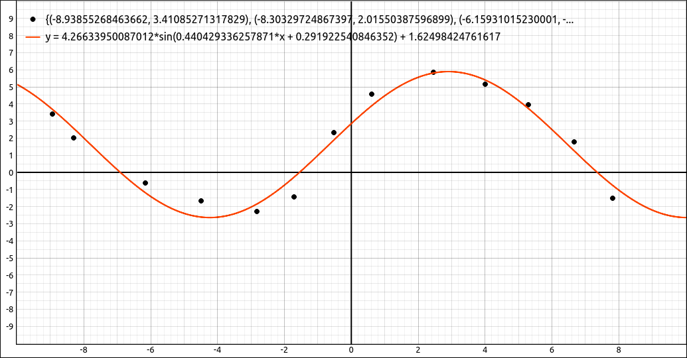

    Sine Curve Fit

:index:`Log Curve Fit`
----------------------

This will fit a log curve of the form :math:`a \ln(x)+b` to the data set.  For example, say we have the data,

.. math::
    \left[\begin{array}{cc}1.10642389652285 & -7.90697674418605\\1.44390334687801 & -4.26356589147287\\1.02701696702751 & -2.36434108527132\\0.868203108036851 & 1.7829457364341\\1.99975185334533 & 4.37984496124031\\1.99975185334533 & 4.37984496124031\\3.44892831663513 & 5.3875968992248\\5.90845230777648 & 4.95728186068498\\8.53650480222602 & 7.35502217213671\\11.9505169211838 & 6.9234289160754\\16.2978560942452 & 7.93047984688513\\14.3575182712404 & 7.69070581573996\end{array}\right]

and we fit a log curve, we get,

.. math::
    3.78318152659784 \ln{\left(x \right)} - 1.65585364786444

Graphing this curve with the data gives,

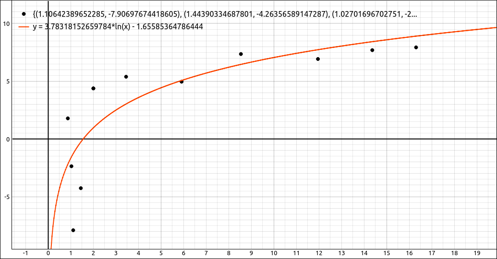

    Log Curve Fit

:index:`Calculate R^2 for Data and Function`
--------------------------------------------

One measure of the goodness of fit is the :math:`R^2` value of the function and data set.  To calculate the :math:`R^2` value select the data set, then select this option.  A dialog box will appear asking the user for the function to test.  This can be any valid formula including CAS workspace entries but since you are probably testing a curve you already calculated using one of the above methods all you need to do is input the CAS designation for the curve, such as ``R1``, ``R2``, ``R3``, etc.

For example if we use the previous example, the data,

.. math::
    \left[\begin{array}{cc}1.10642389652285 & -7.90697674418605\\1.44390334687801 & -4.26356589147287\\1.02701696702751 & -2.36434108527132\\0.868203108036851 & 1.7829457364341\\1.99975185334533 & 4.37984496124031\\1.99975185334533 & 4.37984496124031\\3.44892831663513 & 5.3875968992248\\5.90845230777648 & 4.95728186068498\\8.53650480222602 & 7.35502217213671\\11.9505169211838 & 6.9234289160754\\16.2978560942452 & 7.93047984688513\\14.3575182712404 & 7.69070581573996\end{array}\right]

the curve,

.. math::
    3.78318152659784 \ln{\left(x \right)} - 1.65585364786444

Graphing this curve with the data gives,

    :math:`R^2` Calculation

If we select the data and then input the designation for the curve we get, 0.634245782658166 for our :math:`R^2` value.

:index:`Linear Curve Fit to Points`
-----------------------------------

This option creates a piecewise defined function that is a sequence of straight lines between the given data points.  For example, if the data set is,

.. math::
    \left[\begin{array}{cc}6 & 4\\1 & 2\\4 & 1\\2 & 3\\9 & -5\end{array}\right]

This option produces,

.. math::
    \begin{cases} x + 1 & \text{for}\: x \geq 1 \wedge x \leq 2 \\5 - x & \text{for}\: x \geq 2 \wedge x \leq 4 \\\frac{3 x}{2} - 5 & \text{for}\: x \geq 4 \wedge x \leq 6 \\22 - 3 x & \text{for}\: x \geq 6 \wedge x \leq 9 \end{cases}

When graphed with the points we get,

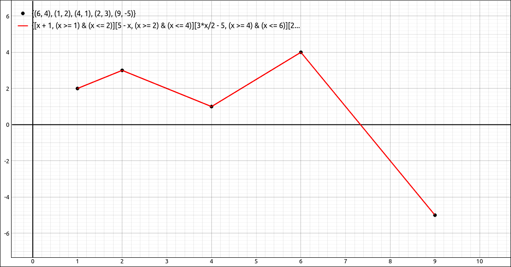

    Linear Curve Fit to Points Example

Note that with this option the *x* values must be numeric but the *y* values may contain variables and expressions containing variables.  When graphed, the variables will come in as sliders to the graphics system.  Note also that the independent variable is set to *x*.  So *x* should not be a variable in any expression in the point list.

:index:`Quadratic Curve Fit to Point Pairs`
-------------------------------------------

This option creates a piecewise defined function that is a sequence of quadratic functions between sets of three consecutive data points (that is point division pairs).  These are the same quadratic functions that are produced in Simpson's method for approximating an integral.  Since this requires pairs of divisions between points there must be an odd number of points in the data set.  For example, if the data set is,

.. math::
    \left[\begin{array}{cc}6 & 4\\1 & 2\\4 & 1\\2 & 3\\9 & -5\end{array}\right]

This option produces,

.. math::
    \begin{cases} - \frac{2 x^{2}}{3} + 3 x - \frac{1}{3} & \text{for}\: x \geq 1 \wedge x \leq 4 \\- \frac{9 x^{2}}{10} + \frac{21 x}{2} - \frac{133}{5} & \text{for}\: x \geq 4 \wedge x \leq 9 \end{cases}

When graphed with the points we get,

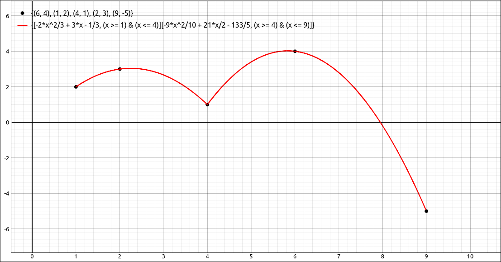

    Quadratic Curve Fit to Point Pairs Example

Note that with this option the *x* values must be numeric but the *y* values may contain variables and expressions containing variables.  When graphed, the variables will come in as sliders to the graphics system.  Note also that the independent variable is set to *x*.  So *x* should not be a variable in any expression in the point list.

:index:`Lagrange Polynomial Curve Fit`
--------------------------------------

This option creates the Lagrange Polynomial for the set of points. Which is the unique polynomial of degree :math:`n-1` (or less) that passes through the :math:`n` data points.  The *x* values in the point set must all be distinct for this fit.  For example, if the data set is,

.. math::
    \left[\begin{array}{cc}6 & 4\\1 & 2\\4 & 1\\2 & 3\\9 & -5\end{array}\right]

This option produces,

.. math::
    - \frac{5 x^{4}}{84} + \frac{289 x^{3}}{280} - \frac{697 x^{2}}{120} + \frac{1693 x}{140} - \frac{184}{35}

When graphed with the points we get,

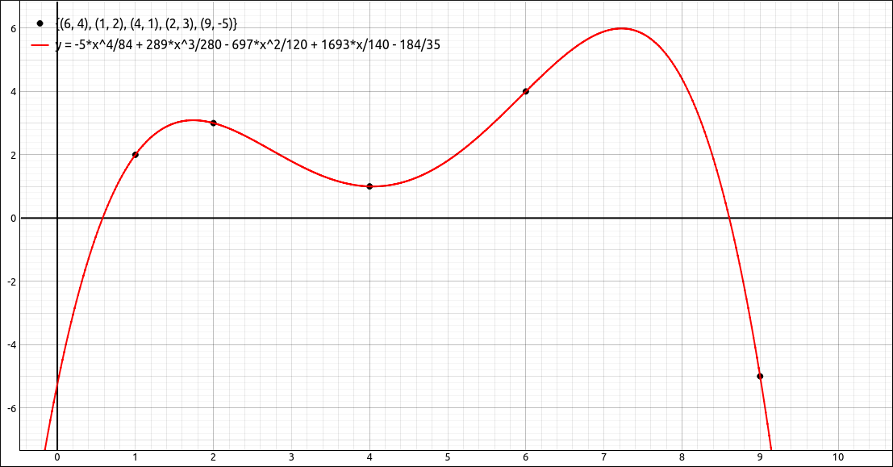

    Lagrange Polynomial Curve Fit Example

Note that with this option the *x* and *y* values may contain variables and expressions containing variables.  When graphed, the variables will come in as sliders to the graphics system.  Note also that the independent variable is set to *x*.  So *x* should not be a variable in any expression in the point list.

:index:`Natural Cubic Spline Curve Fit`
---------------------------------------

This option creates a piecewise defined function that is a sequence of cubic functions between each pair of points. These cubic functions are generated from a natural cubic spline method so that the first and second derivatives are continuous at the data points. For example, if the data set is,

.. math::
    \left[\begin{array}{cc}6 & 4\\1 & 2\\4 & 1\\2 & 3\\9 & -5\end{array}\right]

This option produces,

.. math::
    \begin{cases} \frac{159 x}{104} - \frac{55 \left(x - 1\right)^{3}}{104} + \frac{49}{104} & \text{for}\: x \geq 1 \wedge x \leq 2 \\\frac{29 x^{3}}{52} - \frac{513 x^{2}}{104} + \frac{675 x}{52} - \frac{100}{13} & \text{for}\: x \geq 2 \wedge x \leq 4 \\- \frac{15 x^{3}}{26} + \frac{903 x^{2}}{104} - \frac{2157 x}{52} + \frac{844}{13} & \text{for}\: x \geq 4 \wedge x \leq 6 \\\frac{59 x^{3}}{312} - \frac{531 x^{2}}{104} + \frac{165 x}{4} - \frac{1307}{13} & \text{for}\: x \geq 6 \wedge x \leq 9 \end{cases}

When graphed with the points we get,

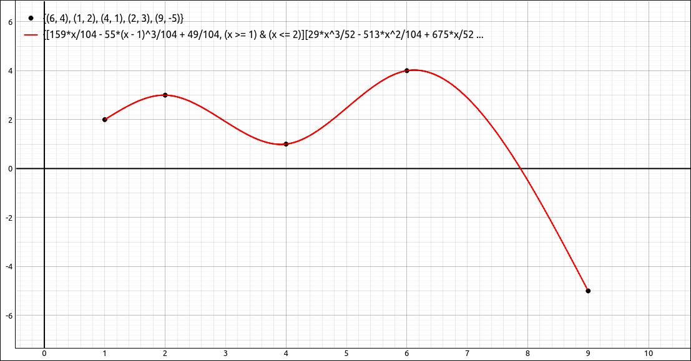

    Natural Cubic Spline Curve Fit Example

Note that with this option the *x* values must be numeric but the *y* values may contain variables and expressions containing variables.  When graphed, the variables will come in as sliders to the graphics system.  Note also that the independent variable is set to *x*.  So *x* should not be a variable in any expression in the point list.

.. note::

    The curve fits,

    - Linear Curve Fit to Points
    - Quadratic Curve Fit to Point Pairs
    - Lagrange Polynomial Curve Fit
    - Natural Cubic Spline Curve Fit

    are all designed to pass through every point in the data set.  Hence there is no need to calculate an :math:`R^2` value for these fits since in all cases, :math:`R^2 = 1.`  If the curves for these four fits are entirely numeric (no variables in the point sets) you can calculate :math:`R^2` as is discussed above, and you will get 1.  If there were variables in the data point sets, and hence in the curve equations, the :math:`R^2` calculation will be unreliable, and probably nonsense.

