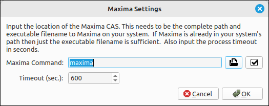
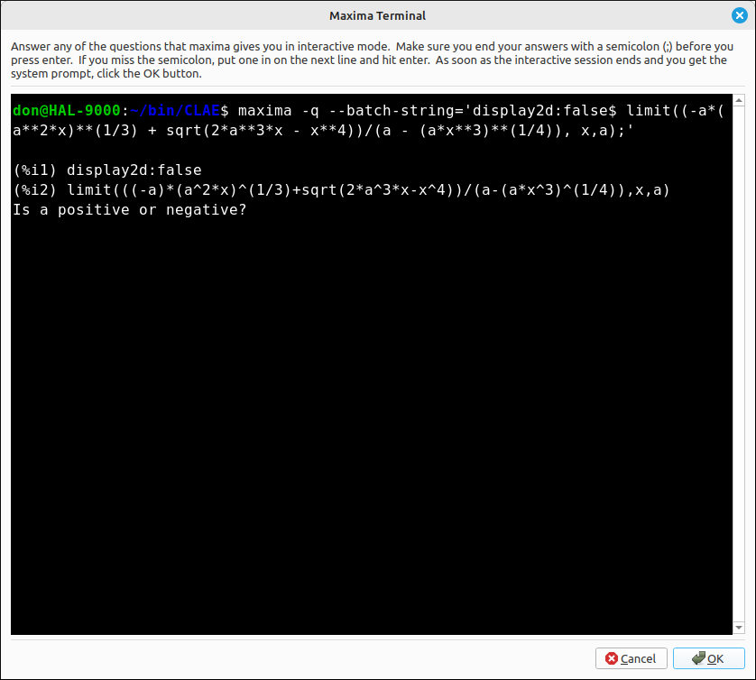
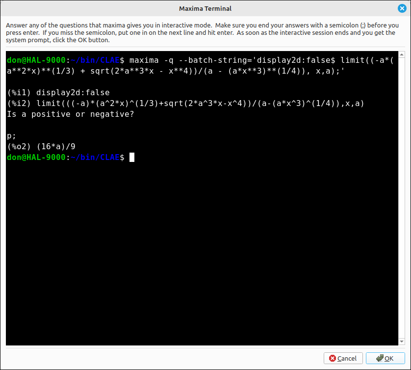
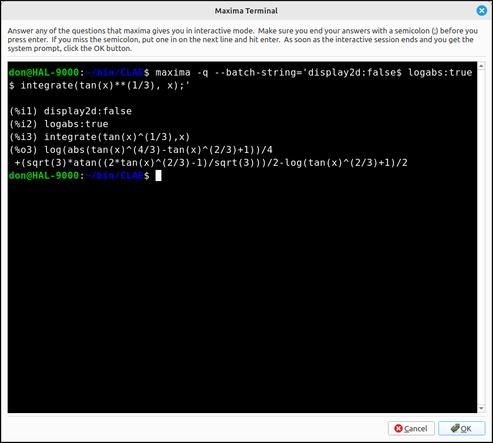

:index:`Maxima Introduction`
============================

This is a completely optional part of the CLAE application.  CLAE uses the SymPy computer algebra system to do the vast majority of its computations.  Some numerical computations are done with SciPy and NumPy but all of the symbolic computations are done with SymPy.  As with all computer algebra systems the package has its strengths and weaknesses. We included an set of options that will run commands in the Maxima CAS and return them to CLAE.  This allows the user to harness the power of two computer algebra systems.  The Maxima interface does not use all the Maxima functionality, in fact only a small portion of it.  The interface also does not mimic all the functions that are included through the SymPy computer algebra system.  The Maxima interface concentrates on some of the algebra and Calculus functionality that is also available with the SymPy interface.

There is nothing in the CLAE application that requires the use of Maxima, it is completely optional.  If it is installed and configured for CLAE then the user can use both systems for a large number of computations. So if one CAS does not return an answer it is possible that the other will.  In addition, they use different algorithms for the computations, so if one returns a bizarre answer it is possible that the other will return a more canonical form to the solution.

Note that you do not need to know or use any Maxima syntax.  You will input expressions and values in the same syntax as CLAE uses.  When a Maxima option is selected it will reformulate the CLAE syntax into Maxima syntax, run the command behind the scenes, and then translate the result back to CLAE.  So there are no additional functions or commands you need to learn.

The Maxima Application
----------------------

Maxima is a full-featured computer algebra system (CAS). A CAS is a program that can solve mathematical problems by rearranging formulas and finding a formula that solves the problem as opposed to just outputting the numeric value of the result. In other words, Maxima can serve as a calculator that gives numerical representations of variables, and it can also provide analytical solutions. Furthermore, it offers a range of numerical methods of analysis for equations or systems of equations that cannot be solved analytically...

Program Installation
--------------------

To download Maxima or wxMaxima (which includes Maxima) for your platform go to `wxMaxima Download <https://wxmaxima-developers.github.io/wxmaxima/download.html>`_ or `Maxima Download <https://maxima.sourceforge.io/download.html>`_.

Linking Maxima to CLAE
----------------------

To link Maxima to CLAE you simply need to tell CLAE where Maxima is on your system.  Select ``Edit > Preferences > Maxima Settings`` to open up the preferences dialog for Maxima, shown below.

    Setup Dialog for Maxima

In the Maxima Command input bar input the location and executable filename for Maxima.  If Maxima is already in your system path then, ``maxima`` or ``maxima.exe`` on Windows will be sufficient.  If Maxima is not in your path you will need to include the path before the executable filename.  In the example above, I have Maxima included in my path so ``maxima`` is sufficient.  On the other hand, I could also use ``/usr/bin/maxima``.  The file open icon will allow you to navigate your system to select the correct file.  Also the check button on the right will check if the selected path and file are valid.  Simply click this button and a message box will appear telling you that the location is good or not.

The other option is a timeout.  When you run maxima as a "subprocess" it will run the maxima command in the background and then when it is finished put the result back into CLAE.  You do not want a Maxima process to run indefinitely, so we included a timeout option.  If the subprocess runs longer than this number of seconds it sill halt the process and return an error, simply meaning that the calculation could not be completed in that amount of time.  The default is 600 seconds (10 minutes), you do not want to set this value too low since some computer algebra system manipulations can be lengthy but you also do not want it to be too high and let Maxima run forever. Also, if the program is exited while a Maxima command is still running, the Maxima command subprocess will be stopped.

Using the Maxima Interface in CLAE
----------------------------------

Since Maxima is not a necessary part of CLAE we have "hidden" the Maxima menu.  To view the Maxima menu select ``View > Toggle Maxima Menu`` or use the Shift+Ctrl+M short cut. This will show Maxima in the main menu bar.

Every Maxima command has a dialog box for you to input needed information.  Some of these will be just asking the user for a run mode.

Maxima Run Modes
----------------

Every Maxima command will ask the user for at least the running mode for the command.  There are three run modes for these commands.

- **Run in a background subprocess**: This is the default mode that you will probably want in most cases, but not all.  In this mode the command is run through maxima in the background and the user sees nothing about the calculation until the calculation is finished and the result is displayed in the CLAE computer algebra system. Note that with some Maxima processes, Maxima may need to ask the user some questions about the calculation.  This does not always happen but when it does the calculation will freeze. So if you run something in a background subprocess and it is taking a long time to finish (and you think it should not) you will want to rerun the command in the Maxima Terminal.

- **Run in the Maxima terminal**:  The Maxima terminal is an integrated commandline terminal like powershell or a Linux terminal.  When you run a Maxima command in the terminal the command will automatically be loaded into the terminal and Maxima will be invokes on that command.  If Maxima needs to ask a question about the calculation you can answer the questions in this terminal.  When the calculation is finished the terminal will display a command prompt at the bottom.  Simply click the OK button and the result will be extracted, converted, and then loaded into the CLAE computer algebra system workspace.

For example, say we wanted to find

.. math::
    \lim_{x \to a} \frac{- a \sqrt[3]{a^{2} x} + \sqrt{2 a^{3} x - x^{4}}}{a - \sqrt[4]{a x^{3}}}

If we input the expression as ``(-a*(a^2*x)^(1/3) + sqrt(2*a^3*x - x^4))/(a - (a*x^3)^(1/4))`` then select ``Maxima > Limit``, variable *x*, limit point *a* and direction is two-sided, and we run it in the Maxima terminal we would see,

    Maxima Terminal

Note that all of this was generated by CLAE.  Also note that Maxima is asking the user for some information.  If we input an answer ``p;`` for positive (and do not forget the ;) the calculation finishes with,

    Maxima Terminal

Then if we click OK the result of :math:`\frac{16 a}{9}` will be loaded into the CLAE CAS workspace.  If we do a command in the terminal that does not require user input it will simply finish, and then clicking OK will load the result back into CLAE. For example, if we want to find,

.. math::
    \int \sqrt[3]{\tan{\left(x \right)}} \; dx

We input ``tan(x)^(1/3)`` then select ``Maxima > Indefinite Integral``, variable x, no constant, and real valued, with a terminal run mode we immediately get,

    Maxima Terminal

Note that the prompt is already at the bottom so we click OK and the result,

.. math::
    - \frac{\ln{\left(\tan^{\frac{2}{3}}{\left(x \right)} + 1 \right)}}{2} + \frac{\ln{\left(\left|{\tan^{\frac{4}{3}}{\left(x \right)} - \tan^{\frac{2}{3}}{\left(x \right)} + 1}\right| \right)}}{4} + \frac{\sqrt{3} \operatorname{atan}{\left(\frac{\sqrt{3} \left(2 \tan^{\frac{2}{3}}{\left(x \right)} - 1\right)}{3} \right)}}{2}

Is loaded into CLAE.

.. note::

    Be very careful with the Maxima terminal.  It is a general terminal application to your system not restricted to running Maxima commands.  You can, among other things, delete files in an unrecoverable way.  It is best to not experiment with this application and simply click OK when the Maxima computation finishes.

- **Copy the Maxima command to the clipboard**: This mode does not run Maxima through CLAE, it simply formulates the command it would send to Maxima and copies it to the clipboard.  You can then paste that command into wither Maxima or wxMaxima and run it outside of CLAE.  At the top of the Maxima menu are two options Copy to Maxima and Paste from Maxima.  If you run a command outside of CLAE you can sometimes copy the result as text and then select Paste from Maxima to load the result into CLAE.  CLAE will not be able to translate everything from Maxima but is fairly consistent with the basic syntax.

