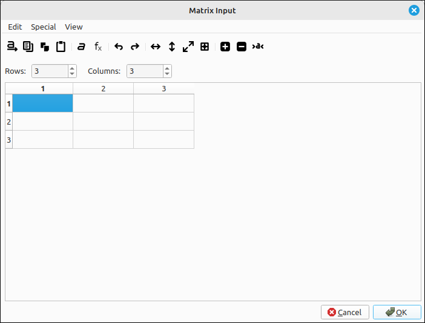
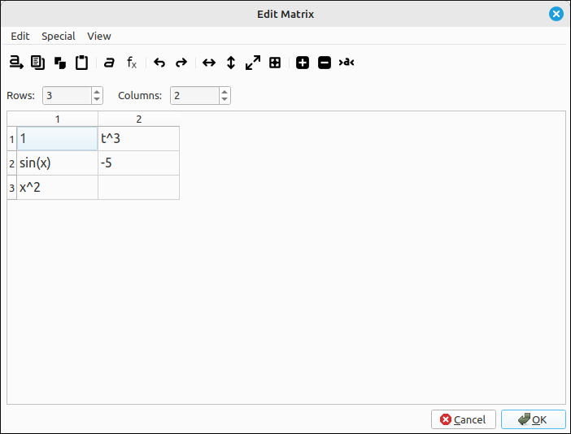
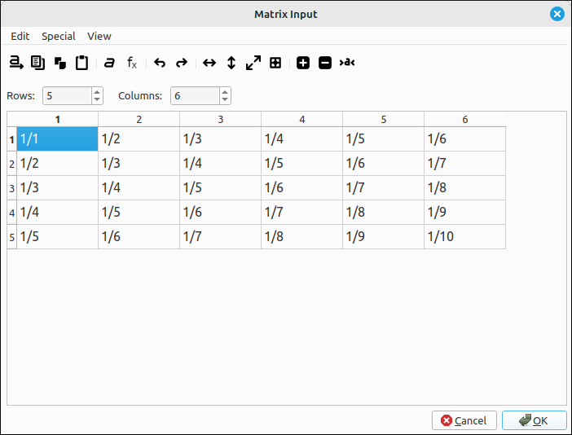

:index:`Matrix and Vector Input`
================================

:index:`The Matrix Input Dialog Box`
------------------------------------

In most computer algebra systems inputting a matrix uses rather lengthy syntax, SymPy is no exception.  So to make these easier for the user we created a special dialog box for this purpose.  Select ``Edit > Input Matrix/Vector...`` from the main menu or its corresponding toolbar button to open the matrix input dialog box.

Dialog Use & Options
--------------------

To use the dialog, select the number of rows and columns of the matrix, input any valid  expression into each of the cells, see the :doc:`../CLAE/syntax` for details on expressions.  Note that any blank cells will be replaced with 0.  Once all the entries are filled out click OK and the expression will be loaded into the CAS workspace.

For example, the following input

produces the matrix,

.. math::

    \left[\begin{array}{cc}1 & t^{3}\\\sin{\left(x \right)} & -5\\x^{2} & 0\end{array}\right]

We can also create a Hilbert-like matrix easily, set the number of rows to 5 and the number of columns to 6, then selecting ``Special > Hilbert`` automatically loads the matrix as shown.

When OK is clicked this produces the matrix,

.. math::

    \left[\begin{array}{cccccc}1 & \frac{1}{2} & \frac{1}{3} & \frac{1}{4} & \frac{1}{5} & \frac{1}{6}\\\frac{1}{2} & \frac{1}{3} & \frac{1}{4} & \frac{1}{5} & \frac{1}{6} & \frac{1}{7}\\\frac{1}{3} & \frac{1}{4} & \frac{1}{5} & \frac{1}{6} & \frac{1}{7} & \frac{1}{8}\\\frac{1}{4} & \frac{1}{5} & \frac{1}{6} & \frac{1}{7} & \frac{1}{8} & \frac{1}{9}\\\frac{1}{5} & \frac{1}{6} & \frac{1}{7} & \frac{1}{8} & \frac{1}{9} & \frac{1}{10}\end{array}\right]

.. note::

    More advanced cell editing can be done in the Spreadsheet tool for this program.

Menu and Tool Options
---------------------

The dialog does have a few editing options, many of these have corresponding toolbar buttons.

File Menu
^^^^^^^^^

- **Select All:**  Selects all the cells in the expression editing area.

- **Copy Selected:** Copies the selected cells to the clipboard in a tab-delimited format that can be pasted into most spreadsheets.

- **Copy All:** Copies all the cells to the clipboard in a tab-delimited format that can be pasted into most spreadsheets.

- **Paste:** Pastes the clipboard contents into the editing grid.  It is assumed that the data is in tab-delimited format.

- **Fill Selected Cells with Text:** When this option is selected a dialog box will appear allowing the user to input text that will fill all the currently selected cells.

- **Apply Function to Selected Cells:** When this option is selected a dialog box will appear allowing the user to input a function and the variable for substitution that will be applied to all currently selected cells.  The function can be any valid  expression including workspace entries, see the :doc:`../CLAE/syntax` for details on expressions. The variable is the variable of the expression that each of the selected cell values will be substituted into.  The program will do easy simplifications and evaluations but will not do a full simplify on the new expressions.

- **Transpose:** This will transpose the matrix.

- **Trim Cells:** This removes the leading and trailing whitespace characters from each cell.

- **Undo:** Undoes the last edit.

- **Redo:** Redoes the last edit.

- **Clear All:** This clears the grid contents.

Special Menu
^^^^^^^^^^^^

- **Identity:** Automatically loads in the identity matrix into the current matrix size.  The size does not need to be square, the program will put a 1 in all (k, k) positions and zeros elsewhere.

- **Zero:** Fills the current matrix with all 0s.

- **Random:** This will open a dialog box allowing the user to input a lower and upper bound for randomly inputting integers into the matrix. The random (pseudo-random) numbers are generated with a uniform distribution.  The seed of the generator is automatically set by the system clock.  More random matrix options can be found in the Edit menu of the main program.

- **Hilbert:** Automatically loads in a Hilbert style matrix into the current matrix size.  The size does not need to be square, the program will simply load each (i, j) cell with ``1/(i+j-1)``.

.. note::

    Many more options for specific matrix input can be found under the Edit option of the main menu.

View Menu
^^^^^^^^^

- **Adjust Column Widths:** This will set the column widths to a size that fits the data in the table.

- **Adjust Row Heights:** This will set the row heights to a size that fits the data in the table.

- **Adjust Row and Column Sizes:** This will set the column widths and row heights to a size that fits the data in the table.

- **Reset Row and Column Sizes:** This resets the column widths and row heights to the original width and height.

- **Increase Font Size:** This increases the font size of the table.

- **Decrease Font Size:** This decreases the font size of the table.

- **Reset Font Size:** This resets the font size of the table.

Column Vector Input
-------------------

If all you are inputting is a simple column vector you do not need to use the full matrix input dialog, although you can.  To input a column vector select ``Edit > Input Vector...`` from the main menu or its corresponding toolbar button to open a dialog box with a single input box.  Input the vector entries as a list separated by commas and click OK.  For example, the input of ``[1,2,3]`` or simply ``1,2,3`` will create the vector,

.. math::
    \left[\begin{array}{c}1\\2\\3\end{array}\right]

