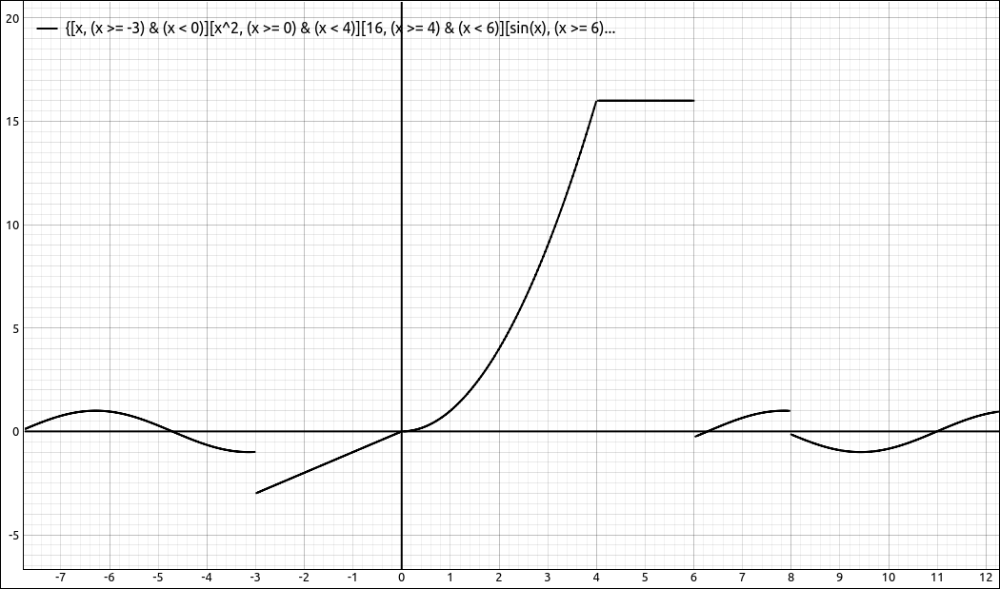
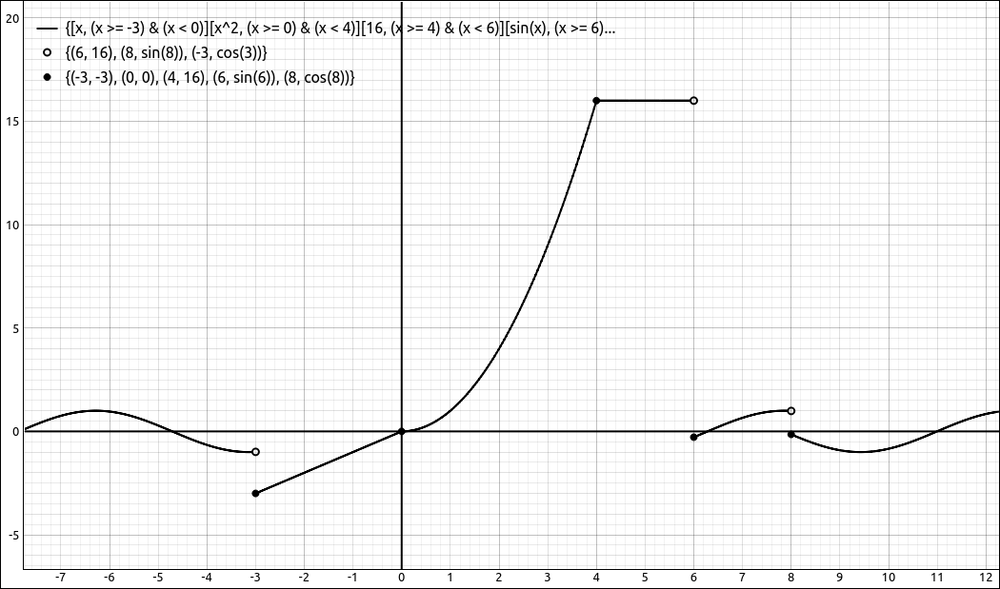
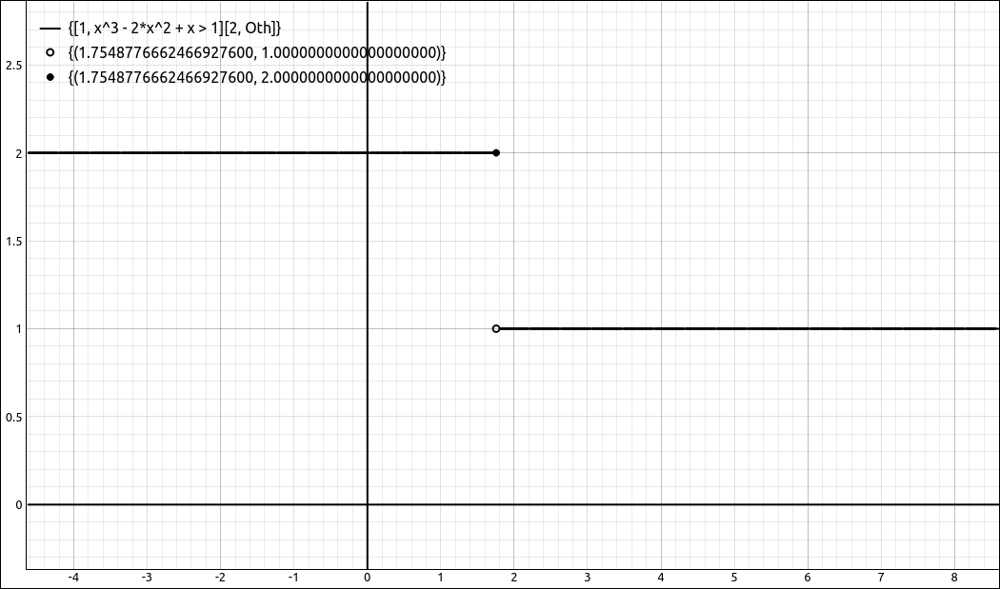
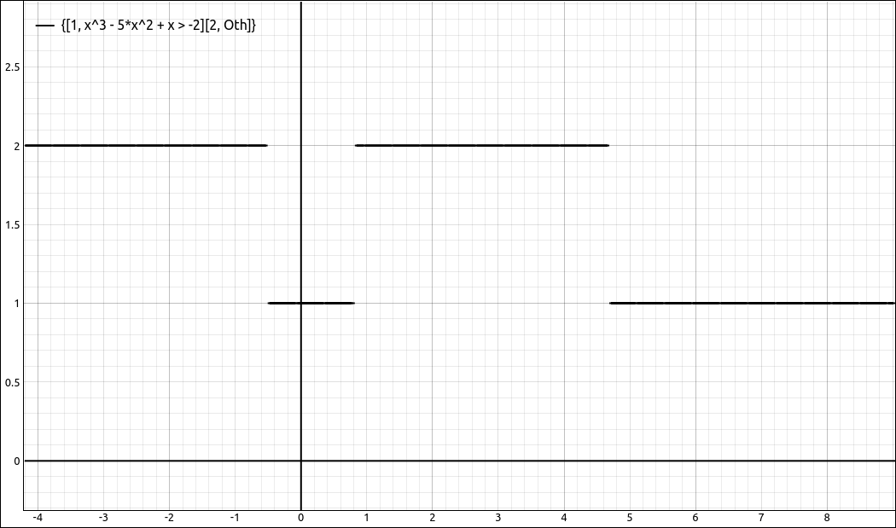
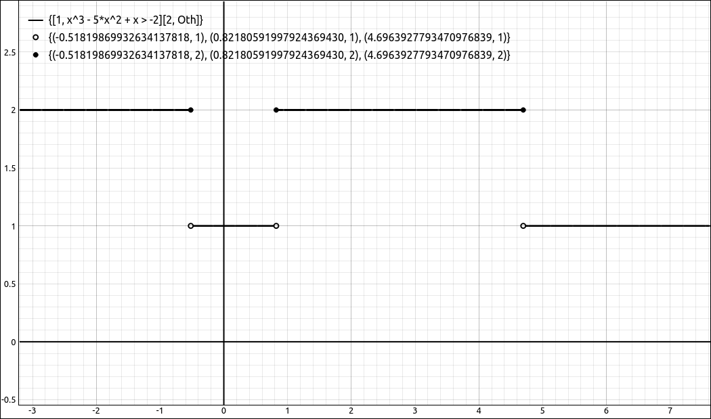

:index:`Piecewise Conversions/Extractions`
==========================================

This set of options is for converting and manipulating piecewise defined expressions.

Extract Expression from Piecewise Function
------------------------------------------

This option allows the user to extract an expression from a piecewise defined function.  The extraction is a single expression from the piecewise defined function with no conditions accompanying it. When selected a dialog box will appear asking for the position of the expression, simply input the line number the expression is on.  For example, if the piecewise defined function is,

.. math::
    \begin{cases} x & \text{for}\: x < 0 \\x^{2} & \text{for}\: x < 4 \\\sin{\left(x \right)} & \text{otherwise} \end{cases}

then extracting the second expression is :math:`x^{2}` and then extracting the third expression is :math:`\sin{\left(x \right)}`.

Extract Piece from Piecewise Function
-------------------------------------

This option allows the user to extract an expression from a piecewise defined function along with its domain conditions.  The extraction is a single expression from the piecewise defined function with its conditions accompanying it. When selected a dialog box will appear asking for the position of the expression, simply input the line number the expression is on.  For example, if the piecewise defined function is,

.. math::
    \begin{cases} x & \text{for}\: x < 0 \\x^{2} & \text{for}\: x < 4 \\\sin{\left(x \right)} & \text{otherwise} \end{cases}

then extracting the second expression returns,

.. math::
    \begin{cases} x^{2} & \text{for}\: x \geq 0 \wedge x < 4 \end{cases}

One thing to note here is that although a piecewise defined function is usually displayed in condensed form for the conditions when extracting a piece the function is first rewritten in a mutually exclusive manner before the piece is extracted.

Extract Pattern from Piecewise Function
---------------------------------------

This option allows the user to extract a set of expressions from a piecewise defined function along with their domains.  The result is another piecewise defined function that is made up of the pieces in the input pattern. When selected a dialog box will appear asking for the position pattern, input the row numbers of the functions you wish to extract with at least one space between them.  For example, if the piecewise defined function is,

.. math::
    \begin{cases} x & \text{for}\: x < 0 \\x^{2} & \text{for}\: x < 4 \\\sin{\left(x \right)} & \text{otherwise} \end{cases}

then a pattern of, ``2 3`` returns,

.. math::
    \begin{cases} x^{2} & \text{for}\: x \geq 0 \wedge x < 4 \\\sin{\left(x \right)} & \text{for}\: x \geq 4 \end{cases}

and a pattern of ``1 3`` returns

.. math::
    \begin{cases} x & \text{for}\: x < 0 \\\sin{\left(x \right)} & \text{for}\: x \geq 4 \end{cases}

and a pattern of ``3 1`` returns

.. math::
    \begin{cases} \sin{\left(x \right)} & \text{for}\: x \geq 4 \\x & \text{for}\: x < 0 \end{cases}

One thing to note here is that although a piecewise defined function is usually displayed in condensed form for the conditions when extracting a piece the function is first rewritten in a mutually exclusive manner before the piece is extracted.  Also, you can put in duplicate positions, such as, ``1 3 1`` but the simplification process will remove the duplications.

Extract All Expressions from Piecewise Function
-----------------------------------------------

This option will extract all the expressions from a piecewise defined function and load them separately into the CAS workspace.  The extraction is just the expressions from the piecewise defined function with no conditions accompanying them.  For example, the piecewise defined function,

.. math::
    \begin{cases} \frac{65 x}{44} - \frac{21 \left(x - 1\right)^{3}}{44} + \frac{23}{44} & \text{for}\: x \geq 1 \wedge x \leq 2 \\\frac{5 x^{3}}{11} - \frac{183 x^{2}}{44} + \frac{247 x}{22} - \frac{71}{11} & \text{for}\: x \geq 2 \wedge x \leq 4 \\- \frac{19 x^{3}}{88} + \frac{171 x^{2}}{44} - \frac{461 x}{22} + \frac{401}{11} & \text{for}\: x \geq 4 \wedge x \leq 6 \end{cases}

would extract to the following three expressions, each loaded separately into the CAS.

.. math::
    \frac{65 x}{44} - \frac{21 \left(x - 1\right)^{3}}{44} + \frac{23}{44}

.. math::
    \frac{5 x^{3}}{11} - \frac{183 x^{2}}{44} + \frac{247 x}{22} - \frac{71}{11}

.. math::
    - \frac{19 x^{3}}{88} + \frac{171 x^{2}}{44} - \frac{461 x}{22} + \frac{401}{11}

Extract All Pieces from Piecewise Function
------------------------------------------

This option will extract each expression from a piecewise defined function along with its domain conditions and load them separately into the CAS workspace. Note that this operation may take a couple seconds to run, especially if there are a lot of pieces to the definition.  The reason for this is that with a piecewise defined function the condition list is not necessarily mutually exclusive, but if we extract one piece of the expression the conditions need to be in a mutually exclusive form or the domain of the single piece will not match the implied domain of the original function.  This conversion of conditions can take some time when there are a lot of pieces or the domains are complicated.  For example, if the piecewise defined function is,

.. math::
    \begin{cases} \frac{65 x}{44} - \frac{21 \left(x - 1\right)^{3}}{44} + \frac{23}{44} & \text{for}\: x \geq 1 \wedge x \leq 2 \\\frac{5 x^{3}}{11} - \frac{183 x^{2}}{44} + \frac{247 x}{22} - \frac{71}{11} & \text{for}\: x \geq 2 \wedge x \leq 4 \\- \frac{19 x^{3}}{88} + \frac{171 x^{2}}{44} - \frac{461 x}{22} + \frac{401}{11} & \text{for}\: x \geq 4 \wedge x \leq 6 \end{cases}

it would extract to the following four pieces, each loaded separately into the CAS.

.. math::
    \begin{cases} \frac{65 x}{44} - \frac{21 \left(x - 1\right)^{3}}{44} + \frac{23}{44} & \text{for}\: x \geq 1 \wedge x \leq 2 \end{cases}

.. math::
    \begin{cases} \frac{5 x^{3}}{11} - \frac{183 x^{2}}{44} + \frac{247 x}{22} - \frac{71}{11} & \text{for}\: x \geq 2 \wedge x \leq 4 \wedge \left(x > 2 \vee x < 1\right) \end{cases}

.. math::
    \begin{cases} - \frac{19 x^{3}}{88} + \frac{171 x^{2}}{44} - \frac{461 x}{22} + \frac{401}{11} & \text{for}\: x \geq 4 \wedge x \leq 6 \wedge \left(x > 4 \vee x < 1\right) \end{cases}

.. math::
    \begin{cases} \text{NaN} & \text{for}\: x > 6 \vee x < 1 \end{cases}

Note that this will possibly produce an "otherwise" piece.

Convert to Unnested Piecewise Expression
----------------------------------------

This option will take a nested piecewise expression and convert it into an equivalent nested piecewise expression.  For example,

.. math::
    \begin{cases} \begin{cases} x & \text{for}\: x < 0 \\x^{2} & \text{for}\: x < 4 \\16 & \text{for}\: x < 6 \\\sin{\left(x \right)} & \text{otherwise} \end{cases} & \text{for}\: x \geq -3 \wedge x < 8 \\\cos{\left(x \right)} & \text{for}\: x \geq 8 \vee x < -3 \end{cases}

would be converted into

.. math::
    \begin{cases} x & \text{for}\: x \geq -3 \wedge x < 0 \\x^{2} & \text{for}\: x \geq 0 \wedge x < 4 \\16 & \text{for}\: x \geq 4 \wedge x < 6 \\\sin{\left(x \right)} & \text{for}\: x \geq 6 \wedge x < 8 \\\cos{\left(x \right)} & \text{for}\: x \geq 8 \vee x < -3 \end{cases}

View Mutually Exclusive
-----------------------

This option opens up another dialog box that displays the current piecewise expression that has been converted into mutually exclusive form. The dialog box has options to export the expression to several forms, LaTeX, text, and images. For example, the following

.. math::
    \begin{cases} \begin{cases} x & \text{for}\: x < 0 \\x^{2} & \text{for}\: x < 4 \\\sin{\left(x \right)} & \text{otherwise} \end{cases} & \text{for}\: x \geq -3 \wedge x < 8 \\\cos{\left(x \right)} & \text{for}\: x \geq 8 \vee x < -3 \end{cases}

will be displayed as

.. math::
    \begin{cases} \begin{cases} x & \text{for}\: x < 0 \\x^{2} & \text{for}\: x \geq 0 \wedge x < 4 \\\sin{\left(x \right)} & \text{for}\: x \geq 4 \end{cases} & \text{for}\: x \geq -3 \wedge x < 8 \\\cos{\left(x \right)} & \text{for}\: x \geq 8 \vee x < -3 \end{cases}

.. note::

    The underlying computer algebra system, SymPy, writes piecewise expressions in a more programmatic form, it works much like an if-elseif type statement in a modern programming language.  If the first condition is satisfied it evaluates the first function.  If not, then the second condition is tested and if it is satisfied the second function is evaluated, and so on.  SymPy also writes the conditions in a condensed form so when viewing a piecewise defined expression the intervals defining the pieces will in most cases overlap.

    The reason we have the mutually exclusive form come up in a separate dialog box is because SymPy will convert it back to programmatic form if it is in the CAS workspace.

Create Endpoint Sets from Piecewise Expression
----------------------------------------------

This option will attempt to create the open and closed endpoint sets from a piecewise expression.  This option has limited functionality since conditions in a piecewise expression can become complex.  For straight forward conditions this option works well.

Simply select a piecewise expression then select ``Edit > Piecewise Conversions / Extractions > Create Endpoint Sets from Piecewise Expression``.  A dialog box will appear asking the user if the expression is to be viewed in rectangular coordinates or in polar coordinates, make this selection and click OK.  The result will be two sets, an open endpoint set and a closed endpoint set.

The program will attempt to remove open points if there is the same point in the closed endpoint set, that is, when the pieces match up at that point. If approximations are being used the program may report the same point in both sets due to small round-off errors.  In general, if you are graphing these points with the function it is best to plot the open points first and then the closed, so that the closed will overwrite the open if they are the same.

.. note::

    If you select polar coordinates for the coordinate system the points that are given will be in rectangular coordinates.

For example, take the following piecewise defined function.

.. math::
    \begin{cases} x & \text{for}\: x \geq -3 \wedge x < 0 \\x^{2} & \text{for}\: x \geq 0 \wedge x < 4 \\16 & \text{for}\: x \geq 4 \wedge x < 6 \\\sin{\left(x \right)} & \text{for}\: x \geq 6 \wedge x < 8 \\\cos{\left(x \right)} & \text{for}\: x \geq 8 \vee x < -3 \end{cases}

Plotting this give us the following image.

    Simple Piecewise Expression

If invoke this option we get the following two sets.  The open endpoint set is,

.. math::
    \left[ \left[ 6, \  16\right], \  \left[ 8, \  \sin{\left(8 \right)}\right], \  \left[ -3, \  \cos{\left(3 \right)}\right]\right]

and the closed endpoint set is,

.. math::
    \left[ \left[ -3, \  -3\right], \  \left[ 0, \  0\right], \  \left[ 4, \  16\right], \  \left[ 6, \  \sin{\left(6 \right)}\right], \  \left[ 8, \  \cos{\left(8 \right)}\right]\right]

Note that the point :math:`(0, 0)` was included in the closed set but not in the open set, even though there is an open endpoint at the origin in another piece.  Graphing these sets along with the original function gives,

    Piecewise Expression with Endpoint Sets

While you probably would not take the time to do this in a classroom setting or even while just examining a piecewise function, it will save you some time if you are creating images for a report or handout.

As was noted above, conditions for a piecewise expression can become very complex.  This option relies on Sympy being able to convert the defining conditions to intervals, which cannot always be done.  We will look at two more examples, one where the program can find the points but need to be approximated first and the other where we do not get a result.

Take the following expression,

.. math::
    \begin{cases} 1 & \text{for}\: x^{3} - 2 x^{2} + x > 1 \\2 & \text{otherwise} \end{cases}

Finding the endpoints gives us,

.. math::
    \left[ \left[ \operatorname{CRootOf} {\left(x^{3} - 2 x^{2} + x - 1, 0\right)}, \  1\right]\right]

and

.. math::
    \left[ \left[ \operatorname{CRootOf} {\left(x^{3} - 2 x^{2} + x - 1, 0\right)}, \  2\right]\right]

for the open and closed sets respectively.  If you try to plot these you will get an error, but if we approximate them to

.. math::
    \left[ \left[ 1.75487766624669276, \  1.0\right]\right]

and

.. math::
    \left[ \left[ 1.75487766624669276, \  2.0\right]\right]

we can plot these,

    Piecewise Expression with Endpoint Sets

Finally, if we change the above expression a little,

.. math::
    \begin{cases} 1 & \text{for}\: x^{3} - 5 x^{2} + x > -2 \\2 & \text{otherwise} \end{cases}

we get two empty sets for the points sets, despite that the function looks like,

    Piecewise Expression

Although the option fails on this expression it is not too difficult to get the endpoints by approximating the roots to the polynomial :math:`x^{3} - 5 x^{2} + x + 2` and then evaluating.

    Piecewise Expression with Endpoint Sets
