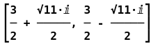
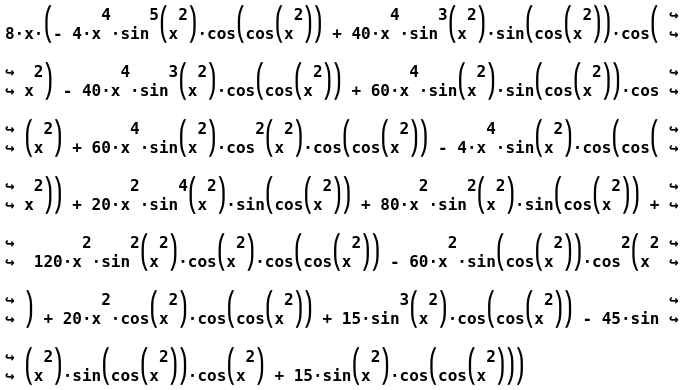

:index:`Preferences`
====================

The CAS has a couple preferences that can be set.  When a preference is changed the preference is stored in the ``CLAE_Preferences.dat`` file that is in the same directory as the program launching directory.

Display Font
------------

The display font is the font used for the mathematical portion of each CAS entry.  For example,

Since this is multi-line text it is imperative that the font be a mono-spaced font.  So when you select this option to change the display font you will only see a handful of options here.  The checkbox at the top allows you to select or deselect the system mono-spaced font.  This is the default but if you wish to use a different font simply deselect it and the drop-down list of fonts will be enabled.  The fonts listed are all mono-spaced fonts that are included in some Linux distributions, but are cross-platform capable.

Select the font, font size, and to use bold or not and then click OK.  This will change the font of all the displays in each of the CAS workspace items.  You may need to experiment with this to get that best look for your system.

Description Font
----------------

The description is the title of each entry and is at the top of each CAS workspace item.  This font need not be mono-spaced and hence is more versatile.  When you select this option a standard font selector dialog box for your operating system will appear.  Select all the options from the dialog and click OK.  This will update the font of all descriptions in the CAS.

Precision of Approximations
---------------------------

Since this is a computer algebra system the entries are exact, such as, :math:`\sqrt{2}`.  There are several menu options that will return approximations of the exact values.  In these cases, the program uses the default number of decimal places when approximating the value.  This option sets that default value.  When selected a dialog box will appear allowing the user to set the number of decimal places.  You can override this with a few menu items, such as with ``Algebra > Approximate with Precision``.

Display Wrap Column
--------------------

The wrap column for the display is where long expressions are broken to the next line.  Long line results will move off the screen to the right, which can be viewed by using the horizontal scroll bar or the mouse/touch-pad.  At some point this becomes too long and the display needs to wrap the item to the next line.  The way it wraps is by block, that is, it considers the expression to be a single line although it is really multi line.

For example, lets say we have input the expression :math:`\sin{\left(\cos{\left(x^{2} \right)} \right)}` and we take the 5th derivative of this function.  The result is,

.. math::

    8 x \left(- 4 x^{4} \sin^{5}{\left(x^{2} \right)} \cos{\left(\cos{\left(x^{2} \right)} \right)} + 40 x^{4} \sin^{3}{\left(x^{2} \right)} \sin{\left(\cos{\left(x^{2} \right)} \right)} \cos{\left(x^{2} \right)} - 40 x^{4} \sin^{3}{\left(x^{2} \right)} \cos{\left(\cos{\left(x^{2} \right)} \right)} + 60 x^{4} \sin{\left(x^{2} \right)} \sin{\left(\cos{\left(x^{2} \right)} \right)} \cos{\left(x^{2} \right)} + 60 x^{4} \sin{\left(x^{2} \right)} \cos^{2}{\left(x^{2} \right)} \cos{\left(\cos{\left(x^{2} \right)} \right)} - 4 x^{4} \sin{\left(x^{2} \right)} \cos{\left(\cos{\left(x^{2} \right)} \right)} + 20 x^{2} \sin^{4}{\left(x^{2} \right)} \sin{\left(\cos{\left(x^{2} \right)} \right)} + 80 x^{2} \sin^{2}{\left(x^{2} \right)} \sin{\left(\cos{\left(x^{2} \right)} \right)} + 120 x^{2} \sin^{2}{\left(x^{2} \right)} \cos{\left(x^{2} \right)} \cos{\left(\cos{\left(x^{2} \right)} \right)} - 60 x^{2} \sin{\left(\cos{\left(x^{2} \right)} \right)} \cos^{2}{\left(x^{2} \right)} + 20 x^{2} \cos{\left(x^{2} \right)} \cos{\left(\cos{\left(x^{2} \right)} \right)} + 15 \sin^{3}{\left(x^{2} \right)} \cos{\left(\cos{\left(x^{2} \right)} \right)} - 45 \sin{\left(x^{2} \right)} \sin{\left(\cos{\left(x^{2} \right)} \right)} \cos{\left(x^{2} \right)} + 15 \sin{\left(x^{2} \right)} \cos{\left(\cos{\left(x^{2} \right)} \right)}\right)

which is well off the screen.  If we reset the wrap column to 70 the displayed expression would look like the following.

Note that mathematics lines up well, that is the exponents are where they need to be.  Also the breaks will break each text line of the multi-line expression at the same place, again the necessity of a mono-spaced font. The default value of the wrapping column is set to 500. If this is not to your liking, setting this option will override that default.

Select Theme
------------

The theme selection is not very extensive for the graphical user interface we are using for this program, specifically PySide6 which is a binding of the Qt graphical user interface. The best cross-platform option here is the Fusion theme but you can change this to your liking.

