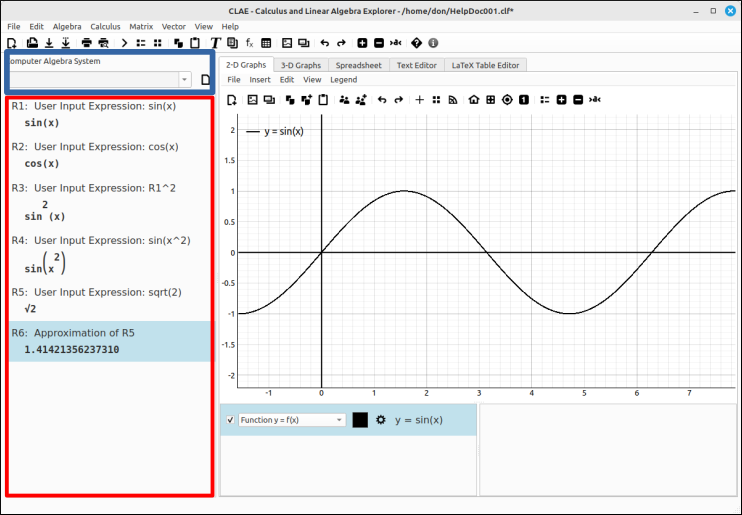

:index:`CAS`
============

Introduction
------------

CAS is short for Computer Algebra System.  A computer algebra system is a computer program that does symbolic manipulation and essentially does mathematics in exact form.  So instead of inputting :math:`\sqrt{2}` and getting 1.41421356237310 on the screen you get the exact value of  :math:`\sqrt{2}`.  In a similar fashion, a computer algebra system will simplify, differentiate, integrate, etc. expressions in symbolic form instead of calculating approximations like most calculators will.

There are many computer algebra systems that are available, some are free and some are expensive.  The CLAE program uses the SymPy computer algebra system as a portion of its interface.  SymPy is a free and open-source Python package that can be found at `<https://www.sympy.org/en/index.html>`_.  You do not need to know any Python to use this and the CLAE application has a menu system for the needed functions so that you do not need to know any of the SymPy functions.  All you need to learn is some basic function syntax that is very similar to that of a graphing calculator.

The CAS is on the left hand side of the application window.  The area in blue is the input bar for the CAS.  Simple expressions like :math:`\sin(x)`, :math:`\sin(x^2)`, :math:`\ln(3/x)`, etc. will be types in here to be loaded into the CAS workspace.  More advanced structures like piecewise defined functions and matrices have their own editing dialog boxes to simplify the process. The red area is the CAS workspace.  This is simply a list of inputs and results of operations.

    Computer Algebra System (CAS) section and input bar.

Note that each entry has a designation, at the beginning of the entry description, R1, R2, ... These can be used in the input bar as well as the expression syntax.  For example, if we were to input ``R2 * R3`` we would get :math:`\sin^{2}{\left(x \right)} \cos{\left(x \right)}`.

The main menu system contains operations that can be done on the entries of the CAS.  To invoke an operation simply select the entry you wish to work with, then select the operation you want to do from the main menu.  In some cases the program will ask you for some specific information to complete the operation in a dialog box.  The program will try to guess the information from the expression and automatically fill in some or all the options in the dialog box as to reduce the typing you need to do.  For example, if we were to select R4 and then from the menu ``Calculus > Derivative...`` a dialog box will appear that already has ``x`` in for the variable and 1 for the order, If we simply click OK a new result of :math:`2 x \cos{\left(x^{2} \right)}` will be loaded into the CAS workspace.

You may want to work through the :doc:`../CLAE/index` examples to get a feel for the program layout and CAS input.  In the documentation for this and other sections we will include numerous examples for you yo try to better understand the use of this program.

Quick Guides
------------

.. toctree::
    :maxdepth: 3
    :caption: Quick Guides
    :titlesonly:

    LayoutUse
    syntax

File Options
------------

.. toctree::
    :maxdepth: 3
    :caption: File Options
    :titlesonly:

    files

Editing Options
---------------

.. toctree::
    :maxdepth: 3
    :caption: Expression & Matrix Input
    :titlesonly:

    casinput
    casPiecewiseInput
    casSequenceInput
    casMatrixInput
    casDataTypes

.. toctree::
    :maxdepth: 3
    :caption: Special & Random Matrices
    :titlesonly:

    casSpecialMatrixInput
    casRandomMatrixInput
    casTransform2DInput
    casTransform3DInput

.. toctree::
    :maxdepth: 3
    :caption: Conversion & Extraction Options
    :titlesonly:

    casCopySpecialCopy
    casMatrixExtract
    casMatrixJoin
    casMatrixRemove
    casMatrixConvert
    casListExtract
    casListConvert
    casPiecewiseConvert
    casOtherConvert

.. toctree::
    :maxdepth: 3
    :caption: Workspace & Process Management
    :titlesonly:

    casDeleteUndoRedo
    casPrefs
    casProcess

Algebra Options
---------------

.. toctree::
    :maxdepth: 3
    :caption: Algebra
    :titlesonly:

    AlgSimplify
    AlgApproxEval
    AlgSolving
    AlgFactorExpand
    AlgSepCollect
    AlgComplex
    AlgRational
    AlgEquations
    AlgLinesPlanes
    AlgFctProps
    AlgForceOp

Calculus Options
----------------

.. toctree::
    :maxdepth: 3
    :caption: Calculus
    :titlesonly:

    CalLimitsDerivatives
    CalIntegration
    CalSeries
    CalOde
    CalMultInt
    CalSpaceCurves
    CalVectorCalculus

Matrix Options
--------------

.. toctree::
    :maxdepth: 3
    :caption: Matrix
    :titlesonly:

    MatRowColops
    MatRedSolve
    MatBasicOps
    MatCofactors
    MatSpaces
    MatEigens
    MatEvalApply
    MatFactor
    MatDiag
    MatGramSchmidt
    MatLeast
    MatCurveFit
    MatOther

Vector Options
--------------

.. toctree::
    :maxdepth: 3
    :caption: Vector
    :titlesonly:

    VecGeneral
    VecLinesPlanes
    VecNorms
    VecProj
    VecGramSchmidt

Maxima Options
--------------

.. toctree::
    :maxdepth: 3
    :caption: Maxima
    :titlesonly:

    MaximaGeneral
    MaximaSimplify
    MaximaApproxEval
    MaximaFactorSolve
    MaximaFactorExpand
    MaximaComplex
    MaximaLimitDer
    MaximaIntegration
    MaximaSeries
    MaximaMultipleIntegral
    MaximaSpaceCurves
    MaximaVectorCalc

View Options
------------

.. toctree::
    :maxdepth: 3
    :caption: View
    :titlesonly:

    view

