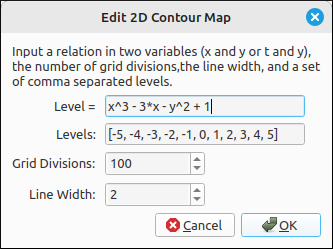
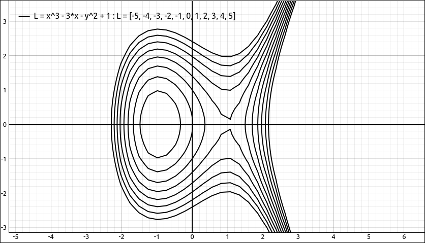

:index:`Contour Map`
====================

Description
-----------

This type is for graphing contour maps of implicitly defined expressions of the form :math:`L = f(x, y)` or :math:`L = f(t, y)` where the values for ``L`` are taken from a list of values.  The expression variables can be ``x`` and ``y`` or ``t`` and ``y``  but not all three.  The following are examples of this type of expression,

- ``cos(x*y)``
- ``cos(t) + Y^2``
- ``x^3 - 3*x - y^2 + 1``
- ``t^3 - 3*t - y^2 + 1``

Insert/Edit Dialog
------------------

The Insert/Edit Dialog for 2D contour maps is below,

    Contour Map Properties Dialog

The first option is the expression to be plotted, followed by a list of levels, grid divisions, and line width.

Options
-------

Levels
^^^^^^

The levels is a list of values that will form each curve.  Specifically, if :math:`L` represents the set of levels and :math:`a \in L` then one of the contour curves will be :math:`a = f(x, y)`. These can be any legitimate expression that evaluates to a real number.  For example, ``1``, ``2``, ``3``,  ``1.234``, ``3*pi``, ``1/E``, etc.

Grid Divisions
^^^^^^^^^^^^^^

The grid divisions are used in determining the location of the curve on the plane.  The larger this is the better the curve image will be, especially at places where the curve self-intersects. As is expected, the larger this is the more calculations need to be completed and the slower the graphing and animations will be.

Line Width
^^^^^^^^^^

.. include:: linewidth.md

Example
-------

For example, say we input the expression :math:`x^{3} - 3 x - y^{2} + 1` with the syntax ``x^3 - 3*x - y^2 + 1``, using the default settings we get the image,

    Contour Map Example

If we drag this plot around you will notice that it is a little slow and clunky.  If we drop the divisions down to 50 we get the image,

    Contour Map Example with Smaller Grid Divisions

Although this responds to movement much better the image can be jagged in places. Note that close to the self intersection at :math:`(0, 1)` the curve is clearly showing some round off errors.

.. note::

    A contour map is simply several implicit relationships graphed together.  Due to the large number of calculations for each implicit plot a contour map can be sluggish when repositioned, zoomed, or animated.  It is best to keep the number of contours small as well as the number of grid divisions when viewing the map in real time.  For document quality images the grid divisions can and should be increased.
