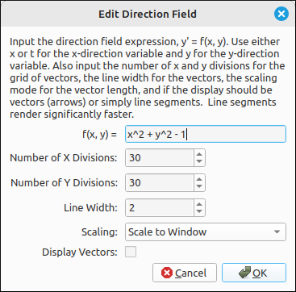

:index:`Direction Field`
========================

Description
-----------

A direction field (or slope filed) is a vector field representing the differential equation :math:`y' = f(x, y)`.  The input for this option is the two-variable function :math:`f(x, y)` or :math:`f(t, y)`. For example, ``x^2 + y^2 - 1`` would represent the differential equation :math:`y' = x^{2} + y^{2} - 1`.

Insert/Edit Dialog
------------------

The Insert/Edit Dialog for the direction fields is pictured below.

    Direction Field Properties Dialog

The top input is the expression :math:`y' = f(x, y)`, below that are options for inputting the number of x and y divisions for plotting the vectors, line width, scaling mode, and if the program should render vectors with arrowheads or just line segments.  Line segments render significantly faster, so if your direction field is linked to a slider you will want to render line segments.

Options
-------

Number of X Divisions
^^^^^^^^^^^^^^^^^^^^^

This is the number of divisions in the x direction for the field.

Number of Y Divisions
^^^^^^^^^^^^^^^^^^^^^

This is the number of divisions in the y direction for the field.

Line Width
^^^^^^^^^^

The width of the line for the vectors connecting the initial and terminal points.

.. include:: linewidth.md

Scaling
^^^^^^^

This is the scaling mode for the vectors, there are four different scaling modes.

- **Scale to Window:** This is probably the best mode visually for most applications.  It scales the vectors by the dimensions of the viewing window and the number of divisions in the x and y directions.
- **Scale to Maximum Vector:** This mode scales the vectors relative to the longest vector in the visible set.  The longest vector is scaled by the viewing window and the number of divisions in the x and y directions and all other vectors are scaled according to the maximum. This is good to visualize the speed of a flow.
- **Normalize:** This scales all vectors to length 1.
- **No Scaling:** This does not scale the vectors at all.

Note that most of these mode look best if the viewing is set to a 1-1 aspect ratio.

Display Vectors
^^^^^^^^^^^^^^^

If this option is selected the program will render arrows for the direction vectors and if it is not selected the program will just render line segments. Line segments render significantly faster, so if your direction field is linked to a slider you will want to render line segments.

Example
-------

If we input the example above, and keep the x and y divisions at 30 each we see the following image.

.. figure:: Images/DF001.png
    :alt: Direction Field Example

    Direction Field Example

.. note::

    One feature of direction fields in general in this program is that when you change the viewing window by either panning or zooming the graphical locations of the vectors do not change.  That is, the starting positions of the vectors in the field are dependent on the divisions and the window bounds, they are not fixed as with many other applications.

    .. figure:: Images/DF002.png
        :alt: Direction Field Example

        Direction Field Example

    Note in the above image we simply shifted the graph, the positions of the vectors did not change, just the vector directions. This feature was by design, it allows the user to easily pinpoint the field to a specific location.