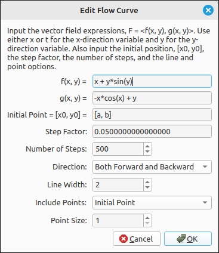
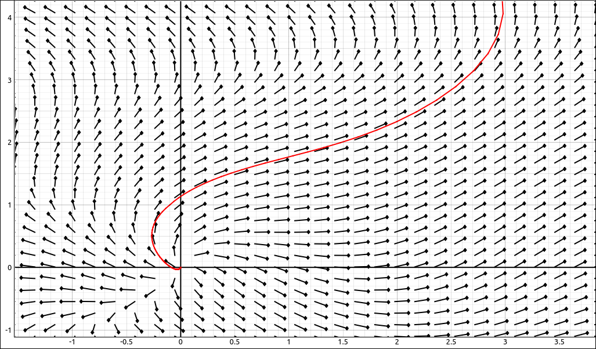

:index:`Flow Curve`
===================

Description
-----------

A flow curve through a vector field :math:`F = (f(x, y), g(x, y))` is an approximation of how a particle would move through a vector field (or force field), much like an Euler's Method curve through a direction field.  Specifically, the flow curve is defined to be a set of points with initial point :math:`(x_0, y_0)` and all subsequence points :math:`(x_n, y_n) = (x_{n-1}, y_{n-1}) + h(f(x_{n-1}, y_{n-1}), g(x_{n-1}, y_{n-1}))` where :math:`h` is the step factor.

There are two ways to input a flow curve into this application, either a list with two expressions or a :math:`2 \times 1` matrix.  For example, the flow curve through the field :math:`F = (x + y \sin{\left(y \right)}, \  - x \cos{\left(x \right)} + y)` could be input as either, ``[x + y*sin(y),-x*cos(x) + y]`` or as

.. math::
    \left[\begin{array}{c}x + y \sin{\left(y \right)}\\- x \cos{\left(x \right)} + y\end{array}\right]

Insert/Edit Dialog
------------------

The Insert/Edit Dialog for the flow curve is shown below.

    Flow Curve Properties Dialog

The first two inputs are the functions for the x and y components to the vectors in the field, after that are options for the initial point, step factor, number of steps, direction, line width, points to include, and the point size.

Options
-------

Initial Point
^^^^^^^^^^^^^

This is the point of origin for the curve, in the language above, it is the point :math:`(x_0, y_0)`.  This is a list of two expressions that must evaluate to a real number but can include constants, so any valid expression that does not include the variables ``x``, ``t``, and ``y``.  It is common to set this to ``[a, b]``, then two sliders will be created (one for ``a`` and one for ``b``) then the user can move the sliders to change the initial point and see the change in the curve in real time.

Step factor
^^^^^^^^^^^

This is the step factor, :math:`h` in the above definition.  This can be any valid expression that does not include the variables ``x``, ``t``, and ``y`` but can include constants. The smaller this is the better the approximation but also the more steps needed to cover the same range.

Number of Steps
^^^^^^^^^^^^^^^

This is the number of steps that are done in the method.  If the curve ends prematurely simply increase this value to extend the curve.  This is the number of steps that are taken in each direction from the initial point.

Direction
^^^^^^^^^

There are three options for the direction.

- **Forward:** Only plots the curve in the forward direction, that is, :math:`h > 0`.
- **Backward:** Only plots the curve in the backward direction, that is, :math:`h < 0`.
- **Both Forward and Backward:** Plots both directions.

Line Width
^^^^^^^^^^

.. include:: linewidth.md

Include Points
^^^^^^^^^^^^^^

This determines which points to include in the plot.

- **No Points:** Does not plot any points, just the line.
- **Initial Point:** Plots just the initial point for the curve.
- **All Points:** Plots all points used in the approximation of the curve.

Point Size
^^^^^^^^^^

The size of the points that are plotted, if any are selected.

Example
-------

Say we use the example above of the field :math:`F = (x + y \sin{\left(y \right)}, \  - x \cos{\left(x \right)} + y)`, set the initial point to :math:`(a, b)`, move the sliders, reposition and zoom in, plot the initial point along with the vector field we would see,

    Flow Curve Example

