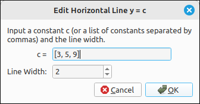
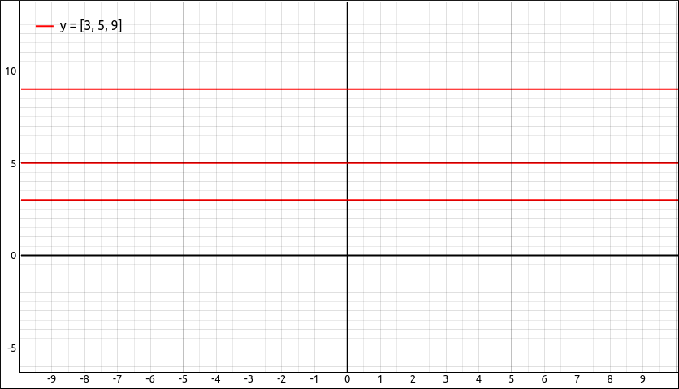

:index:`Horizontal Line`
========================

Description
-----------

This type is for graphing one or more horizontal lines.  The ``Function y = f(x)`` type can also be used here but this allows several lines to be drawn at once with the same options and color.  The expression can be a single formula that evaluates to a real number or a list of formulas, as long as the expressions do not contain the variables ``x``, ``t``, or ``y``.

Insert/Edit Dialog
------------------

The Insert/Edit Dialog for horizontal lines is fairly simple.

    Horizontal Line Properties Dialog

The first item is a list of expressions for the values and this is followed by an option for the line width.

Options
-------

Line Width
^^^^^^^^^^

.. include:: linewidth.md

Example
-------

Say we input the expression (list) of ``[3, 5, 9]`` and plot it as horizontal lines, we get,

    Horizontal Lines Example

