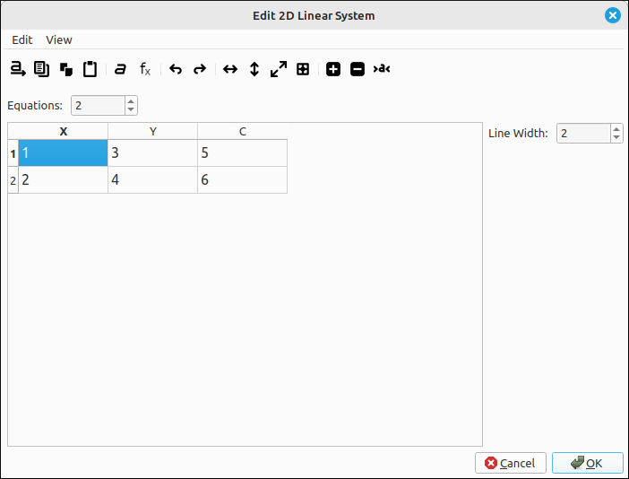
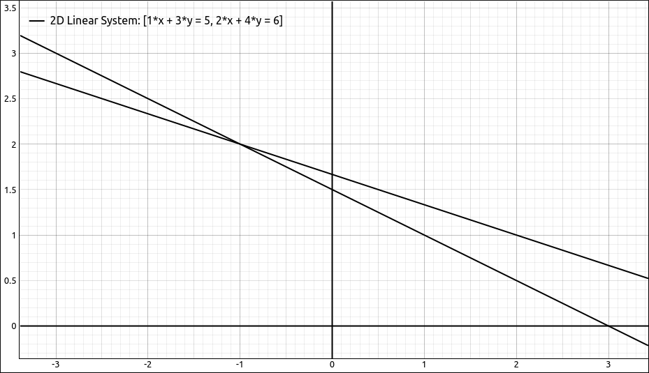
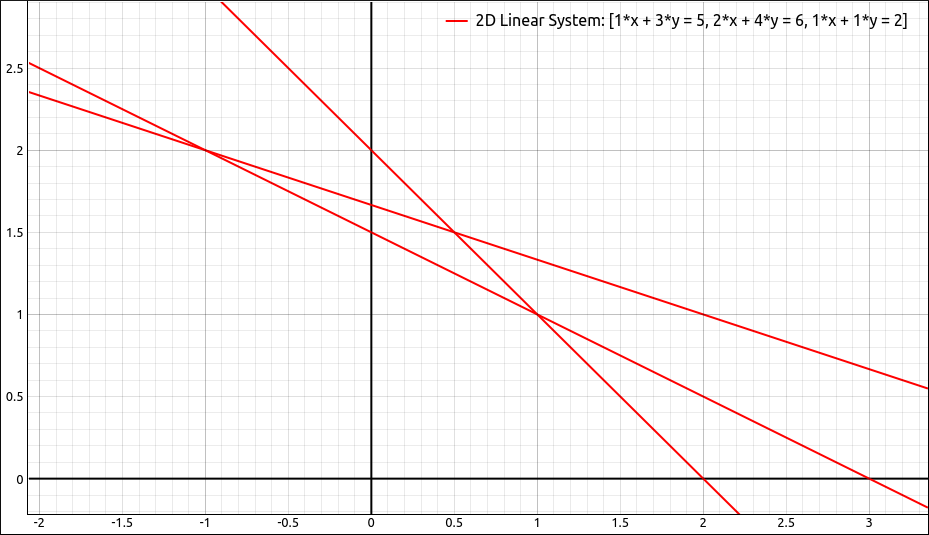

:index:`Linear System`
======================

Description
-----------

This type is for graphing a linear system of lines defined by the rows of a matrix that defines the linear system.  The input is an :math:`n \times 3` matrix where each row defines a linear equation in two variables.  For example, the matrix,

.. math::
    \left[\begin{array}{ccc}1 & 3 & 5\\2 & 4 & 6\end{array}\right]

defines the linear system, :math:`\{x + 3y = 5, 2x + 4y = 6\}`.

Insert/Edit Dialog
------------------

The Insert/Edit Dialog for a 2D linear system is pictured below.

    Linear System Properties Dialog

The dialog is set up in a similar manner as the matrix input dialog except that the number of columns is fixed at 3. The menu and toolbar have options for the input of the points in the editing grid on the left.  In the grid, note that the headers are labeled ``x``, ``y``, and ``c``.  So each row represents the linear equation :math:`ax + by = c`.

.. include:: ../CLAE/PointSetDialogOptions.md

Options
-------

Line Width
^^^^^^^^^^

This is the width of each of the lines for the linear equations.

.. include:: linewidth.md

Example
-------

If we insert the linear system from the examples above we get the image.

    Linear System Example

Showing the solution of :math:`(-1, 2)`, and if we add in the equation :math:`x + y = 2` we get,

    Linear System Example

showing no solution to the system.
