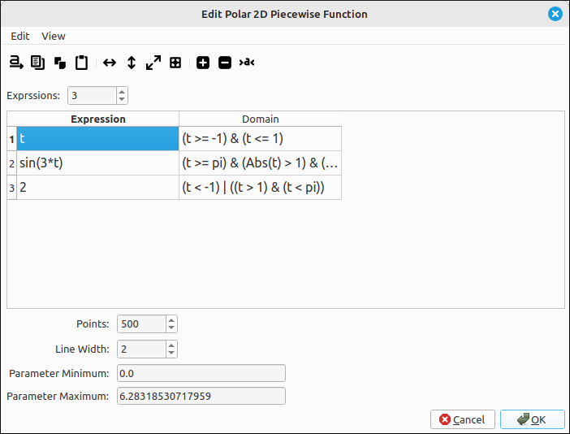
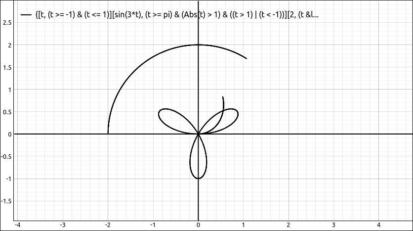
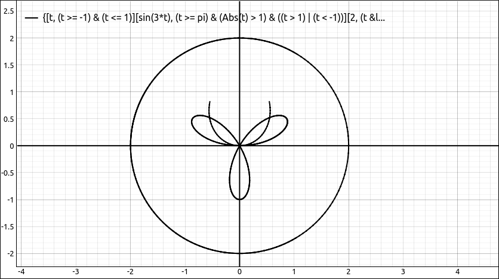

:index:`Polar Piecewise Defined Function`
=========================================

Description
-----------

This type will graph the piecewise defined expression in polar coordinates, that is, the polar function :math:`r = f(t) = f(\theta)`.  See :doc:`../CAS/casPiecewiseInput` for details on inputting piecewise defined functions and the syntax for the domains.  The independent variable in the expression can be ``x`` or ``t`` but not both.  The variable ``y`` cannot be in the expression either.  All other variables are considered constants.

Insert/Edit Dialog
------------------

The Insert/Edit Dialog for the piecewise polar functions is shown below.

    Polar Piecewise Properties Dialog

The Insert/Edit Dialog is the same as the Input Piecewise Defined Function dialog in the CAS with the added options of the number of points to plot, the line width and the parameter minimum and maximum.  One difference in the graphing of piecewise defined functions is that each piece is graphed with the number of selected points.  That is, if there are three pieces to the function each is graphed independently.  This gives a nice break at the domain edges.

Options
-------

Points
^^^^^^

.. include:: points.md

Line Width
^^^^^^^^^^

.. include:: linewidth.md

Parameter Minimum and Maximum
^^^^^^^^^^^^^^^^^^^^^^^^^^^^^

Lower and upper bounds for the parameter can be any legitimate expression that evaluates to a real number.  For example, ``1.234``, ``3*pi``, ``1/E``, etc.

Example
-------

As a quick example, say we have the following piecewise defined expression,

.. math::
    \begin{cases} t & \text{for}\: t \geq -1 \wedge t \leq 1 \\\sin{\left(3 t \right)} & \text{for}\: t \geq \pi \wedge \left(t > 1 \vee t < -1\right) \wedge \left|{t}\right| > 1 \\2 & \text{for}\: \left(t > 1 \wedge t < \pi\right) \vee t < -1 \end{cases}

Although this looks rather complicated for the domains it was input as follows, ``t`` on the domain ``(t>=-1) & (t<=1)``, ``sin(3*t)`` on the domain ``t >= pi``, and ``2`` with the domain cell left blank.  SymPy changed this to something more formal.

If we graph this with the default domain of :math:`[0, 2\pi]` we get,

    Polar Piecewise Example

and if we change the domain to :math:`[-10, 10]` we get,

    Polar Piecewise Example

