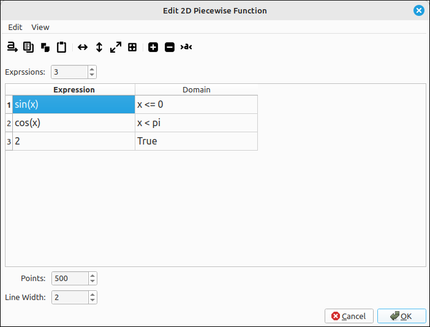

:index:`Piecewise Defined Function`
===================================

Description
-----------

This type is your standard Cartesian plane piecewise defined function, see :doc:`../CAS/casPiecewiseInput` for details on inputting piecewise defined functions and the syntax for the domains.  The independent variable in the expressions can be ``x`` or ``t`` but not both.  The variable ``y`` cannot be in the expressions either.  All other variables are considered constants.

Insert/Edit Dialog
------------------

The Insert/Edit Dialog is the same as the Input Piecewise Defined Function dialog in the CAS with the added options of the number of points to plot and the line width.  One difference in the graphing of piecewise defined functions is that each piece is graphed with the number of selected points.  That is, if there are three pieces to the function each is graphed independently.  This gives a nice break at the domain edges.

    Piecewise Properties Dialog

Options
-------

Points
^^^^^^

.. include:: points.md

Line Width
^^^^^^^^^^

.. include:: linewidth.md

.. note::

    This program does not automatically indicate the nature of the function at the domain edges.  If we take the piecewise defined expression,

    .. math::
        y = \begin{cases} \sin{\left(x \right)} & \text{for}\: x \leq 0 \\\cos{\left(x \right)} & \text{for}\: x < \pi \\2 & \text{otherwise} \end{cases}

    and graph it in red we get the following,

    .. figure:: Images/PD_Fct_Ex002.png
        :alt: Piecewise Example

        Piecewise Example

    Note that it does not illustrate what is happening at :math:`x = 0` and :math:`x = \pi`.  If you are making an image for a document and want the endpoint designations you can use two point sets, one with a filled in circle and one with an open circle.  For example,

    .. figure:: Images/PD_Fct_Ex003.png
        :alt: Enhanced Piecewise Example

        Enhanced Piecewise Example

