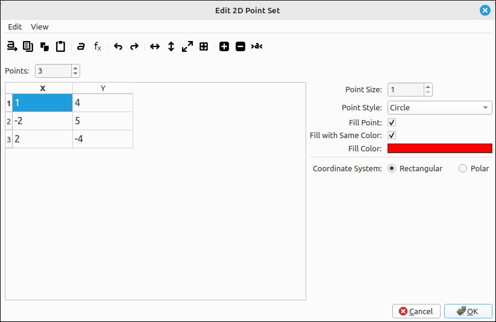
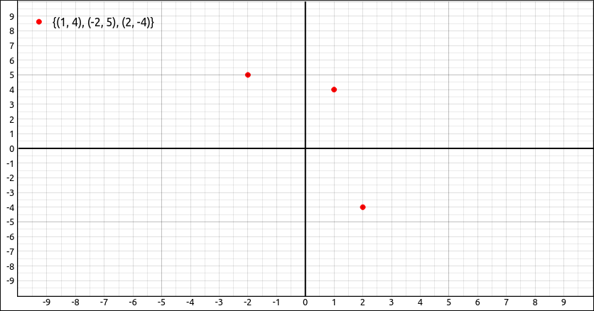

:index:`Point Set`
==================

Description
-----------

This is for plotting a set of points.  The points can be given as a :math:`2 \times n` matrix where each column represents a point, row 1 are the x-coordinates and row 2 are the y-coordinates.  It can also be given as a list of lists, the inner lists must have two components representing x and y respectively. For example the set of points :math:`\{(1, 4), (-2, 5), (2, -4) \}` could be input as the matrix,

.. math::
    \left[\begin{array}{ccc}1 & -2 & 2\\4 & 5 & -4\end{array}\right]

or as the list of lists ``[[1, 4],[-2, 5],[2, -4]]``.

Insert/Edit Dialog
------------------

The Insert/Edit Dialog for a 2D point set is pictured below.

    Point Set Properties Dialog

The dialog is set up in a similar manner as the matrix input dialog except that the number of columns is fixed at 2.  This is really transposed from the matrix input way of representing points but was done to make user input more natural.  The menu and toolbar have options for the input of the points in the editing grid on the left.  The options on the right are for the point styles and visual aspects of the set.

.. include:: ../CLAE/PointSetDialogOptions.md

Options
-------

Point Size
^^^^^^^^^^

The size of the point to be used in the image.  The default of 1 is usually sufficient for most applications.

Point Style
^^^^^^^^^^^

.. include:: ../CLAE/PointStyles2D.md

Fill Point
^^^^^^^^^^

When this option is selected it will fill in the center of the point.

Fill with Same Color
^^^^^^^^^^^^^^^^^^^^

When this is selected, if Fill Point is selected, it will fill the center of the point with the same color as the outline.

Fill Color
^^^^^^^^^^

If Fill Point is selected and Fill with Same Color is not selected, the color here will be used to fill the center of the point.  To change this color simply click on the color box and a color selection dialog will appear allowing you to select the fill color.  Note that if Fill with Same Color is selected it will override and color selection here.

Coordinate System
^^^^^^^^^^^^^^^^^

This allows the user to select between rectangular and polar coordinates. In rectangular coordinates the expressions will evaluate an :math:`(x, y)` point and if set to polar the expressions will evaluate an :math:`(r, \theta)` point.

Example
-------

If we added the point set from the above examples we would see,

    Point Set Example

Adding and Removing Points to and from a Set
--------------------------------------------

This applications allows the user to add and remove points from a point set using the mouse and the plot window.  Holding down the Shift key and clicking on the graphics window will add the click point to the point set.  Holding down the Ctrl and Shift keys and clicking on the graphics window will remove the point closest to the click point.  These options come in handy when you want to quickly create a set of points for a demonstration, such as fitting a curve to a set of data.

