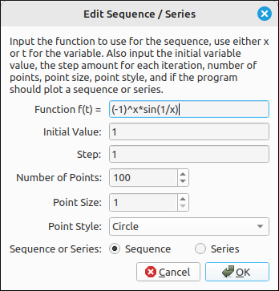
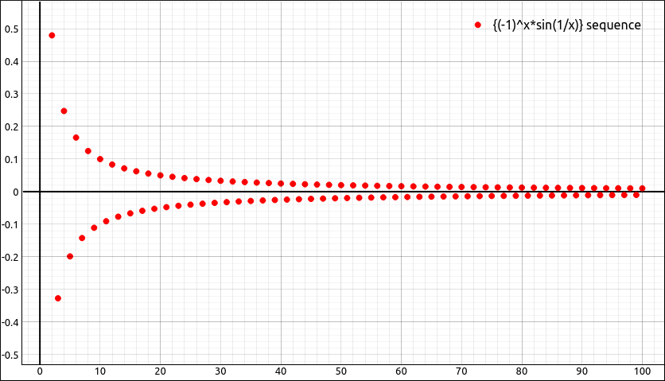
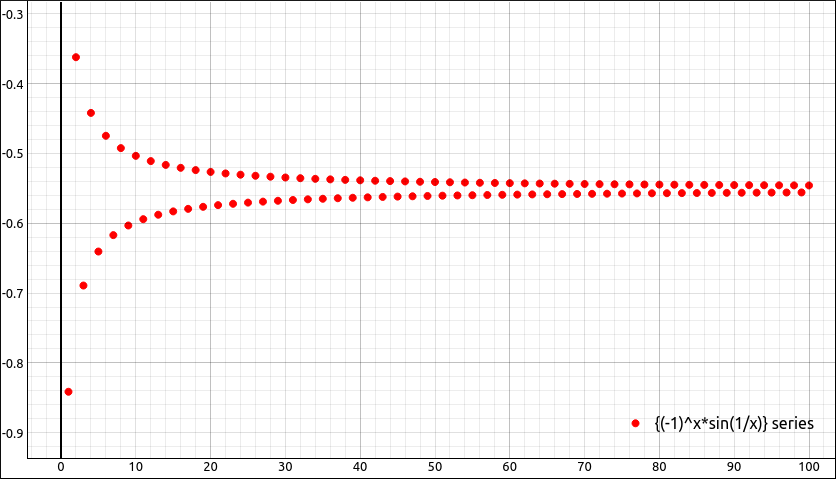

:index:`Sequence / Series`
==========================

Description
-----------

This type is for graphing either sequences of the form :math:`\{a_n\} = f(n)` or the sequence of partial sums,

.. math::
    \{s_n\} = \sum_{a = 1}^n f(a)

The independent variable in the expression can be ``x`` or ``t`` but not both.  The variable ``y`` cannot be in the expression either.  All other variables are considered constants.  Note that although ``n`` is a common variable for sequences and series it is considered a constant in this application.

Insert/Edit Dialog
------------------

The Insert/Edit Dialog for the sequence and series is picture below.

    Sequence / Series Properties Dialog

The function to be used for the sequence or series is first, followed by the initial value, step, number of points, point size, point style, and a selector between a sequence or series.

Options
-------

Initial Value
^^^^^^^^^^^^^

The initial value is the first value that the function is evaluated at for the sequence or series. This can be any legitimate expression that evaluates to a real number.

Step
^^^^

The step is the step size for the sequence or series. That is, the distance between each consecutive point in the sequence or series.  This can be any legitimate expression that evaluates to a real number.

Number of Points
^^^^^^^^^^^^^^^^

The number of points to plot for the sequence or series.

Point Size
^^^^^^^^^^

The size of the point to be used in the image.  The default of 1 is usually sufficient for most applications.

Point Style
^^^^^^^^^^^

.. include:: ../CLAE/PointStyles2D.md

Sequence or Series
^^^^^^^^^^^^^^^^^^

This is a selector between the graphing of a sequence or a sequence of partial sums of a series.  If sequence is selected then the plotted points will be :math:`(t_n, f(t_n))` where :math:`t_n` is determined by the initial value and the step size.  If series is selected then the points plotted are

.. math::
    \left(t_n, \sum_{a = 1}^n f(t_n) \right)

again where :math:`t_n` is determined by the initial value and the step size.

Example
-------

For example, if we take the expression, :math:`\left(-1\right)^{x} \sin{\left(\frac{1}{x} \right)}` and graph it as a sequence with initial value of 1, step size of 1, and 100 points we get,

    Sequence Example

If we change this to series we get the graph of partial sums,

    Series Example (Sequence of Partial Sums)

which converges to approximately :math:`-0.5507963481341922`.

