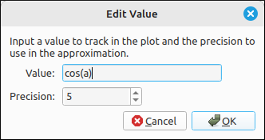
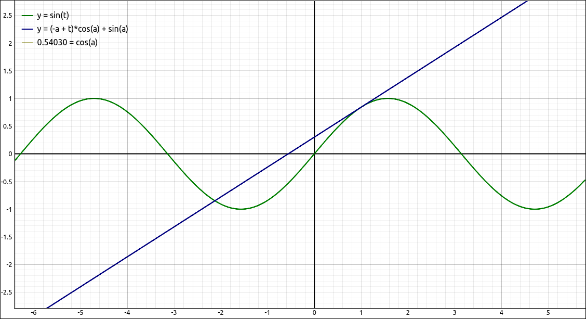
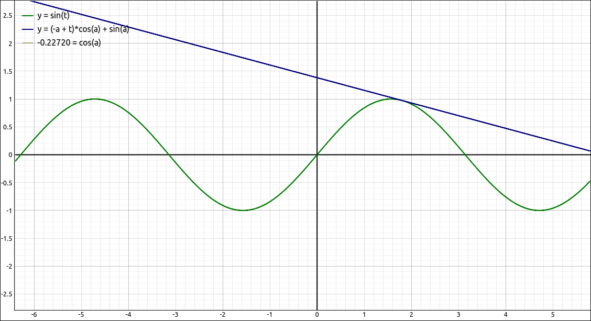
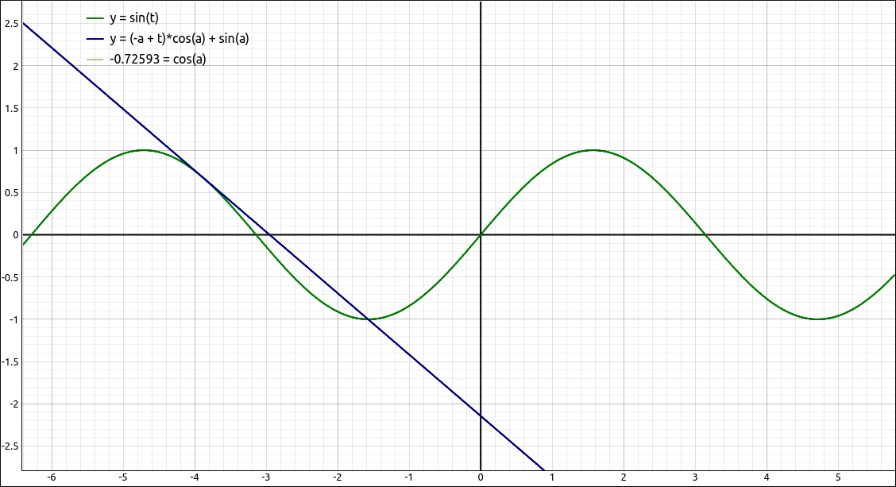

:index:`Value`
==============

Description
-----------

A value has no graphical interpretation, it is simply an expression that is evaluated and its value is displayed in the graphics manager and the legend.  A value can be any legitimate expression that doe not contain the variables ``x``, ``t``, or ``y``.  Usually the value is linked to one or more sliders to show the value of the expression as its parameter values change.

Insert/Edit Dialog
------------------

The Insert/Edit Dialog for a value is shown below.

    Value Properties Dialog

Other than the expression to be evaluated the only option is the precision of the output.

Options
-------

Precision
^^^^^^^^^

This is just the number of decimal places shown in the output.

Example
-------

In the CAS,

- Input ``sin(t)``, say this is R1.
- Calculate the first derivative of R1 with respect to t, say this is R2.
- Evaluate R2 at ``a``, say this is R3.
- Calculate the tangent line to R1 at ``a``, say this is R4.
- Graph, R1, R3, and R4.
- Change the R3 plot to a Value.

At this point when you change the value of the ``a`` slider the tangent line will follow the curve and the R3 value will display the slope of the tangent line as the slider moves.

    Value Example

    Value Example

    Value Example

Although it is not displayed above the value changes in the object description in the graphics manager.
