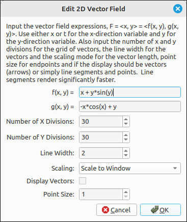
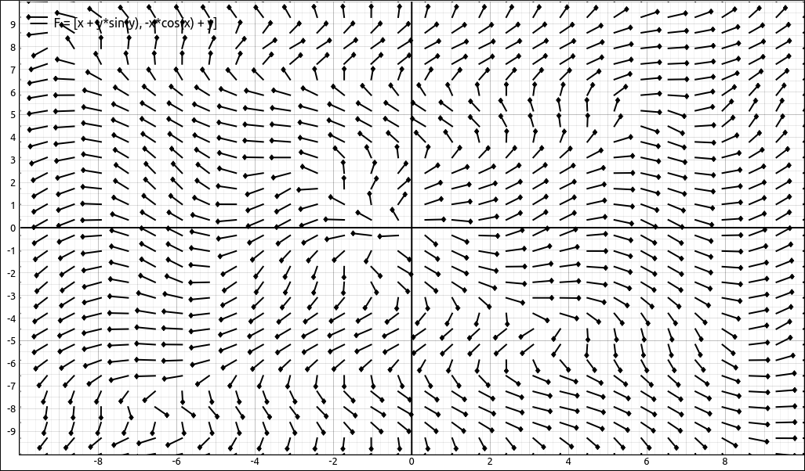
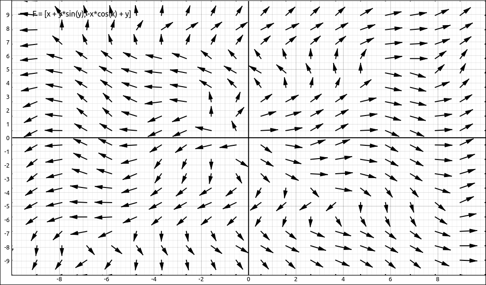

:index:`Vector Field`
=====================

Description
-----------

A vector field is a vector valued function :math:`F = (f(x, y), g(x, y))` where :math:`f(x, y)` represents the x direction of the vector at the point :math:`(x, y)` and :math:`g(x, y)` represents the y direction of the vector at the point :math:`(x, y)`.

There are two ways to input a vector field into this application, either a list with two expressions or a :math:`2 \times 1` matrix.  For example, the field :math:`F = (x + y \sin{\left(y \right)}, \  - x \cos{\left(x \right)} + y)` could be input as either, ``[x + y*sin(y),-x*cos(x) + y]`` or as

.. math::
    \left[\begin{array}{c}x + y \sin{\left(y \right)}\\- x \cos{\left(x \right)} + y\end{array}\right]

Insert/Edit Dialog
------------------

The Insert/Edit Dialog for the vector field is pictured below.

    Vector Field Properties Dialog

The top two inputs are for the x and y expressions defining the field :math:`F = (f(x, y), g(x, y))`, below that are options for inputting the number of x and y divisions for plotting the vectors, line width, scaling mode, point size and if the vectors should be rendered as vectors (arrows) or as line segments with points at the end.  Although the vectors look better they require more computations and slow the system down.  If you are using a lot of vectors for the field or have them linked to a slider you probably want to use line segments with points.

Options
-------

Number of X Divisions
^^^^^^^^^^^^^^^^^^^^^

This is the number of divisions in the x direction for the field.

Number of Y Divisions
^^^^^^^^^^^^^^^^^^^^^

This is the number of divisions in the y direction for the field.

Line Width
^^^^^^^^^^

The width of the line for the vectors connecting the initial and terminal points.

.. include:: linewidth.md

Scaling
^^^^^^^

This is the scaling mode for the vectors, there are four different scaling modes.

- **Scale to Window:** This is probably the best mode visually for most applications.  It scales the vectors by the dimensions of the viewing window and the number of divisions in the x and y directions.
- **Scale to Maximum Vector:** This mode scales the vectors relative to the longest vector in the visible set.  The longest vector is scaled by the viewing window and the number of divisions in the x and y directions and all other vectors are scaled according to the maximum. This is good to visualize the speed of a flow.
- **Normalize:** This scales all vectors to length 1.
- **No Scaling:** This does not scale the vectors at all.

Note that most of these mode look best if the viewing is set to a 1-1 aspect ratio.

Display Vectors
^^^^^^^^^^^^^^^

This option allows you to select to display vectors for the each vector in the field or to display line segments with point at the end.  Although the vectors look better they require more computations and slow the system down.  If you are using a lot of vectors for the field or have them linked to a slider you probably want to use line segments with points.

Point Size
^^^^^^^^^^

If the display mode is line segments with points, this sets the size of the point at the end of the vector.

Example
-------

If we input the field, :math:`F = (x + y \sin{\left(y \right)}, \  - x \cos{\left(x \right)} + y)`, and leave the divisions set to the default of 30 in each direction,

    Vector Field Example

Changing the divisions to 20 in each direction and plotting vectors gives.

    Vector Field Example Vector Display Mode
