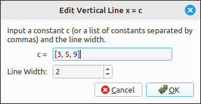
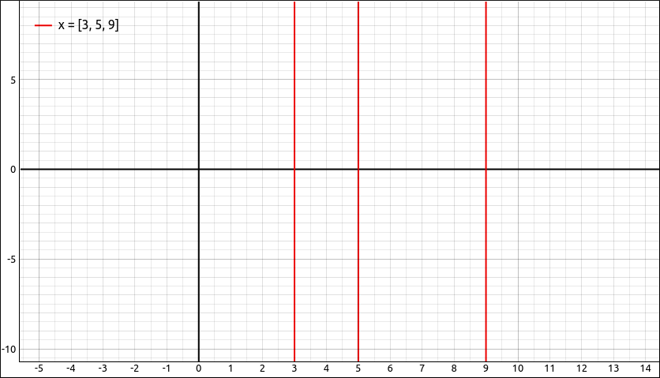

:index:`Vertical Line`
======================

Description
-----------

This type is for graphing one or more vertical lines, :math:`x = a`.  The expression can be a single formula that evaluates to a real number or a list of formulas, as long as the expressions do not contain the variables ``x``, ``t``, or ``y``.

Insert/Edit Dialog
------------------

The Insert/Edit Dialog for vertical lines is fairly simple.

    Vertical Line Properties Dialog

The first item is a list of expressions for the values and this is followed by an option for the line width.

Options
-------

Line Width
^^^^^^^^^^

.. include:: linewidth.md

Example
-------

Say we input the expression (list) of ``[3, 5, 9]`` and plot it as vertical lines, we get,

    Vertical Line Example
