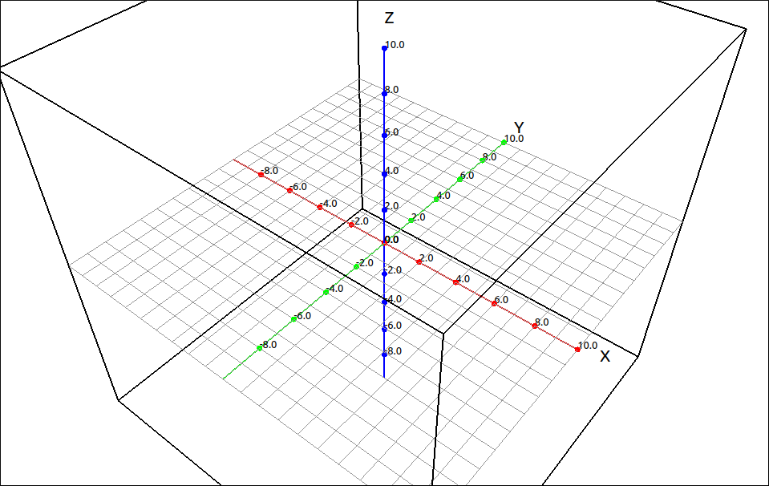
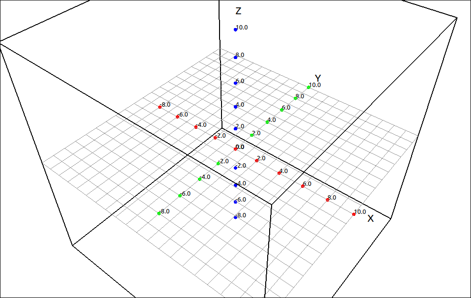
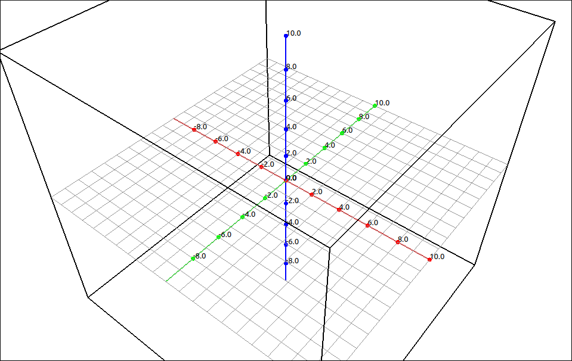
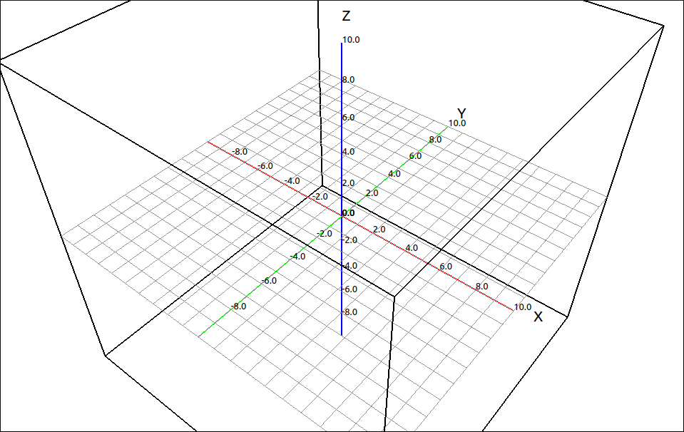
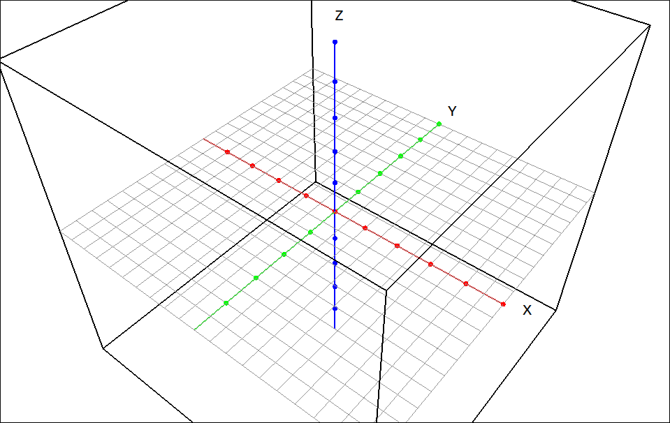
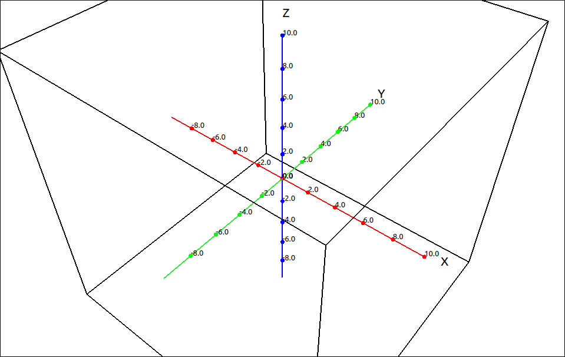
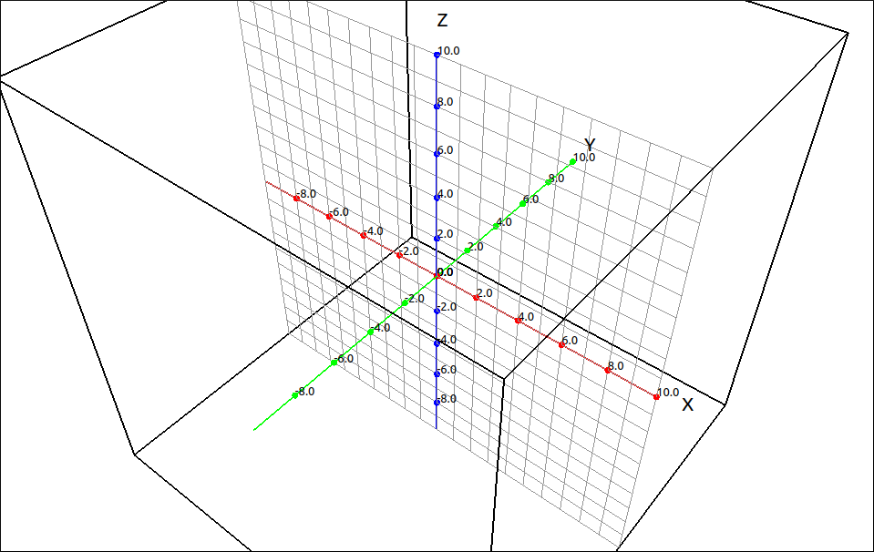
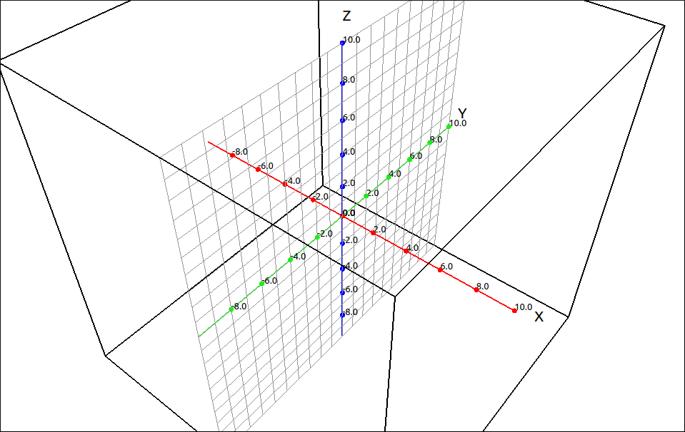

Axes/Grid Options
=================

The following options allow the user to customize the axes and grids layout of the view.

Lines
-----

This option allows the user to turn on and off the visibility of the coordinate axes.  With them on,

    Coordinate Axes On

and with them off,

    Coordinate Axes Off

Labels
------

This option allows the user to turn on and off the visibility of the axes labels.  With them on,

    Labels On

and with them off,

    Labels Off

Tick Marks
----------

This option allows the user to turn on and off the visibility of the axes tick marks.  With them on,

    Tick Marks On

and with them off,

    Tick Marks Off

Tick Mark Numbers
-----------------

This option allows the user to turn on and off the visibility of the axes tick mark numbers.  With them on,

    Tick Mark Numbers On

and with them off,

    Tick Mark Numbers Off

Select Axes Label Font
----------------------

This option allows the user to select the font for the axes labels.  When selected a font selection dialog box will appear allowing the user to select any font the system gas loaded.

Select Axes Number Font
-----------------------

This option allows the user to select the font for the tick mark numbers.  When selected a font selection dialog box will appear allowing the user to select any font the system gas loaded.

Show XY-Grid
------------

This option allows the user to turn on and off the xy-plane grid.  Bu default this grid is on.  With it on,

    XY-Grid On

and with it off,

    XY-Grid Off

Show XZ-Grid
------------

This option allows the user to turn on and off the xz-plane grid.  Bu default this grid is off.  With it on,

    XZ-Grid On

and with it off,

    XZ-Grid Off

Show YZ-Grid
------------

This option allows the user to turn on and off the yz-plane grid.  Bu default this grid is off.  With it on,

    YZ-Grid On

and with it off,

    YZ-Grid Off

.. note::

    Having all three of the coordinate plane grids on can look a little cluttered.

    .. figure:: Images/AxesOpts009.png
        :alt: All Grids On

        All Grids On

    This might come in handy to explain the octant layout of the 3D Cartesian coordinate system but in general you probably want at most two of them on at any time.

Select Grid Color
-----------------

This option allows the user to select the color of the grids.  When selected a color selection dialog box will appear allowing the user to select a color.  When this color is changed it will change the color of all the visible coordinate grids.

Reset Grid Color
----------------

This option resets the color of all the coordinate grids back to a light gray.

View Information
----------------

This option will bring up a dialog box displaying the bounds of each of the coordinate axes in the view and the center position of the view.
