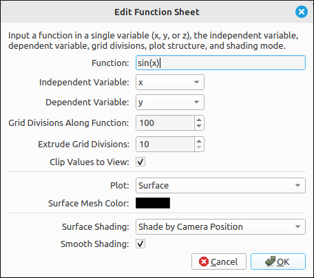
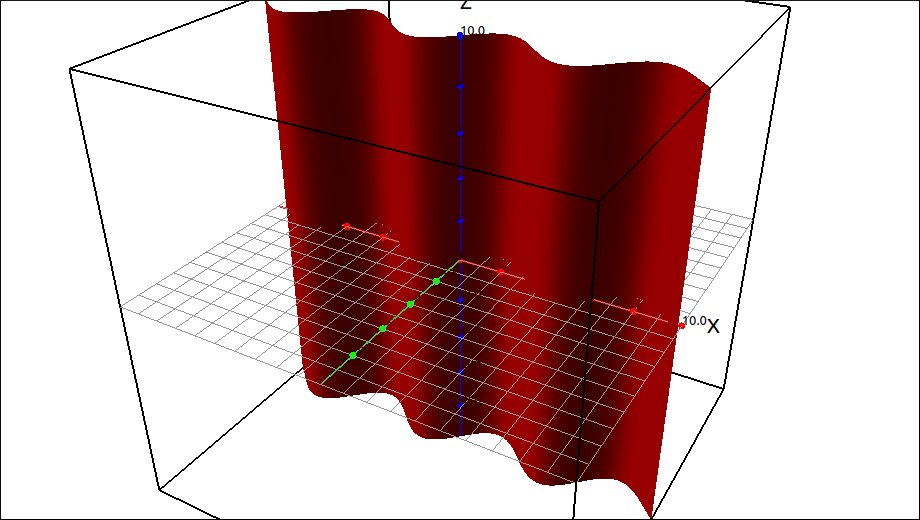
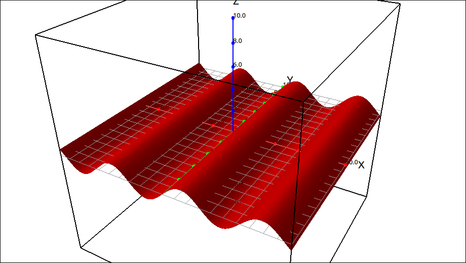

:index:`Function Sheet`
=======================

Description
-----------

A function sheet is also called a function curtain.  It is when you take a function and extrude it in the third dimension.  These are easy to write parametrically but we included this type as a convenience for the user.

Insert/Edit Dialog
------------------

The Insert/Edit Dialog for this type is shown below.

    Function Sheet Dialog Box

Below the function expression input there are options for an independent variable, dependent variable, the number of grid divisions along the function direction, grid divisions along the extrusion direction, clipping the z-values to the viewing cube, plot objects, surface mesh color, surface shading, and a selector for smooth shading.

Options
-------

Independent Variable
^^^^^^^^^^^^^^^^^^^^

This is the independent variable for the function.  This option is only used if the function is a constant function and the independent variable cannot be determined from the expression.  If the independent variable can be determined from the expression then that variable is used and overrides any setting of this option.  For example, if the expression is ``sin(x)`` then ``x`` is taken as the independent variable.  On the other hand, if the expression is ``3`` then the setting of this option will be takes as the independent variable.

Dependent Variable
^^^^^^^^^^^^^^^^^^

This is the dependent variable for the function.  Since we could view :math:`\sin(x)` as :math:`y = \sin(x)` or :math:`z = \sin(x)` we need to know the dependent variable.

Grid Divisions Along Function
^^^^^^^^^^^^^^^^^^^^^^^^^^^^^

This is the number of points plotted in the direction of the curve.  This is determined by the independent variable of the function and the range is taken to be that of the view range in that direction.

Extrude Grid Divisions
^^^^^^^^^^^^^^^^^^^^^^

This is the number of points plotted in the extrusion direction. This is determined by the independent and dependent variables and the range is taken to be that of the view range in that direction.  Since the extrusion direction is all straight lines there does not need to be very many division in that direction.  So the function divisions can be set higher and this lower to get a smoother surface.

Clip Values to View
^^^^^^^^^^^^^^^^^^^

.. include:: clipping3d.md

Plot
^^^^

.. include:: plotObjects3d.md

Surface Mesh Color
^^^^^^^^^^^^^^^^^^

.. include:: meshcolor.md

Surface Shading
^^^^^^^^^^^^^^^

.. include:: shading3d.md

Smooth Shading
^^^^^^^^^^^^^^

.. include:: smoothshading3d.md

Example
-------

If we take the expression :math:`\sin(x)` and use ``y`` as the dependent variable (making the extruding direction ``z``) we get,

    Function Sheet Example

Hence the term "curtain".  If we change the dependent variable to ``z`` (making the extruding direction ``y``) we get,

    Function Sheet Example

