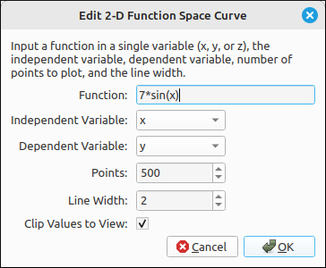
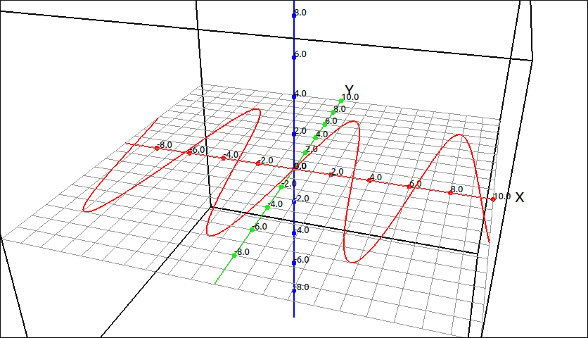

:index:`2-D Function Space Curve`
=================================

Description
-----------

This type graphs a function of the form :math:`y = f(x)` as a space curve in 3D. These are easy to define parametrically but we included this option for user convince and to save them a couple steps.  The independent variable may be either ``x``, ``y``, or ``z`` but not a combination of two or more of these.  All other variables outside the set of 3D variables (``x``, ``y``, ``z``, ``p``, ``t``, ``u``, and ``v``) are considered constants.

Insert/Edit Dialog
------------------

The Insert/Edit Dialog for this type is shown below.

    2-D Function Space Curve Dialog Box

The first three inputs are for the x, y, and z expressions, below that are options for the minimum and maximum t values, the number of points to use for the plot, the line width, and clipping.

Options
-------

Independent Variable
^^^^^^^^^^^^^^^^^^^^

This is the independent variable for the function.  This option is only used if the function is a constant function and the independent variable cannot be determined from the expression.  If the independent variable can be determined from the expression then that variable is used and overrides any setting of this option.  For example, if the expression is ``sin(x)`` then ``x`` is taken as the independent variable.  On the other hand, if the expression is ``3`` then the setting of this option will be takes as the independent variable.

Dependent Variable
^^^^^^^^^^^^^^^^^^

This is the dependent variable for the function.  Since we could view :math:`\sin(x)` as :math:`y = \sin(x)` or :math:`z = \sin(x)` we need to know the dependent variable.

Points
^^^^^^

.. include:: points.md

Line Width
^^^^^^^^^^

.. include:: linewidth.md

Clip Values to View
^^^^^^^^^^^^^^^^^^^^

.. include:: clipping3d.md

Example
-------

If we plot :math:`y = 7 \sin{\left(x \right)}` we get,

    2-D Function Space Curve Example

