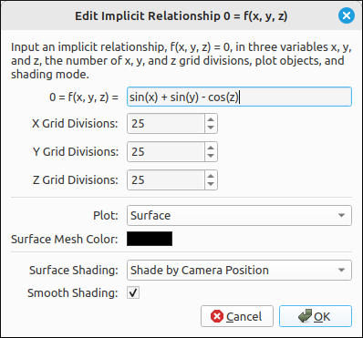
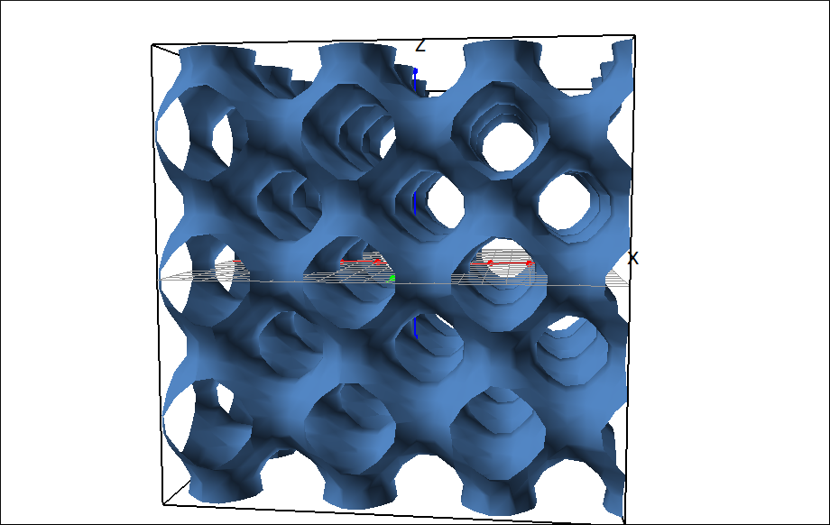
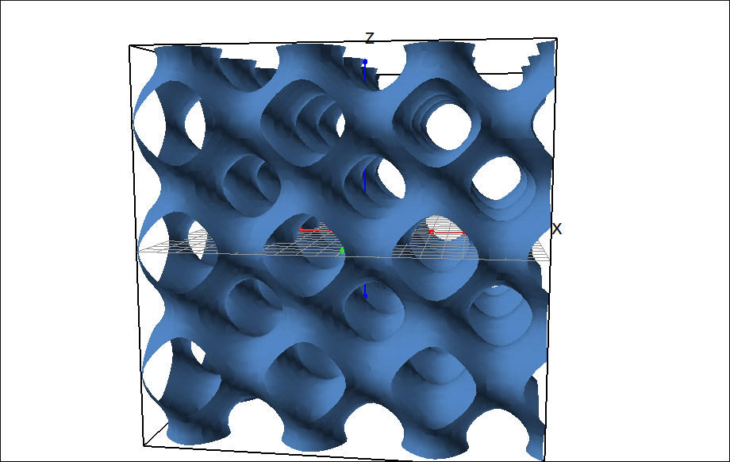
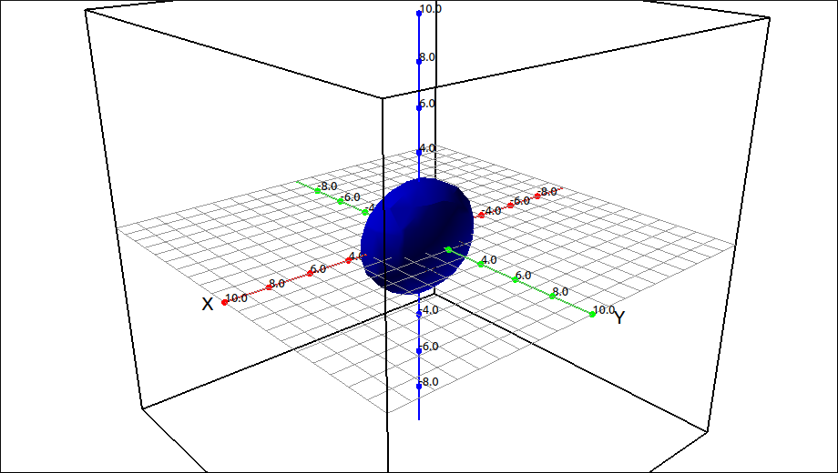
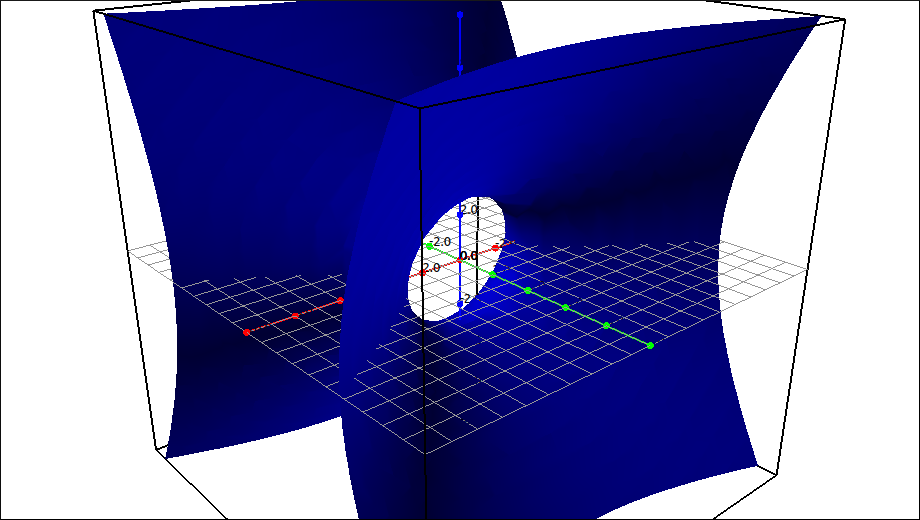
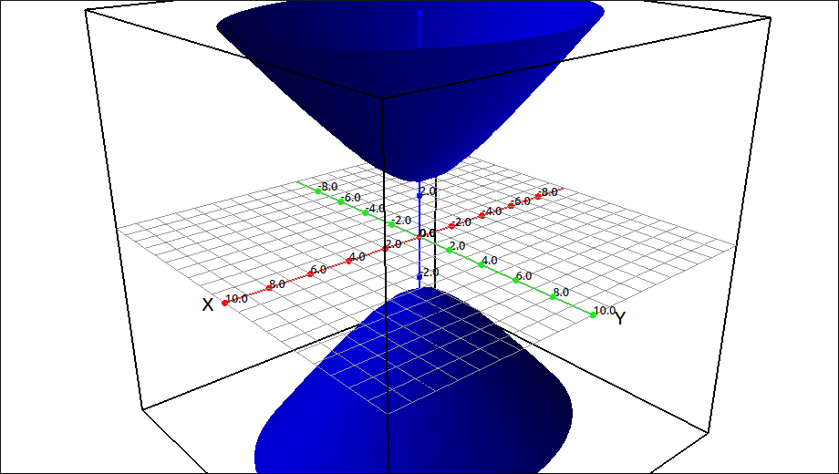

:index:`Implicit Relationship f(x, y, z) = 0`
=============================================

Description
-----------

This type is for graphing implicitly defined expressions of the form :math:`f(x, y, z) = 0`.  The expression must be in the variables ``x``, ``y`` and ``z`` and it is assumed that the expression is set to 0 for the relationship.

Insert/Edit Dialog
------------------

The Insert/Edit Dialog for this type is shown below.

    Implicit Relationship Dialog Box

The first input is for the expression, after that there are options for the number of grid divisions in the x, y, and z directions, plot object, mesh color, shading mode and smooth shading.

The program first evaluates the expression over the cubic grid formed by the coordinate axes ranges, then uses a cube-marching algorithm to interpolate and form a mesh that will be used to plot the surface.

Options
-------

X, Y, and Z Grid Divisions
^^^^^^^^^^^^^^^^^^^^^^^^^^

The variables these set depend on the selection of the function type, the labels will change when the function type selector is changed.  As with implicitly defined curves in 2D, the more gird divisions the better the interpolation but also the more calculations to be completed, and hence slower for animations, panning, and scaling.

Plot
^^^^

.. include:: plotObjects3d.md

Surface Mesh Color
^^^^^^^^^^^^^^^^^^

.. include:: meshcolor.md

Surface Shading
^^^^^^^^^^^^^^^

.. include:: shading3d.md

Smooth Shading
^^^^^^^^^^^^^^

.. include:: smoothshading3d.md

.. note::

    Since the implicit grid is only defined inside the viewing cube there is no clipping option with this type as there is with other surface types.

Example
-------

As a quick example, if we plot the expression in the dialog box above, :math:`\sin{\left(x \right)} + \sin{\left(y \right)} - \cos{\left(z \right)} = 0` we get,

    :math:`\sin{\left(x \right)} + \sin{\left(y \right)} - \cos{\left(z \right)} = 0`

If we increase the divisions to 50 in each direction we get a smoother surface.

    :math:`\sin{\left(x \right)} + \sin{\left(y \right)} - \cos{\left(z \right)} = 0`

As another example, this type of graph can be used to examine quadratic surfaces, even dynamically.  If we input the expression, :math:`-1 + \frac{z^{2}}{c} + \frac{y^{2}}{b} + \frac{x^{2}}{a}` we get sliders for ``a``, ``b``, and ``c``, moving them we can dynamically see the shifting between the following surfaces.

    Quadratic Surface Example

    Quadratic Surface Example

    Quadratic Surface Example

