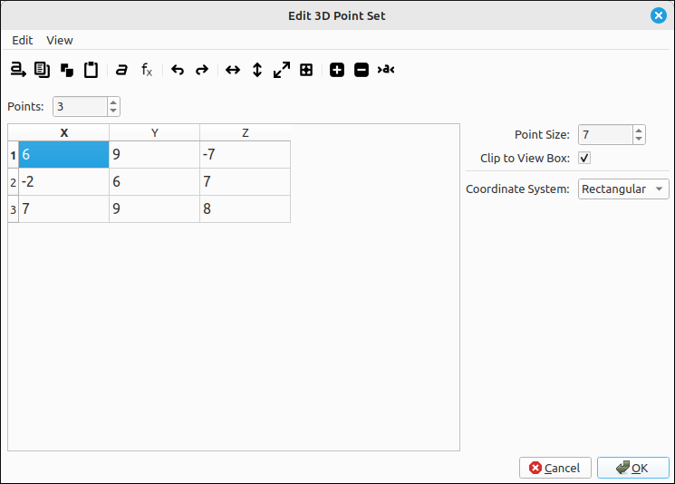
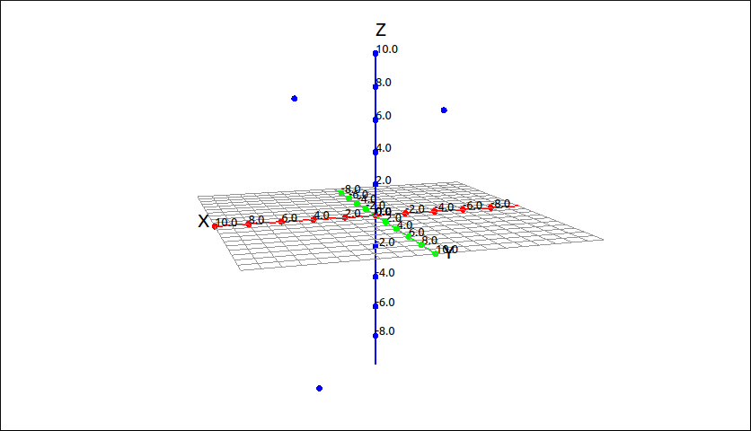

:index:`Point Set`
==================

Description
-----------

This is for plotting a set of points.  The points can be given as a :math:`3 \times n` matrix where each column represents a point, row 1 are the x-coordinates, row 2 are the y-coordinates, and row 3 are the z-coordinates.  It can also be given as a list of lists, the inner lists must have two components representing x, y, and z respectively. For example the set of points :math:`\{(6, 9, -7), (-2, 6, 7), (7, 9, 8) \}` could be input as the matrix,

.. math::
    \left[\begin{array}{ccc}6 & -2 & 7\\9 & 6 & 9\\-7 & 7 & 8\end{array}\right]

or as the list of lists ``[[6, 9, -7],[-2, 6, 7],[7, 9, 8]]``.

Insert/Edit Dialog
------------------

The Insert/Edit Dialog for a 3D point set is pictured below.

    Point Set Dialog Box

The dialog is set up in a similar manner as the matrix input dialog except that the number of columns is fixed at 3.  This is really transposed from the matrix input way of representing points but was done to make user input more natural.  The menu and toolbar have options for the input of the points in the editing grid on the left.  The options on the right are for the point size, clipping, and coordinate system.

.. include:: ../CLAE/PointSetDialogOptions.md

Options
-------

Point Size
^^^^^^^^^^

The size of the point to be used in the image.  The default of 7 is usually sufficient for most applications.

Clip to View Box
^^^^^^^^^^^^^^^^

.. include:: clipping3d.md

Coordinate System
^^^^^^^^^^^^^^^^^

This allows the user to select between rectangular, cylindrical, and spherical coordinates. In rectangular coordinates the expressions will evaluate an :math:`(x, y, z)` point, if set to cylindrical the expressions will evaluate an :math:`(r, \theta, z)` point, and if set to spherical the expressions will evaluate a :math:`(\rho, \theta, \phi)` point.

Example
-------

If we plot the point set from the above example we would see,

    Point Set Example

