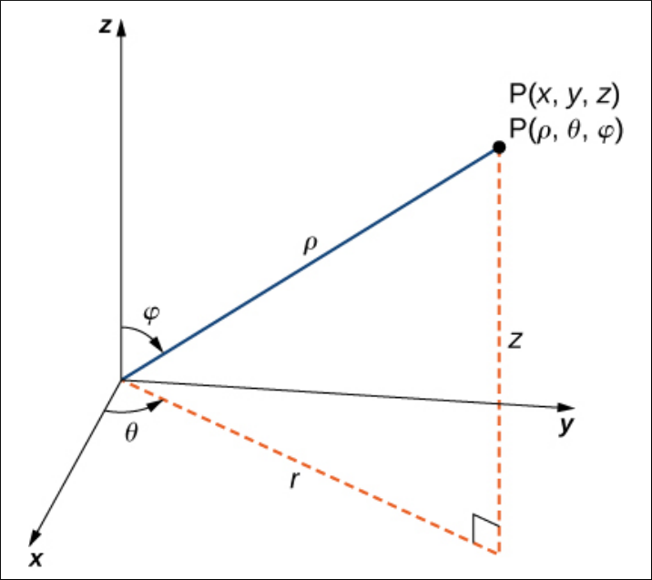
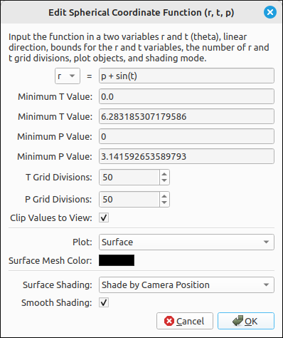
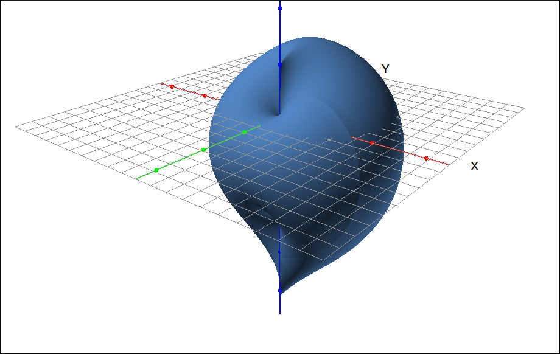
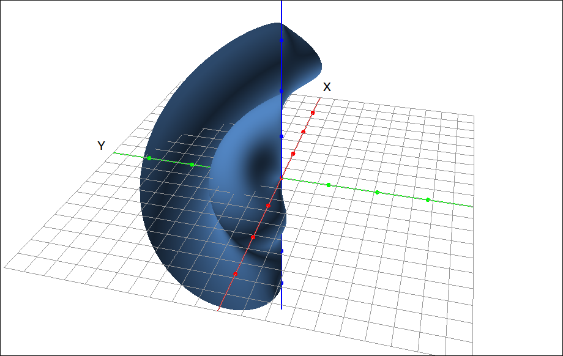
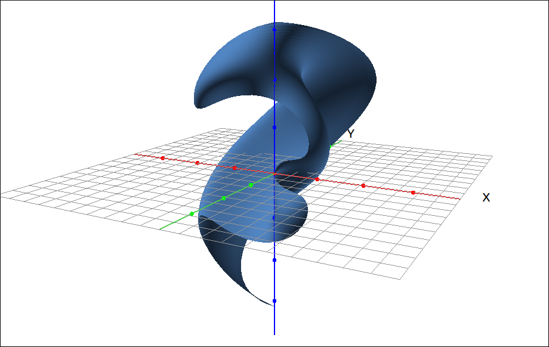

:index:`Spherical Coordinate Surface`
=====================================

Description
-----------

This type is for graphing functions in the spherical coordinate system.  There are several standard ways to define spherical coordinates, we chose the most common.  Spherical coordinates are defined as a triple :math:`(\rho, \theta, \phi)` where :math:`\rho` is the radius of the point (distance to the origin), :math:`\theta` is the angle made in the xy-plane measured counterclockwise from the positive x-axis, and :math:`\phi` is the angle made with the positive z-axis.  The image below shows the graphical relationship.

    :title:`Calculus Volume 3` by Gilbert Strang and Edwin "Jed" Herman, 2018, OpenStax, https://openstax.org

A few calculations give the formulas,

.. math::
    x = \rho \sin(\phi)\cos(\theta) \quad y = \rho \sin(\phi)\sin(\theta) \quad z = \rho \cos(\phi)

and

.. math::
    \rho^2 = x^2 + y^2 + z^2

In this program, we use ``r`` for :math:`\rho`, ``t`` for :math:`\theta`, and ``p`` for :math:`\phi`.  This program can graph three types of spherical coordinate functions, :math:`\rho = f(\theta, \phi)`, :math:`\theta = f(\rho, \phi)`, :math:`\phi = f(\rho, \theta)`.

Insert/Edit Dialog
------------------

The Insert/Edit Dialog for this type is shown below.

    Spherical Coordinate Surface Dialog Box

The first input is for the function.  Note that there is a drop-down selector on the left hand side for you to select what type of spherical coordinate function you want to plot, :math:`\rho = f(\theta, \phi)`, :math:`\theta = f(\rho, \phi)`, :math:`\phi = f(\rho, \theta)`.  The function input box is to its right and this must be a function in terms of the other two variables. After the function selection there are options for the minimum and maximum values of the independent variables, the number of grid divisions for the independent variables, clipping, plot object, mesh color, shading mode and smooth shading.

Options
-------

Minimum and Maximum Values
^^^^^^^^^^^^^^^^^^^^^^^^^^

The variables these set depend on the selection of the function type, the labels will change when the function type selector is changed.

Grid Divisions
^^^^^^^^^^^^^^

The variables these set depend on the selection of the function type, the labels will change when the function type selector is changed.

Clip Values to View
^^^^^^^^^^^^^^^^^^^^

.. include:: clipping3d.md

Plot
^^^^

.. include:: plotObjects3d.md

Surface Mesh Color
^^^^^^^^^^^^^^^^^^

.. include:: meshcolor.md

Surface Shading
^^^^^^^^^^^^^^^

.. include:: shading3d.md

Smooth Shading
^^^^^^^^^^^^^^

.. include:: smoothshading3d.md

Example
-------

A couple quick examples, first if we plot :math:`\rho = \phi + \sin(\theta)` on the default ranges we get,

    Spherical Coordinate Surface Example

Second if we plot :math:`\theta = \phi + \sin(\rho)` on the default ranges we get,

    Spherical Coordinate Surface Example

Finally, if we plot :math:`\phi = \theta + \sin(\rho)` on the default ranges we get,

    Spherical Coordinate Surface Example

