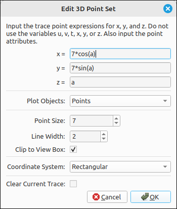
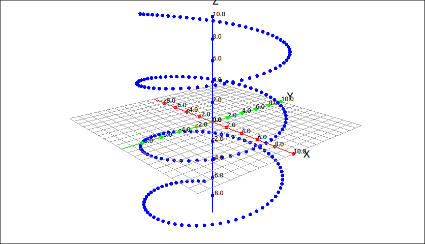
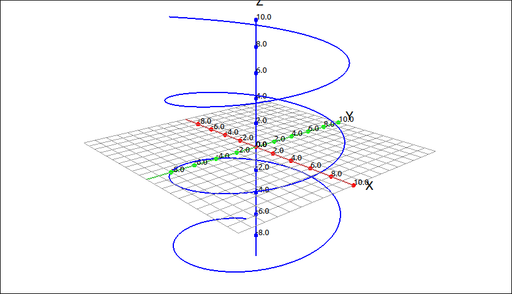
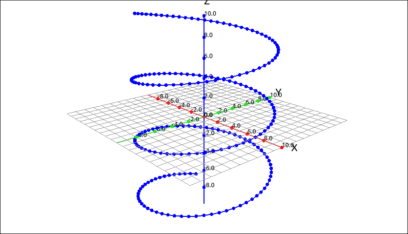

:index:`Trace Point`
====================

Description
-----------

A trace point is a single point on the graph that is linked to one or more sliders, that is, the expression contains variables other than the set of 3D variables (``x``, ``y``, ``z``, ``p``, ``t``, ``u``, and ``v``).  When the sliders are changed the updated point is plotted along with all the previous points, thus tracing out a path that the point follows.  A trace point can be input as a list of 3 elements representing the x, y, and z coordinates respectively or as a :math:`3 \times 1` matrix.  For example, we could input :math:`\left[ 7 \cos{\left(a \right)}, \  7 \sin{\left(a \right)}, \  a\right]` or

.. math::
    \left[\begin{array}{c}7 \cos{\left(a \right)}\\7 \sin{\left(a \right)}\\a\end{array}\right]

Insert/Edit Dialog
------------------

The Insert/Edit Dialog for trace point is pictured below.

    Trace Point Dialog Box

The first edit boxes are for the x, y, and z coordinate expressions.  This is followed by the plot objects, point size, line width, clipping, coordinate system, and an option to clear the current trace.

Options
-------

Plot Objects
^^^^^^^^^^^^

This designates what is plotted as the trace point changes.  The options are:

- **Points:** This plots each individual point on the update.

- **Connecting Lines:** This plots lines between the individual points and does not plot the point itself.

- **Points and Lines:** This plots both the points and connecting lines.

.. note::

    When plotting the connecting lines this will plot a line between each consecutive pair of points that are evaluated.  If a slider is moved quickly then the consecutive points may be far apart and the connecting line may not be as accurate.  If you do set this to a connecting line mode it is best to animate the slider instead of moving it with the mouse.

Point Size
^^^^^^^^^^

The size of the point to be used in the image.  The default of 7 is usually sufficient for most applications.

Line Width
^^^^^^^^^^

If one of the connected line modes is selected this will set the width of the connecting line.

.. include:: linewidth.md

Clip to View Box
^^^^^^^^^^^^^^^^

.. include:: clipping3d.md

Coordinate System
^^^^^^^^^^^^^^^^^

This allows the user to select between rectangular and polar coordinates. In rectangular coordinates the expressions will evaluate an :math:`(x, y)` point and if set to polar the expressions will evaluate an :math:`(r, \theta)` point.

Clear Current Trace
^^^^^^^^^^^^^^^^^^^

This will clear the current trace data from the plot.

Example
-------

Say we plot the expression ``[7*cos(a),7*sin(a),a]`` as a trace point.  If we animate the ``a`` slider we get the image.

    Trace Point Example Points

Changing the plot object to connected lines we get,

    Trace Point Example Lines

Changing the plot object to points and lines we get,

    Trace Point Example Points and Lines
