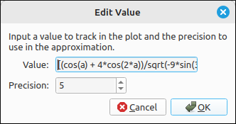
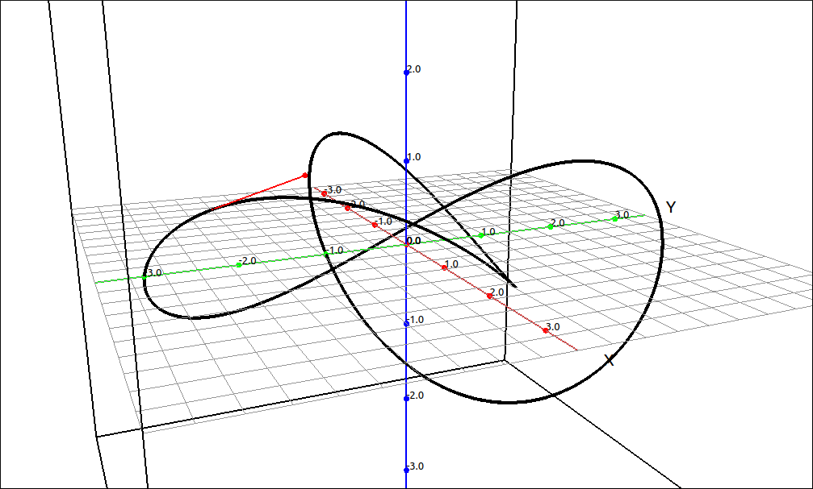
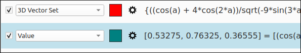

:index:`Value`
==============

Description
-----------

A value has no graphical interpretation, it is simply an expression that is evaluated and its value is displayed in the graphics manager and the legend.  A value can be any legitimate expression that doe not contain the set of 3D variables (``x``, ``y``, ``z``, ``p``, ``t``, ``u``, and ``v``).  Usually the value is linked to one or more sliders to show the value of the expression as its parameter values change.

Insert/Edit Dialog
------------------

The Insert/Edit Dialog for a value is shown below.

    Value Dialog Box

Other than the expression to be evaluated the only option is the precision of the output.

Options
-------

Precision
^^^^^^^^^

This is just the number of decimal places shown in the output.

Example
-------

For this example we will plot the trefoil curve, a unit tangent vector to the curve at a slider value, and the value of the unit tangent vector also attached to the same slider.  The trefoil curve is defined to be,

.. math::
    C = \left( \sin{\left(t \right)} + 2 \sin{\left(2 t \right)}, \  \cos{\left(t \right)} - 2 \cos{\left(2 t \right)}, \  - \sin{\left(3 t \right)}\right)

In the CAS,

- Input the curve as a list, ``[sin(t) + 2*sin(2*t),cos(t) - 2*cos(2*t),-sin(3*t)]``, say this is R1.
- Calculate the unit tangent vector for R1 with respect to t, say this is R2.
- Simplify R2, say this is R3.  You should have,

.. math::
    \left[\begin{array}{c}\frac{\cos{\left(t \right)} + 4 \cos{\left(2 t \right)}}{\sqrt{- 9 \sin^{2}{\left(3 t \right)} + 8 \cos{\left(3 t \right)} + 26}}\\\frac{\left(8 \cos{\left(t \right)} - 1\right) \sin{\left(t \right)}}{\sqrt{- 9 \sin^{2}{\left(3 t \right)} + 8 \cos{\left(3 t \right)} + 26}}\\- \frac{3 \cos{\left(3 t \right)}}{\sqrt{- 9 \sin^{2}{\left(3 t \right)} + 8 \cos{\left(3 t \right)} + 26}}\end{array}\right]

- Evaluate R3 at ``a``, say this is R4.
- Evaluate the curve, R1, at ``a``, say this is R5.
- Graph, R1 as a space curve and R4 as a vector set.
- Go into the properties of the vector set (unit tangent vector) and set the initial point to R5.

At this point when you should see the unit tangent on the curve and when you change the value of the ``a`` slider the tangent line will follow the curve.

    Value Example

- In the graphics manager, duplicate the vector set and then change its type to Value.  At this point you will see the vector value in the description of the object in the graphics manager.  As you change the slider ``a`` this vector will change accordingly.

    Value Example Graphics Manager Display

