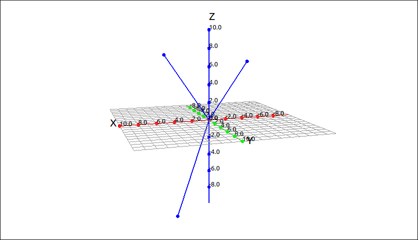
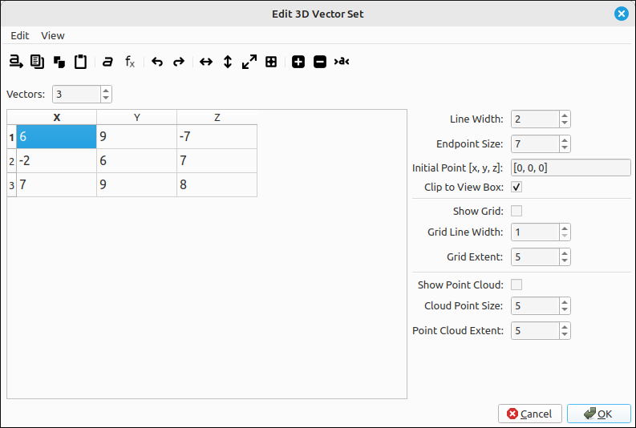
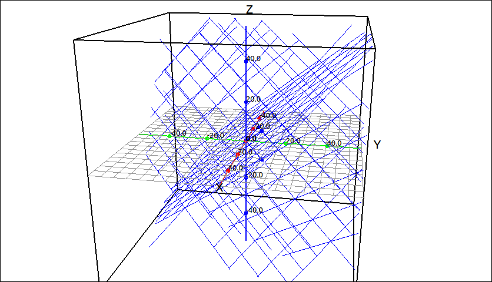
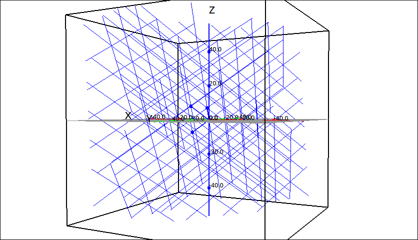
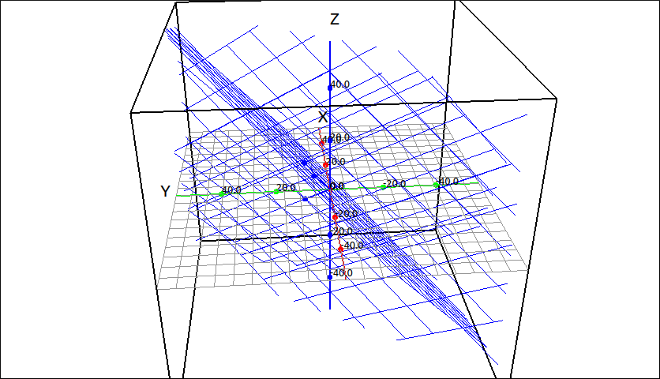
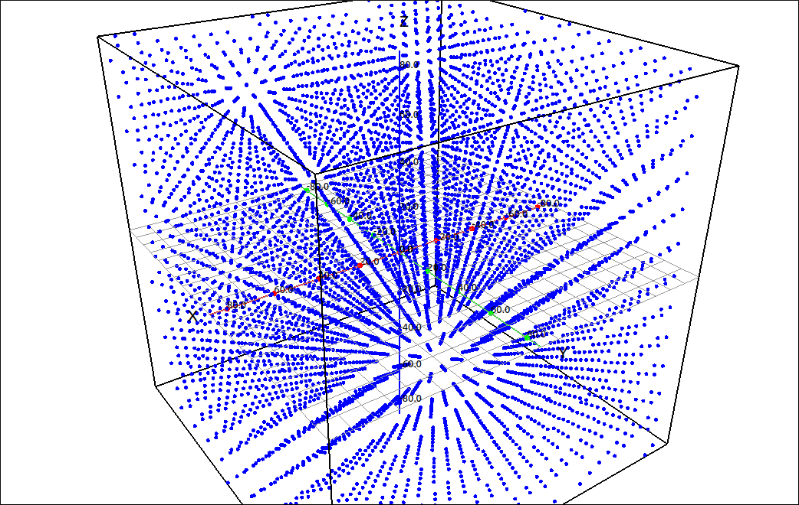
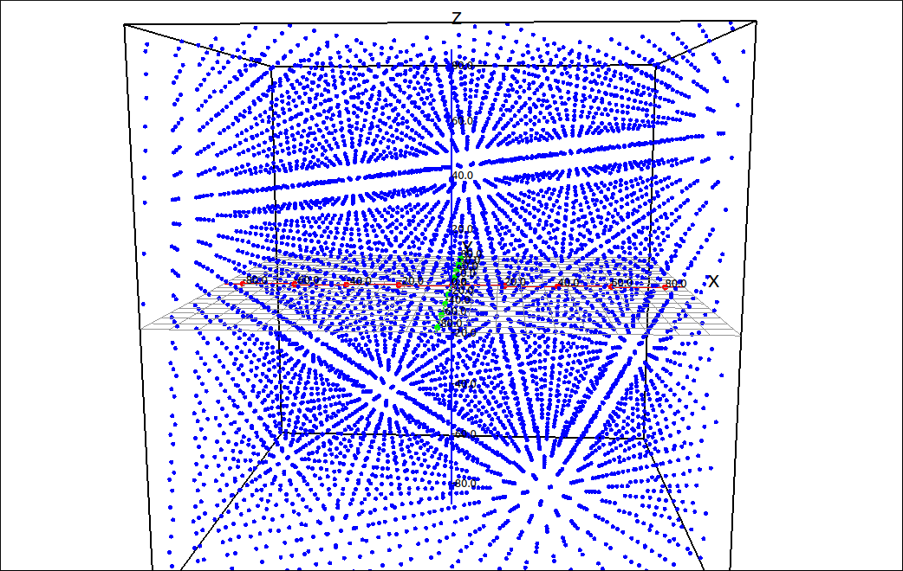

:index:`Vector Set`
===================

Description
-----------

This is for plotting a set of vectors.  The vectors can be given as a :math:`3 \times n` matrix where each column represents a point, row 1 are the x-coordinates, row 2 are the y-coordinates, and row 3 are the z-coordinates.  It can also be given as a list of lists, the inner lists must have two components representing x, y, and z respectively. For example the set of points :math:`\{(6, 9, -7), (-2, 6, 7), (7, 9, 8) \}` could be input as the matrix,

.. math::
    \left[\begin{array}{ccc}6 & -2 & 7\\9 & 6 & 9\\-7 & 7 & 8\end{array}\right]

or as the list of lists ``[[6, 9, -7],[-2, 6, 7],[7, 9, 8]]``.

When a 3D vector is rendered the head of the vector is simply a point instead of an arrow or directed cone.  Although not as fancy as an arrow it still adequately represents a vector and speeds up the graphics considerably.  The following is an example of the vector rendering of the vectors in the above example.

    Vector Set Example

Insert/Edit Dialog
------------------

The Insert/Edit Dialog for a 3D vector set is pictured below.

    Vector Set Dialog Box

The dialog is set up in a similar manner as the matrix input dialog except that the number of columns is fixed at 3.  This is really transposed from the matrix input way of representing points but was done to make user input more natural.  The menu and toolbar have options for the input of the points in the editing grid on the left.  The options on the right are for the line width, point size, initial point, clipping, grid, grid line width, grid line extent, point cloud, cloud point size, and point cloud extent.

.. include:: ../CLAE/PointSetDialogOptions.md

Options
-------

Line Width
^^^^^^^^^^

This is the width of the lines from the initial point of the vector to the terminal point of the vector.

.. include:: linewidth.md

Endpoint Size
^^^^^^^^^^^^^

The size of the point to be used in the image.  The default of 7 is usually sufficient for most applications.

Initial Point
^^^^^^^^^^^^^

This is the initial point of the vector set.  The input is as a list with three elements the first is the x coordinate, the second is the y coordinate, and the third is the z coordinate.  The expressions for the x, y, and z coordinates can be any valid expression that does not contain the set of 3D variables (``x``, ``y``, ``z``, ``p``, ``t``, ``u``, and ``v``).  They may contain constants that will link with a slider.

Clip to View Box
^^^^^^^^^^^^^^^^

.. include:: clipping3d.md

Show Grid
^^^^^^^^^

If checked the program will add in a grid of integer linear combinations of the vectors in the set (in pairs), up to the first 5 vectors.  This is useful when visualizing linear combinations, change of basis, and spanning.

Grid Line Width
^^^^^^^^^^^^^^^

This is the width of the grid lines used if that option is selected.

Grid Extent
^^^^^^^^^^^

This option sets the number of grid lines that are created if that option is selected.  For example, if the extent is set to 5 the program will graph the grid 5 lines in each direction, that is, linear combination constants of :math:`-5, -4, -3, -2, -1, 0, 1, 2, 3, 4, 5`.

Show Point Cloud
^^^^^^^^^^^^^^^^

If checked the program will add in a point cloud of integer linear combinations of the vectors in the set, up to the first 5 vectors.  This is useful when visualizing linear combinations and spanning.

Cloud Point Size
^^^^^^^^^^^^^^^^

This is the point size of the used in the cloud if that option is selected.

Point Cloud Extent
^^^^^^^^^^^^^^^^^^

This option sets the number of points that are created in each vector direction if that option is selected.  For example, if the extent is set to 5 the program will graph 5 points in each vector direction, that is, linear combination constants of :math:`-5, -4, -3, -2, -1, 0, 1, 2, 3, 4, 5`.

Example
-------

If we plot the vector set from the above example we would see,

    Vector Set Example

If we turn on the grid option, zoom out a little, and look at several different views we see the following.

    Vector Set Example with Grid

    Vector Set Example with Grid

    Vector Set Example with Grid

If we turn on the point cloud option, zoom out a little, increase the extent, and look at a couple different views we see the following.  This should give the user a good feel that the set of vectors span :math:`\mathbb{R}^3.`

    Vector Set Example with Point Cloud

    Vector Set Example with Point Cloud

.. note::

    - The grid option will graph the grid defined by pairs of vectors up to the first 5 vectors.  As usual, for speed we did not have it graph all possible grid translations or go past 5 vectors.  From this, for most applications, the user should get a good feel for the span of the set of vectors.

    - The user should be aware that with the grid option there may be some cases where the image does not represent the true span of the set.  For example, if the first 5 vectors are multiples of each other and the remaining vectors in the set are not.

    - The point cloud option does not restrict the linear combinations to pairs of vectors but takes all linear combinations, up to the first 5 vectors, within the selected extent.  This will usually give a better visualization of the span of a set of vectors.  On the other hand, the number of points increases exponentially so care should be taken not to increase the extent too far.  With a set of three or four vectors the system responds fairly quickly but with 5 vectors and large extent the user will probably see some lag when the view is scaled or translated or during a slider movement. As an example, if you have a set of 5 vectors and increase the extent to 20 there will be 115,856,201 points plotted.

