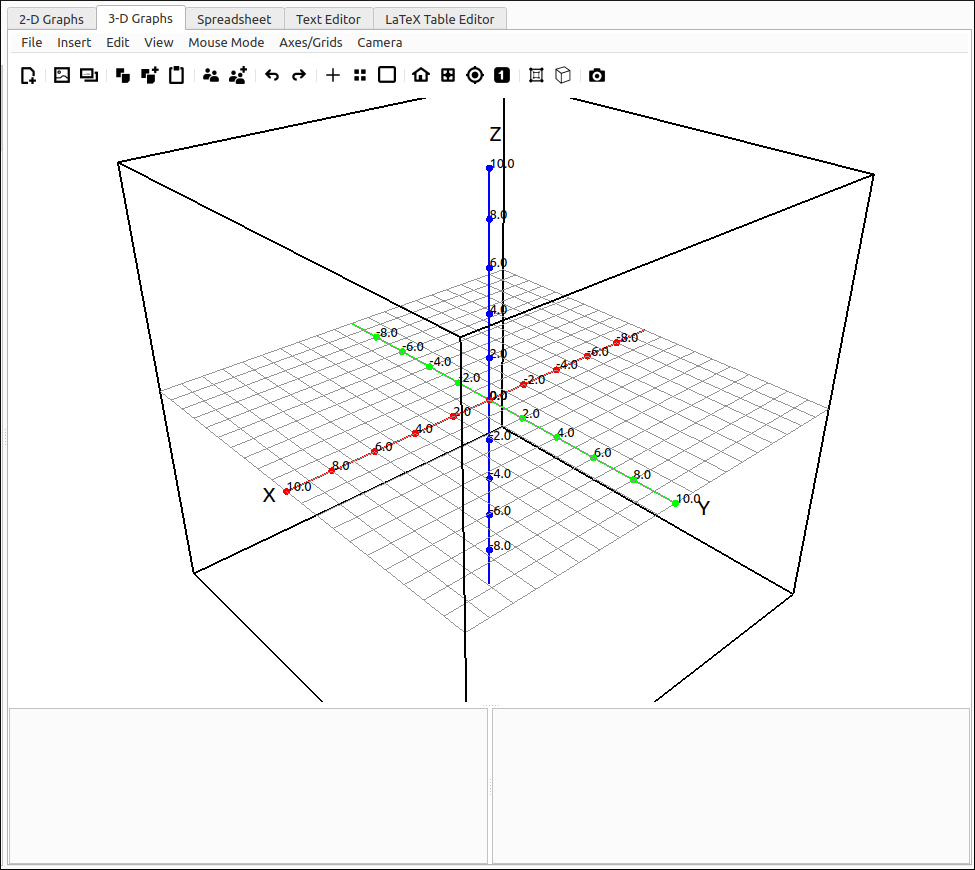
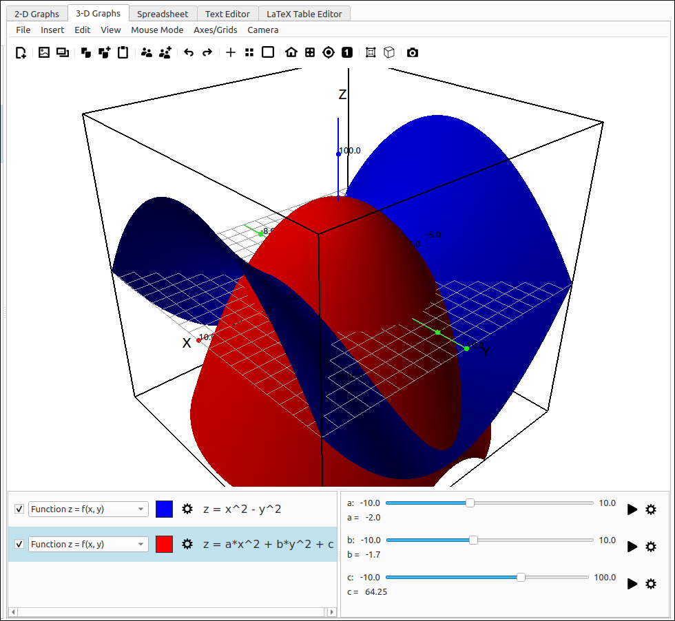
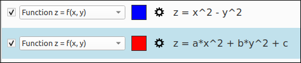
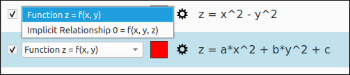
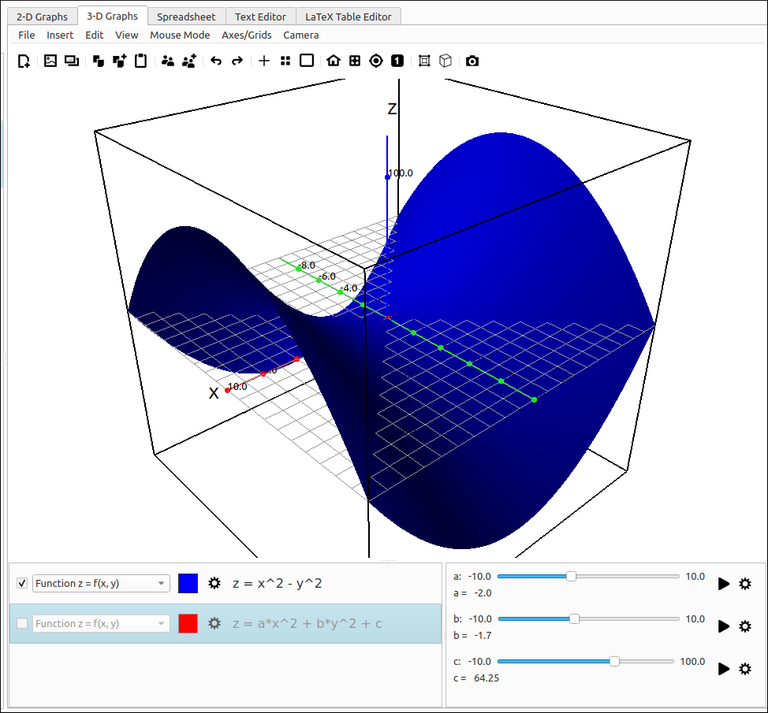
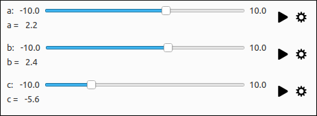
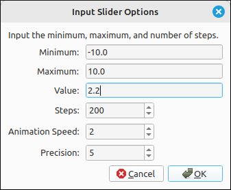

:index:`3D Graphs`
==================

Introduction
------------

The 2D and 3D graphics tabs are the ones you will be using the most.  For the first couple courses in Calculus you will be primarily, if not exclusively, using the 2D graphics system and for courses in Linear Algebra and Multi-variable Calculus you will primarily be using the 3D graphics system.  Both are set up in a similar manner but they are independent of each other.

:index:`3D Graphics System Layout`
^^^^^^^^^^^^^^^^^^^^^^^^^^^^^^^^^^

The 3D graphics system is pictured below.  The menu and toolbars are at the top of the view, the main graphics area for the plots is in the center and the graphics manager is at the bottom.  The graphics manager is divided into two sub-windows.  The left will contain the objects being graphed as well as tools for changing the display types and properties of the graphs. The currently selected object is the one that is highlighted, you can select only one object at a time.  The right contains the sliders for the objects.  Any variable name that is not the independent variable or variables in the expression are considered constants, that is, anything other than ``x``, ``y``, ``z``, ``p``, ``t``, ``u``, and ``v``.  When an expression is graphed that has one or more constants in it a slider is created for each constant in the expression.  These sliders are global, so if two different expressions use the constant ``a`` both use the same slider value for ``a``.

    3D Graphics System Layout

The image below shows the graphics system with several entries and slider values.  Note that the main graphics area shows the surfaces. The 3D graphics system does not include a legend like the 2D graphics system, the object list in the graphics manager is the legend for the 3D system. The graphics manager shows each object in the left screen and a set of sliders in the right screen.

    3D Graphics System Layout with Objects and Sliders

The divider between the graphs and the graphics manager is movable as is the divider between the object list and the slider list within the graphics manager.  In fact, they can be moved all the way to the margins of the view and collapsed.

:index:`Inserting a 3D Graphs Item`
^^^^^^^^^^^^^^^^^^^^^^^^^^^^^^^^^^^

Adding a plot to the 3D graphics system can be done in two ways, a drag and drop from the CAS to the graphics plot area or the graphics manager item list, and second by selecting the Insert option from the 3D graph menu and then the type of object you wish to plot.

This program was built for using the CAS capabilities alongside the visualizations tools so in many cases you will already have an expression in the CAS workspace that you want to graph.  In this case simply drag it over to the graph.  The type of image will be automatically selected (see the discussion on types below), if this is not that way you want to visualize the expression use the type selector to change the rendering type to what you want.  Note that if you click and drag an expression that cannot be graphed by the program it will give you an error message.  Also, there may be some rare cases where you click and drag an expression over to the graph and the expression does not graph.  This is usually when the expression is legitimate but the numpy translation does not produce usable values, for example, complex numbered results.

You do not need to first input the expression in the CAS.  The Insert menu contains all the graphics types that this program will recognize. When an expression is input in this manner the type will be the type selected from the menu but it will also produce the same type drop-down list as it would if the expression was dragged over from the CAS.

:index:`Navigating the 3D Graphics View`
^^^^^^^^^^^^^^^^^^^^^^^^^^^^^^^^^^^^^^^^

Navigating the 3D graphics view is fairly simple and done primary using the mouse.  First make sure that the mouse mode is set to the default mode of ``Camera Rotation and Zoom``.  The camera is a spherical camera, that is, its position is on a sphere and the direction it is pointed is to the center of the viewing cube.

- Left click and drag will change the spherical angles of the camera position but not the distance the camera is from the center of the viewing cube.  Horizontal movements change the XY-plane angle and vertical movements change the angle with the Z-axis.
- Mouse scrolling will change the distance the camera is from the origin, that is, the radius of the sphere the camera is on.
- The left and right arrow keys change the XY-plane angle.
- The up and down arrow keys change the angle with the Z-axis.
- Ctrl+Up Arrow decreases the sphere radius and hence zooms in on the view.
- Ctrl+Down Arrow increases the sphere radius and hence zooms out on the view.
- The menu option ``View > Reset View Window`` (and its corresponding toolbar button) resets the view area to the default of :math:`[-10, 10] \times [-10, 10] \times [-10, 10]`.
- The menu option ``View > Center at Origin`` (and its corresponding toolbar button) resets the center to the origin.  Note that this will simply move the center, it will not change the lengths of the axes or the viewing aspect ratio.
- The menu option ``View > Translate Center to (x, y, z)`` (and its corresponding toolbar button) allows the user to set the center of the viewing area to any point :math:`(x, y, z)`.  When this option is selected a dialog box will appear allowing the user to select the x, y, and z values for the new center. Note that this will simply move the center, it will not change the lengths of the axes or the viewing aspect ratio.
- The menu option ``View > Set View Window to 1-1`` (and its corresponding toolbar button) will reset the lengths of the axes to give an aspect ratio of 1.  Note that this is not a locking 1-1, so after this option is selected the graphics view aspect ratio can be changed with the other navigation options.  If this is done then this option needs to be selected again to get back to a 1-1 aspect ratio.

:index:`3D Graphics Manager`
^^^^^^^^^^^^^^^^^^^^^^^^^^^^

3D Graphics Item Tools
""""""""""""""""""""""

Each entry in the graphics items list has the same set of options.  The first is a check box that toggles the view of the object, you can also toggle the view of the object by double-clicking the description.  The second is a drop-down box which lists all the ways that this program can view the expression, to change the type of rendering of the expression simply select it from this drop-down box. The next is the base color of the object, simply click on this color box to bring up a color selection dialog for you to select another color. The last tool before the description is the properties editing button.  Selecting this will bring up the properties dialog for that object type to allow you to edit any options for that plot.

Each graphics type has its own set of properties, these will be discussed in each of the separate graphics object types.  The editing dialog and the insert dialog have the same properties for each type, the only difference is that when you edit properties for an object that already exists the expression and current properties are already loaded into the dialog whereas with the insert option the expressions are blank and the properties are set to their default values.

    3D Graphics Item Tools

Note that you can drag and drop items from the graphics item list to the CAS.  This would be useful if you had input the expression from the insert menu and then decided you wanted to do some CAS functions on it.

3D Graphics Item Types
""""""""""""""""""""""

The image below shows the graphics type selector.  This list will be different for different expressions, some may have a large number of types and others may have few or just one.

    3D Graphics Type Selector

3D Graphics Item Toggle
"""""""""""""""""""""""

As mentioned above, the checkbox or double-clicking the description will toggle the view of the item but not remove the item from the item list.  If an item is deselected it will be grayed out in the list and not visible on the graph.  Below is an example of a deselected item.  Note that sliders for deselected items are not removed since the item is still in the manager list.

    3D Graphics Item Toggle

3D Graphics Sliders
"""""""""""""""""""

Each constant is automatically given a slider when the expression is put into the graph and is removed if an item is deleted and no other item uses that constant.  The constant sliders all have the same layout.  The top line starts with the constant name.  In the example pictured below the names are ``a``, ``b``, and ``c``.   Any variable that is not an independent variable or variables is considered to be a constant, that is, anything other than ``x``, ``y``, ``z``, ``p``, ``t``, ``u``, and ``v``.  After the name is the minimum slider value, the slider itself, and then the maximum slider value.  The minimum and maximum can be changed using the slider properties, discussed below. Below the slider is the current value of the constant.

    3D Graphics Sliders

On the far right of each slider are two tools, the first (play button) is the animator.  Clicking this will animate the slider from the minimum to maximum values and then reverse direction continually until the user clicks the stop button that will replace the play button when an animation is started.  The second tool is the properties button.  This will invoke the slider options dialog allowing the user to select the minimum, maximum, value, the number of steps in the slider (i.e. the granularity), the animation speed, and the precision of the display of the constant value.

    3D Graphics Slider Properties

3-D Graphics Object Descriptions
--------------------------------

* :doc:`Function`: Graph expressions of the form :math:`z = f(x, y)`.
* :doc:`SurfaceRev`: Graph a surface of revolution around an axis parallel to one of the coordinate axes.
* :doc:`Parametric`: Graph a parametric surface :math:`(x, y, z) = (f(u, v), g(u, v), h(u, v))`.
* :doc:`Cylindrical`: Graph a Cylindrical Coordinate surface :math:`z= f(r, \theta)`.
* :doc:`Spherical`: Graph a Spherical Coordinate surface :math:`r = f(\theta, \phi)`, :math:`\theta = f(r, \phi)`, or :math:`\phi = f(r, \theta)`.
* :doc:`Implicit`: Graph an implicitly defined relationship of the form :math:`f(x, y, z) = 0`.
* :doc:`FunctionSheet`: Graph a function sheet, or curtain, with respect to any of the coordinate planes.
* :doc:`PolarFunctionSheet`: Graph a function sheet, or curtain, in polar coordinates with respect to any of the coordinate planes.
* :doc:`SpaceCurve`: Graph a space curve :math:`(x, y, z) = (f(t), g(t), h(t))`.
* :doc:`FunctionSpaceCurve2D`: Graph a space curve defined by a single variable function with respect to any of the coordinate planes.
* :doc:`FunctionSpaceCurve2DPolar`: Graph a space curve defined by a single variable function with respect to any of the coordinate planes in polar coordinates.
* :doc:`TracePoint`: Graph a point that traces out a point set as the graph is updated, usually by the changing of a slider value.
* :doc:`PointSet`: Graph a set of :math:`(x, y, z)` points.
* :doc:`Polygon`: Graph a polygon through a sequence of :math:`(x, y, z)` points.
* :doc:`VectorSet`: Graph a set of :math:`(x, y, z)` points, as vectors :math:`\langle x, y, z \rangle`.
* :doc:`LinearSystem`: Graph a set of lines defining a linear system, each being the row of an :math:`n \times 4` matrix.
* :doc:`VectorField`: Graph a 3-D vector field defined as :math:`F = \langle f(x, y, z), g(x, y, z), h(x, y, z) \rangle`.
* :doc:`FlowCurve`: Graph a curve following a vector field and with initial point :math:`(a, b, c)`.
* :doc:`Value`: Track a value in the graphics manage and in the legend that is linked to one or more slider values.

Quick Guides
------------

.. toctree::
    :maxdepth: 3
    :caption: Quick Guides
    :titlesonly:

    LayoutUse
    syntax

File Options
------------

.. toctree::
    :maxdepth: 3
    :caption: File Options
    :titlesonly:

    FileOpts

Graphs
------

.. toctree::
    :maxdepth: 3
    :caption: Graphs
    :titlesonly:

    Function
    SurfaceRev
    Parametric
    Cylindrical
    Spherical
    Implicit
    FunctionSheet
    PolarFunctionSheet
    SpaceCurve
    FunctionSpaceCurve2D
    FunctionSpaceCurve2DPolar
    TracePoint
    PointSet
    Polygon
    VectorSet
    LinearSystem
    VectorField
    FlowCurve
    Value

Edit and Navigation Options
---------------------------

.. toctree::
    :maxdepth: 3
    :caption: Edit and Navigation Options
    :titlesonly:

    EditOpts
    ViewOpts
    SnapshotViewer
    MouseModeOpts
    AxesOpts
    CameraOpts

