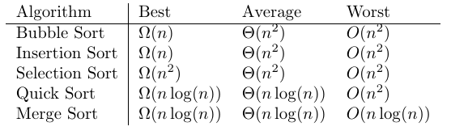
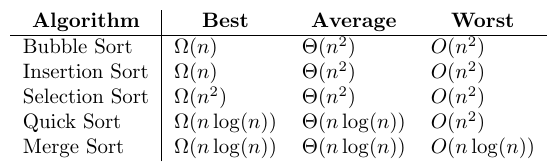
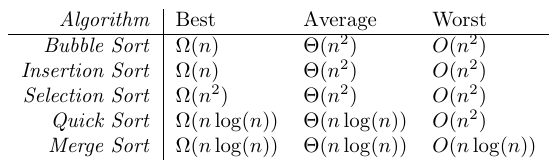
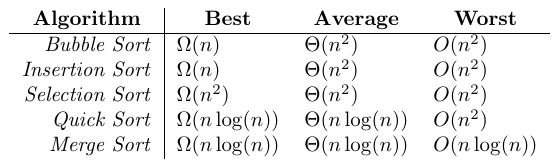

Edit Options
============

The Edit menu contains standard copy and paste options as one would expect. It also has options for creating LaTeX code, as the program was designed to do, and export to specialized formats.

Copy Selected
-------------

This will copy the selected contents to the clipboard as tab-delimited text.  This can then be pasted into the grid or external program such as a spreadsheet or word processor.

Select All
----------

This option simply selects the entire grid of cells.

Paste
-----

Pastes the contents of the clipboard into the grid at the currently selected position.  It is assumed that the data on the clipboard is in tab-delimited form, a standard format for spreadsheets.  With the paste option, if what is being pasted at the current position needs more space, rows or columns, the grid will automatically resize itself to fit the added content.

Paste from LaTeX
----------------

There is also an option to paste from LaTeX code. This will take the body of LaTeX code, extract the cell entries, and load the data into the grid. As with exporting to LaTeX code the entire grid is replaced with the data, not just the selection. For example, if you had the following table,

.. code-block:: latex

    \begin{longtable}[l]{lll}
    1 & 4 & 7 \\
    2 & 5 & 8 \\
    3 & 6 & 9 \\
    \end{longtable}

and then copied the body portion to the clipboard, not including the begin and end statements, that is,

.. code-block:: latex

    1 & 4 & 7 \\
    2 & 5 & 8 \\
    3 & 6 & 9 \\

then select this option the program would extract the contents into the grid,

.. code-block:: console

    1  4  7
    2  5  8
    3  6  9

This option will also parse through \hline code but will not process multicolumn commands and some other specialized content.

Copy to Longtable Environment
-----------------------------

The Longtable Environment and Tabular Environment have options for column alignment, a table border, and several options for division lines between rows and columns. The Column Alignment is the alignment used for all columns in the table. These can be overridden by header rows or columns. The alignment is on each column but is easily editable in the pasted LaTeX code.

The Divisions options are for the selection of common division lines in the table. If you have worked with LaTeX you know there are many more possibilities here for row and column divisions. This tool just includes some of the more common selections and if they are not exactly what is needed it should only take some minimal editing.

- Table Boarder puts a simple border around the entire table.
- Division After First Row puts a line directly below the first row.
- Division on All Rows puts a line directly below each row of the table and one at the top.
- Division After First Column puts a line directly to the right of the first column.
- Division After All Columns puts a line directly to the right of each column of the table and one at the left.

At the bottom there are options to include math mode around the contents of each cell, and to include the arraystretch renew command. If the math mode is selected, then each cell will be put into inline math mode.

There are also have options for both row and column headers. Each header type can include as many rows and columns as you wish, you can set the alignment of the headers as well as the font styles of the headers. When a cell is both a row header and a column header the attributes for the column header are used. For example,

- A table with no headers:

- The same table with just one column header in bold:

- The same table with just one row header in italics:

- The same table with one row header in italics and one column header in bold:

A simple example of the output of this option, note the commented inclusion of the preamble package.

.. code-block:: latex

    % Package: \usepackage{longtable}

    \begin{longtable}[l]{lll}
    1 & 4 & 7 \\
    2 & 5 & 8 \\
    3 & 6 & 9 \\
    \end{longtable}

Copy to Tabular Environment
---------------------------

The Longtable Environment and Tabular Environment have options for column alignment, a table border, and several options for division lines between rows and columns. The Column Alignment is the alignment used for all columns in the table. These can be overridden by header rows or columns. The alignment is on each column but is easily editable in the pasted LaTeX code.

The Divisions options are for the selection of common division lines in the table. If you have worked with LaTeX you know there are many more possibilities here for row and column divisions. This tool just includes some of the more common selections and if they are not exactly what is needed it should only take some minimal editing.

- Table Boarder puts a simple border around the entire table.
- Division After First Row puts a line directly below the first row.
- Division on All Rows puts a line directly below each row of the table and one at the top.
- Division After First Column puts a line directly to the right of the first column.
- Division After All Columns puts a line directly to the right of each column of the table and one at the left.

At the bottom there are options to include math mode around the contents of each cell, and to include the arraystretch renew command. If the math mode is selected, then each cell will be put into inline math mode.

There are also have options for both row and column headers. Each header type can include as many rows and columns as you wish, you can set the alignment of the headers as well as the font styles of the headers. When a cell is both a row header and a column header the attributes for the column header are used. For example,

- A table with no headers:

- The same table with just one column header in bold:

- The same table with just one row header in italics:

- The same table with one row header in italics and one column header in bold:

A simple example of the output of this option, note the commented inclusion of the preamble package.

.. code-block:: latex

    \begin{tabular}{lll}
    1 & 4 & 7 \\
    2 & 5 & 8 \\
    3 & 6 & 9 \\
    \end{tabular}

Copy to Tabbing Environment
---------------------------

The Tabbing Environment has only two options, the column spacing for each column and to include math mode on each cell. The column spacing will be in points, remember 72 points to an inch. If the math mode is selected, then each cell will be put into inline math mode. A simple example of the output of this option,

.. code-block:: latex

    \begin{tabbing}
    \hspace{20pt}\=\hspace{20pt}\=\hspace{20pt}\=\kill
    1 \> 4 \> 7 \\
    2 \> 5 \> 8 \\
    3 \> 6 \> 9 \\
    \end{tabbing}

Copy to Array Environment
-------------------------

This mode has options for column alignment, a table border, and several options for division lines between rows and columns. These are the same as with the longtable and tabular options. There are also options to include the arraystretch renew command and a decoration, that is include brackets, parenthesis, or vertical bars around the matrix.  Since this will most likely be a displayed formula for your document the code is automatically placed into display math mode.

.. code-block:: latex

    \[
    \left[
    \begin{array}{lll}
    1 & 4 & 7 \\
    2 & 5 & 8 \\
    3 & 6 & 9 \\
    \end{array}
    \right]
    \]

Which would result in the following matrix.

.. math::

    \left[
    \begin{array}{lll}
    1 & 4 & 7 \\
    2 & 5 & 8 \\
    3 & 6 & 9 \\
    \end{array}
    \right]

Copy to Matrix Environment
--------------------------

This option requires the amsmath package to be used. There are options the arraystretch renew, and to include bracket, parenthesis, or vertical bar decorations around the matrix.  Since this will most likely be a displayed formula for your document the code is automatically placed into display math mode.

.. code-block:: latex

    % Package: \usepackage{amsmath}

    \[
    \left[
    \begin{matrix}
    1 & 4 & 7 \\
    2 & 5 & 8 \\
    3 & 6 & 9 \\
    \end{matrix}
    \right]
    \]

Which would result in the following matrix.

.. math::

    \left[
    \begin{matrix}
    1 & 4 & 7 \\
    2 & 5 & 8 \\
    3 & 6 & 9 \\
    \end{matrix}
    \right]

Copy to Special Matrix Environment
----------------------------------

All of these option will require the amsmath package to be used. When the special matrix option is selected the user will have the option of exporting to a pmatrix, bmatrix, vmatrix, or Vmatrix. The only other option is to include the arraystretch renew command. Since this will most likely be a displayed formula for your document the code is automatically placed into display math mode.

With pmatrix selected, a simple example of the code would look like,

.. code-block:: latex

    % Package: \usepackage{amsmath}

    \[
    \begin{pmatrix}
    1 & 4 & 7 \\
    2 & 5 & 8 \\
    3 & 6 & 9 \\
    \end{pmatrix}
    \]

Which would result in the following matrix.

.. math::

    \begin{pmatrix}
    1 & 4 & 7 \\
    2 & 5 & 8 \\
    3 & 6 & 9 \\
    \end{pmatrix}

With bmatrix selected, a simple example of the code would look like,

.. code-block:: latex

    % Package: \usepackage{amsmath}

    \[
    \begin{bmatrix}
    1 & 4 & 7 \\
    2 & 5 & 8 \\
    3 & 6 & 9 \\
    \end{bmatrix}
    \]

Which would result in the following matrix.

.. math::

    \begin{bmatrix}
    1 & 4 & 7 \\
    2 & 5 & 8 \\
    3 & 6 & 9 \\
    \end{bmatrix}

With vmatrix selected, a simple example of the code would look like,

.. code-block:: latex

    % Package: \usepackage{amsmath}

    \[
    \begin{vmatrix}
    1 & 4 & 7 \\
    2 & 5 & 8 \\
    3 & 6 & 9 \\
    \end{vmatrix}
    \]

Which would result in the following matrix.

.. math::

    \begin{vmatrix}
    1 & 4 & 7 \\
    2 & 5 & 8 \\
    3 & 6 & 9 \\
    \end{vmatrix}

With Vmatrix selected, a simple example of the code would look like,

.. code-block:: latex

    % Package: \usepackage{amsmath}

    \[
    \begin{Vmatrix}
    1 & 4 & 7 \\
    2 & 5 & 8 \\
    3 & 6 & 9 \\
    \end{Vmatrix}
    \]

Which would result in the following matrix.

.. math::

    \begin{Vmatrix}
    1 & 4 & 7 \\
    2 & 5 & 8 \\
    3 & 6 & 9 \\
    \end{Vmatrix}

Selected Cells to LaTeX Code
----------------------------

This will take the entries in the selected cells and convert them from CAS workspace expressions (SymPy syntax) to LaTeX syntax.  So if you copied an entry or matrix (or several of these) from the CAS to the LaTeX Table Editor tool you can convert them into LaTeX syntax automatically.  For example, if our grid contained the following expressions,

.. code-block:: console

    cos(t^2)    ln(x+4)  x^2-3*x+5
    exp(x)      1/2      4/x
    sin(cos(x)) x/y^2    x^x

This option would alter the grid into the following,

.. code-block:: console

    \cos{\left(t^{2} \right)}                  \ln{\left(x + 4 \right)}  x^{2} - 3 x + 5
    e^{x}                                      \frac{1}{2}               \frac{4}{x}
    \sin{\left(\cos{\left(x \right)} \right)}  \frac{x}{y^{2}}           x^{x}

Selected Cells to LaTeX Code in Math Mode
-----------------------------------------

This will take the entries in the selected cells and convert them from CAS workspace expressions (SymPy syntax) to LaTeX syntax and put each cell into inline math mode.  So if you copied an entry or matrix (or several of these) from the CAS to the LaTeX Table Editor tool you can convert them into LaTeX syntax automatically.  For example, if our grid contained the following expressions,

.. code-block:: console

    cos(t^2)    ln(x+4)  x^2-3*x+5
    exp(x)      1/2      4/x
    sin(cos(x)) x/y^2    x^x

This option would alter the grid into the following,

.. code-block:: console

    $\cos{\left(t^{2} \right)}$                   $\ln{\left(x + 4 \right)}$   $x^{2} - 3 x + 5$
    $e^{x}$                                       $\frac{1}{2}$                $\frac{4}{x}$
    $\sin{\left(\cos{\left(x \right)} \right)}$   $\frac{x}{y^{2}}$            $x^{x}$

Copy as GeoGebra
----------------

The Copy as GeoGebra will formulate the grid as a GeoGebra matrix, that is { } delimited. For example, the standard grid

.. code-block:: console

    1  4  7
    2  5  8
    3  6  9

copies as

.. code-block:: console

    {{1,4,7},{2,5,8},{3,6,9}}

Copy as Maxima
--------------

The Copy as Maxima will formulate the grid as a Maxima matrix. For example, the standard grid

.. code-block:: console

    1  4  7
    2  5  8
    3  6  9

will copy as

.. code-block:: console

    matrix([1,4,7],[2,5,8],[3,6,9])

Copy as SageMath
----------------

The Copy as SageMath will formulate the grid as a SageMath matrix. For example, the standard grid

.. code-block:: console

    1  4  7
    2  5  8
    3  6  9

will copy as

.. code-block:: console

    matrix(QQ,[[1,4,7],[2,5,8],[3,6,9]])

Copy [...] Delimited
--------------------

This copies as [ ] delimited string. For example, the standard grid

.. code-block:: console

    1  4  7
    2  5  8
    3  6  9

copies as

.. code-block:: console

    [[1,4,7],[2,5,8],[3,6,9]]

Copy {...} Delimited
--------------------

This copies as { } delimited string. For example, the standard grid

.. code-block:: console

    1  4  7
    2  5  8
    3  6  9

copies as

.. code-block:: console

    {{1,4,7},{2,5,8},{3,6,9}}

Copy <...> Delimited
--------------------

This copies as < > delimited string. For example, the standard grid

.. code-block:: console

    1  4  7
    2  5  8
    3  6  9

copies as

.. code-block:: console

    <<1,4,7>,<2,5,8>,<3,6,9>>

Copy as HTML
------------

This copies the table to HTML markup. For example, the standard grid

.. code-block:: console

    1  4  7
    2  5  8
    3  6  9

copies as

.. code-block:: html

    <TABLE BORDER=1 CELLPADDING=1 CELLSPACING=0>
    <TR>
    <TD>1</TD><TD>4</TD><TD>7</TD>
    </TR>
    <TR>
    <TD>2</TD><TD>5</TD><TD>8</TD>
    </TR>
    <TR>
    <TD>3</TD><TD>6</TD><TD>9</TD>
    </TR>
    </TABLE>

Undo & Redo
-----------

This tool also has its own undo and redo history. Every time the grid is changed the undo history is updated with the new grid. The program does not limit the number of undos that are possible.

