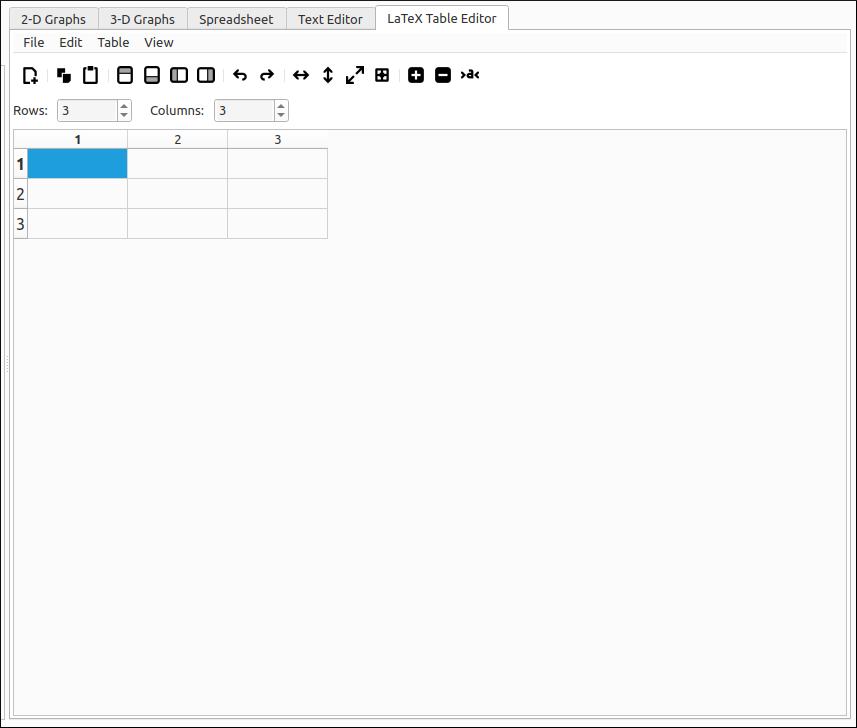

:index:`LaTeX Table Editor`
===========================

Introduction
------------

The LaTeX Table Editor is a tool that allows the user to input data into a grid and export the contents to LaTeX syntax given a few options. The program is not a WYSIWYG interface and certainly does not provide a complete set of table options for the LaTeX typesetting language. This tool is for quick conversions of table data into either table or matrix LaTeX code. It does offer copy and paste capabilities within the program and between the program and most spreadsheets (tab delimited text transfer). In addition, there are several options for populating the grid, transposing, resizing, inserting and deleting rows and columns, undo and redo, and file saving and loading of the data grid.

The LaTeX export is done through the system clipboard. The user should populate the grid with the desired data, select the LaTeX environment to export to from the menu, fill in the desired options, and select OK.  This will copy the LaTeX code for the table to the system clipboard. From there the user can paste the code into any editor they are using to create their document.

The tool currently supports longtable, tabular, tabbing, array, matrix, pmatrix, bmatrix, vmatrix, and Vmatrix environments. When copied, the clipboard text will have a commented line of any needed packages to be included in the preamble of the document. Each of the supported environments has a set of options for that environment, which includes alignment options, border and division options, header row and column creation, automatic math mode inclusion, and matrix decorations.

This program is designed to make the creation of LaTeX tables easier but is not designed to do everything for the user. For someone who is familiar with LaTeX typesetting and the basic code for tables, it will provide a nice layout that should be easy to edit and manipulate. In addition, there are options for exporting the grid contents to SageMath, Maxima, and GeoGebra code as well as [ ] and < > delimited strings that are commonly used in other packages.

The tool has a simple layout, menu and toolbar at the top, below that selectors for the number of rows and columns of the table, the main area is a grid of cells much like a standard spreadsheet but without any calculation abilities.

    LaTeX Table Creator Layout

Quick Guides
------------

.. toctree::
    :maxdepth: 3
    :caption: Quick Guides
    :titlesonly:

    LayoutUse
    syntax

LaTeX Editor Options
--------------------

.. toctree::
    :maxdepth: 3
    :caption: LaTeX Editor Options
    :titlesonly:

    FileOps
    EditOps
    TableOps
    ViewOps
