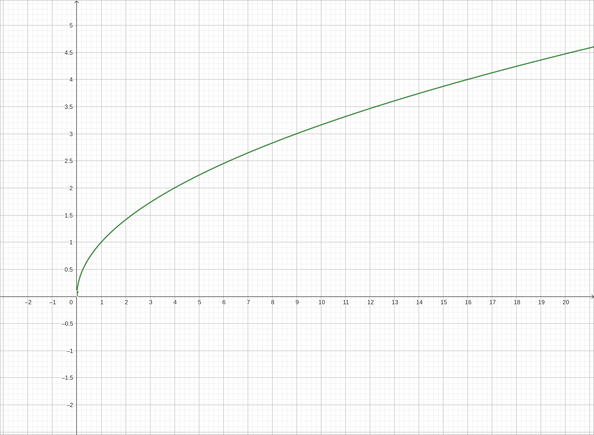
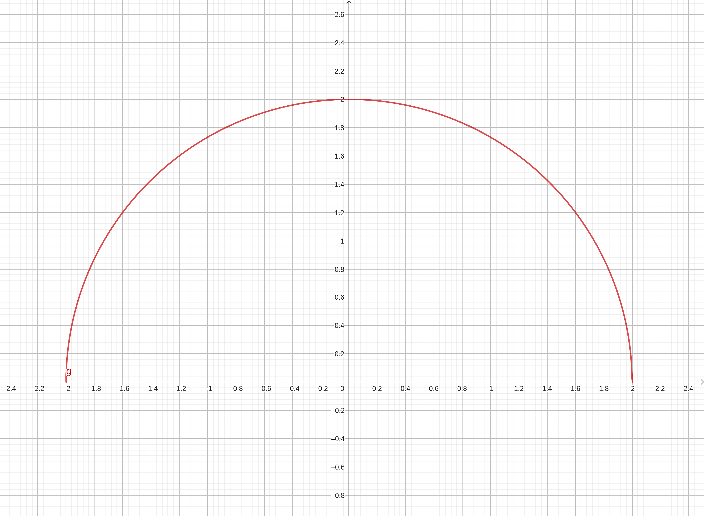
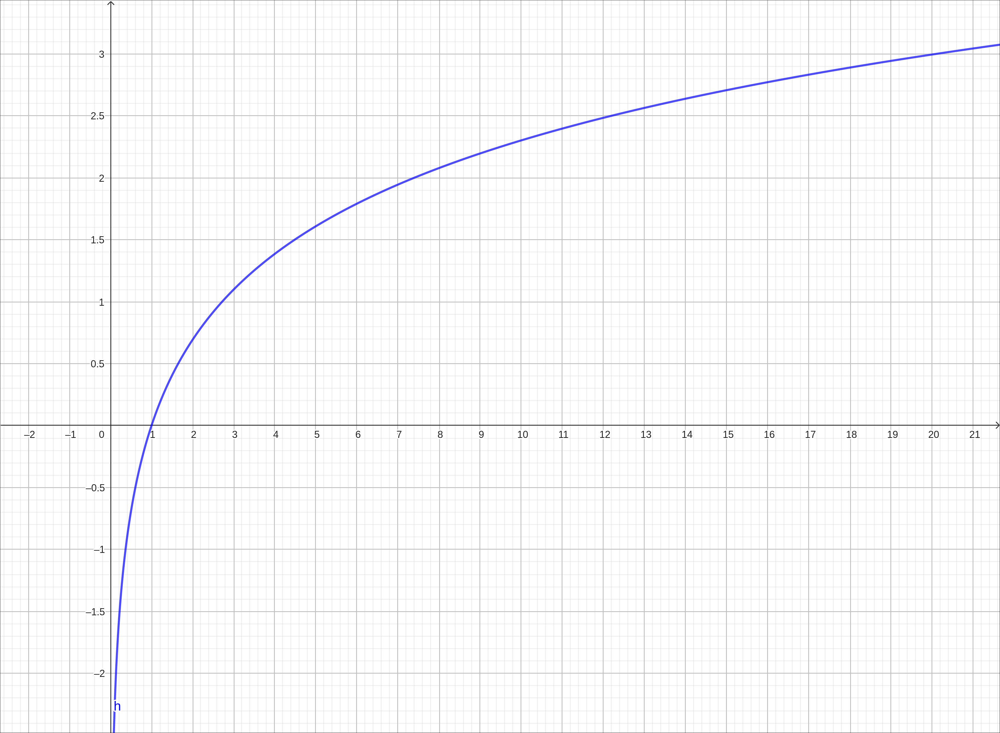
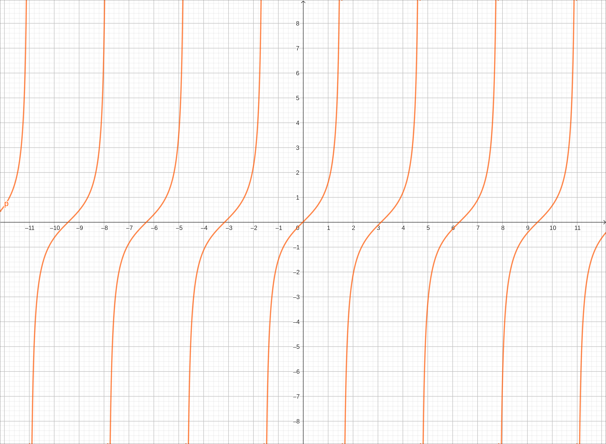
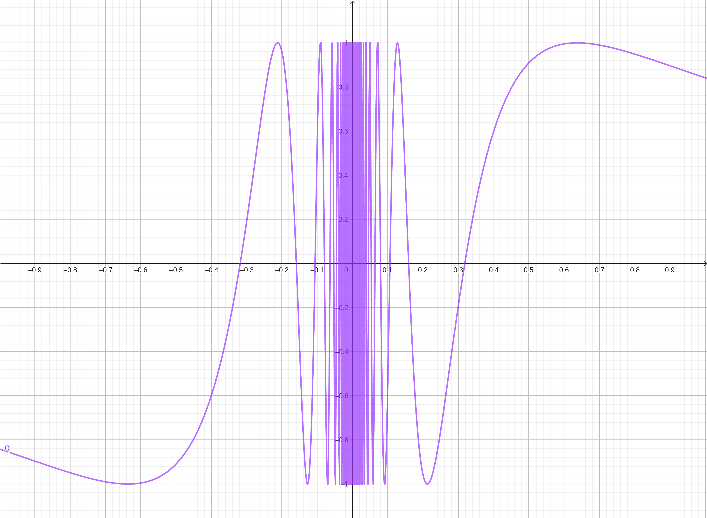
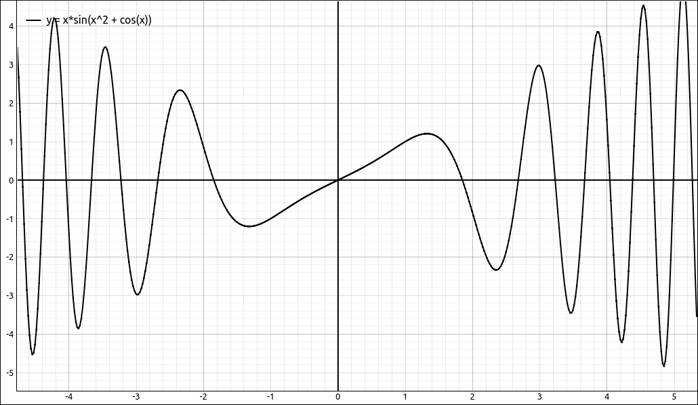

:index:`Theorems on Continuity`
===============================

Discussion & Definitions
------------------------

The theorems below basically say that most of the functions we have been working with since elementary school are continuous on their domains.  Additionally, we can do arithmetic on continuous functions and compositions of continuous functions and the result is a continuous function, on its domain.

.. admonition:: Theorem: Arithmetic of Continuous Functions

    If :math:`f(x)` and :math:`g(x)` are continuous functions at :math:`x = a` and if *c* is any constant, then the following functions are also continuous at :math:`x = a`:

    .. hlist::
        :columns: 2

        - :math:`f(x) + g(x)`
        - :math:`f(x) - g(x)`
        - :math:`f(x) \cdot g(x)`
        - :math:`c f(x)`
        - :math:`\displaystyle \frac{f(x)}{g(x)} \text{ if } g(a) \neq 0`

.. admonition:: Theorem: Continuous Function Classes

    The following types of functions are continuous at every number in
    their domains:

    .. hlist::
        :columns: 2

        - Polynomials
        - Rational Functions
        - Root Functions
        - Trigonometric Functions
        - Inverse Trigonometric Functions
        - Exponential Functions
        - Logarithmic Functions
        - Hyperbolic Functions

.. admonition:: Theorem: Composition with a Limit

    If :math:`f(x)` is continuous at *L* and :math:`\displaystyle \lim_{x \to a} g(x) = L` then
    :math:`\displaystyle \lim_{x \to a} f(g(x)) = f(L)`.  Another way to write this is,

    .. math::

        \lim_{x \to a} f(g(x)) = f\left(\lim_{x \to a} g(x) \right)

.. admonition:: Theorem: Composition of Continuous Functions

    If :math:`g(x)` is continuous at :math:`x = a` and :math:`f(x)` is continuous at :math:`g(a)` then :math:`f(g(x))` is continuous at :math:`x = a`.

Example: :math:`f(x) = \sqrt{x}`
--------------------------------

:math:`f(x) = \sqrt{x}` is continuous on the interval, :math:`[0, \infty)`.  This is a root function.

    :math:`f(x) = \sqrt{x}`

Example: :math:`f(x) = \sqrt{4-x^2}`
------------------------------------

:math:`f(x) = \sqrt{4-x^2}` is continuous on the interval, :math:`[-2, 2]`.  This is the composition of a polynomial and a root function.

    :math:`f(x) = \sqrt{4-x^2}`

Example: :math:`f(x) = \ln(x)`
------------------------------

:math:`f(x) = \ln(x)` is continuous on the interval, :math:`(0, \infty)`.  This is a logarithmic function.

    :math:`f(x) = \ln(x)`

Example: :math:`f(x) = \tan(x)`
-------------------------------

:math:`f(x) = \tan(x)` is continuous on the union of intervals, :math:`(-\pi/2 + k\pi, \pi/2 + k\pi)`, where :math:`k \in \mathbb{Z}`.  This is a trigonometric function.

    :math:`f(x) = \tan(x)`

Example: :math:`f(x) = \sin(1/x)`
---------------------------------

:math:`f(x) = \sin(1/x)` is continuous on the union of intervals, :math:`(-\infty, 0) \cup (0, \infty)`.  This is a composition of a rational function and a trigonometric function.

    :math:`f(x) = \sin(1/x)`

Example: :math:`f(x) = x \sin{\left(x^{2} + \cos{\left(x \right)} \right)}`
---------------------------------------------------------------------------

:math:`f(x) = x \sin{\left(x^{2} + \cos{\left(x \right)} \right)}` is continuous on, :math:`(-\infty, \infty)`.  This is a composition and arithmetic operations on polynomials and trigonometric functions.

    :math:`f(x) = x \sin{\left(x^{2} + \cos{\left(x \right)} \right)}`

The same applies for the following function, also continuous on, :math:`(-\infty, \infty)`.

.. math::
    f(x) = x \left(- \left(2 x - \sin{\left(x \right)}\right)^{3} \cos{\left(x^{2} + \cos{\left(x \right)} \right)} + \left(6 x - 3 \sin{\left(x \right)}\right) \left(\cos{\left(x \right)} - 2\right) \sin{\left(x^{2} + \cos{\left(x \right)} \right)} + \sin{\left(x \right)} \cos{\left(x^{2} + \cos{\left(x \right)} \right)}\right) - 3 \left(2 x - \sin{\left(x \right)}\right)^{2} \sin{\left(x^{2} + \cos{\left(x \right)} \right)} - \left(3 \cos{\left(x \right)} - 6\right) \cos{\left(x^{2} + \cos{\left(x \right)} \right)}

