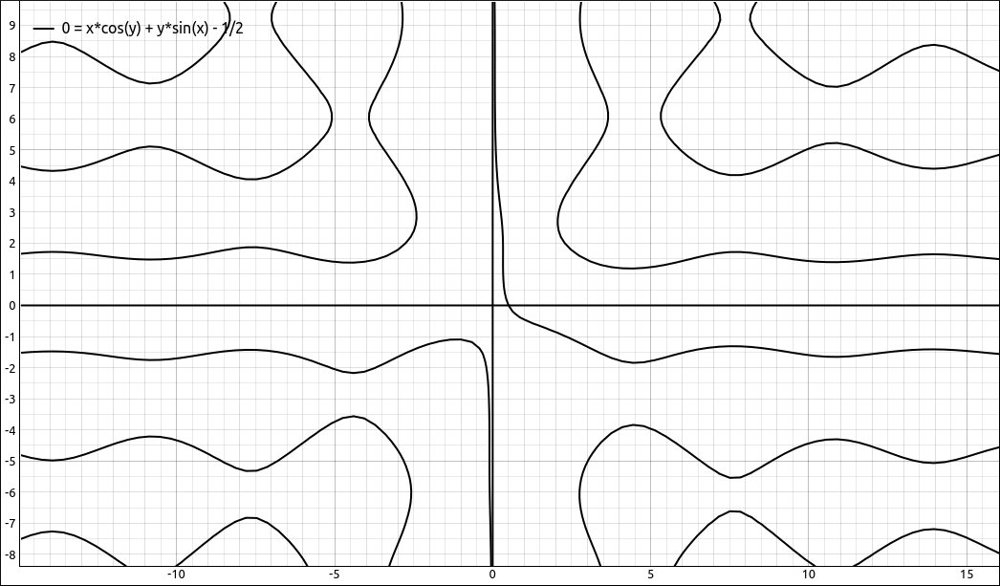

:index:`Implicit Differentiation`
=================================

Discussion & Definitions
------------------------

When you no longer have a function of the form :math:`f(x)` but an implicit relationship :math:`f(x, y) = 0` the procedure for finding the derivative changes a little.  Since the dependent variable *y* may not be able to be isolated to form an expression :math:`f(x)` we need to incorporate the derivative into the implicit expression and then isolate :math:`y'` at the end.  The procedure below outlines the steps one would take in finding the derivative of an implicit relationship :math:`f(x, y) = 0` by hand, we will concentrate on examples using technology.

.. admonition:: Problem Solving: Steps in Implicit Differentiation

    #. Differentiate both sides of the implicit equation with respect to *x* thinking of *y* as a function of *x*.
    #. Isolate all terms that have a :math:`y'` in them.  That is, put all terms with :math:`y'` on one side of the equation and all the other terms on the other side.
    #. On the side with :math:`y'`, factor out the :math:`y'`.
    #. Divide both sides by the expression times :math:`y'` on the :math:`y'` side of the equation.  The result will be of the form, :math:`y' = g(x,y)`.

Example: :math:`x^2 + y^2 = 2`
------------------------------

This is a circle of radius :math:`\sqrt{2}`.

GeoGebra
^^^^^^^^

First rearrange the expression so that it is of the form :math:`f(x, y) = 0`, that is, :math:`x^2 + y^2 - 2`.

Input the expression,

.. code-block:: console

    x^2 + y^2 - 2

It will probably come in as ``a(x, y)``, we will assume that in the following procedure.

Go to the next cell and start typing ``ImplicitDerivative``, a popup menu will appear allowing you to select ``ImplicitDerivative``, do so and in the function parameter type in ``a`` and then Enter.  GeoGebra will find :math:`\frac{dy}{dx}` and assign it to a new function name, probably ``b(x, y)``.  The result should be, :math:`- \frac{x}{y}`.

CLAE
^^^^

First rearrange the expression so that it is of the form :math:`f(x, y) = 0`, that is, :math:`x^2 + y^2 - 2`.

Input the expression,

.. code-block:: console

    x^2 + y^2 - 2

Select the expression then select ``Calculus > Implicit Derivative``, in the dialog box that appears you are asked for the dependent and independent variables.  We will keep the order at 1 for the moment.  If the dependent variable is *y* and the independent variable is *x* the program will return :math:`\frac{dy}{dx}.`  On the other hand, if we input the dependent variable as *x* and the independent variable as *y* the result will be  :math:`\frac{dx}{dy}.`  Since we want :math:`\frac{dy}{dx}` we will use a dependent variable of *y* and independent variable of *x*.  Then click OK and the result of :math:`- \frac{x}{y}` will be added to the workspace.

Maxima
^^^^^^

The procedure in Maxima is a little different.  We keep the implicit relationship as an equation, we need to tell Maxima that *y* is a function of *x* with the notation, ``y(x)``, and then we can use the ``diff`` command, followed by solving for the derivative.

Input the expression using ``y(x)`` for ``y``,

.. code-block:: console

    kill(all);
    f:x^2 + y(x)^2 = 2

Now take the derivative,

.. code-block:: console

    diff(f, x)

You should get the following,

.. math::

    2 \operatorname{y}(x) \left( \frac{d}{d x} \operatorname{y}(x)\right) +2 x=0

Maxima took the derivative implicitly but did not solve for :math:`y'`.  The following command will solve for :math:`y'`, assuming that ``%o3`` holds the above derivative.

.. code-block:: console

    solve(%o3,diff(y(x),x))

The result should be,

.. math::

    \left[ \frac{d}{d x} \operatorname{y}(x)=-\frac{x}{\operatorname{y}(x)}\right]

which, of course, translates to :math:`- \frac{x}{y}`.

Example: :math:`x \cos{\left(y \right)} = -y \sin{\left(x \right)} + \frac{1}{2}`
---------------------------------------------------------------------------------

Let's look at something a little more difficult, :math:`x \cos{\left(y \right)} = -y \sin{\left(x \right)} + \frac{1}{2}`.  The graph of the relationship is below.

    :math:`x \cos{\left(y \right)} = -y \sin{\left(x \right)} + \frac{1}{2}`

GeoGebra
^^^^^^^^

First rearrange the expression so that it is of the form :math:`f(x, y) = 0`, that is, :math:`x \cos{\left(y \right)} + y \sin{\left(x \right)} - \frac{1}{2}`.

Input the expression,

.. code-block:: console

    x cos(y)+y sin(x)-1/2

It will probably come in as ``a(x, y)``, we will assume that in the following procedure.

Go to the next cell and start typing ``ImplicitDerivative``, a popup menu will appear allowing you to select ``ImplicitDerivative``, do so and in the function parameter type in ``a`` and then Enter.  GeoGebra will find :math:`\frac{dy}{dx}` and assign it to a new function name, probably ``b(x, y)``.  The result should be,

.. math::
    \frac{y \cos{\left(x \right)} + \cos{\left(y \right)}}{x \sin{\left(y \right)} - \sin{\left(x \right)}}

CLAE
^^^^

First rearrange the expression so that it is of the form :math:`f(x, y) = 0`, that is, :math:`x^2 + y^2 - 2`.

Input the expression,

.. code-block:: console

    x*cos(y) + y*sin(x) - 1/2

Select the expression then select ``Calculus > Implicit Derivative``, in the dialog box that appears you are asked for the dependent and independent variables.  We will keep the order at 1 for the moment.  If the dependent variable is *y* and the independent variable is *x* the program will return :math:`\frac{dy}{dx}.`  On the other hand, if we input the dependent variable as *x* and the independent variable as *y* the result will be  :math:`\frac{dx}{dy}.`  Since we want :math:`\frac{dy}{dx}` we will use a dependent variable of *y* and independent variable of *x*.  Then click OK and the result is,

.. math::
    \frac{y \cos{\left(x \right)} + \cos{\left(y \right)}}{x \sin{\left(y \right)} - \sin{\left(x \right)}}

Maxima
^^^^^^

The procedure in Maxima is a little different.  We keep the implicit relationship as an equation, we need to tell Maxima that *y* is a function of *x* with the notation, ``y(x)``, and then we can use the ``diff`` command, followed by solving for the derivative.

Input the expression using ``y(x)`` for ``y``,

.. code-block:: console

    kill(all);
    f:x*cos(y(x)) = -y(x)*sin(x) + 1/2

Now take the derivative,

.. code-block:: console

    diff(f, x)

You should get the following,

.. math::
    \cos{\left( \operatorname{y}(x)\right) }-x \sin{\left( \operatorname{y}(x)\right) } \left( \frac{d}{d x} \operatorname{y}(x)\right) =-\sin{(x)} \left( \frac{d}{d x} \operatorname{y}(x)\right) -\operatorname{y}(x) \cos{(x)}

Maxima took the derivative implicitly but did not solve for :math:`y'`.  The following command will solve for :math:`y'`, assuming that ``%o3`` holds the above derivative.

.. code-block:: console

    solve(%o3,diff(y(x),x))

The result should be,

.. math::
    \left[ \frac{d}{d x} \operatorname{y}(x)=\frac{\cos{\left( \operatorname{y}(x)\right) }+\operatorname{y}(x) \cos{(x)}}{x \sin{\left( \operatorname{y}(x)\right) }-\sin{(x)}}\right]

which, of course, translates to

.. math::
    \frac{y \cos{\left(x \right)} + \cos{\left(y \right)}}{x \sin{\left(y \right)} - \sin{\left(x \right)}}

Example: Higher-Order Implicit Derivatives
------------------------------------------

Higher-order implicit derivatives can get a bit messy quickly.  Recall that when you do them by hand you need to substitute the first derivative into the expression for the second, and so on.  CLAE has this built in and it can be done in Maxima in a couple steps.

We will take the last example, :math:`x \cos{\left(y \right)} = -y \sin{\left(x \right)} + \frac{1}{2}`, and find the second derivative, :math:`y''`.

CLAE
^^^^

First rearrange the expression so that it is of the form :math:`f(x, y) = 0`, that is, :math:`x^2 + y^2 - 2`.

Input the expression,

.. code-block:: console

    x*cos(y) + y*sin(x) - 1/2

Select the expression then select ``Calculus > Implicit Derivative``, use *y* as the dependent variable and *x* as the independent variable, and set the order to 2, the result should be,

.. math::
    \frac{- x^{2} y \sin{\left(x \right)} \sin^{2}{\left(y \right)} - x y^{2} \cos^{2}{\left(x \right)} \cos{\left(y \right)} + 2 x y \sin^{2}{\left(x \right)} \sin{\left(y \right)} - 2 x y \sin^{2}{\left(y \right)} \cos{\left(x \right)} + 2 x y \sin{\left(y \right)} \cos^{2}{\left(x \right)} - 2 x y \cos{\left(x \right)} \cos^{2}{\left(y \right)} - 2 x \sin^{2}{\left(y \right)} \cos{\left(y \right)} + 2 x \sin{\left(y \right)} \cos{\left(x \right)} \cos{\left(y \right)} - x \cos^{3}{\left(y \right)} - y \sin^{3}{\left(x \right)} + 2 y \sin{\left(x \right)} \sin{\left(y \right)} \cos{\left(x \right)} - 2 y \sin{\left(x \right)} \cos^{2}{\left(x \right)} + 2 \sin{\left(x \right)} \sin{\left(y \right)} \cos{\left(y \right)} - 2 \sin{\left(x \right)} \cos{\left(x \right)} \cos{\left(y \right)}}{x^{3} \sin^{3}{\left(y \right)} - 3 x^{2} \sin{\left(x \right)} \sin^{2}{\left(y \right)} + 3 x \sin^{2}{\left(x \right)} \sin{\left(y \right)} - \sin^{3}{\left(x \right)}}

We can do the third derivative just as easily with 3 as the order and we get,

.. math::
    \frac{- x^{4} y \sin^{4}{\left(y \right)} \cos{\left(x \right)} + 3 x^{3} y^{2} \sin{\left(x \right)} \sin^{2}{\left(y \right)} \cos{\left(x \right)} \cos{\left(y \right)} + 3 x^{3} y \sin{\left(x \right)} \sin^{4}{\left(y \right)} - 2 x^{3} y \sin{\left(x \right)} \sin^{3}{\left(y \right)} \cos{\left(x \right)} + 3 x^{3} y \sin{\left(x \right)} \sin^{2}{\left(y \right)} \cos^{2}{\left(y \right)} - 3 x^{3} \sin{\left(x \right)} \sin^{3}{\left(y \right)} \cos{\left(y \right)} + x^{2} y^{3} \sin^{2}{\left(y \right)} \cos^{3}{\left(x \right)} + 3 x^{2} y^{3} \cos^{3}{\left(x \right)} \cos^{2}{\left(y \right)} - 6 x^{2} y^{2} \sin^{2}{\left(x \right)} \sin{\left(y \right)} \cos{\left(x \right)} \cos{\left(y \right)} + 9 x^{2} y^{2} \sin^{2}{\left(y \right)} \cos^{2}{\left(x \right)} \cos{\left(y \right)} - 9 x^{2} y^{2} \sin{\left(y \right)} \cos^{3}{\left(x \right)} \cos{\left(y \right)} + 9 x^{2} y^{2} \cos^{2}{\left(x \right)} \cos^{3}{\left(y \right)} - 9 x^{2} y \sin^{2}{\left(x \right)} \sin^{3}{\left(y \right)} + 12 x^{2} y \sin^{2}{\left(x \right)} \sin^{2}{\left(y \right)} \cos{\left(x \right)} - 6 x^{2} y \sin^{2}{\left(x \right)} \sin{\left(y \right)} \cos^{2}{\left(y \right)} + 6 x^{2} y \sin^{4}{\left(y \right)} \cos{\left(x \right)} - 12 x^{2} y \sin^{3}{\left(y \right)} \cos^{2}{\left(x \right)} + 6 x^{2} y \sin^{2}{\left(y \right)} \cos^{3}{\left(x \right)} + 15 x^{2} y \sin^{2}{\left(y \right)} \cos{\left(x \right)} \cos^{2}{\left(y \right)} - 18 x^{2} y \sin{\left(y \right)} \cos^{2}{\left(x \right)} \cos^{2}{\left(y \right)} + 9 x^{2} y \cos{\left(x \right)} \cos^{4}{\left(y \right)} + 9 x^{2} \sin^{2}{\left(x \right)} \sin^{2}{\left(y \right)} \cos{\left(y \right)} + 6 x^{2} \sin^{4}{\left(y \right)} \cos{\left(y \right)} - 12 x^{2} \sin^{3}{\left(y \right)} \cos{\left(x \right)} \cos{\left(y \right)} + 6 x^{2} \sin^{2}{\left(y \right)} \cos^{2}{\left(x \right)} \cos{\left(y \right)} + 7 x^{2} \sin^{2}{\left(y \right)} \cos^{3}{\left(y \right)} - 9 x^{2} \sin{\left(y \right)} \cos{\left(x \right)} \cos^{3}{\left(y \right)} + 3 x^{2} \cos^{5}{\left(y \right)} - x y^{3} \sin{\left(x \right)} \sin{\left(y \right)} \cos^{3}{\left(x \right)} + 3 x y^{2} \sin^{3}{\left(x \right)} \cos{\left(x \right)} \cos{\left(y \right)} - 6 x y^{2} \sin{\left(x \right)} \sin{\left(y \right)} \cos^{2}{\left(x \right)} \cos{\left(y \right)} + 9 x y^{2} \sin{\left(x \right)} \cos^{3}{\left(x \right)} \cos{\left(y \right)} + 9 x y \sin^{3}{\left(x \right)} \sin^{2}{\left(y \right)} - 14 x y \sin^{3}{\left(x \right)} \sin{\left(y \right)} \cos{\left(x \right)} + 3 x y \sin^{3}{\left(x \right)} \cos^{2}{\left(y \right)} - 12 x y \sin{\left(x \right)} \sin^{3}{\left(y \right)} \cos{\left(x \right)} + 24 x y \sin{\left(x \right)} \sin^{2}{\left(y \right)} \cos^{2}{\left(x \right)} - 12 x y \sin{\left(x \right)} \sin{\left(y \right)} \cos^{3}{\left(x \right)} - 9 x y \sin{\left(x \right)} \sin{\left(y \right)} \cos{\left(x \right)} \cos^{2}{\left(y \right)} + 18 x y \sin{\left(x \right)} \cos^{2}{\left(x \right)} \cos^{2}{\left(y \right)} - 9 x \sin^{3}{\left(x \right)} \sin{\left(y \right)} \cos{\left(y \right)} - 12 x \sin{\left(x \right)} \sin^{3}{\left(y \right)} \cos{\left(y \right)} + 24 x \sin{\left(x \right)} \sin^{2}{\left(y \right)} \cos{\left(x \right)} \cos{\left(y \right)} - 12 x \sin{\left(x \right)} \sin{\left(y \right)} \cos^{2}{\left(x \right)} \cos{\left(y \right)} - 4 x \sin{\left(x \right)} \sin{\left(y \right)} \cos^{3}{\left(y \right)} + 9 x \sin{\left(x \right)} \cos{\left(x \right)} \cos^{3}{\left(y \right)} - 3 y^{2} \sin^{2}{\left(x \right)} \cos^{2}{\left(x \right)} \cos{\left(y \right)} - 3 y \sin^{4}{\left(x \right)} \sin{\left(y \right)} + 5 y \sin^{4}{\left(x \right)} \cos{\left(x \right)} + 6 y \sin^{2}{\left(x \right)} \sin^{2}{\left(y \right)} \cos{\left(x \right)} - 12 y \sin^{2}{\left(x \right)} \sin{\left(y \right)} \cos^{2}{\left(x \right)} + 6 y \sin^{2}{\left(x \right)} \cos^{3}{\left(x \right)} - 6 y \sin^{2}{\left(x \right)} \cos{\left(x \right)} \cos^{2}{\left(y \right)} + 3 \sin^{4}{\left(x \right)} \cos{\left(y \right)} + 6 \sin^{2}{\left(x \right)} \sin^{2}{\left(y \right)} \cos{\left(y \right)} - 12 \sin^{2}{\left(x \right)} \sin{\left(y \right)} \cos{\left(x \right)} \cos{\left(y \right)} + 6 \sin^{2}{\left(x \right)} \cos^{2}{\left(x \right)} \cos{\left(y \right)} - 3 \sin^{2}{\left(x \right)} \cos^{3}{\left(y \right)}}{x^{5} \sin^{5}{\left(y \right)} - 5 x^{4} \sin{\left(x \right)} \sin^{4}{\left(y \right)} + 10 x^{3} \sin^{2}{\left(x \right)} \sin^{3}{\left(y \right)} - 10 x^{2} \sin^{3}{\left(x \right)} \sin^{2}{\left(y \right)} + 5 x \sin^{4}{\left(x \right)} \sin{\left(y \right)} - \sin^{5}{\left(x \right)}}

Maxima
^^^^^^

Input the expression using ``y(x)`` for ``y``,

.. code-block:: console

    kill(all);
    f:x*cos(y(x)) = -y(x)*sin(x) + 1/2

Now take the derivative,

.. code-block:: console

    diff(f, x)

You should get the following,

.. math::
    \cos{\left( \operatorname{y}(x)\right) }-x \sin{\left( \operatorname{y}(x)\right) } \left( \frac{d}{d x} \operatorname{y}(x)\right) =-\sin{(x)} \left( \frac{d}{d x} \operatorname{y}(x)\right) -\operatorname{y}(x) \cos{(x)}

Maxima took the derivative implicitly but did not solve for :math:`y'`.  The following command will solve for :math:`y'`, assuming that ``%o3`` holds the above derivative.

.. code-block:: console

    solve(%o3,diff(y(x),x))

The result should be,

.. math::
    \left[ \frac{d}{d x} \operatorname{y}(x)=\frac{\cos{\left( \operatorname{y}(x)\right) }+\operatorname{y}(x) \cos{(x)}}{x \sin{\left( \operatorname{y}(x)\right) }-\sin{(x)}}\right]

which, of course, translates to

.. math::
    \frac{y \cos{\left(x \right)} + \cos{\left(y \right)}}{x \sin{\left(y \right)} - \sin{\left(x \right)}}

Now take the second derivative with,

.. code-block:: console

    diff(f, x, 2)

ou should get,

.. math::
    -x \sin{\left( \operatorname{y}(x)\right) } \left( \frac{{{d}^{2}}}{d {{x}^{2}}} \operatorname{y}(x)\right) -x \cos{\left( \operatorname{y}(x)\right) } {{\left( \frac{d}{d x} \operatorname{y}(x)\right) }^{2}}-2 \sin{\left( \operatorname{y}(x)\right) } \left( \frac{d}{d x} \operatorname{y}(x)\right) = -\sin{(x)} \left( \frac{{{d}^{2}}}{d {{x}^{2}}} \operatorname{y}(x)\right) -2 \cos{(x)} \left( \frac{d}{d x} \operatorname{y}(x)\right) +\operatorname{y}(x) \sin{(x)}

solve it for the second derivative, assuming the above expression is in ``%o4``,

.. code-block:: console

    s:solve(%o4,diff(y(x),x,2))

The result should be,

.. math::
    \operatorname{[}\frac{{{d}^{2}}}{d {{x}^{2}}} \operatorname{y}(x)=-\operatorname{(}x \cos{\left( \operatorname{y}(x)\right) } {{\left( \frac{d}{d x} \operatorname{y}(x)\right) }^{2}}+\left( 2 \sin{\left( \operatorname{y}(x)\right) }-2 \cos{(x)}\right) \, \left( \frac{d}{d x} \operatorname{y}(x)\right) +\operatorname{y}(x) \sin{(x)}\operatorname{)}/\left( x \sin{\left( \operatorname{y}(x)\right) }-\sin{(x)}\right) \operatorname{]}\mbox{}

Note we stored this in the variable *s*.  Now substitute in the first derivative,

.. code-block:: console

    subst((cos(y(x))+y(x)*cos(x))/(x*sin(y(x))-sin(x)), 'diff(y(x),x,1), s);

The result should be,

.. math::

    \operatorname{[}\frac{{{d}^{2}}}{d {{x}^{2}}} \operatorname{y}(x)=-\operatorname{(}\frac{\left( \cos{\left( \operatorname{y}(x)\right) }+\operatorname{y}(x) \cos{(x)}\right) \, \left( 2 \sin{\left( \operatorname{y}(x)\right) }-2 \cos{(x)}\right) }{x \sin{\left( \operatorname{y}(x)\right) }-\sin{(x)}}+ \frac{x \cos{\left( \operatorname{y}(x)\right) } {{\left( \cos{\left( \operatorname{y}(x)\right) }+\operatorname{y}(x) \cos{(x)}\right) }^{2}}}{{{\left( x \sin{\left( \operatorname{y}(x)\right) }-\sin{(x)}\right) }^{2}}}+\operatorname{y}(x) \sin{(x)}\operatorname{)}/\left( x \sin{\left( \operatorname{y}(x)\right) }-\sin{(x)}\right) \operatorname{]}\mbox{}
