:index:`Derivatives and the Shape of a Graph`
=============================================

Discussion & Definitions
------------------------

Back before we had graphing calculators and computer software for graphing functions (which was not that long ago) we used these methods to analyze the function and then use the information we got to draw a rough sketch of the function.  The procedures worked surprisingly well and we were able to produce graphs that were quite accurate, although the process was a bit time-consuming.  In today's day and age we do not need to go to these lengths to get the graph of a function, we simply input the function into a calculator or computer program and press the plot key.

So why continue to study these relationships?  While we do not need the information here to produce a graph of a function these methods still allow us to extract information about a function by using its derivative and its second derivative. These functions could represent physical system or models and hence these methods will extract information about the application or physical model.

Increasing, Decreasing, and the First Derivative Test
^^^^^^^^^^^^^^^^^^^^^^^^^^^^^^^^^^^^^^^^^^^^^^^^^^^^^

In the section on the Mean Value Theorem there were several corollaries to the theorem, one of which was,

.. admonition:: Corollary: Increasing and Decreasing Functions

    Let :math:`f` be continuous over the closed interval :math:`[a, b]` and differentiable over the open interval :math:`(a, b)`.

    i. If :math:`f'(x) > 0` for all :math:`x \in (a, b)`, then :math:`f` is an increasing function over :math:`[a, b]`.

    ii. If :math:`f'(x) < 0` for all :math:`x \in (a, b)`, then :math:`f` is a decreasing function over :math:`[a, b]`.

This gives a direct relationship between the sign of the derivative and the direction the function is going (up or down). This will also give us an algorithm for finding local extrema.

1. A function will have a local maximum at a critical number if the function goes from increasing to decreasing over the critical number if we read the function (graph) from left to right.  Using the above corollary that means that the derivative goes from positive to negative over the critical number if we read the function (graph) from left to right.

2. A function will have a local minimum at a critical number if the function goes from decreasing to increasing over the critical number if we read the function (graph) from left to right.  Using the above corollary that means that the derivative goes from negative to positive over the critical number if we read the function (graph) from left to right.

The graphic example below shows the possibilities.

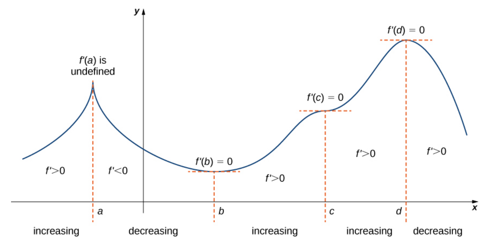

    The function :math:`f` has four critical points: :math:`a, b, c, {\rm and }\;  d`. The function :math:`f` has local maxima at :math:`a` and :math:`d`, and a local minimum at :math:`b`. The function :math:`f` does not have a local extremum at :math:`c`. The sign of :math:`f'` changes at all local extrema.   Image from Calculus Volume 1 by Edwin "Jed" Herman and Gilbert Strang

Taking these observations we can write them more formally into the First Derivative Test.

.. admonition:: Theorem: The First Derivative Test

    Suppose that :math:`f` is a continuous function over an interval :math:`I` containing a critical point :math:`c`. If :math:`f` is differentiable over :math:`I`, except possibly at point :math:`c`, then :math:`f(c)` satisfies one of the following descriptions:

    i. If :math:`f'` changes sign from positive when :math:`x < c` to negative when :math:`x > c`, then :math:`f(c)` is a local maximum of :math:`f.`

    ii. If :math:`f'` changes sign from negative when :math:`x < c` to positive when :math:`x > c`, then :math:`f(c)` is a local minimum of :math:`f.`

    iii. If :math:`f'` has the same sign for :math:`x < c` and :math:`x > c`, then :math:`f(c)` is neither a local maximum nor a local minimum of :math:`f.`

Formulating this into an algorithm give us the following procedure for determining the intervals where a function is increasing and decreasing as well as determining all local extrema.

.. admonition:: Problem Solving: Using the First Derivative Test

    Consider a function :math:`f` that is continuous over an interval :math:`I`.

    a. Find all critical points of :math:`f` and divide the interval :math:`I` into smaller subintervals using the critical points as endpoints.

    b. Take a test value *v* inside each of the subintervals, do not use the endpoints.  Evaluate :math:`f'` at the test value,

        i. If :math:`f'(v) > 0` then :math:`f'` is positive in the entire subinterval and hence the function is increasing in that entire subinterval.

        ii. If :math:`f'(v) < 0` then :math:`f'` is negative in the entire subinterval and hence the function is decreasing in that entire subinterval.

    c. Use First Derivative Test and the results of the previous step to determine if :math:`f` has a local maximum, a local minimum, or neither at each of the critical points.

**Example:** Find all local maximums and minimums as well as the intervals of increasing and decreasing for the function :math:`f(x) = x^{4} + x^{3}`.  Graph below,

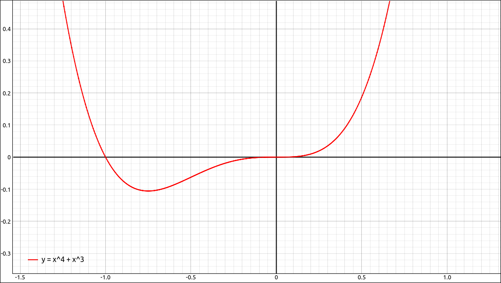

    :math:`f(x) = x^{4} + x^{3}`

Although we can approximate all of these answers from the graph we will approach this algebraically as well as graphically. First we take the derivative :math:`f'(x) = 4 x^{3} + 3 x^{2}`.  Since the derivative is a polynomial we do not need to worry about the derivative not existing, solving :math:`f'(x) = 4 x^{3} + 3 x^{2} = 0` gives, :math:`\left[ - \frac{3}{4}, \  0\right]`.  This divides the *x*-axis into three subintervals, :math:`\left(-\infty, - \frac{3}{4}\right)`, :math:`\left(- \frac{3}{4}, \  0\right)`, and :math:`\left(0, \infty \right)`. Taking test points we have :math:`f'(-1) = -1`, :math:`f'(-0.5) = 0.25`, and :math:`f'(1) = 7`.  This gives us the following information,

- The function is decreasing on :math:`\left(-\infty, - \frac{3}{4}\right)`.
- The function is increasing on :math:`\left(- \frac{3}{4}, \  0\right)` and :math:`\left(0, \infty \right)`.  We will sometimes say that the function is increasing on :math:`\left(- \frac{3}{4}, \  \infty \right)`.
- There is a local minimum at :math:`x = - \frac{3}{4}`.
- There are no local maximums.

Concavity and Points of Inflection
^^^^^^^^^^^^^^^^^^^^^^^^^^^^^^^^^^

Concavity is property of a function (or its graph) that describes the curving of the graph, if it is not a straight line and does curve.  If it curves upward we say that it is concave up and if it curves downward we say that it is concave down.  For example, if we plot :math:`f(x) = x^3-x`, the function is concave up on the interval :math:`(0, \infty)` and concave down on the interval :math:`(-\infty, 0)`.

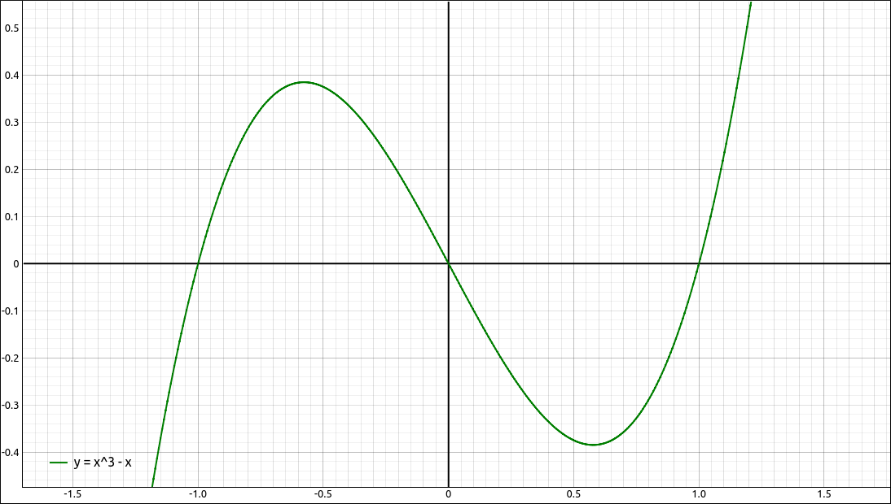

    :math:`f(x) = x^3-x`

If we imagine tangent lines to this curve in the interval :math:`(-\infty, 0)`, they start out with fairly large positive slopes, these slopes become smaller and hit 0 at the local maximum then become negative.  So the slopes of the tangent lines are decreasing as *x* increases in the interval :math:`(-\infty, 0)`.  The slopes are given by the function :math:`f'(x)`, so :math:`f'(x)` is decreasing which means that its derivative :math:`f''(x) < 0`.

If we imagine tangent lines to this curve in the interval :math:`(0, \infty)`, they start out with fairly large negative slopes, these slopes become larger and hit 0 at the local minimum then become positive.  So the slopes of the tangent lines are increasing as *x* increases in the interval :math:`(0, \infty)`.  The slopes are given by the function :math:`f'(x)`, so :math:`f'(x)` is decreasing which means that its derivative :math:`f''(x) > 0`.

Taking these observations and writing then more formally we have the following definition and algorithm.

.. admonition:: Definition: Concavity

    Let :math:`f` be a function that is differentiable over an open interval :math:`I`. If :math:`f'` is increasing over :math:`I`, we say :math:`f` is :index:`concave up` over :math:`I`. If :math:`f'` is decreasing over :math:`I`, we say :math:`f` is :index:`concave` down over :math:`I`.

.. admonition:: Problem Solving: Test for Concavity

    Let :math:`f` be a function that is twice differentiable over an interval :math:`I`.

    i. If :math:`f''(x) > 0` for all :math:`x \in I`, then :math:`f` is concave up over :math:`I`.

    ii. If :math:`f''(x) < 0` for all :math:`x \in I`, then :math:`f` is concave down over :math:`I`.

When a function changes concavity, and is continuous where the change occurs, we call it an inflection point.

.. admonition:: Definition: Inflection Point

    If :math:`f` is continuous at :math:`a` and :math:`f` changes concavity at :math:`a`, the point :math:`(a, f (a))` is an :index:`inflection point` of :math:`f` .

The image below will help put these notions into perspective.

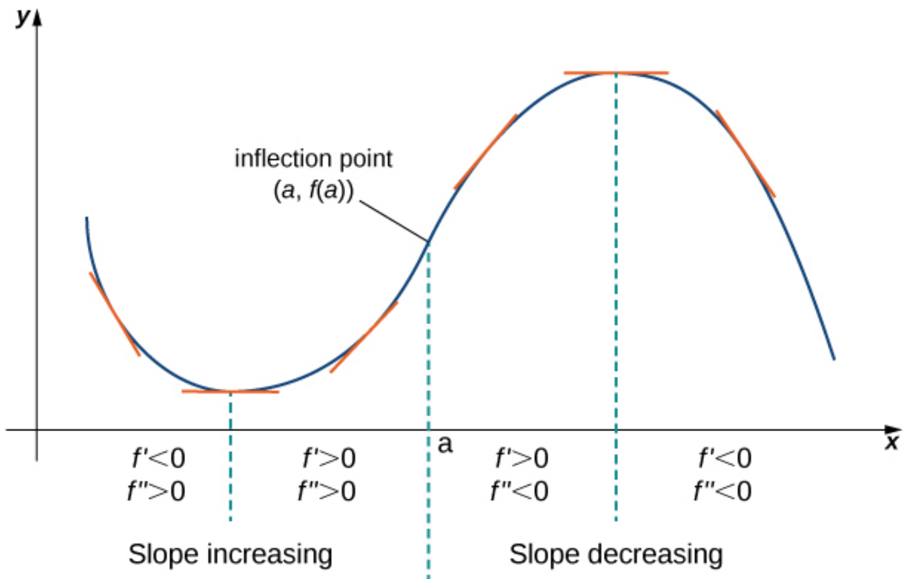

    Since :math:`f''(x) > 0` for :math:`x < a`, the function :math:`f` is concave up over the interval :math:`(-infty, a)`. Since :math:`f''(x) < 0` for :math:`x > a`, the function :math:`f` is concave down over the interval :math:`(a, \infty)`. The point :math:`(a, f (a))` is an inflection point of :math:`f`.  Image from Calculus Volume 1 by Edwin "Jed" Herman and Gilbert Strang

Note that a function can change concavity at a point we would not consider to be a point of inflection.  For example, take the function :math:`f(x) = \frac{x^{2}}{x - 1}`.

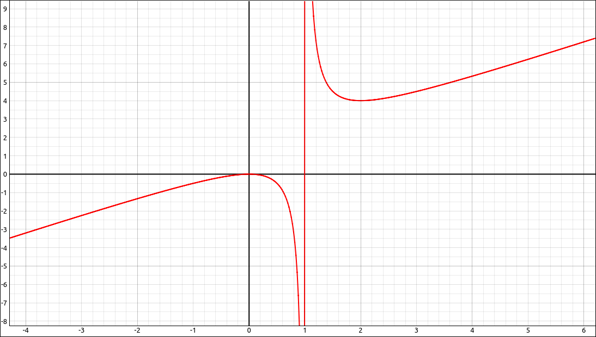

    :math:`f(x) = \frac{x^{2}}{x - 1}`

    The function goes from concave down to concave up at :math:`x = 1` but we would not call :math:`x = 1` a point of inflection since the function does not exist there.

.. admonition:: Problem Solving: Finding Intervals of Concavity and Points of Inflection

    To find intervals of concavity and points of inflection we can follow the procedure below, which is very similar to the first derivative test.

    a. Find all points :math:`x = c` where either :math:`f''(c) = 0` or :math:`f''(c)` does not exist. This will divide the interval :math:`I` into smaller subintervals using these points as endpoints.  Note we do not call these critical points, that name is reserved for the first derivative.

    b. Take a test value *v* inside each of the subintervals, do not use the endpoints.  Evaluate :math:`f''` at the test value,

        i. If :math:`f''(v) > 0` then :math:`f''` is positive in the entire subinterval and hence the function is concave up in that entire subinterval.

        ii. If :math:`f''(v) < 0` then :math:`f''` is negative in the entire subinterval and hence the function is concave down in that entire subinterval.

    c. If the function changes concavity at a point where the function is continuous then that is an inflection point.

**Example:** Let's revisit the above example of the function :math:`f(x) = x^{4} + x^{3}`.  Here we will find all the intervals of concavity and inflection points.  Graph below,

    :math:`f(x) = x^{4} + x^{3}`

Although we can approximate all of these answers from the graph we will approach this algebraically as well as graphically. The second derivative is :math:`f''(x) = 12 x^{2} + 6 x`.  Since the second derivative is a polynomial we do not need to worry about the derivative not existing, solving :math:`f''(x) = 12 x^{2} + 6 x = 0` gives, :math:`\left[ - \frac{1}{2}, \  0\right]`.

This divides the *x*-axis into three subintervals, :math:`\left(-\infty, - \frac{1}{2}\right)`, :math:`\left(- \frac{1}{2}, \  0\right)`, and :math:`\left(0, \infty \right)`. Taking test points we have :math:`f''(-1) = 6`, :math:`f''(-0.25) = -0.75`, and :math:`f''(1) = 18`.  This gives us the following information,

- The function is concave up on :math:`\left(-\infty, - \frac{1}{2}\right)` and :math:`\left(0, \infty \right)`. We will sometimes write this as :math:`\left(-\infty, - \frac{1}{2}\right) \cup \left(0, \infty \right)`.
- The function is concave down on :math:`\left(- \frac{1}{2}, \  0\right)`.
- There are inflection points at :math:`x = - \frac{1}{2}` and :math:`x = 0`.

The Second Derivative Test
^^^^^^^^^^^^^^^^^^^^^^^^^^

Another note about the image,

    Second Derivative Test Visualization

Notice at the local minimum that :math:`f'' < 0` and at the local maximum that :math:`f'' > 0`.  This gives us the Second Derivative Test, note that this test only works at critical points where :math:`f'(c) = 0`.  If we have a critical number where :math:`f'(c)` does not exist we need to rely on the First Derivative Test.

.. admonition:: Definition: The Second Derivative Test

    Suppose :math:`f'(c) = 0`, and :math:`f''` is continuous over an interval containing :math:`c`.

    i. If :math:`f''(c) > 0`, then :math:`f` has a local minimum at :math:`c`.

    ii. If :math:`f''(c) < 0`, then :math:`f` has a local maximum at :math:`c`.

    iii. If :math:`f''(c) = 0`, then the test is inconclusive.

**Example:** Let's revisit the above example of the function :math:`f(x) = x^{4} + x^{3}`.  Here we will use the second derivative test for the local extrema.

    :math:`f(x) = x^{4} + x^{3}`

Although we can approximate all of these answers from the graph we will approach this algebraically as well as graphically. From above, we have critical numbers at :math:`x = - \frac{3}{4}` and :math:`x = 0`. Both of the critical numbers are from :math:`f'(x) = 0`.  Evaluating the second derivative at these values gives, :math:`f''\left(- \frac{3}{4}\right) = \frac{9}{4}` and :math:`f''\left(0\right) = 0`.  So we can conclude the following,

- There is a local minimum at :math:`x = - \frac{3}{4}`.
- The second derivative test at :math:`x = 0` is inconclusive, the first derivative test here reveals that it is neither a local maximum or minimum.

Example: :math:`f(x) = x^{4} + x^{3}`
-------------------------------------

In this example we will go through the analysis of :math:`f(x) = x^{4} + x^{3}` that we did in the examples above.

GeoGebra
^^^^^^^^

Input the function,

.. code-block:: console

    x^4 + x^3

Zooming in gives us the following image,

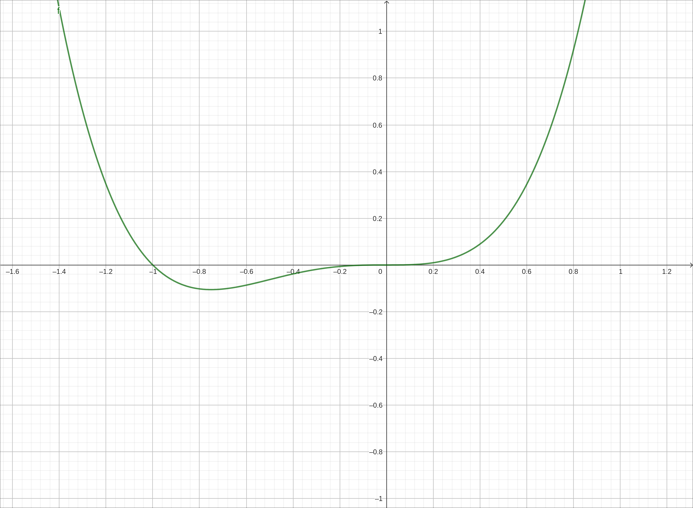

    :math:`f(x) = x^{4} + x^{3}`

In a new cell input ``Solutions`` and for the equation input ``f'=0``.  This will give you the two critical values, :math:`-\frac{3}{4}` and 0.  For testing the first derivative we simply need to select a new cell and input ``f'(-1)`` and then do the same with ``f'(-1/2)`` and ``f'(1)``.  The results will be  :math:`f'(-1) = -1`, :math:`f'(-0.5) = 0.25`, and :math:`f'(1) = 7`.  This gives us the following information,

- The function is decreasing on :math:`\left(-\infty, - \frac{3}{4}\right)`.
- The function is increasing on :math:`\left(- \frac{3}{4}, \  0\right)` and :math:`\left(0, \infty \right)`.  We will sometimes say that the function is increasing on :math:`\left(- \frac{3}{4}, \  \infty \right)`.
- There is a local minimum at :math:`x = - \frac{3}{4}`.
- There are no local maximums.

Before we move onto the second derivative and concavity, note that we can get a nice graphical representation of the sign of the derivative which is equivalent to our using test points in each subinterval.  Input the following into a new cell.

.. code-block:: console

    0.1 sgn(f'(x))

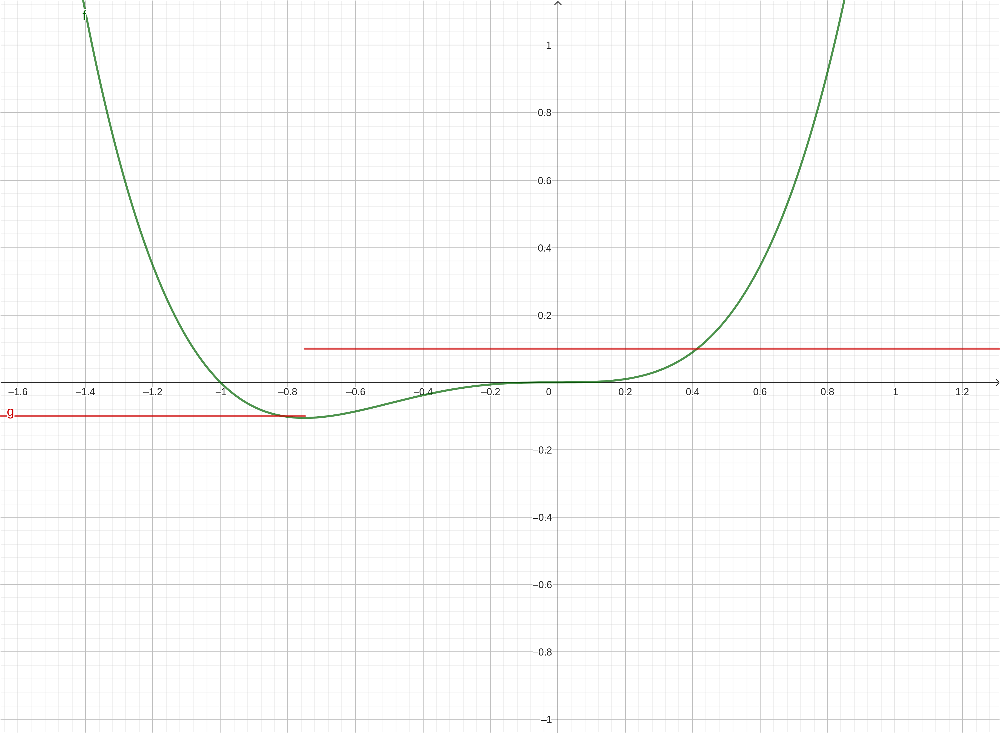

    :math:`f(x) = x^{4} + x^{3}` with the sign of the first derivative.

The sign function in GeoGebra (sgn) returns 1 if the value is positive, :math:`-1` if the value is negative, and 0 if the value is zero.  In essence, GeoGebra simply plots a lot of test values.  Another note here is that we frequently need to scale this function so that it is readable on the graph, as we did here with 0.1.

Now we will move on to the second derivative and concavity.  In a new cell input ``Solutions`` and for the equation input ``f''=0``.  This gives us  :math:`\left[ - \frac{1}{2}, \  0\right]`, dividing the *x*-axis into three subintervals, :math:`\left(-\infty, - \frac{1}{2}\right)`, :math:`\left(- \frac{1}{2}, \  0\right)`, and :math:`\left(0, \infty \right)`. Taking test points we have :math:`f''(-1) = 6`, :math:`f''(-0.25) = -0.75`, and :math:`f''(1) = 18`.  This gives us the following information,

- The function is concave up on :math:`\left(-\infty, - \frac{1}{2}\right)` and :math:`\left(0, \infty \right)`. We will sometimes write this as :math:`\left(-\infty, - \frac{1}{2}\right) \cup \left(0, \infty \right)`.
- The function is concave down on :math:`\left(- \frac{1}{2}, \  0\right)`.
- There are inflection points at :math:`x = - \frac{1}{2}` and :math:`x = 0`.

Note that we can get a nice graphical representation of the sign of the second derivative (as we did above) which is equivalent to our using test points in each subinterval.  Input the following into a new cell.

.. code-block:: console

    0.1 sgn(f''(x))

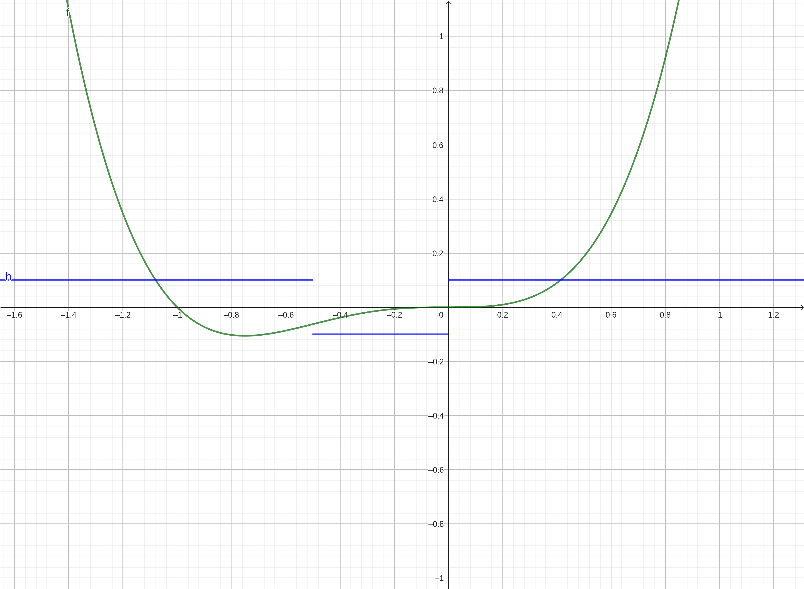

    :math:`f(x) = x^{4} + x^{3}` with the sign of the second derivative.

CLAE
^^^^

Input the function,

.. code-block:: console

    x^4 + x^3

Zooming in gives us the following image,

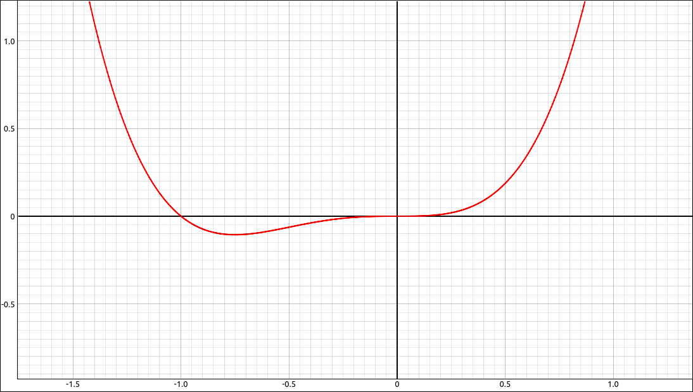

    :math:`f(x) = x^{4} + x^{3}`

Find the derivative with ``Calculus > Derivative``, variable *x* and order 1, returns :math:`4 x^{3} + 3 x^{2}`. Selecting ``Algebra > Solve`` on the derivative gives us the two critical values, :math:`-\frac{3}{4}` and 0.  Either using the evaluate option in the algebra menu or by assigning the derivative to a function name evaluate the derivative at test numbers, the results will be  :math:`f'(-1) = -1`, :math:`f'(-0.5) = 0.25`, and :math:`f'(1) = 7`.  This gives us the following information,

- The function is decreasing on :math:`\left(-\infty, - \frac{3}{4}\right)`.
- The function is increasing on :math:`\left(- \frac{3}{4}, \  0\right)` and :math:`\left(0, \infty \right)`.  We will sometimes say that the function is increasing on :math:`\left(- \frac{3}{4}, \  \infty \right)`.
- There is a local minimum at :math:`x = - \frac{3}{4}`.
- There are no local maximums.

Before we move onto the second derivative and concavity, note that we can get a nice graphical representation of the sign of the derivative which is equivalent to our using test points in each subinterval.  Input the following into the CAS.  We will assume that the derivative is in entry ``R2``.

.. code-block:: console

    0.1*sign(R2)

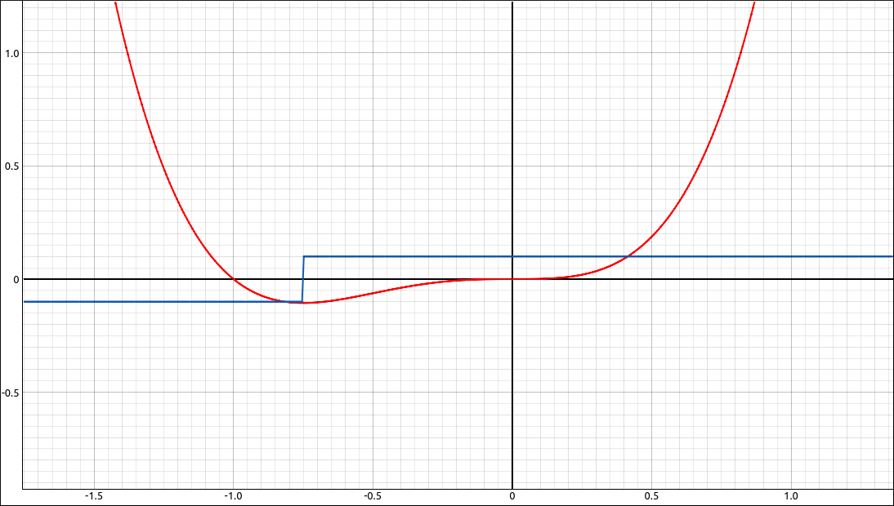

    :math:`f(x) = x^{4} + x^{3}` with the sign of the first derivative.

The sign function in CLAE returns 1 if the value is positive, :math:`-1` if the value is negative, and 0 if the value is zero.  In essence, CLAE simply plots a lot of test values.  Another note here is that we frequently need to scale this function so that it is readable on the graph, as we did here with 0.1.

Now we will move on to the second derivative and concavity.  Select the derivative expression, then select ``Calculus > Derivative``, variable *x* and order 1, returns :math:`12 x^{2} + 6 x`. Note you could have also selected the original function and then  ``Calculus > Derivative``, variable *x* and order 2.  Now select ``Algebra > Solve`` on the second derivative gives us the solutions, :math:`-\frac{1}{2}` and 0.  Taking test points we have :math:`f''(-1) = 6`, :math:`f''(-0.25) = -0.75`, and :math:`f''(1) = 18`.  This gives us the following information,

- The function is concave up on :math:`\left(-\infty, - \frac{1}{2}\right)` and :math:`\left(0, \infty \right)`. We will sometimes write this as :math:`\left(-\infty, - \frac{1}{2}\right) \cup \left(0, \infty \right)`.
- The function is concave down on :math:`\left(- \frac{1}{2}, \  0\right)`.
- There are inflection points at :math:`x = - \frac{1}{2}` and :math:`x = 0`.

Note that we can get a nice graphical representation of the sign of the second derivative (as we did above) which is equivalent to our using test points in each subinterval.  Input the following into the CAS, assuming the second derivative is in entry ``R3``.

.. code-block:: console

    0.1*sign(R3)

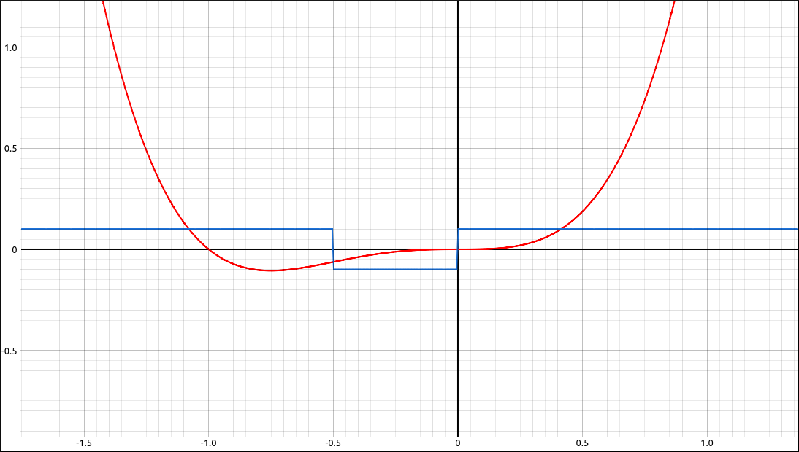

    :math:`f(x) = x^{4} + x^{3}` with the sign of the second derivative.

Maxima
^^^^^^

Input the function,

.. code-block:: console

    kill(all);
    f(x):=x^4 + x^3

Plot the function,

.. code-block:: console

    wxplot2d(f(x),[x,-1.5,1])

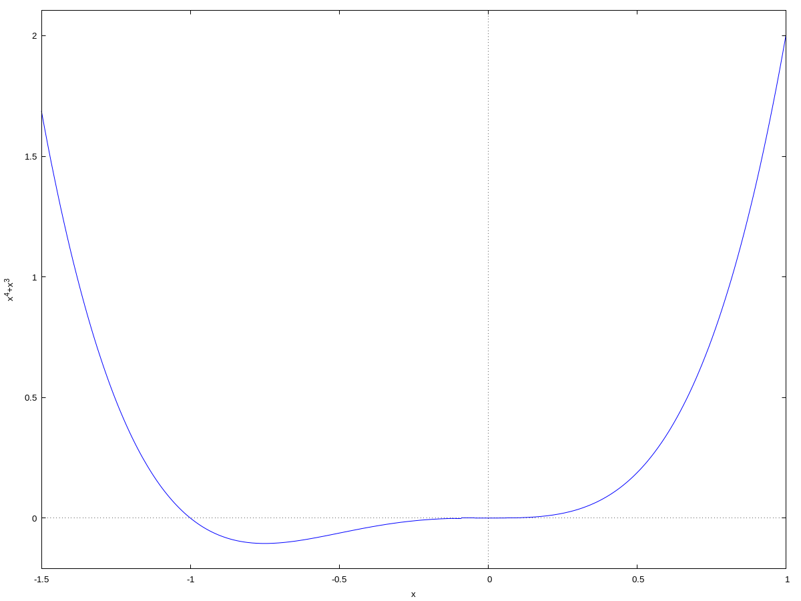

    :math:`f(x) = x^{4} + x^{3}`

Take the derivative and assign it to a function,

.. code-block:: console

    df:diff(f(x), x);
    dff(x):=''df

Find the critical numbers,

.. code-block:: console

    solve(df=0)

This will give you the two critical values, :math:`-\frac{3}{4}` and 0.  Using the ``dff`` function test the derivative values. the results will be  :math:`f'(-1) = -1`, :math:`f'(-0.5) = 0.25`, and :math:`f'(1) = 7`.  This gives us the following information,

- The function is decreasing on :math:`\left(-\infty, - \frac{3}{4}\right)`.
- The function is increasing on :math:`\left(- \frac{3}{4}, \  0\right)` and :math:`\left(0, \infty \right)`.  We will sometimes say that the function is increasing on :math:`\left(- \frac{3}{4}, \  \infty \right)`.
- There is a local minimum at :math:`x = - \frac{3}{4}`.
- There are no local maximums.

Now we will move on to the second derivative and concavity.  Find the second derivative,

.. code-block:: console

    df2:diff(f(x), x, 2);
    dff2(x):=''df2

and solve

.. code-block:: console

    solve(df2=0)

This gives us  :math:`\left[ - \frac{1}{2}, \  0\right]`, dividing the *x*-axis into three subintervals, :math:`\left(-\infty, - \frac{1}{2}\right)`, :math:`\left(- \frac{1}{2}, \  0\right)`, and :math:`\left(0, \infty \right)`. Taking test points we have :math:`f''(-1) = 6`, :math:`f''(-0.25) = -0.75`, and :math:`f''(1) = 18`.  This gives us the following information,

- The function is concave up on :math:`\left(-\infty, - \frac{1}{2}\right)` and :math:`\left(0, \infty \right)`. We will sometimes write this as :math:`\left(-\infty, - \frac{1}{2}\right) \cup \left(0, \infty \right)`.
- The function is concave down on :math:`\left(- \frac{1}{2}, \  0\right)`.
- There are inflection points at :math:`x = - \frac{1}{2}` and :math:`x = 0`.

Example: :math:`f(x) = \frac{x^{2}}{x - 1}`
-------------------------------------------

In this example we will go through the analysis of :math:`f(x) = \frac{x^{2}}{x - 1}`.

GeoGebra
^^^^^^^^

Input the function,

.. code-block:: console

    x^2/(x - 1)

This gives us the following image,

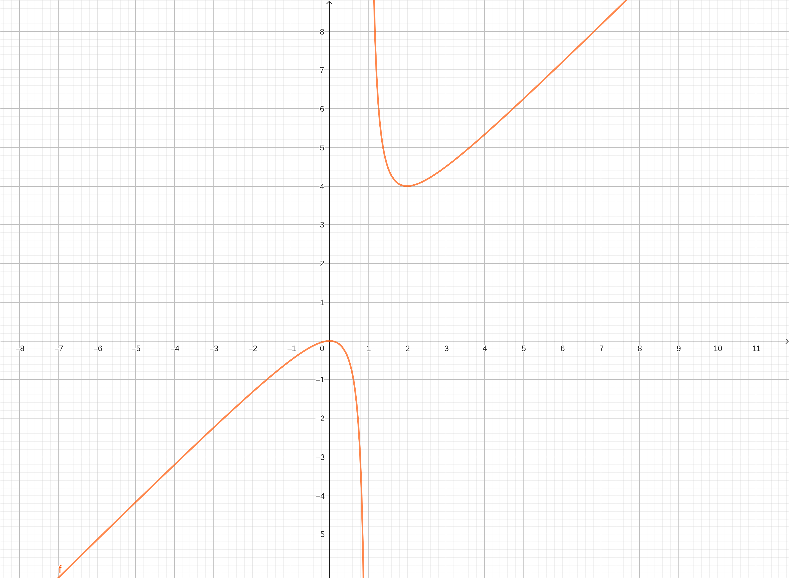

    :math:`f(x) = \frac{x^{2}}{x - 1}`

In a new cell input ``f'`` to find the derivative,

.. math::
    \frac{x \left(x - 2\right)}{x^{2} - 2 x + 1}

In a new cell input ``Solutions`` and for the equation input ``f'=0``.  This will give you the critical values, 0 and 2. In this example the derivative is not a polynomial but a rational function.  So we need to check where the derivative does not exist.  In a new cell type in ``Denominator`` and then ``f'`` for the function, it will extract the :math:`x^{2} - 2 x + 1`, probably called ``g``.  In a new cell input ``Solutions`` and for the equation input ``g=0``. It will return a set with one number, 1, in it.  This is not a critical value since the original function is not defined there but it is still a place where the function could change from increasing to decreasing or vice-versa.  So it is included in our subintervals.

Our subintervals are, :math:`(-\infty, 0)`, :math:`(0, 1)`, :math:`(1, 2)`, and :math:`(2, \infty)`.  Testing the derivative gives us :math:`f'(-1) = 3/4`, :math:`f'(0.5) = -3`, :math:`f'(1.5) = -3`,  :math:`f'(3) = 3/4`.  This gives us the following information,

- The function is decreasing on :math:`\left(0, 1\right) \cup \left(1, 2\right)`.
- The function is increasing on :math:`\left(- \infty, \  0\right)` and :math:`\left(2, \infty \right)`.
- There is a local minimum at :math:`x = 2`.
- There is a local maximum at :math:`x = 0`.

Doing the same trick with the sign function gives us the image,

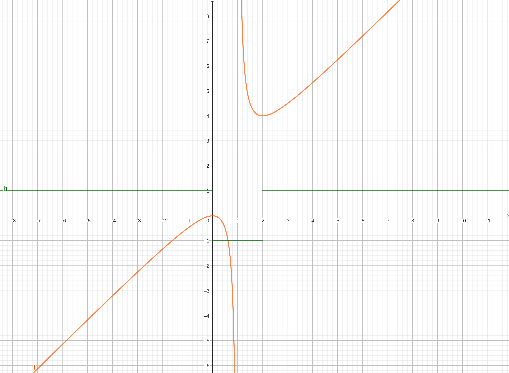

    :math:`f(x) = \frac{x^{2}}{x - 1}` with the sign of the first derivative.

Now we will move on to the second derivative and concavity.  In a new cell input ``f''`` to get the second derivative, the result should be,

.. math::
    \frac{2}{x^{3} - 3 x^{2} + 3 x - 1}

In a new cell input ``Solutions`` and for the equation input ``f''=0``.  This gives us the empty set, as you would have guessed by looking at the second derivative.  As with the first derivative, extract the denominator and solve it for 0, we get a single value of 1.  As with the critical numbers, this cannot be a point of inflection since the function is not defined here but it is still a place where the function can change concavity.  Taking test values gives us, :math:`f''(0)=-2` and :math:`f''(3)=1/4`.  This gives us the following information,

- The function is concave up on :math:`\left(1, \infty \right)`.
- The function is concave down on :math:`\left(- \infty, \  1\right)`.
- There are no inflection points.

Doing the same sign trick with the second derivative we get,

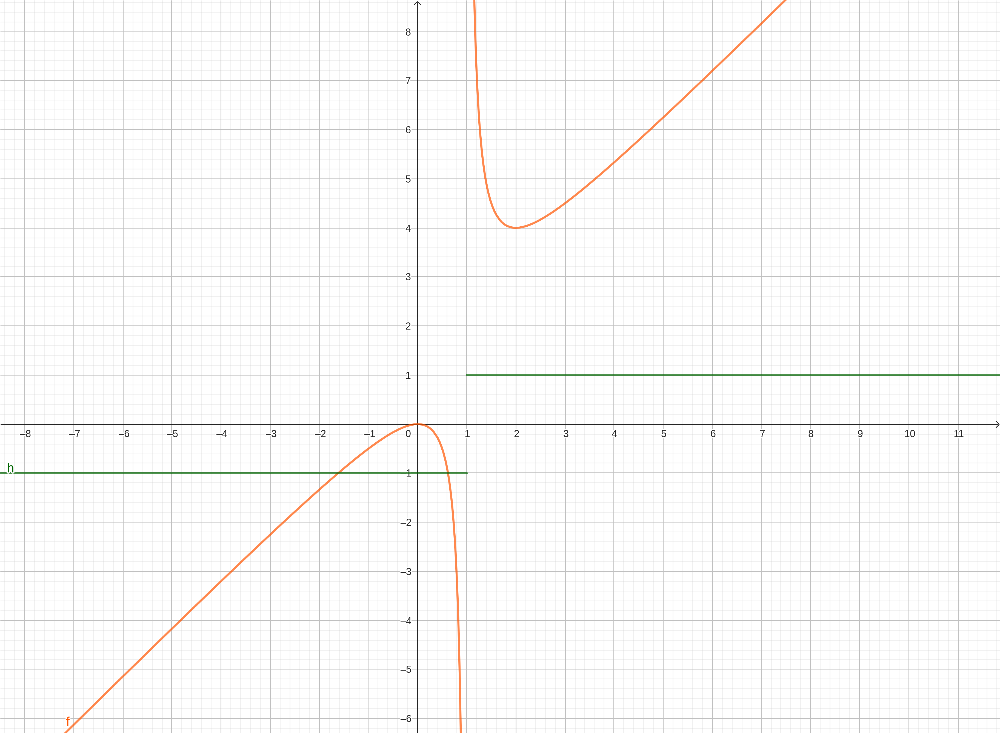

    :math:`f(x) = \frac{x^{2}}{x - 1}` with the sign of the second derivative.

CLAE
^^^^

Input the function,

.. code-block:: console

    x^2/(x - 1)

Graphing gives us the following image,

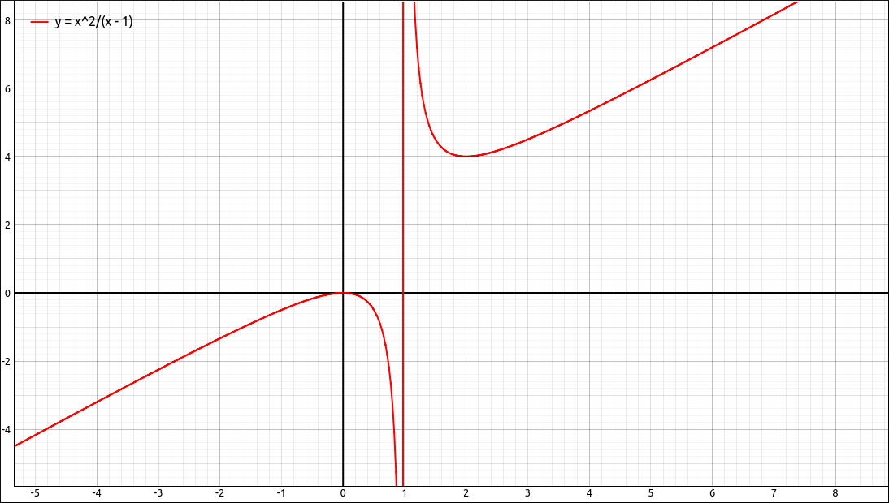

    :math:`f(x) = \frac{x^{2}}{x - 1}`

Find the derivative with ``Calculus > Derivative``, variable *x* and order 1, returns

.. math::
    - \frac{x^{2}}{\left(x - 1\right)^{2}} + \frac{2 x}{x - 1}

and simplifying gives,

.. math::
    \frac{x \left(x - 2\right)}{x^{2} - 2 x + 1}

Selecting ``Algebra > Solve`` on the derivative gives us two critical values, 0 and 2.  Testing where the derivative does not exist, ``Algebra > Rational Expressions > Denominator`` to get the denominator, then solving this for 0 gives a single point 1.  This is not a critical value since the original function is not defined there but it is still a place where the function could change from increasing to decreasing or vice-versa.  So it is included in our subintervals.

Our subintervals are, :math:`(-\infty, 0)`, :math:`(0, 1)`, :math:`(1, 2)`, and :math:`(2, \infty)`.  Testing the derivative either with the evaluate option or defining the derivative to a function, gives us :math:`f'(-1) = 3/4`, :math:`f'(0.5) = -3`, :math:`f'(1.5) = -3`,  :math:`f'(3) = 3/4`.  This gives us the following information,

- The function is decreasing on :math:`\left(0, 1\right) \cup \left(1, 2\right)`.
- The function is increasing on :math:`\left(- \infty, \  0\right)` and :math:`\left(2, \infty \right)`.
- There is a local minimum at :math:`x = 2`.
- There is a local maximum at :math:`x = 0`.

Doing the same trick with the sign function gives us the image,

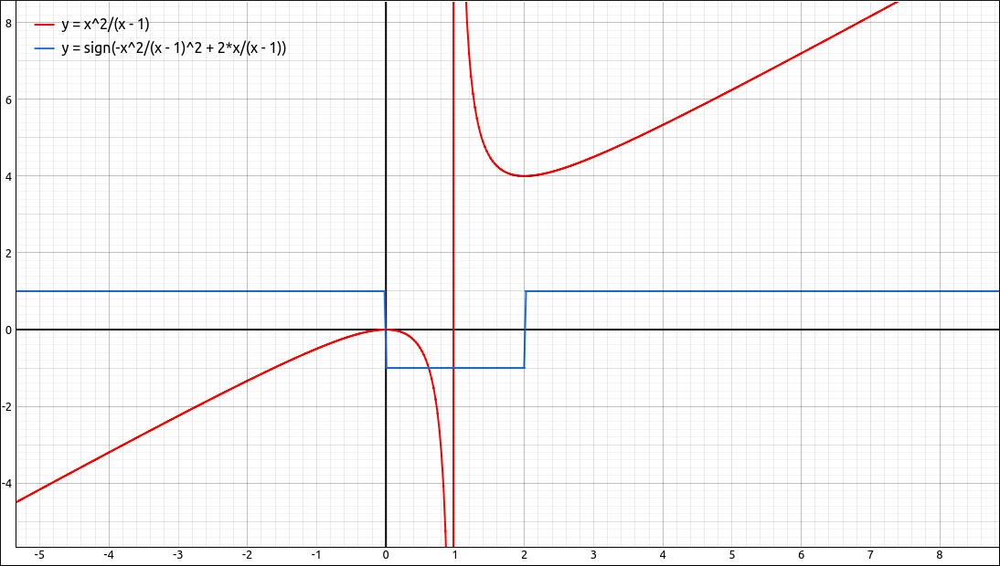

    :math:`f(x) = \frac{x^{2}}{x - 1}` with the sign of the first derivative.

Now we will move on to the second derivative and concavity.  Select the derivative expression, then select ``Calculus > Derivative``, variable *x* and order 1, returns

.. math::
    \frac{x \left(2 - 2 x\right) \left(x - 2\right)}{\left(x^{2} - 2 x + 1\right)^{2}} + \frac{x}{x^{2} - 2 x + 1} + \frac{x - 2}{x^{2} - 2 x + 1}

and simplifying gives,

.. math::
    \frac{2}{x^{3} - 3 x^{2} + 3 x - 1}

Note you could have also selected the original function and then  ``Calculus > Derivative``, variable *x* and order 2.  Now select ``Algebra > Solve`` on the second derivative gives us the empty list for the solutions, as expected. Extracting the denominator and solving it returns again, 1.  We know this cannot be an inflection point but could still be a place where the concavity changes.

Taking test values gives us, :math:`f''(0)=-2` and :math:`f''(3)=1/4`.  This gives us the following information,

- The function is concave up on :math:`\left(1, \infty \right)`.
- The function is concave down on :math:`\left(- \infty, \  1\right)`.
- There are no inflection points.

Doing the same sign trick with the second derivative we get,

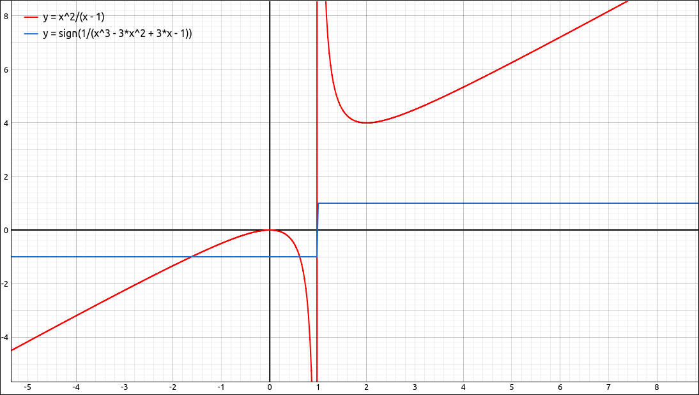

    :math:`f(x) = \frac{x^{2}}{x - 1}` with the sign of the second derivative.

Maxima
^^^^^^

Input the function,

.. code-block:: console

    kill(all);
    f(x):=x^2/(x - 1)

Plot the function,

.. code-block:: console

    wxplot2d(f(x),[x,-10,10], [y,-10,10])

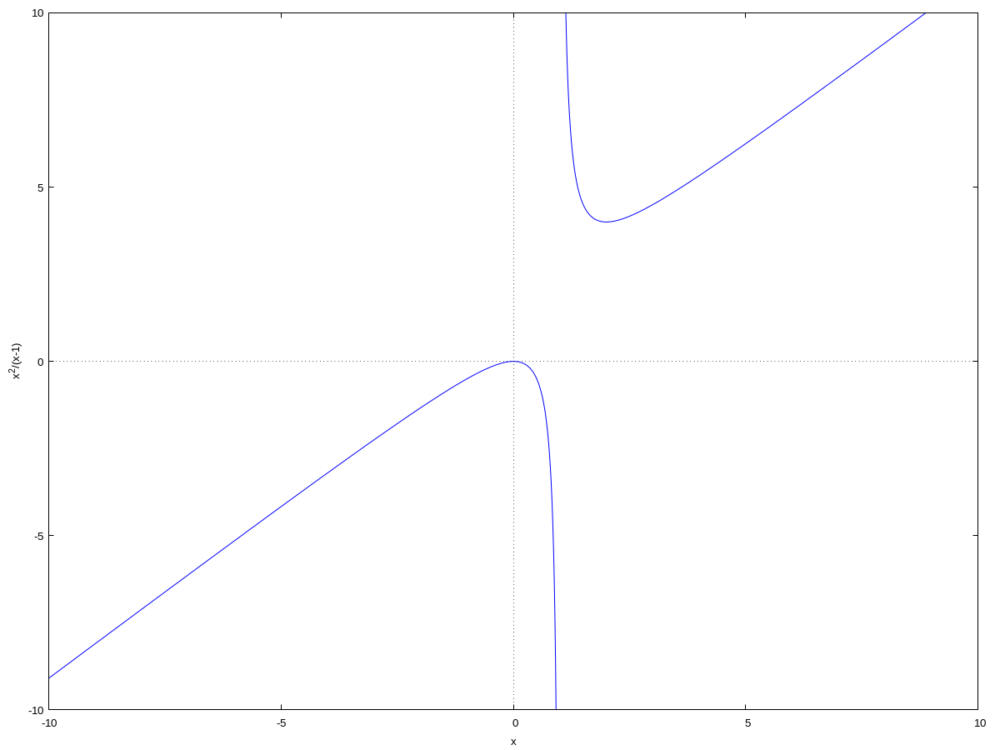

    :math:`f(x) = \frac{x^{2}}{x - 1}`

Take the derivative and assign it to a function,

.. code-block:: console

    df:diff(f(x), x);
    dff(x):=''df

Find the critical numbers,

.. code-block:: console

    solve(df=0)

gives us two critical values, 0 and 2.  Testing where the derivative does not exist,

.. code-block:: console

    df:ratsimp(df);
    d:denom(df);
    solve(d);

gives a single point 1.  This is not a critical value since the original function is not defined there but it is still a place where the function could change from increasing to decreasing or vice-versa.  So it is included in our subintervals.

Our subintervals are, :math:`(-\infty, 0)`, :math:`(0, 1)`, :math:`(1, 2)`, and :math:`(2, \infty)`.  Testing the derivative either with the evaluate option or defining the derivative to a function, gives us :math:`f'(-1) = 3/4`, :math:`f'(0.5) = -3`, :math:`f'(1.5) = -3`,  :math:`f'(3) = 3/4`.  This gives us the following information,

- The function is decreasing on :math:`\left(0, 1\right) \cup \left(1, 2\right)`.
- The function is increasing on :math:`\left(- \infty, \  0\right)` and :math:`\left(2, \infty \right)`.
- There is a local minimum at :math:`x = 2`.
- There is a local maximum at :math:`x = 0`.

Now we will move on to the second derivative and concavity.  Find the second derivative,

.. code-block:: console

    df2:diff(f(x), x, 2);
    df2:ratsimp(df2);
    dff2(x):=''df2

and solve

.. code-block:: console

    solve(df2=0)

gives us the empty list for the solutions, as expected. Extracting the denominator and solving it returns again, 1.  We know this cannot be an inflection point but could still be a place where the concavity changes.

Taking test values gives us, :math:`f''(0)=-2` and :math:`f''(3)=1/4`.  This gives us the following information,

- The function is concave up on :math:`\left(1, \infty \right)`.
- The function is concave down on :math:`\left(- \infty, \  1\right)`.
- There are no inflection points.

Example: Dynamically Visualizing the Relation Between Derivatives and the Shape of a Graph
------------------------------------------------------------------------------------------

In this example we will revisit the function :math:`f(x) = x^4 + x^3`, and do a dynamic tracking of the derivative and second derivative values that will illustrate the concepts in this section.

GeoGebra
^^^^^^^^

Input the function,

.. code-block:: console

    x^4 + x^3

Zoom in and reposition the graph to about where is was in the first example.  In the toolbar, select the point tool and make sure its mode is Point.  Click on the curve and it will place a point on the curve that is "locked" to the curve.  To make sure the point is locked to the curve select the Move tool, click and drag on the point, if it stays on the curve you are good to go and if not, delete it and try again.

Now select the line construction tool and make sure its mode is set to Tangents.  Click the point and then click the curve.  This will create a tangent line to the curve through the point.  Select the Move tool, click and drag the point and the tangent line should follow along.  The image should look like the following,

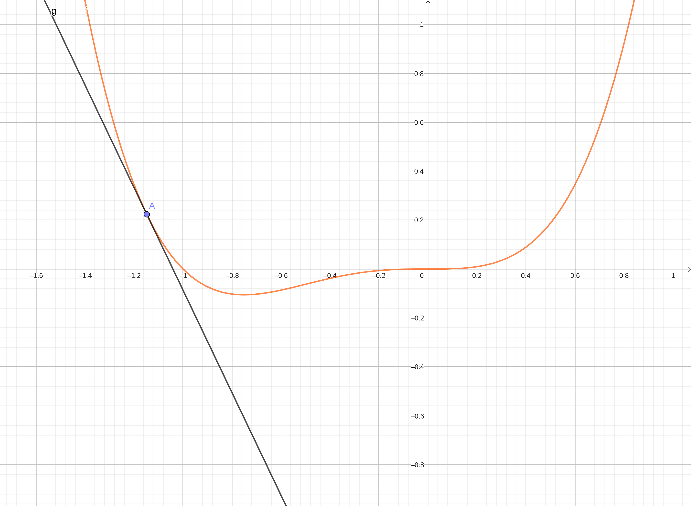

    :math:`f(x) = x^4+x^3` with tangent line.

The point should be designated as *A*, we will assume this.  Now we will input the values for the first and second derivatives. In a new cell input ``f'(A)``, this will display the value of the derivative at the point *A*.  Now in a new cell input ``f''(A)``, this will display the value of the second derivative at the point *A*.  Now just click and drag the point along the curve and compare the derivative values with the theorems in this section.

CLAE
^^^^

Input the function,

.. code-block:: console

    f(x):=x^4 + x^3

We do not need to define this as a function but it will make the next step easier. We will place a point on the curve that will be linked to the slider *a*, input,

.. code-block:: console

    [a, f(a)]

Click and drag the function to the graph area,  zoom in and reposition the graph to about where is was in the first example.  Now click and drag the point to the graph area, change its type to a 2D Point Set.  Now select the function and then select ``Calculus > Tangent Line`` the variable is *x* and the point of tangency should be ``a``.  Click and drag the tangent line over to the graph area.  This links the point to the function and the tangent line to both the point and the function, which is animated by the slider *a*.  The default bounds for the *a* slider are :math:`[-10, 10]` which is a little too large for this example.  Click the slider properties icon and change the bounds to :math:`[-1.5, 1.5]`.  The graph should look like the following.

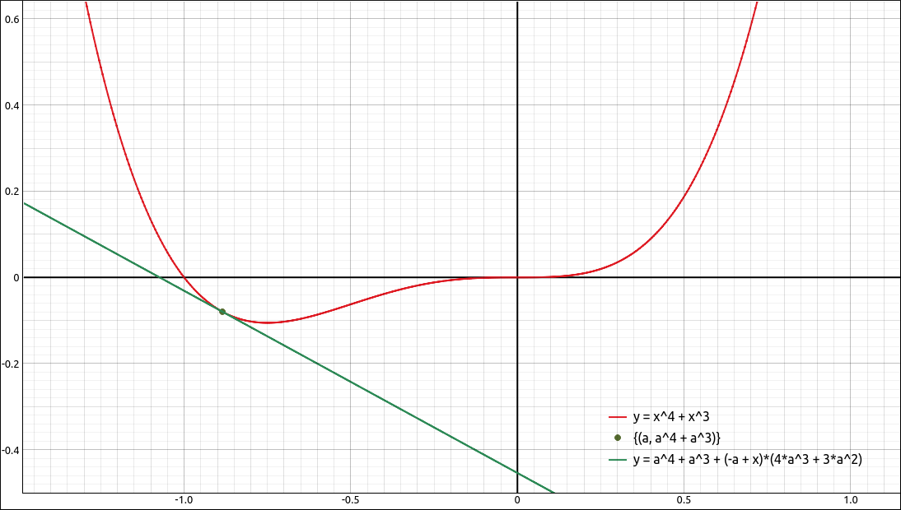

    :math:`f(x) = x^4+x^3` with tangent line.

Now it is time to add in the derivative value tracking.  Select the original expression, select ``Calculus > Derivative``, variable *x* order 1.  With the derivative selected select ``Algebra > Evaluate``, variable *x* expression *a*, this is :math:`f'(a)`.  Now select the original expression, select ``Calculus > Derivative``, variable *x* order 2.  With the second derivative selected select ``Algebra > Evaluate``, variable *x* expression *a*, this is :math:`f''(a)`.  Click and drag the expressions for :math:`f'(a)` and :math:`f''(a)` to the graph and change their types to Value. The graph should now look like the following.

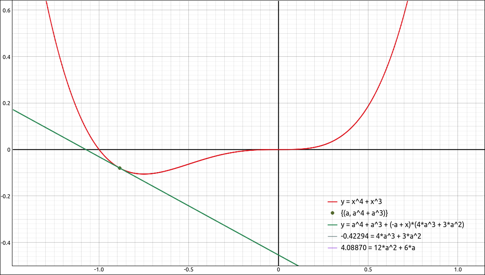

    :math:`f(x) = x^4+x^3` with tangent line and slope value.

Now just click and drag the *a* slider and compare the derivative values with the theorems in this section.
