:index:`Infinite Limits at Infinity`
====================================

Discussion & Definitions
------------------------

Another examination of the end behavior of a function could be that the function increases or decreases without bound as *x* increases or decreases without bound.  If this is the case we have infinite limits at infinity.  More precisely,

.. admonition:: Definition: Infinite Limits at Infinity

    - Let :math:`f(x)` be a function defined at all values in an open interval :math:`(c, \infty)`. If the values of the function :math:`f(x)` *increase without bound* as the values of *x* *increase without bound*, then we say that *the limit of f(x) as x approaches* :math:`\infty` *is* :math:`\infty`.  That is, as *x* gets arbitrarily large, :math:`f(x)` gets arbitrarily large.  Symbolically we write,

    .. math::

        \lim_{x \to \infty} f(x) = \infty

    - Let :math:`f(x)` be a function defined at all values in an open interval :math:`(c, \infty)`. If the values of the function :math:`f(x)` *decrease without bound* as the values of *x* *increase without bound*, then we say that *the limit of f(x) as x approaches* :math:`\infty` *is* :math:`-\infty`.  That is, as *x* gets arbitrarily large, :math:`f(x)` gets arbitrarily small (that is, large negatively).  Symbolically we write,

    .. math::

        \lim_{x \to \infty} f(x) = -\infty

    - Let :math:`f(x)` be a function defined at all values in an open interval :math:`(-\infty, c)`. If the values of the function :math:`f(x)` *increase without bound* as the values of *x* *decrease without bound*, then we say that *the limit of f(x) as x approaches* :math:`-\infty` *is* :math:`\infty`.  That is, as *x* gets arbitrarily small, :math:`f(x)` gets arbitrarily large.  Symbolically we write,

    .. math::

        \lim_{x \to -\infty} f(x) = \infty

    - Let :math:`f(x)` be a function defined at all values in an open interval :math:`(-\infty, c)`. If the values of the function :math:`f(x)` *decrease without bound* as the values of *x* *decrease without bound*, then we say that *the limit of f(x) as x approaches* :math:`-\infty` *is* :math:`-\infty`.  That is, as *x* gets arbitrarily small, :math:`f(x)` gets arbitrarily small (that is, large negatively).  Symbolically we write,

    .. math::

        \lim_{x \to -\infty} f(x) = -\infty

Just as with infinite limits these limits do not exist.  We use the :math:`\pm\infty` notation to portray more information about the function than simply DNE.

Example: :math:`f(x) = x^{3} - 3 x^{2} + x - 1`
-----------------------------------------------

GeoGebra
^^^^^^^^

To graph the function you can use the following syntax,

.. code-block:: console

    x^3-3 x^2 + x -1

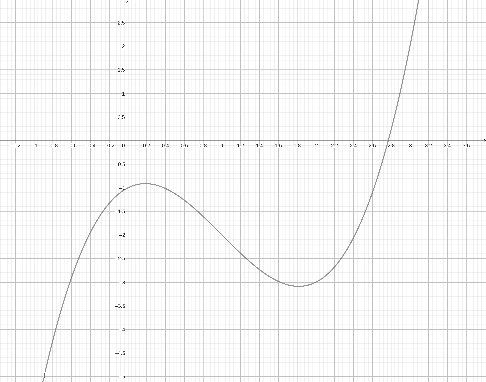

    :math:`f(x) = x^{3} - 3 x^{2} + x - 1`

From the graph it appears that

.. math::

    \lim_{x \to \infty} x^3-3 x^2 + x -1 = \infty \quad {\rm and } \quad  \lim_{x \to -\infty} x^3-3 x^2 + x -1 = -\infty

We can also attack this algebraically.  Select a new cell and type in ``limit`` select the limit option, put in ``f`` as your function and ``inf`` as the point (``inf`` in GeoGebra is :math:`\infty`) the result will be :math:`\infty`.  Do the same in the next cell except use ``-inf`` as the limit point and again the result is :math:`-\infty`.  This algebraically confirms our conclusions above.

CLAE
^^^^

To graph the function you can use the following syntax,

.. code-block:: console

    x^3-3*x^2 + x -1

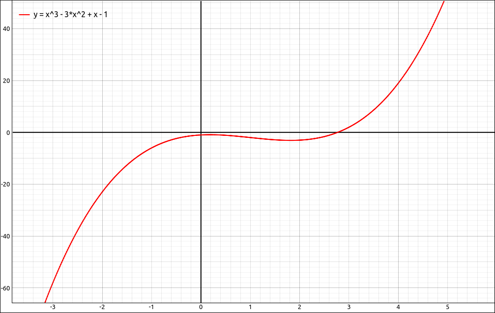

    :math:`f(x) = x^{3} - 3 x^{2} + x - 1`

From the graph it appears that

.. math::

    \lim_{x \to \infty} x^3-3 x^2 + x -1 = \infty \quad {\rm and } \quad  \lim_{x \to -\infty} x^3-3 x^2 + x -1 = -\infty

We can also attack this algebraically.  Select the expression then select ``Calculus > Limit``, variable is *x* and the limit point is ``oo``, the result is :math:`\infty`.  Now do the same but with a limit point of ``-oo``, the result is :math:`-\infty`. This algebraically confirms our conclusions above.

Maxima
^^^^^^

To graph the function you can use the following syntax,

.. code-block:: console

    kill(all)

.. code-block:: console

    f(x):=x^3-3*x^2 + x -1

.. code-block:: console

    wxplot2d([f(x)], [x,-3,5], [y,-60,60])

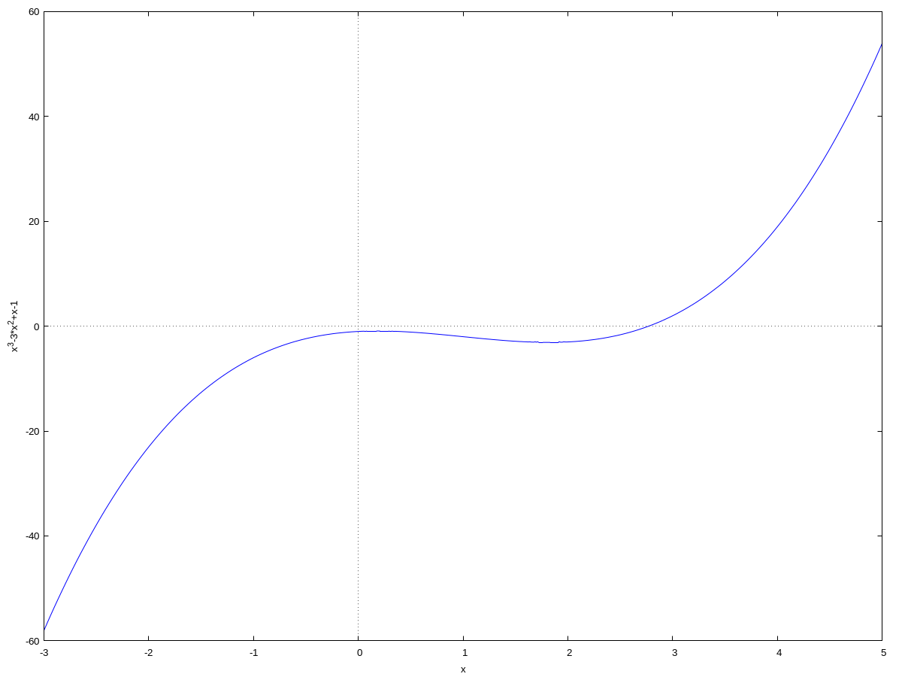

    :math:`f(x) = x^{3} - 3 x^{2} + x - 1`

From the graph it appears that

.. math::

    \lim_{x \to \infty} x^3-3 x^2 + x -1 = \infty \quad {\rm and } \quad  \lim_{x \to -\infty} x^3-3 x^2 + x -1 = -\infty

We can also attack this algebraically by running the following two commands.

.. code-block:: console

    limit(f(x),x,inf)

.. code-block:: console

    limit(f(x),x,-inf)

This algebraically confirms our conclusions above.

Example: :math:`f(x) = \frac{x^{3} - 3 x^{2} + x - 1}{x^{2} + 1}`
-----------------------------------------------------------------

GeoGebra
^^^^^^^^

To graph the function you can use the following syntax,

.. code-block:: console

    (x^3-3 x^2 + x -1)/(x^2+1)

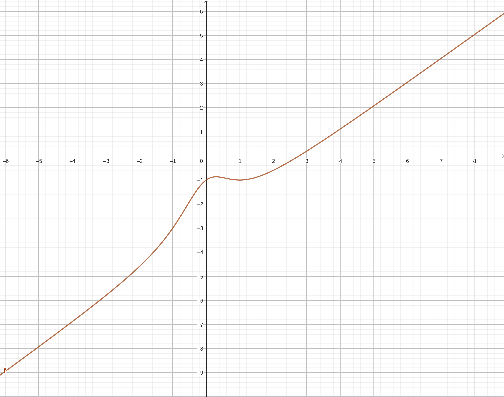

    :math:`f(x) = \frac{x^{3} - 3 x^{2} + x - 1}{x^{2} + 1}`

From the graph it appears that

.. math::

    \lim_{x \to \infty} \frac{x^{3} - 3 x^{2} + x - 1}{x^{2} + 1} = \infty \quad {\rm and } \quad  \lim_{x \to -\infty} \frac{x^{3} - 3 x^{2} + x - 1}{x^{2} + 1} = -\infty

Using the commands outlined in the first example, verify these algebraically.  Note that with this function there is no horizontal asymptote but the curve does straighten out at the ends to what looks like a straight line.  Since this function is a rational function we can do long division on it using the partial fractions function.  In a new cell start typing ``PartialFractions``, select the ``PartialFractions`` from the popup menu and input ``f`` as the function.  The result will be,

.. math::
    x - 3 + \frac{2}{x^{2} + 1}

Plot :math:`x-3` along with the original function and you see that the original function has this straight line as an asymptote.  We would call this a :index:`slanted asymptote`, :index:`tilted asymptote`, or in general an :index:`asymptotic function`.

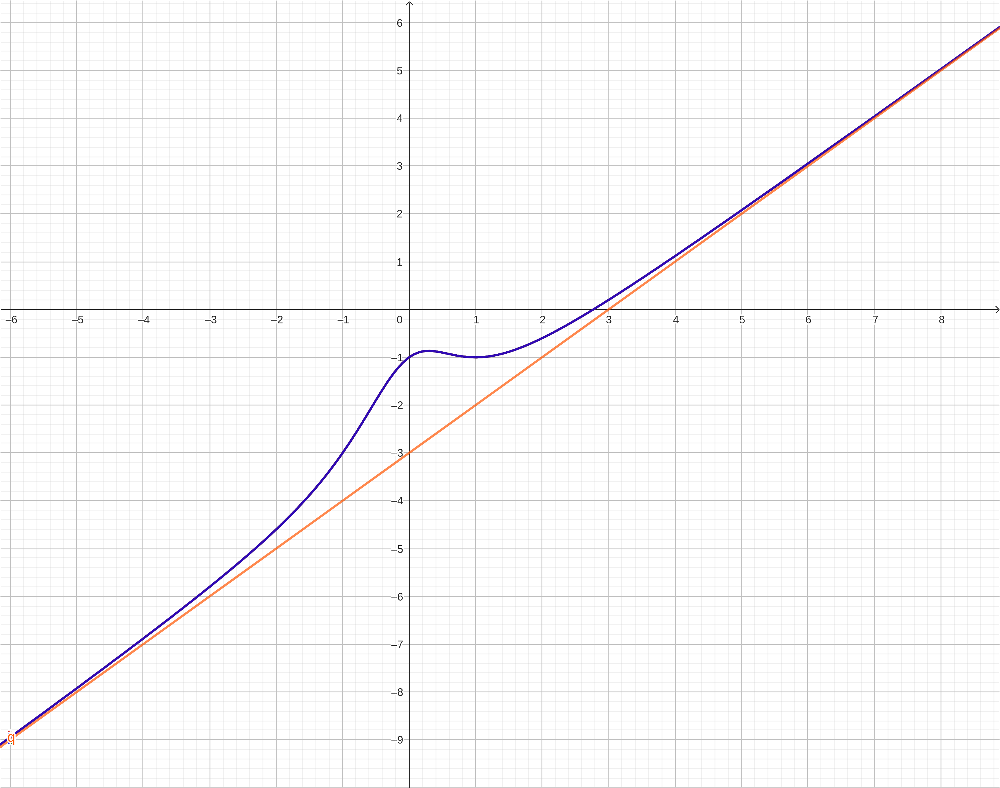

    :math:`f(x) = \frac{x^{3} - 3 x^{2} + x - 1}{x^{2} + 1}` with slanted asymptote.

CLAE
^^^^

To graph the function you can use the following syntax,

.. code-block:: console

    (x^3-3*x^2+x-1)/(x^2+1)

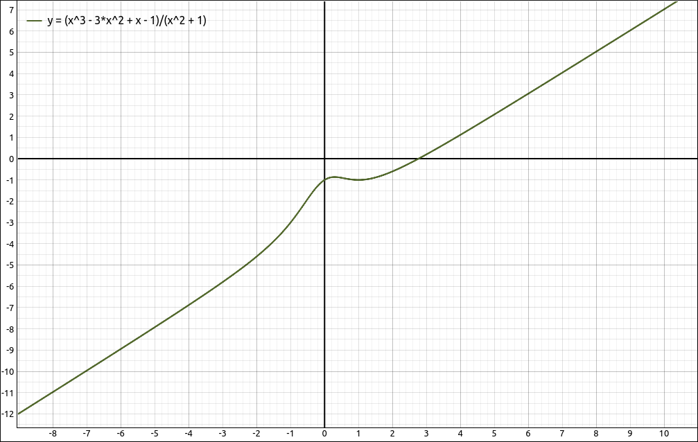

    :math:`f(x) = \frac{x^{3} - 3 x^{2} + x - 1}{x^{2} + 1}`

From the graph it appears that

.. math::

    \lim_{x \to \infty} \frac{x^{3} - 3 x^{2} + x - 1}{x^{2} + 1} = \infty \quad {\rm and } \quad  \lim_{x \to -\infty} \frac{x^{3} - 3 x^{2} + x - 1}{x^{2} + 1} = -\infty

Using the commands outlined in the first example, verify these algebraically.  Note that with this function there is no horizontal asymptote but the curve does straighten out at the ends to what looks like a straight line.  Since this function is a rational function we can do long division on it using the partial fractions function.  Select the function, then select ``Algebra > Partial Fractions``.  The result will be,

.. math::
    x - 3 + \frac{2}{x^{2} + 1}

Plot :math:`x-3` along with the original function and you see that the original function has this straight line as an asymptote.  We would call this a :index:`slanted asymptote`, :index:`tilted asymptote`, or in general an :index:`asymptotic function`.

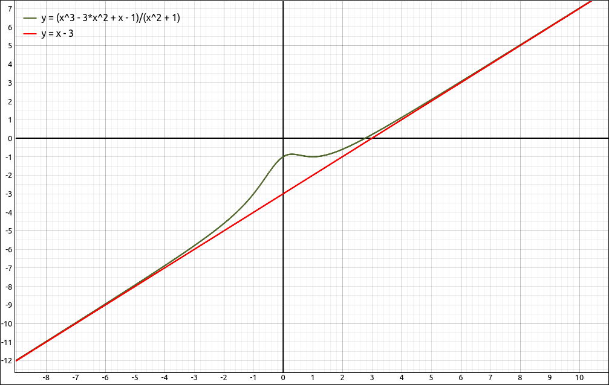

    :math:`f(x) = \frac{x^{3} - 3 x^{2} + x - 1}{x^{2} + 1}` with slanted asymptote.

Maxima
^^^^^^

To graph the function you can use the following syntax,

.. code-block:: console

    kill(all)

.. code-block:: console

    f(x):=(x^3-3*x^2+x-1)/(x^2+1)

.. code-block:: console

    wxplot2d([f(x)], [x,-8,12], [y,-10,10])

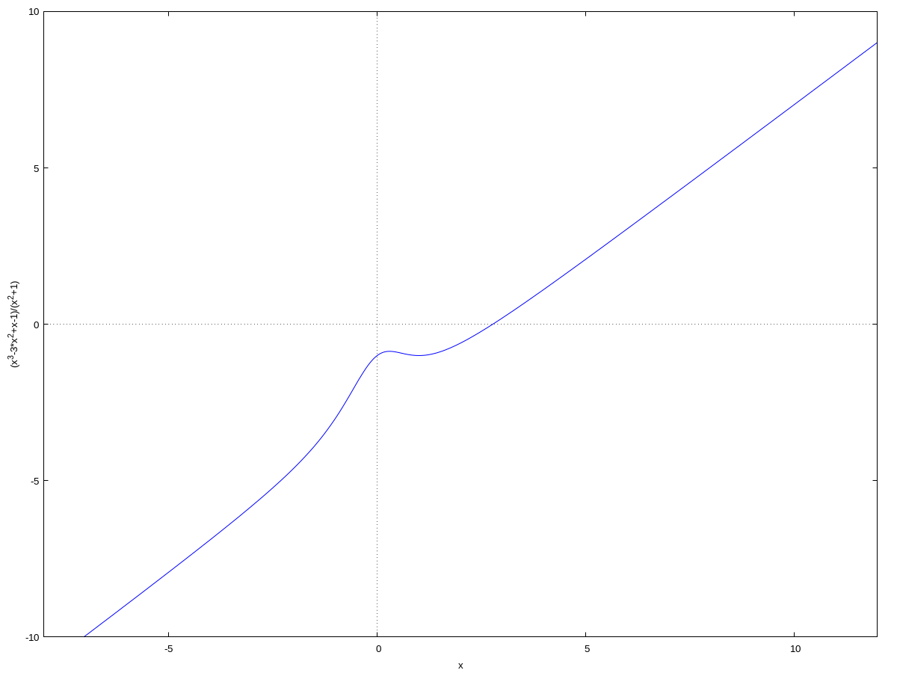

    :math:`f(x) = \frac{x^{3} - 3 x^{2} + x - 1}{x^{2} + 1}`

From the graph it appears that

.. math::

    \lim_{x \to \infty} \frac{x^{3} - 3 x^{2} + x - 1}{x^{2} + 1} = \infty \quad {\rm and } \quad  \lim_{x \to -\infty} \frac{x^{3} - 3 x^{2} + x - 1}{x^{2} + 1} = -\infty

Using the commands outlined in the first example, verify these algebraically.  Note that with this function there is no horizontal asymptote but the curve does straighten out at the ends to what looks like a straight line.  Since this function is a rational function we can do long division on it using the partial fractions function.  Run the command,

.. code-block:: console

    partfrac(f(x),x)

The result will be,

.. math::
    x - 3 + \frac{2}{x^{2} + 1}

Plot :math:`x-3` along with the original function and you see that the original function has this straight line as an asymptote.  We would call this a :index:`slanted asymptote`, :index:`tilted asymptote`, or in general an :index:`asymptotic function`.

.. code-block:: console

    wxplot2d([f(x), x-3], [x,-8,12], [y,-10,10])

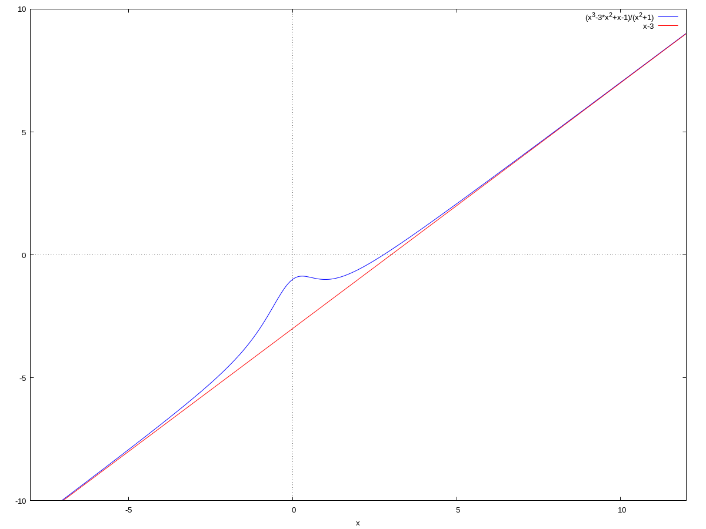

    :math:`f(x) = \frac{x^{3} - 3 x^{2} + x - 1}{x^{2} + 1}` with slanted asymptote.

Example: :math:`f(x) = \frac{x^{3} - 3 x^{2} + x - 1}{x - 2}`
-------------------------------------------------------------

GeoGebra
^^^^^^^^

To graph the function you can use the following syntax,

.. code-block:: console

    (x^3-3 x^2 + x -1)/(x-2)

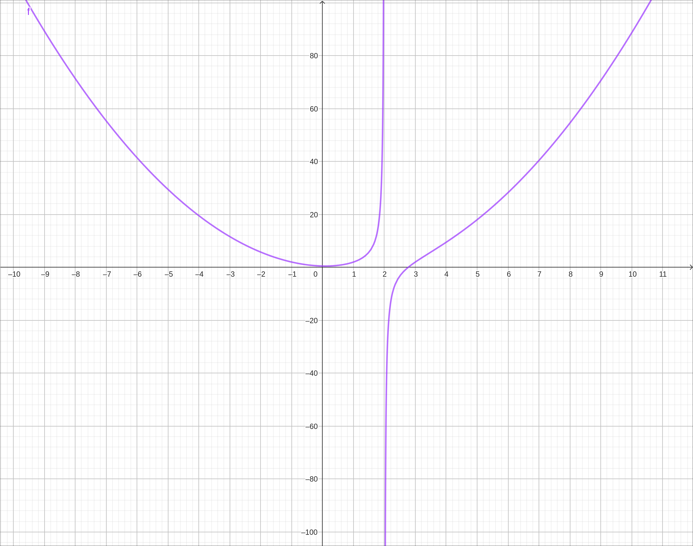

    :math:`f(x) = \frac{x^{3} - 3 x^{2} + x - 1}{x - 2}`

From the graph it appears that

.. math::

    \lim_{x \to \infty} \frac{x^{3} - 3 x^{2} + x - 1}{x - 2} = \infty \quad {\rm and } \quad  \lim_{x \to -\infty} \frac{x^{3} - 3 x^{2} + x - 1}{x - 2} = \infty

Using the commands outlined in the first example, verify these algebraically.  Unlike the last example, the function does not appear to be forming a straight line at the ends, but it does appear to be almost parabolic at the ends.  Using the partial fractions command from the previous example, apply it to this function and we get,

.. math::
    x^{2} - x - 1 - \frac{3}{x - 2}

Graph :math:`y = x^{2} - x - 1` along with the original function and we get,

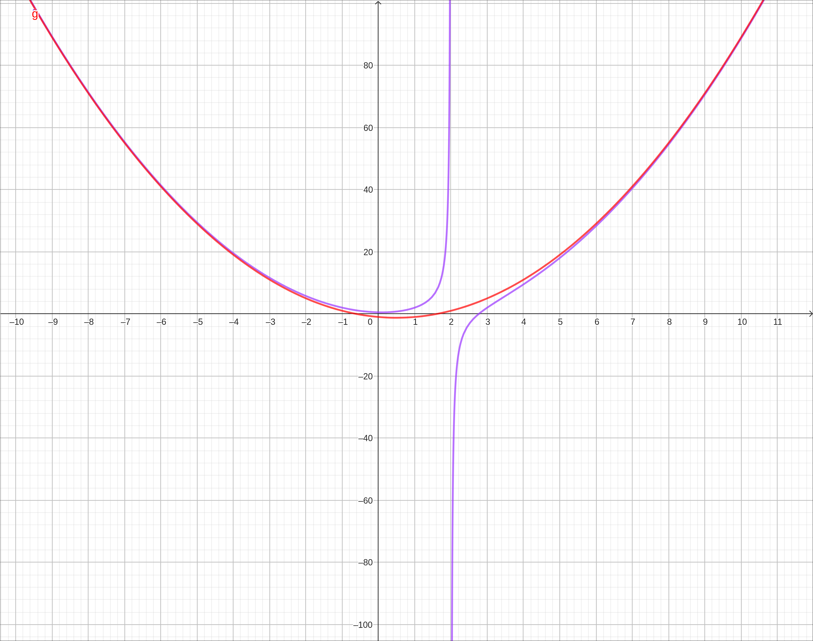

    :math:`f(x) = \frac{x^{3} - 3 x^{2} + x - 1}{x - 2}` with asymptotic function.

So :math:`y = x^{2} - x - 1` is the :index:`asymptotic function` for our original function.

CLAE
^^^^

To graph the function you can use the following syntax,

.. code-block:: console

    (x^3-3*x^2+x-1)/(x-2)

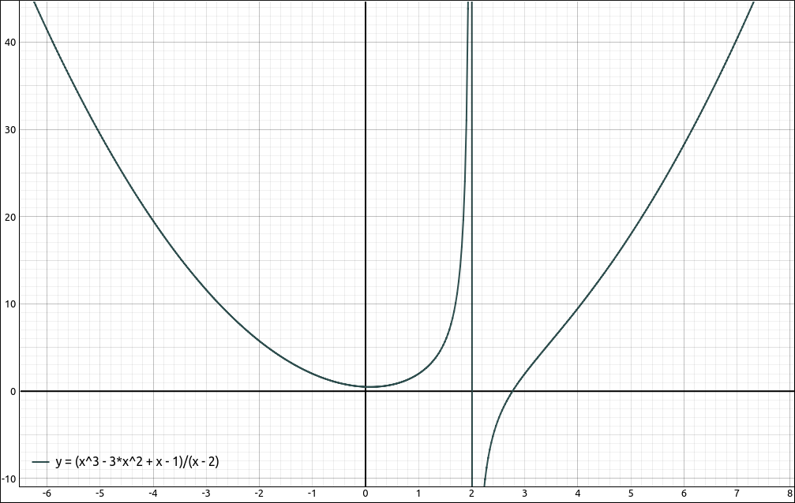

    :math:`f(x) = \frac{x^{3} - 3 x^{2} + x - 1}{x - 2}`

From the graph it appears that

.. math::

    \lim_{x \to \infty} \frac{x^{3} - 3 x^{2} + x - 1}{x - 2} = \infty \quad {\rm and } \quad  \lim_{x \to -\infty} \frac{x^{3} - 3 x^{2} + x - 1}{x - 2} = \infty

Using the commands outlined in the first example, verify these algebraically.  Unlike the last example, the function does not appear to be forming a straight line at the ends, but it does appear to be almost parabolic at the ends.  Using the partial fractions command from the previous example, apply it to this function and we get,

.. math::
    x^{2} - x - 1 - \frac{3}{x - 2}

Graph :math:`y = x^{2} - x - 1` along with the original function and we get,

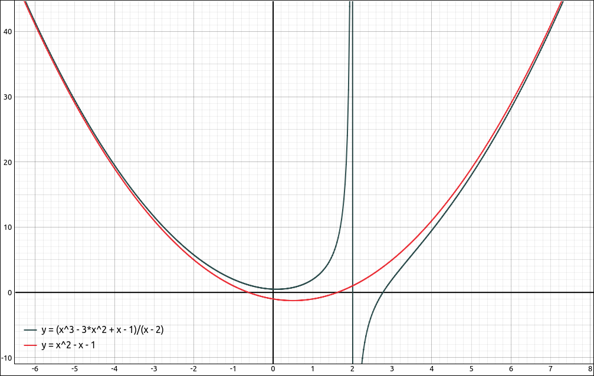

    :math:`f(x) = \frac{x^{3} - 3 x^{2} + x - 1}{x - 2}` with asymptotic function.

So :math:`y = x^{2} - x - 1` is the :index:`asymptotic function` for our original function.

Maxima
^^^^^^

To graph the function you can use the following syntax,

.. code-block:: console

    kill(all)

.. code-block:: console

    f(x):=(x^3-3*x^2+x-1)/(x-2)

.. code-block:: console

    wxplot2d([f(x)], [x,-6,6], [y,-10,30])

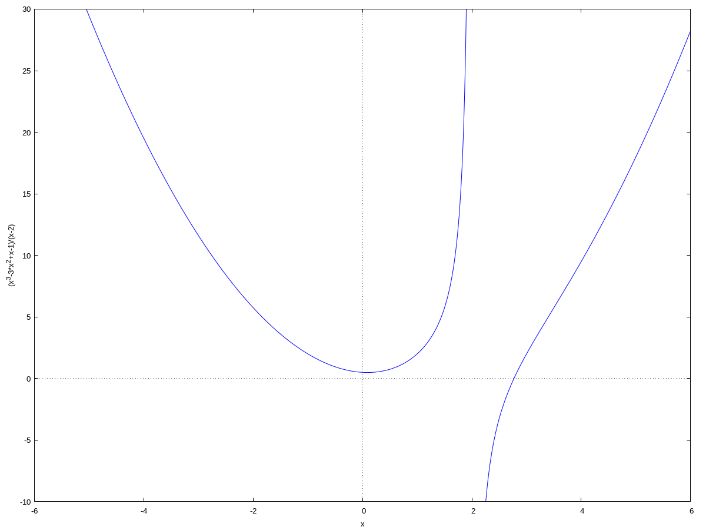

    :math:`f(x) = \frac{x^{3} - 3 x^{2} + x - 1}{x - 2}`

From the graph it appears that

.. math::

    \lim_{x \to \infty} \frac{x^{3} - 3 x^{2} + x - 1}{x - 2} = \infty \quad {\rm and } \quad  \lim_{x \to -\infty} \frac{x^{3} - 3 x^{2} + x - 1}{x - 2} = \infty

Using the commands outlined in the first example, verify these algebraically.  Unlike the last example, the function does not appear to be forming a straight line at the ends, but it does appear to be almost parabolic at the ends.  Using the partial fractions command from the previous example, apply it to this function and we get,

.. math::
    x^{2} - x - 1 - \frac{3}{x - 2}

Graph :math:`y = x^{2} - x - 1` along with the original function and we get,

.. code-block:: console

    wxplot2d([f(x),x^2-x-1], [x,-6,6], [y,-10,30])

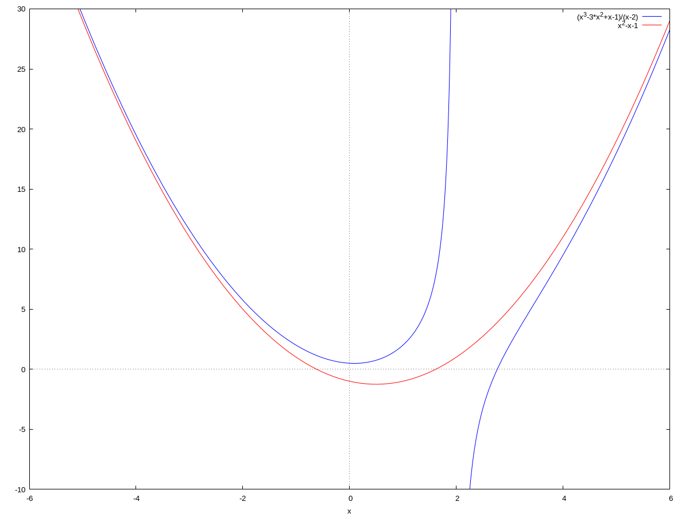

    :math:`f(x) = \frac{x^{3} - 3 x^{2} + x - 1}{x - 2}` with asymptotic function.

So :math:`y = x^{2} - x - 1` is the :index:`asymptotic function` for our original function.

Example: :math:`f(x) = x + \tan^{-1}{\left(x \right)} - 2`
----------------------------------------------------------

The above method of partial fractions (really just long division) works well for rational expressions since it rewrites the function as :math:`f(x) = g(x) + h(x)` where the function :math:`h(x)` has a horizontal asymptote of :math:`y = 0`.  So as *x* grows the value of :math:`h(x)` gets very small and then the difference between :math:`f(x)` and :math:`g(x)` becomes negligible.

As you can guess, there are many more possibilities out there.  For example, the function :math:`f(x) = x + \tan^{-1}{\left(x \right)} - 2`.

GeoGebra
^^^^^^^^

To graph the function you can use the following syntax,

.. code-block:: console

    x-2+atan(x)

Graphing this gives us,

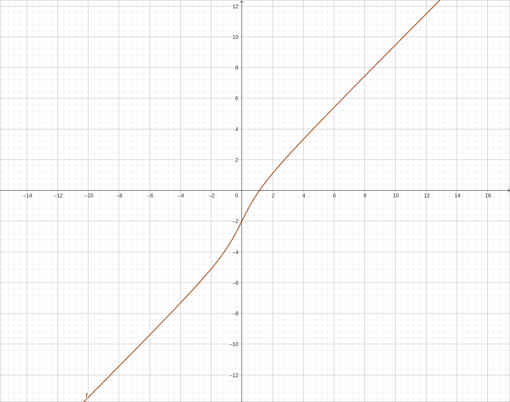

    :math:`f(x) = x + \tan^{-1}{\left(x \right)} - 2`

Although the function does appear to be straighting out at the ends it is not straighting to the same function.  We know from a previous section that the horizontal asymptotes of :math:`\tan^{-1}(x)` are :math:`\pi/2` and :math:`-\pi/2`.  So if we add :math:`x-2` to these we get :math:`y = x-2+\pi/2` and :math:`y = x-2-\pi/2` as our two asymptotic functions.  Graphing all three of these shows,

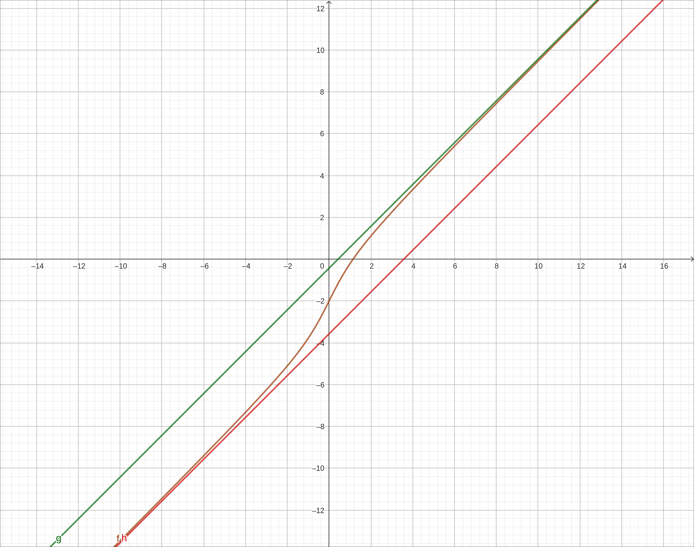

    :math:`f(x) = x + \tan^{-1}{\left(x \right)} - 2` with asymptotic functions.

CLAE
^^^^

To graph the function you can use the following syntax,

.. code-block:: console

    x-2+atan(x)

Graphing this gives us,

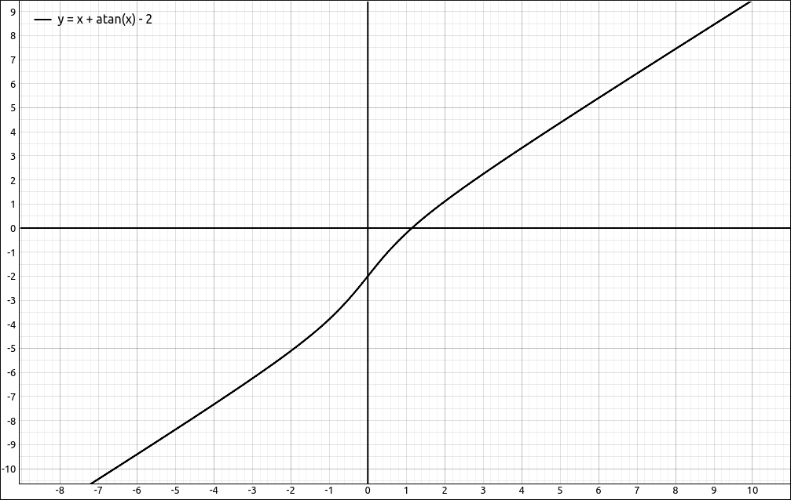

    :math:`f(x) = x + \tan^{-1}{\left(x \right)} - 2`

Although the function does appear to be straighting out at the ends it is not straighting to the same function.  We know from a previous section that the horizontal asymptotes of :math:`\tan^{-1}(x)` are :math:`\pi/2` and :math:`-\pi/2`.  So if we add :math:`x-2` to these we get :math:`y = x-2+\pi/2` and :math:`y = x-2-\pi/2` as our two asymptotic functions.  Graphing all three of these shows,

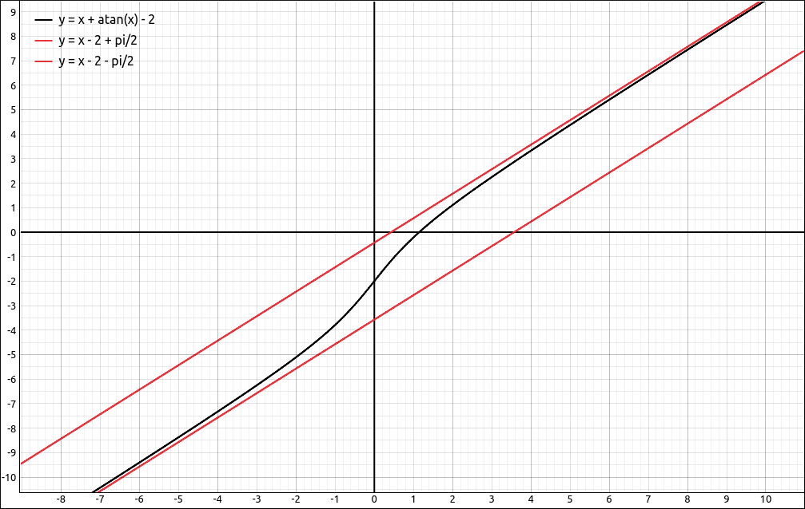

    :math:`f(x) = x + \tan^{-1}{\left(x \right)} - 2` with asymptotic functions.

Maxima
^^^^^^

To graph the function you can use the following syntax,

.. code-block:: console

    kill(all)

.. code-block:: console

    f(x):=x-2+atan(x)

Graphing this gives us,

.. code-block:: console

    wxplot2d([f(x)], [x,-10,10], [y,-10,10])

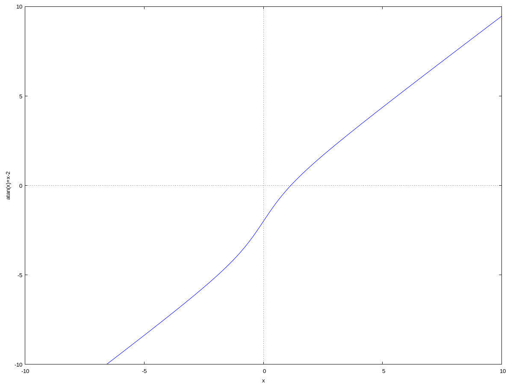

    :math:`f(x) = x + \tan^{-1}{\left(x \right)} - 2`

Although the function does appear to be straighting out at the ends it is not straighting to the same function.  We know from a previous section that the horizontal asymptotes of :math:`\tan^{-1}(x)` are :math:`\pi/2` and :math:`-\pi/2`.  So if we add :math:`x-2` to these we get :math:`y = x-2+\pi/2` and :math:`y = x-2-\pi/2` as our two asymptotic functions.  Graphing all three of these shows,

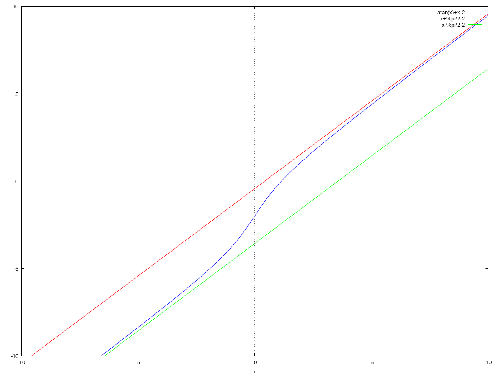

    :math:`f(x) = x + \tan^{-1}{\left(x \right)} - 2` with asymptotic functions.

