:index:`The Precise Definition of a Limit at a Point`
=====================================================

Discussion & Definitions
------------------------

In most cases having a good intuitive understanding of the limit will be sufficient and serve you well.  If you intend to go further in mathematics and take courses in analysis the intuitive understanding will serve as a good basis but will not be sufficient. In this case you will need a formal definition.  Below we give formal or precise  definitions of the limit at a point, including one-sided limits.  Applying these algebraically can be tricky and we will not do any of these examples.  We will use dynamic software to visualize the definition to put some meaning to all the mathematics.  The big step here is to make the terms "approach" and "gets close to" precise, in essence, quantify these intuitive concepts.

.. admonition:: Definition: Precise Definition of a Two-Sided Limit

    Let :math:`f(x)` be a function defined at all values in an open interval containing the number *a*, with the possible exception of a itself. We say that *the limit of f(x) as x approaches a is L*, denoted,

    .. math::

        \lim_{x \to a} f(x) = L

    If for every :math:`\epsilon > 0`, there exists a :math:`\delta > 0`, such that if :math:`0 < |x - a| < \delta`, then :math:`|f (x) - L| < \epsilon`.

.. admonition:: Definition: Precise Definition of a Limit from the Left

    Let :math:`f(x)` be a function defined at all values in an open interval :math:`(c, a)` with :math:`c < a`. We say that *the limit of f(x) as x approaches a from the left is L*, denoted,

    .. math::

        \lim_{x \to a^-} f(x) = L

    If for every :math:`\epsilon > 0`, there exists a :math:`\delta > 0`, such that if :math:`-\delta < x - a < 0`, then :math:`|f (x) - L| < \epsilon`.

.. admonition:: Definition: Precise Definition of a Limit from the Right

    Let :math:`f(x)` be a function defined at all values in an open interval :math:`(a, c)` with :math:`c > a`. We say that *the limit of f(x) as x approaches a from the right is L*, denoted,

    .. math::

        \lim_{x \to a^+} f(x) = L

    If for every :math:`\epsilon > 0`, there exists a :math:`\delta > 0`, such that if :math:`0 < x - a < \delta`, then :math:`|f (x) - L| < \epsilon`.

Example: Visualizing the Two-Sided Limit Definition
---------------------------------------------------

We will concentrate on the definition of the two-sided limit, the one-sided ones are similar.  Since these visualize better with dynamic software packages we will be using just GeoGebra and CLAE.  For these examples we will use a simple function, :math:`f(x) = x^2`.  The limit point will be 2 and hence the limit will be 4.  So we will go through the definition to show, or visualize,

.. math::
    \lim_{x \to 2} x^2 = 4

**Definition:** Let :math:`f(x)` be a function defined at all values in an open interval containing the number *a*, with the possible exception of a itself. We say that *the limit of f(x) as x approaches a is L*, denoted,

.. math::

    \lim_{x \to a} f(x) = L

If for every :math:`\epsilon > 0`, there exists a :math:`\delta > 0`, such that if :math:`0 < |x - a| < \delta`, then :math:`|f (x) - L| < \epsilon`.

GeoGebra
^^^^^^^^

The hardest part of this definition is,

If for every :math:`\epsilon > 0`, there exists a :math:`\delta > 0`, such that if :math:`0 < |x - a| < \delta`, then :math:`|f (x) - L| < \epsilon`.

Let's set things up.

#. Input the function,

    .. code-block:: console

        x^2

#. Set up two sliders, one for :math:`\epsilon` and one for :math:`\delta`.  To do this just input ``d`` into a cell and hit enter, this will give you a slider for :math:`\delta`.  Now input ``p``  into a cell and hit enter, this will give you a slider for :math:`\epsilon`.  Do not use ``e`` since this is Euler's constant (2.718281828...) in GeoGebra.

#. The statement :math:`0 < |x - a| < \delta` means :math:`-\delta < x - a < \delta` (excluding 0) and that means  :math:`a-\delta < x < a+ \delta` (excluding *a*).  So we will put in the two lines that define the boundary to this region, :math:`x = a-\delta` and :math:`x = a+ \delta`.  Since *a* is 2 and :math:`\delta` is *d* input the following two equations,

    .. code-block:: console

        x = 2 - d

    and

    .. code-block:: console

        x = 2 + d

#. The statement :math:`|f (x) - L| < \epsilon` means :math:`-\epsilon < f (x) - L < \epsilon` and that means :math:`L-\epsilon < f (x) < L+ \epsilon`  So we will put in the two lines that define the boundary to this region, :math:`y = L-\epsilon` and :math:`y = L+\epsilon`.  Since *L* is 4 and :math:`\epsilon` is *p* input the following two equations,

    .. code-block:: console

        y = 4 - p

    and

    .. code-block:: console

        y = 4 + p

At this point you should have something close to the following image.

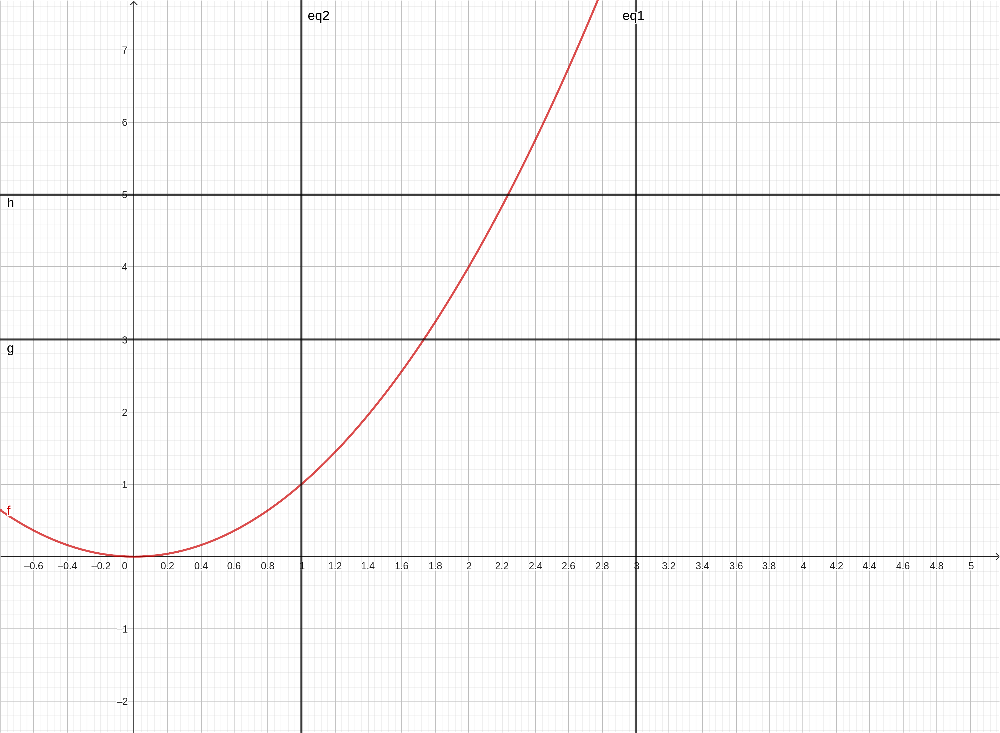

    :math:`f(x) = x^2` with :math:`\delta` and :math:`\epsilon` bound lines.

So now how do we interpret,

If for every :math:`\epsilon > 0`, there exists a :math:`\delta > 0`, such that if :math:`0 < |x - a| < \delta`, then :math:`|f (x) - L| < \epsilon`.

Take the statement bit by bit from left to right.  The first thing is that there is an :math:`\epsilon > 0`.  We have that (the default slider value is 1 which is a fine place to start).  Next we have, there exists a :math:`\delta > 0`, this means that we need to find it, that is our job.  But there is a stipulation, if :math:`0 < |x - a| < \delta`, then :math:`|f (x) - L| < \epsilon`.  This means that if *x* is between those two vertical lines we plotted then *y* (meaning :math:`f(x)`) is between the two horizontal limes we plotted.

If we look at the image this is not the case since within the vertical lines there are portions of the graph that are outside the horizontal lines.  So move the *d* slider down to 0.2, we get the image,

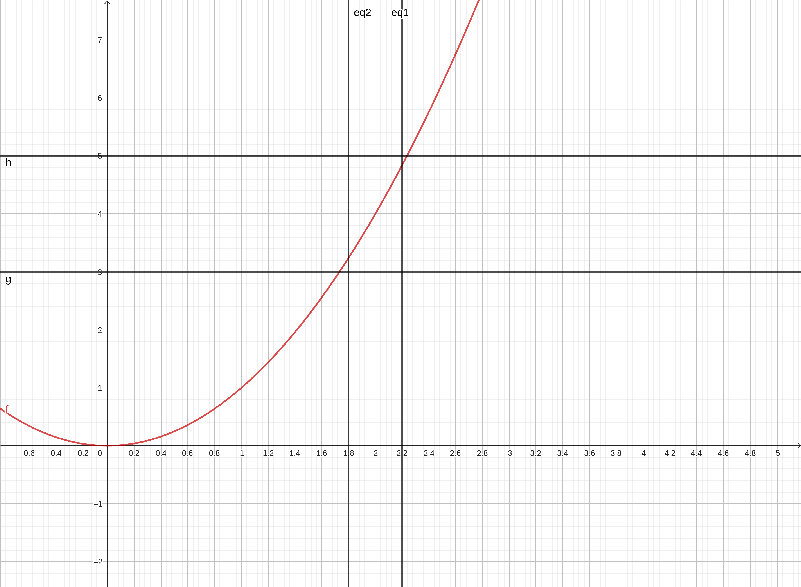

    :math:`f(x) = x^2` with :math:`\delta` and :math:`\epsilon` bound lines.

This satisfies the criteria. Another way to think of it is that the graph of the function is inside the box created by the :math:`\delta` range and the :math:`\epsilon` range.  We are not done yet.  One thing we glossed over was the very beginning of the statement, for every :math:`\epsilon > 0`, there exists a .... So doing this for just one :math:`\epsilon` value is not enough.  Move the *p* slider down to 0.5.

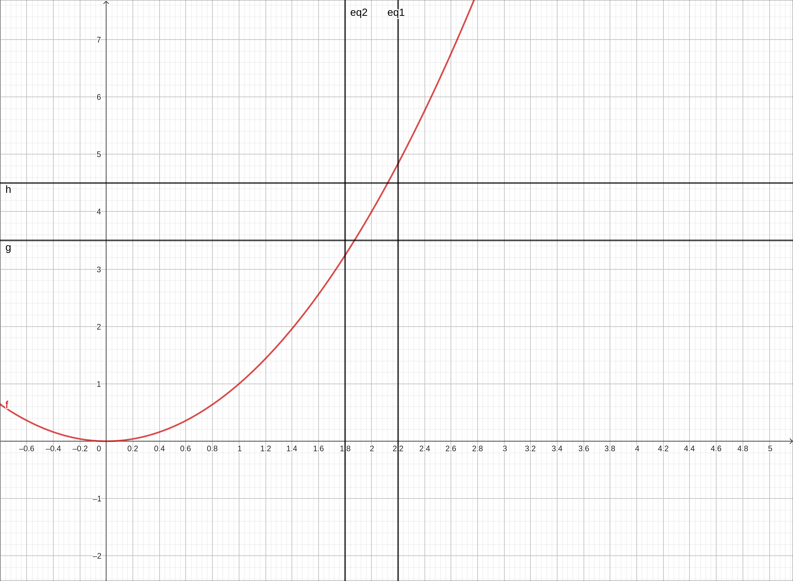

    :math:`f(x) = x^2` with :math:`\delta` and :math:`\epsilon` bound lines.

You can see that the current :math:`\delta` is insufficient, but if we can find a new :math:`\delta` that works we are in business.  Move the *d* slider down to 0.1 and we are back in business.

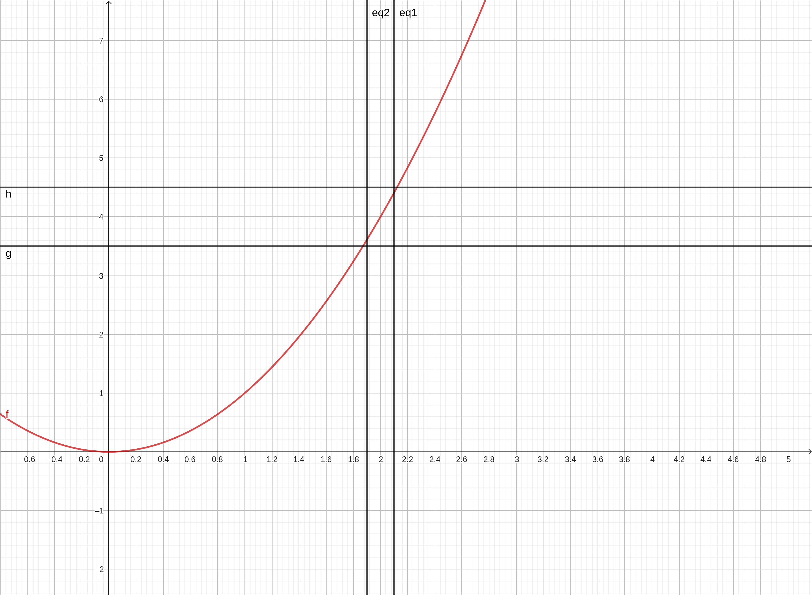

    :math:`f(x) = x^2` with :math:`\delta` and :math:`\epsilon` bound lines.

This needs to be able to be continued no matter how small :math:`\epsilon` is just as long as it is positive.  We cannot do this forever but we will take it another step to get the feel that we can do this infinitely.  We will zoom in a bit, and set the settings of the sliders to have both their ranges between 0 and 0.1 and increment 0.001.  This will also set the *p* slider to 0.1.

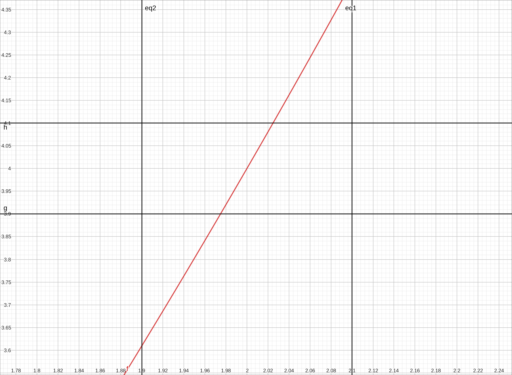

    :math:`f(x) = x^2` with :math:`\delta` and :math:`\epsilon` bound lines.

Again we are in a situation where :math:`\delta` is insufficient.  Set the *d* slider to 0.02, and again we are back in business.

    :math:`f(x) = x^2` with :math:`\delta` and :math:`\epsilon` bound lines.

This is certainly not a proof or an algebraic justification but hopefully it gives you a feel for how we gave quantified the terms "approach" and "gets close to" precisely.

CLAE
^^^^

The hardest part of this definition is,

If for every :math:`\epsilon > 0`, there exists a :math:`\delta > 0`, such that if :math:`0 < |x - a| < \delta`, then :math:`|f (x) - L| < \epsilon`.

Let's set things up.

#. Input the function,

    .. code-block:: console

        x^2

#. The statement :math:`0 < |x - a| < \delta` means :math:`-\delta < x - a < \delta` (excluding 0) and that means  :math:`a-\delta < x < a+ \delta` (excluding *a*).  So we will put in the two lines that define the boundary to this region, :math:`x = a-\delta` and :math:`x = a+ \delta`.  Since *a* is 2 and :math:`\delta` is *d* input the following list,

    .. code-block:: console

        [2 - d, 2+d]

#. Drag this over to the graph.  They will come in as horizontal lines, change the type drop-down for the graphics object to Vertical Lines.

#. The statement :math:`|f (x) - L| < \epsilon` means :math:`-\epsilon < f (x) - L < \epsilon` and that means :math:`L-\epsilon < f (x) < L+ \epsilon`  So we will put in the two lines that define the boundary to this region, :math:`y = L-\epsilon` and :math:`y = L+\epsilon`.  Since *L* is 4 and :math:`\epsilon` is *e* input the following list,

    .. code-block:: console

        [4 - e, 4+e]

#. Drag this over to the graph.  They will come in as horizontal lines which is what we want.

At this point you should have something close to the following image.

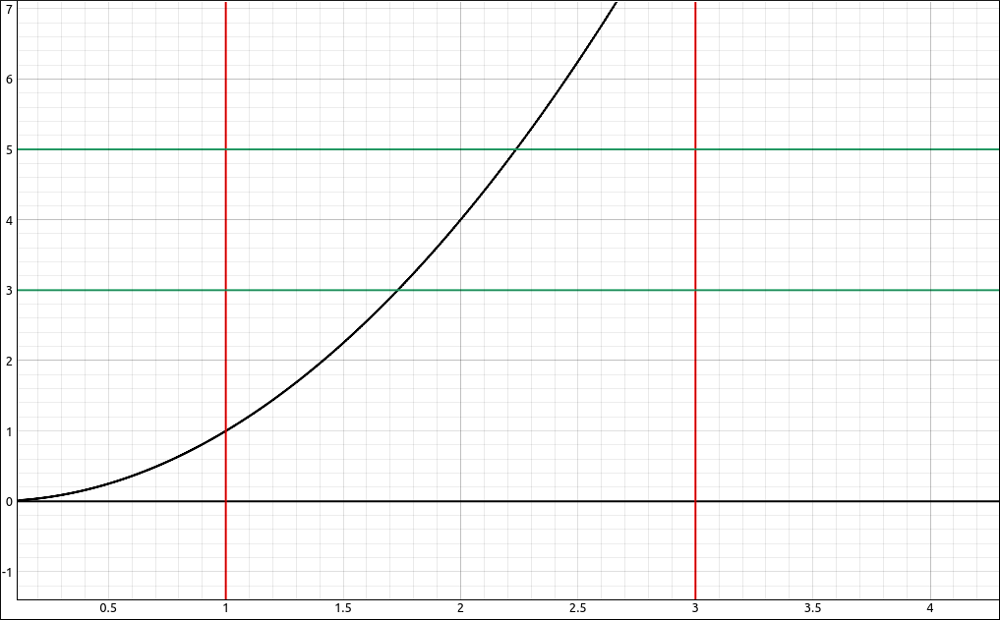

    :math:`f(x) = x^2` with :math:`\delta` and :math:`\epsilon` bound lines.

So now how do we interpret,

If for every :math:`\epsilon > 0`, there exists a :math:`\delta > 0`, such that if :math:`0 < |x - a| < \delta`, then :math:`|f (x) - L| < \epsilon`.

Take the statement bit by bit from left to right.  The first thing is that there is an :math:`\epsilon > 0`.  We have that (the default slider value is 1 which is a fine place to start).  Next we have, there exists a :math:`\delta > 0`, this means that we need to find it, that is our job.  But there is a stipulation, if :math:`0 < |x - a| < \delta`, then :math:`|f (x) - L| < \epsilon`.  This means that if *x* is between those two vertical lines we plotted then *y* (meaning :math:`f(x)`) is between the two horizontal limes we plotted.

If we look at the image this is not the case since within the vertical lines there are portions of the graph that are outside the horizontal lines.  So move the *d* slider down to 0.2, we get the image,

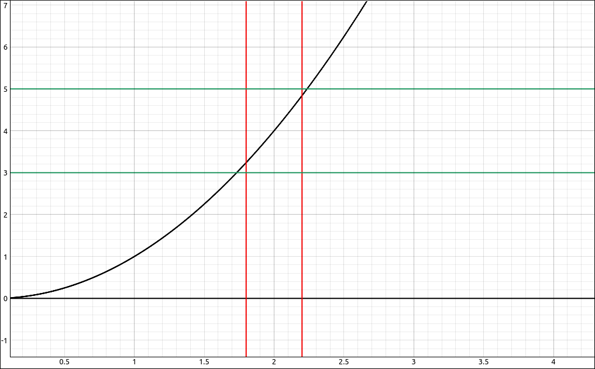

    :math:`f(x) = x^2` with :math:`\delta` and :math:`\epsilon` bound lines.

This satisfies the criteria. Another way to think of it is that the graph of the function is inside the box created by the :math:`\delta` range and the :math:`\epsilon` range.  We are not done yet.  One thing we glossed over was the very beginning of the statement, for every :math:`\epsilon > 0`, there exists a .... So doing this for just one :math:`\epsilon` value is not enough.  Move the *e* slider down to 0.5.

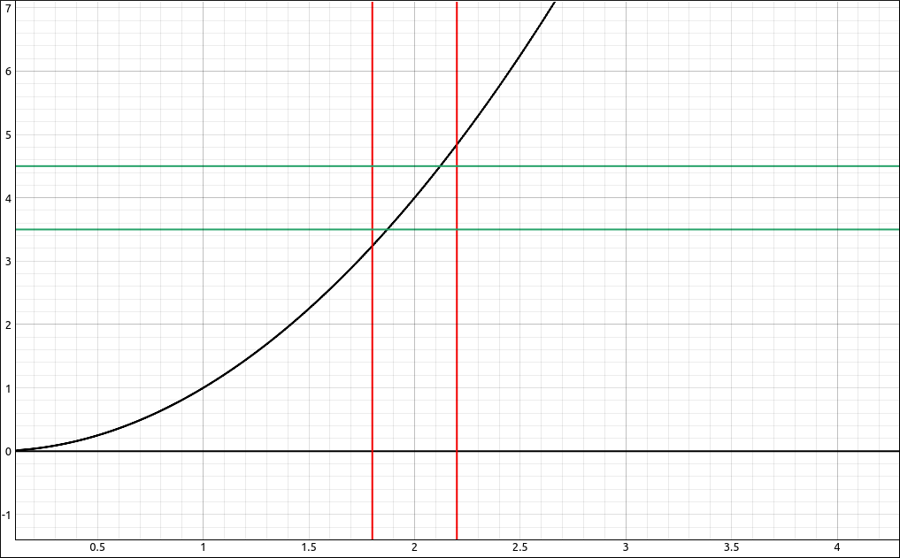

    :math:`f(x) = x^2` with :math:`\delta` and :math:`\epsilon` bound lines.

You can see that the current :math:`\delta` is insufficient, but if we can find a new :math:`\delta` that works we are in business.  Move the *d* slider down to 0.1 and we are back in business.

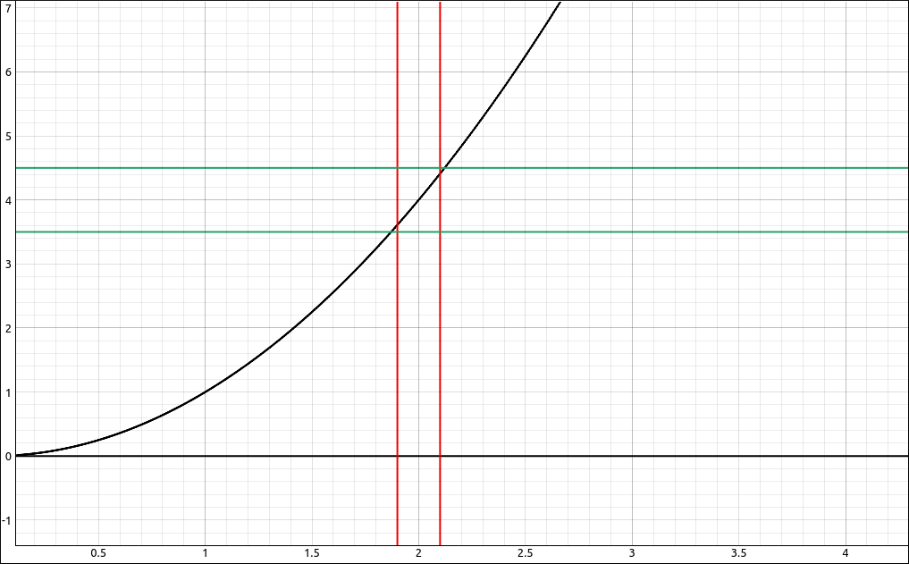

    :math:`f(x) = x^2` with :math:`\delta` and :math:`\epsilon` bound lines.

This needs to be able to be continued no matter how small :math:`\epsilon` is just as long as it is positive.  We cannot do this forever but we will take it another step to get the feel that we can do this infinitely.  We will zoom in a bit, and set the settings of the sliders to have both their ranges between 0 and 0.1.  This will also set the *e* slider to 0.1.

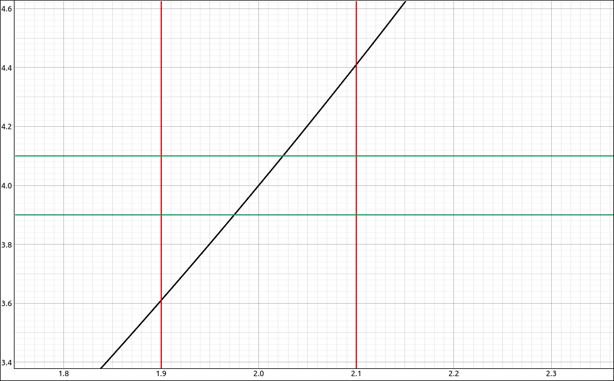

    :math:`f(x) = x^2` with :math:`\delta` and :math:`\epsilon` bound lines.

Again we are in a situation where :math:`\delta` is insufficient.  Set the *d* slider to 0.02, and again we are back in business.

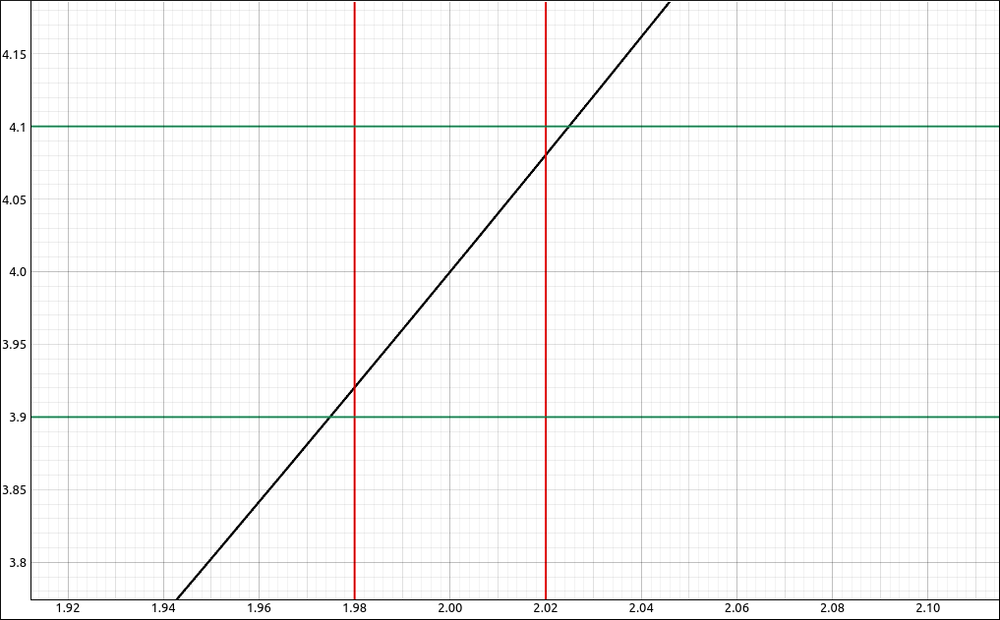

    :math:`f(x) = x^2` with :math:`\delta` and :math:`\epsilon` bound lines.

This is certainly not a proof or an algebraic justification but hopefully it gives you a feel for how we gave quantified the terms "approach" and "gets close to" precisely.

