:index:`Mean Value Theorem`
===========================

Discussion & Definitions
------------------------

We start out with a special case of the Mean Value Theorem, Rolle's Theorem.

.. admonition:: Theorem: Rolle's Theorem

    Let :math:`f` be a continuous function over the closed interval :math:`[a, b]` and differentiable over the open interval :math:`(a, b)` such that :math:`f(a) = f(b)`. Then there exists at least one value :math:`c \in (a, b)` such that :math:`f'(c) = 0`.

To illustrate this theorem let's look at an example, take the function :math:`f(x) = x^{3} - 4 x + 3` on the interval :math:`[-2, 2]`.  The function is continuous over the interval and differentiable over :math:`(-2, 2)`, also :math:`f(-2) = f(2) = 3`.  So all of the criteria of the theorem is satisfied, hence there exists at least one value :math:`c \in (a, b)` such that :math:`f'(c) = 0`.  This theorem is an "existence theorem", which says that *c* exists but it does not give an algorithm for finding it nor does it tell us how many of them there are, just at least one.  Solving :math:`f'(c) = 0` gives us two solutions,

.. math::
    c= - \frac{2 \sqrt{3}}{3} \quad {\rm and} \quad c = \frac{2 \sqrt{3}}{3}

In the following figure, the red line is the function, the blue points are the points :math:`(-2, f(-2))` and :math:`(2, f(2))`, the blue line is the line between the two points.  The green vertical lines are at the two *c* values and the orange lines are the tangent lines at the two *c* values.  Since the tangent lines are horizontal we have :math:`f'(c) = 0` at each *c* value.

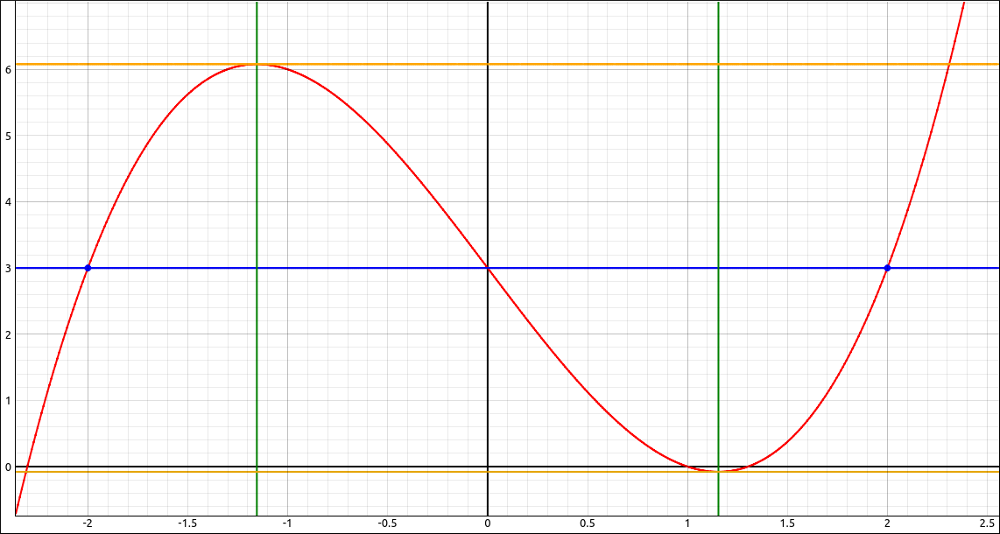

    Rolle's Theorem Visualization

It is vital that the hypotheses of the theorem are satisfied, for example, if we take :math:`f(x) = |x|` on the interval :math:`[-2, 2]`, there is no place in the interval with :math:`f'(c) = 0`, since the function fails to be differentiable on the interval :math:`(-2, 2)`.

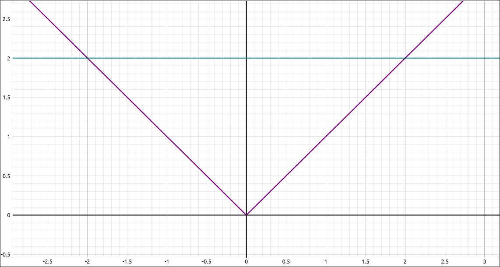

    Rolle's Theorem Visualization

.. admonition:: Theorem: Mean Value Theorem

    Let :math:`f` be a continuous function over the closed interval :math:`[a, b]` and differentiable over the open interval :math:`(a, b)` such that :math:`f(a) = f(b)`. Then there exists at least one value :math:`c \in (a, b)` such that :math:`f'(c) = \frac{f(b) - f(a)}{b-a}`.

To illustrate the Mean Value Theorem let's look at an example, take the function :math:`f(x) = x^{3} - 4 x + 3` on the interval :math:`[-2, 3]`.  The function is continuous over the interval and differentiable over :math:`(-2, 3)`, also :math:`f(-2) = 3` and :math:`f(3) = 18`, so :math:`\frac{f(b) - f(a)}{b-a} = \frac{18 - 3}{3-(-2)} = 3`.  So all of the criteria of the theorem is satisfied, hence there exists at least one value :math:`c \in (a, b)` such that :math:`f'(c) = 3`.  This theorem is an "existence theorem", which says that *c* exists but it does not give an algorithm for finding it nor does it tell us how many of them there are, just at least one.  Solving :math:`f'(c) = 3` gives us two solutions,

.. math::
    c= - \frac{\sqrt{21}}{3} \quad {\rm and} \quad c = \frac{\sqrt{21}}{3}

In the following figure, the red line is the function, the blue points are the points :math:`(-2, f(-2))` and :math:`(3, f(3))`, the blue line is the line between the two points.  The green vertical lines are at the two *c* values and the orange lines are the tangent lines at the two *c* values.

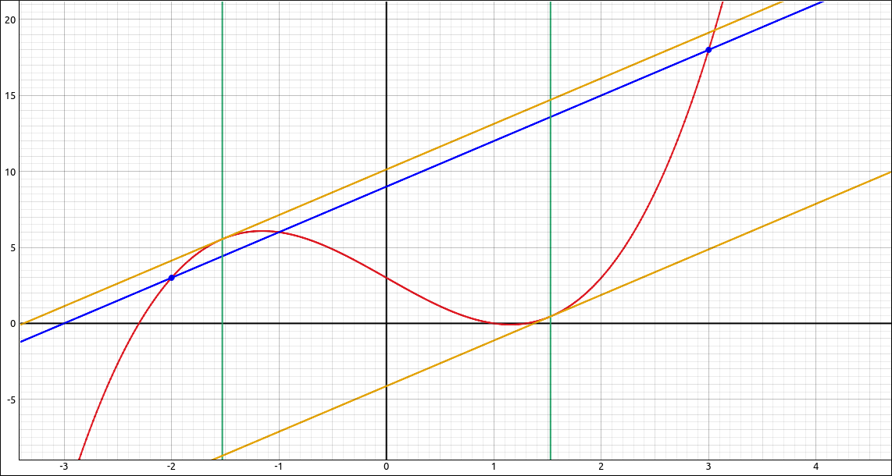

    Mean Value Theorem Visualization

Corollaries of the Mean Value Theorem
^^^^^^^^^^^^^^^^^^^^^^^^^^^^^^^^^^^^^

.. admonition:: Corollary: Functions with a Derivative of Zero

    Let :math:`f` be differentiable over an interval :math:`I`. If :math:`f'(x) = 0` for all :math:`x \in I`, then f(x) is a constant function for all :math:`x \in I`.

.. admonition:: Corollary: Constant Difference Theorem

    If :math:`f` and :math:`g` are differentiable over an interval :math:`I` and :math:`f'(x) = g'(x)` for all :math:`x \in I`, then :math:`f(x) = g(x) + C` for some constant :math:`C`.

.. admonition:: Corollary: Increasing and Decreasing Functions

    Let :math:`f` be continuous over the closed interval :math:`[a, b]` and differentiable over the open interval :math:`(a, b)`.

    i. If :math:`f'(x) > 0` for all :math:`x \in (a, b)`, then :math:`f` is an increasing function over :math:`[a, b]`.

    ii. If :math:`f'(x) < 0` for all :math:`x \in (a, b)`, then :math:`f` is a decreasing function over :math:`[a, b]`.

Example: :math:`f(x) = \frac{x}{\sin{\left(\pi x \right)} + 1}` on :math:`[0, 1]`
---------------------------------------------------------------------------------

For this example we will verify that the Mean Value Theorem applies to the function :math:`f(x) = \frac{x}{\sin{\left(\pi x \right)} + 1}` on the interval :math:`[0, 1]` and then find all values of *c* that satisfy the Mean Value Theorem.

GeoGebra
^^^^^^^^

Input the function and zoom in until the interval from 0 to 1 and the graph are taking up most of the graphics area.

.. code-block:: console

    x/(sin(pi x)+1)

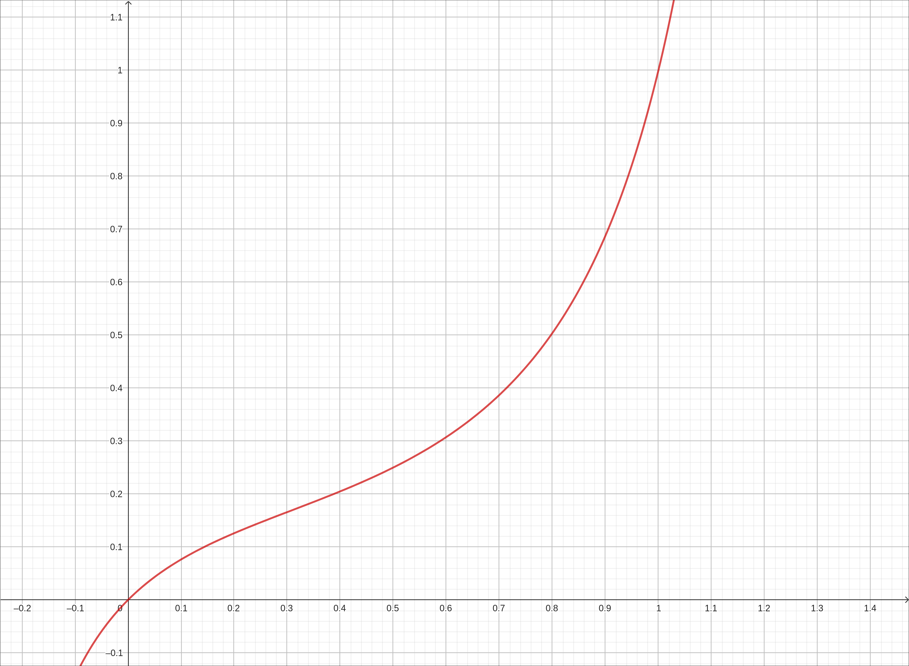

    :math:`f(x) = \frac{x}{\sin{\left(\pi x \right)} + 1}`

If we find the derivative with ``f'`` the result is,

.. math::
    \frac{- \pi x \cos{\left(\pi x \right)} + \sin{\left(\pi x \right)} + 1}{\sin^{2}{\left(\pi x \right)} + 2 \sin{\left(\pi x \right)} + 1}

Since this is a rational expression in polynomials and trigonometric functions it will be defined as long as the denominator is not 0.  Extracting the denominator with

.. code-block:: console

    Denominator(f')

.. math::
    \sin^{2}{\left(\pi x \right)} + 2 \sin{\left(\pi x \right)} + 1

Then applying the ``Solve`` function to this we get two solutions, :math:`-1/2` and :math:`3/2`.  There are really an infinite number of solutions to this equation but as we can see, none in the interval :math:`[0, 1]`.  So the hypotheses for the Mean Value Theorem are satisfied.

Calculate :math:`f(0)` and :math:`f(1)`, resulting in 0 and 1 respectively.  So the line through the points :math:`(0, f(0)) = (0, 0)` and :math:`(1, f(1)) = (1, 1)` is :math:`y = x`.  Input and plot :math:`y = x`.  If we try to solve the equation :math:`f'(x) = 1` with,

.. code-block:: console

    Solve(f'(x)=1)

The program will simply return ``?``, which is not a surprise, solving combinations of polynomial and trigonometric functions is difficult to do exactly.  If instead we do,

.. code-block:: console

    NSolutions(f'(x)=1)

to get the numeric solutions the program returns a long list of approximate solutions.  The one we want is 0.7138.  Note that you can extract an entry from a list in GeoGebra.  When we did this exercise the list name was ``l2`` and the entry we wanted was the 22nd entry, using ``l2(22)`` extracted the value for us and stored it in the variable *a*.

Now plot the point by inputting,

.. code-block:: console

    (0.7138, f(0.7138))

or

.. code-block:: console

    (a, f(a))

if you did the extraction.  This will plot the point on the curve.  In the menu, in the line options icon set the mode to Tangents.  Then click on the point and then click on the curve.  This will create the tangent line to the curve at that point.

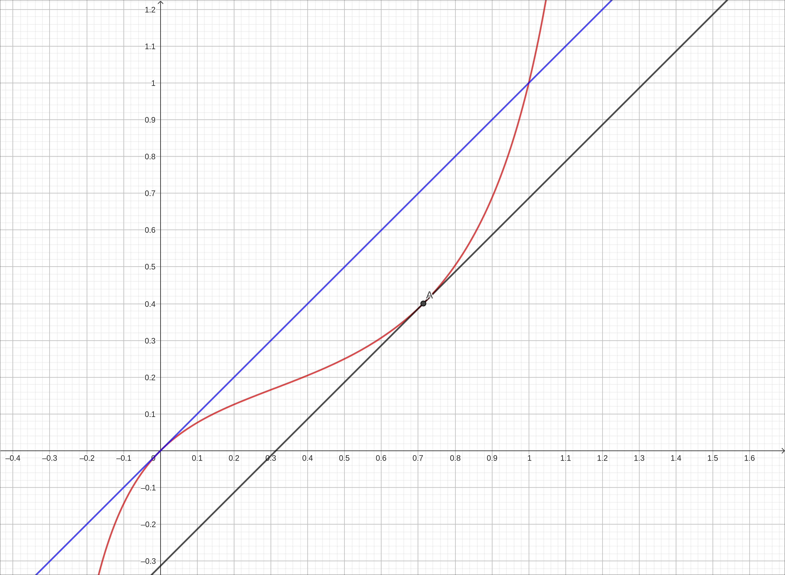

    :math:`f(x) = \frac{x}{\sin{\left(\pi x \right)} + 1}` with Mean Value Theorem Tangents

CLAE
^^^^

Input the function and zoom in until the interval from 0 to 1 and the graph are taking up most of the graphics area.

.. code-block:: console

    x/(sin(pi*x)+1)

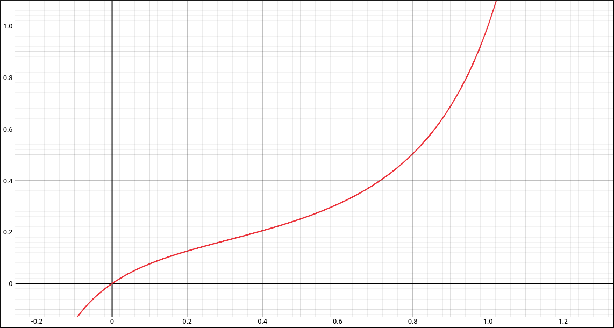

    :math:`f(x) = \frac{x}{\sin{\left(\pi x \right)} + 1}`

If we find the derivative, ``Calculus > Derivative``, variable *x*, order 1, the result is,

.. math::
    - \frac{\pi x \cos{\left(\pi x \right)}}{\left(\sin{\left(\pi x \right)} + 1\right)^{2}} + \frac{1}{\sin{\left(\pi x \right)} + 1}

Since this is a rational expression in polynomials and trigonometric functions it will be defined as long as the denominator is not 0.  Extracting the denominator with ``Algebra > Rational Expressions > Denominator`` we get,

.. math::
    \left(\sin{\left(\pi x \right)} + 1\right)^{3}

Then selecting ``Algebra > Solve``  to this we get two solutions, :math:`-1/2` and :math:`3/2`.  There are really an infinite number of solutions to this equation but as we can see, none in the interval :math:`[0, 1]`.  So the hypotheses for the Mean Value Theorem are satisfied.

Note that we could get all the solutions to this equation by selecting, ``Algebra > Advanced Solvers``, then in the dialog box select Single Equation Solve with Set Output, Real Domain,  the result is

.. math::
    \left\{\frac{2 \pi k + \frac{3 \pi}{2}}{\pi}\; \middle|\; k \in \mathbb{Z}\right\}

Selecting ``Algebra > Simplify`` on this returns,

.. math::
    \left\{2 k + \frac{3}{2}\; \middle|\; k \in \mathbb{Z}\right\}

Which is the set of all solutions, and as we noted above, none of these values are in the interval :math:`[0, 1]`.

Calculate :math:`f(0)` and :math:`f(1)`, resulting in 0 and 1 respectively.  So the line through the points :math:`(0, f(0)) = (0, 0)` and :math:`(1, f(1)) = (1, 1)` is :math:`y = x`.  Input and plot :math:`y = x`.  We will now try to solve the equation :math:`f'(x) = 1`.  Assuming that the derivative is in cell ``R2``, input ``R2 - 1`` into the CAS, resulting in

.. math::
    - \frac{\pi x \cos{\left(\pi x \right)}}{\left(\sin{\left(\pi x \right)} + 1\right)^{2}} - 1 + \frac{1}{\sin{\left(\pi x \right)} + 1}

If we now try ``Algebra > Solve`` on this expression we will get an error, meaning that the program could not solve the expression exactly, which is not a surprise, solving combinations of polynomial and trigonometric functions is difficult to do exactly.  We will get numeric solutions, select the expression, select ``Algebra > Numeric Solutions in [a, b]``.  Input 0 as the lower bound and 1 as the upper bound.  The result is,

.. math::

    \left[ 0, \  0.713804007362983\right]

The one we want is 0.713804007362983.  Now we will graph the tangent line to the curve.  We could create the equation step by step but since we already know how to do this we will do a short cut.  Assume that the list of solutions above is in R8, select the original function, select ``Calculus > Tangent Line``, in the point of tangency input ``R8[1]``, the result should be,

.. math::
    \left(x - 0.713804007362983\right) \left(- \frac{0.713804007362983 \pi \cos{\left(0.713804007362983 \pi \right)}}{\left(\sin{\left(0.713804007362983 \pi \right)} + 1\right)^{2}} + \frac{1}{\sin{\left(0.713804007362983 \pi \right)} + 1}\right) + \frac{0.713804007362983}{\sin{\left(0.713804007362983 \pi \right)} + 1}

Simplifying gives,

.. math::
    \frac{\left(0.713804007362983 - x\right) \left(0.713804007362983 \pi \cos{\left(0.713804007362983 \pi \right)} - 1 - \sin{\left(0.713804007362983 \pi \right)}\right) + 0.713804007362983 \sin{\left(0.713804007362983 \pi \right)} + 0.713804007362983}{\left(\sin{\left(0.713804007362983 \pi \right)} + 1\right)^{2}}

and approximating gives,

.. math::
    0.999999999999999 x - 0.313414527255342

A little round-off error here but good enough.

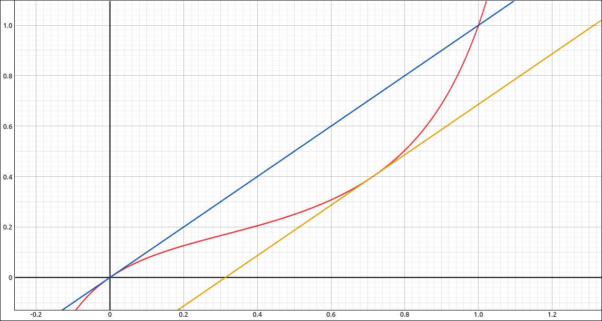

    :math:`f(x) = \frac{x}{\sin{\left(\pi x \right)} + 1}` with Mean Value Theorem Tangents

Maxima
^^^^^^

Input the function and zoom in until the interval from 0 to 1 and the graph are taking up most of the graphics area.

.. code-block:: console

    kill(all);
    f(x):=x/(sin(%pi*x)+1)

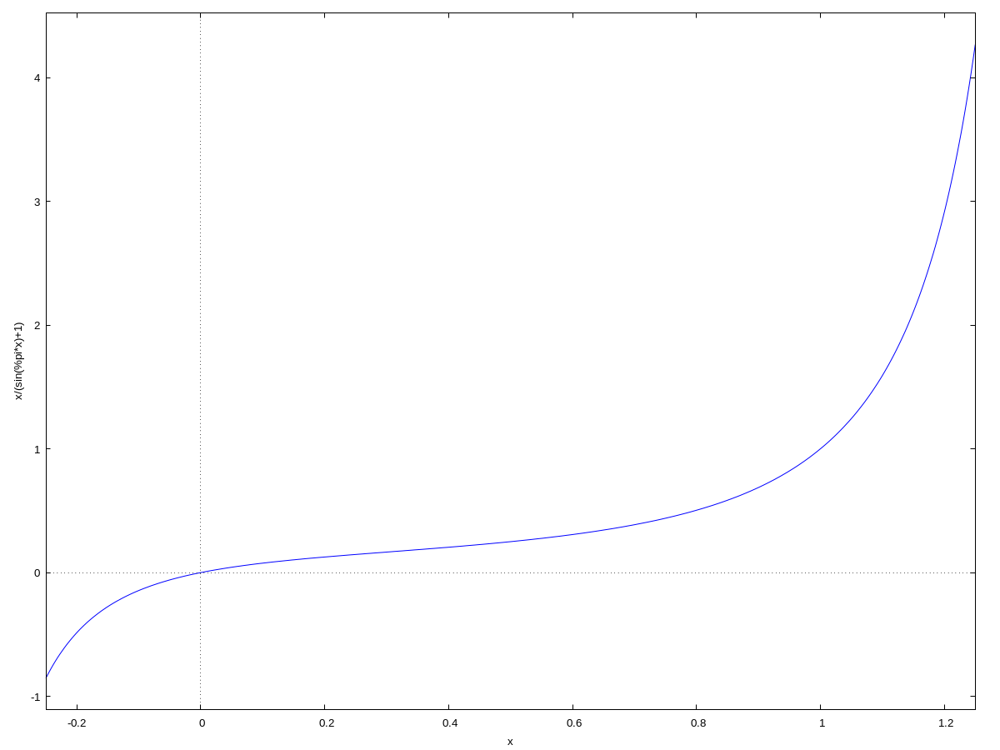

    :math:`f(x) = \frac{x}{\sin{\left(\pi x \right)} + 1}`

Find the derivative,

.. code-block:: console

    df:diff(f(x),x)

simplify it,

.. code-block:: console

    sdf:ratsimp(df)

and turn it into a function,

.. code-block:: console

    dff(x):=''sdf

the result is,

.. math::
    \frac{- \pi x \cos{\left(\pi x \right)} + \sin{\left(\pi x \right)} + 1}{\sin^{2}{\left(\pi x \right)} + 2 \sin{\left(\pi x \right)} + 1}

Since this is a rational expression in polynomials and trigonometric functions it will be defined as long as the denominator is not 0.  Extracting the denominator with

.. code-block:: console

    d:denom(sdf)

Graph the denominator on :math:`[0, 1]` with

.. code-block:: console

    wxplot2d(d,[x,0,1]);

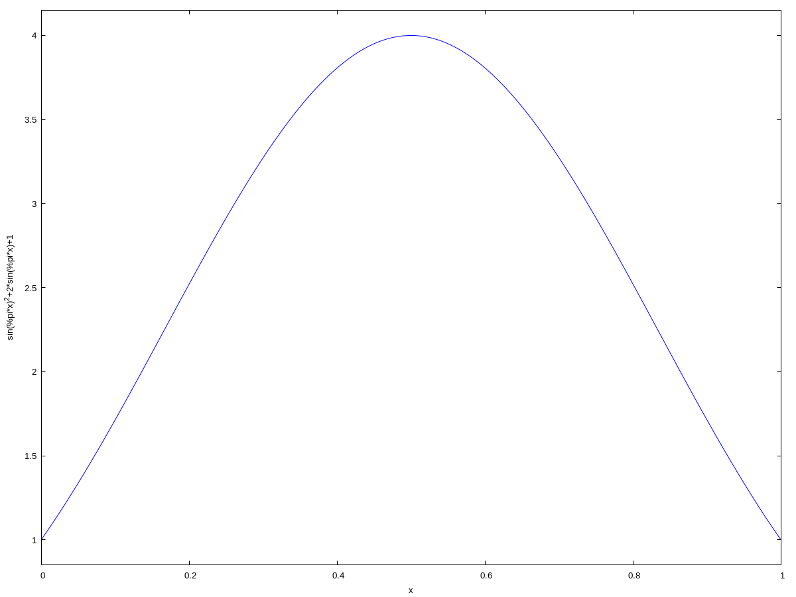

    Graph of the denominator of the derivative.

As we can see from the graph there is no place in :math:`[0, 1]` where the denominator is 0. So the hypotheses for the Mean Value Theorem are satisfied.

Calculate :math:`f(0)` and :math:`f(1)`, resulting in 0 and 1 respectively.  So the line through the points :math:`(0, f(0)) = (0, 0)` and :math:`(1, f(1)) = (1, 1)` is :math:`y = x`.  We will now try to solve the equation :math:`f'(x) = 1`.  If we use,

.. code-block:: console

    solve(dff(x)=1,x)

we get back,

.. math::
    \left[ x=-\frac{{{\sin{\left( {\pi}  x\right) }}^{2}}+\sin{\left( {\pi}  x\right) }}{{\pi}  \cos{\left( {\pi}  x\right) }}\right] \mbox{}

which is rather meaningless.  Graphing :math:`f'(x) - 1` we get,

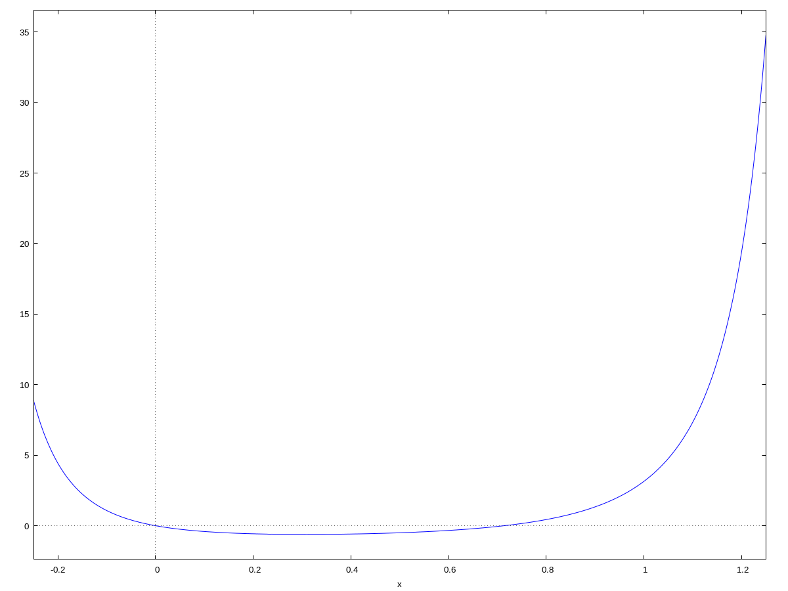

    :math:`f'(x) - 1`

So it looks like the solutions are 0 and something around 0.7.  Using the ``find_root`` function to find a root between 0.1 and 1,

.. code-block:: console

    r:find_root(df-1, x, 0.1, 1)

the result is, 0.7138040073629834.

.. code-block:: console

    tl:dff(r)*(x-r)+f(r)

.. math::
    \operatorname{(}\left( \sin{\left( 0.7138040073629834 {\pi} \right) }-0.7138040073629834 {\pi}  \cos{\left( 0.7138040073629834 {\pi} \right) }+1\right) \, \left( x-0.7138040073629834\right) \operatorname{)}/\left( {{\sin{\left( 0.7138040073629834 {\pi} \right) }}^{2}}+2 \sin{\left( 0.7138040073629834 {\pi} \right) }+1\right) +\frac{0.7138040073629834}{\sin{\left( 0.7138040073629834 {\pi} \right) }+1}\mbox{}

approximating with,

.. code-block:: console

    float(tl), numer;

.. math::
    1.0 \left( x-0.7138040073629834\right) +0.4003894801076403\mbox{}

Now if we graph all these together we see,

.. code-block:: console

    wxplot2d([f(x),x,tl],[x,-0.25,1.1])

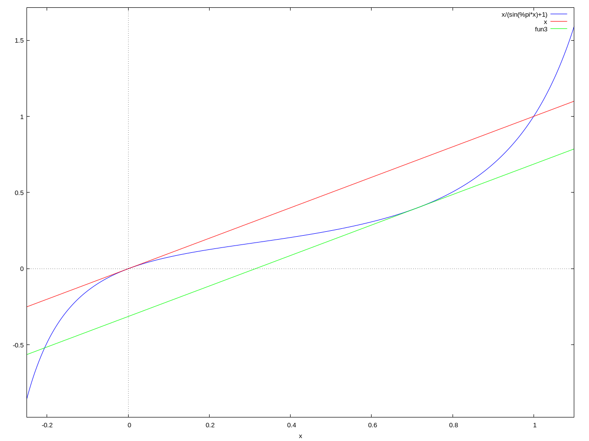

    :math:`f(x) = \frac{x}{\sin{\left(\pi x \right)} + 1}` with Mean Value Theorem Tangents

