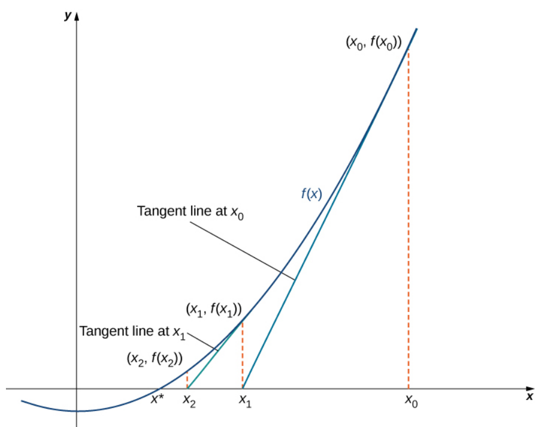
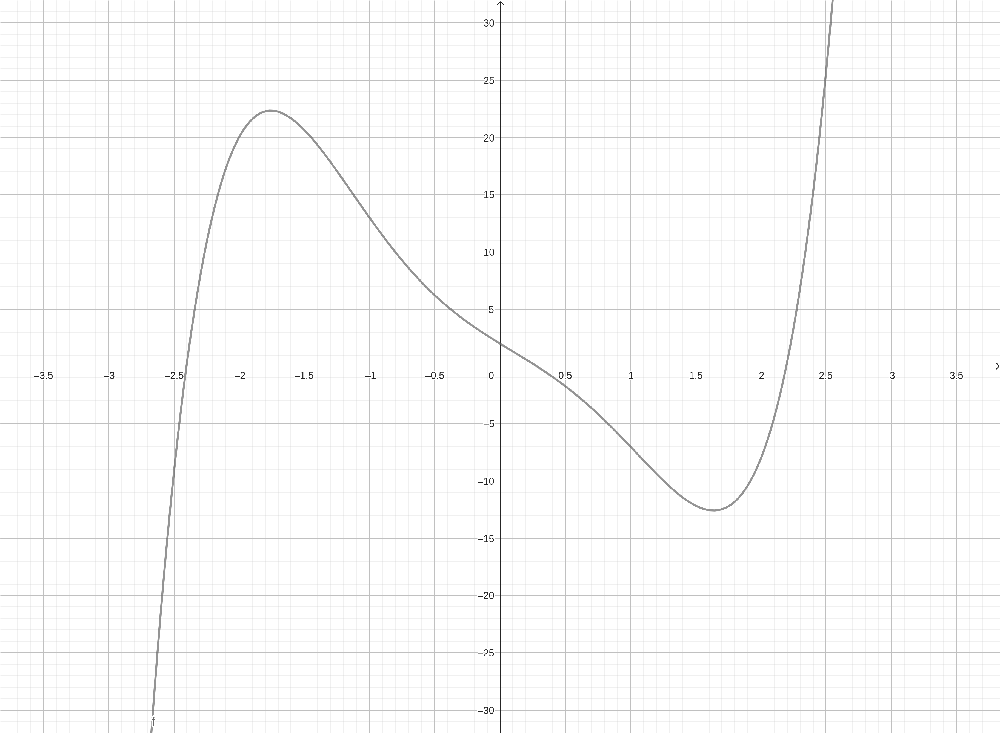
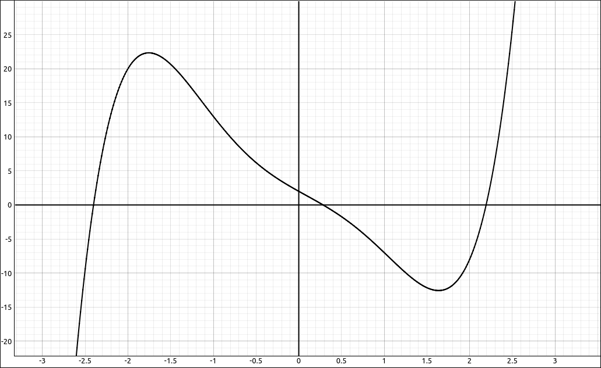
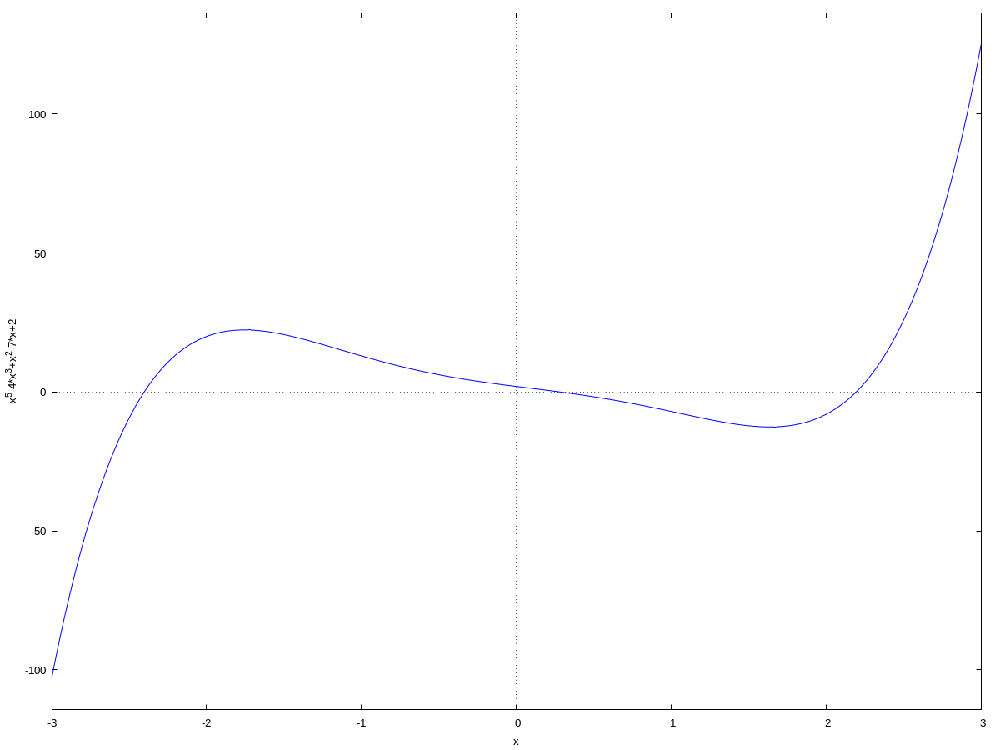
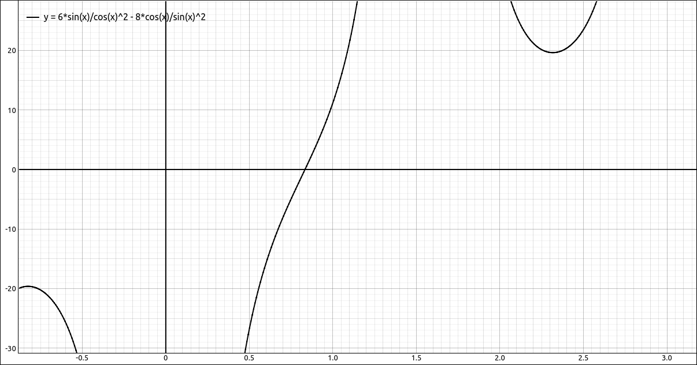
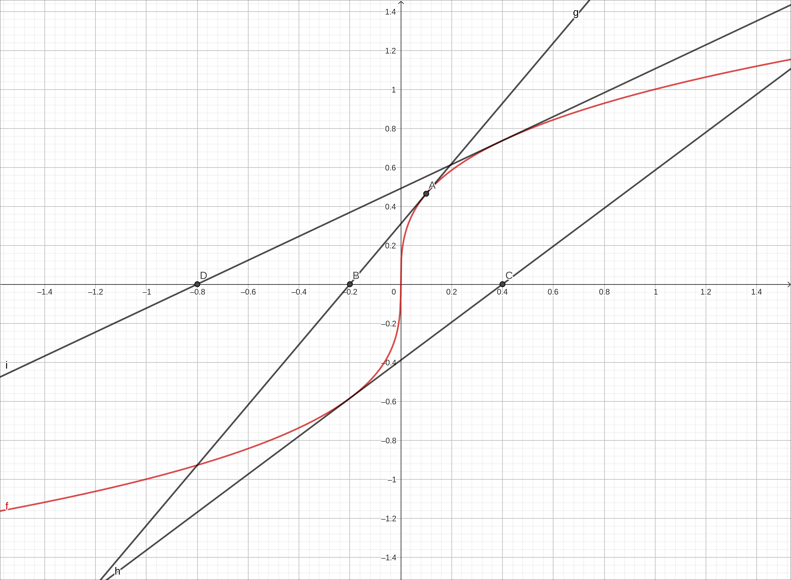
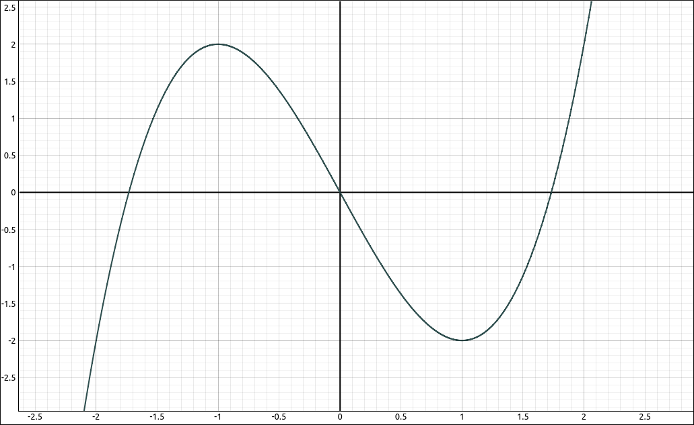
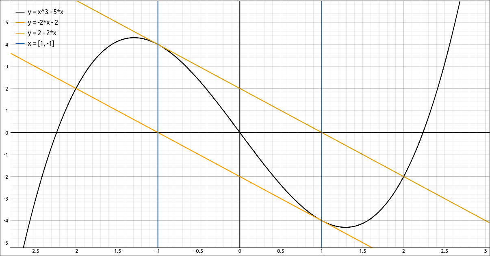

:index:`Newton’s Method`
========================

Discussion & Definitions
------------------------

Newton’s Method is a way to approximate the root of a differentiable function by using tangent lines to get better and better approximations to the root.  It is an iterative method where you do the following,

.. admonition:: Problem Solving: Newton’s Method

    1. Make an initial guess of the root, usually from the graph of the function.

    2. Find the tangent line to the curve at that initial guess.

    3. Calculate the intersection of the tangent line with the *x*-axis.

    4. This intersection is the next guess, go back to step 2 and repeat the process.  You continue until the approximations are close to the root.  One question is, how will know you are close to the root?  When this is coded into calculators and computer software the process usually continues until the successive approximations are within some set tolerance, sometimes the precision of the machine.

The following image gives a nice picture of the process.  Here :math:`x_0` is the initial guess and :math:`x^*` is the root.  From the diagram it appears that the successive approximations :math:`x_1, x_2, x_3, \ldots` are approaching the root.

    From Calculus Volume 1 by Edwin "Jed" Herman and Gilbert Strang

The derivation of the *x*-intercept is not difficult but we will not display it here, the solution is

.. math::
    x_n = x_{n-1} - \frac{f(x_{n-1})}{f'(x_{n-1})}

So our Newton's Method algorithm is,

1. Make an initial guess of the root, usually from the graph of the function, this is :math:`x_0`.

2. Calculate :math:`x_1, x_2, x_3, \ldots` using

.. math::
    x_n = x_{n-1} - \frac{f(x_{n-1})}{f'(x_{n-1})}

3. Stop when the successive approximations are within your allowable margin of error.

.. note::

    A couple things to note before we look at a few examples,

    - The function needs to be differentiable in an interval containing the root, otherwise the iterative function does not make sense.
    - It is possible that the method could converge to a different root then the one you were aiming for.
    - This method can fail to produce a root in several ways.

        - If at any point :math:`f'(x_{n-1}) = 0` we have division by 0 in the formula.
        - The iterations may not converge on the root but instead diverge away from the root.
        - The iterations may not converge on the root but instead get locked into a cycle.

    - When you take the result of a process and use it as input into the same process we call that a **Dynamical System**. Dynamical systems are at the heart of an area of mathematics called *Chaos Theory*. Although Chaos Theory is an advanced area of research-level mathematics, many of the concepts are accessible to students with a an introductory level experience in differential and integral calculus, and hence is often taught at the undergraduate level. One of  the best-known examples of chaos is the Mandelbrot Set, named after Benoit Mandelbrot (1924–2010), who investigated its properties and helped popularize the field of chaos theory.  Below are several images of the Mandelbrot Set and portions of the Mandelbrot Set.  The final image is one produced by the same Newton's Method iteration as we did in this section, the only difference is that it is being applied to the complex plane.

    .. figure:: Images/Apps/NM002.png
        :alt: The Mandelbrot Set

        The Mandelbrot Set

    .. figure:: Images/Apps/gal01_frac002.png
        :alt: A portion of the Mandelbrot Set, taken from Seahorse Valley, it is the tail of one seahorse using a curvature algorithm to establish the colors.

        A portion of the Mandelbrot Set, taken from Seahorse Valley, it is the tail of one seahorse using a curvature algorithm to establish the colors.

    .. figure:: Images/Apps/gal02_frac023.png
        :alt: A portion of the Mandelbrot Set, taken from close to :math:`c = i`, using a combination of distance algorithms to establish the colors.

        A portion of the Mandelbrot Set, taken from close to :math:`c = i`, using a combination of distance algorithms to establish the colors.

    .. figure:: Images/Apps/gal02_frac032.png
        :alt: A portion of the Mandelbrot Set, taken from close to the real axis, using a combination of distance algorithms to establish the colors.

        A portion of the Mandelbrot Set, taken from close to the real axis, using a combination of distance algorithms to establish the colors.

    .. figure:: Images/Apps/gal05_frac004.png
        :alt: A portion of a Newton's Method fractal on the complex plane.

        A portion of a Newton's Method fractal on the complex plane.

Although our computer algebra systems have other ways of finding roots to functions we will go through the proces of using Newton's Method using them.

Example: :math:`f(x) = x^{5} - 4 x^{3} + x^{2} - 7 x + 2`
---------------------------------------------------------

In this example we will find at least one of the real roots to the function, :math:`f(x) = x^{5} - 4 x^{3} + x^{2} - 7 x + 2`.

GeoGebra
^^^^^^^^

Input the function,

.. code-block:: console

    x^5-4 x^3+x^2-7 x+2

    :math:`f(x) = x^{5} - 4 x^{3} + x^{2} - 7 x + 2`

Assuming that this came in as ``f`` we can now create the Newton's Method iteration formula for this function by,

.. code-block:: console

    x - f(x)/f'(x)

This should come in as ``g``, we will assume so.  There is a root close to 2 so we will use Newton's Method to approximate this root.  Input,

.. code-block:: console

    g(2)

The result is :math:`\frac{66}{29}` and came in as ``a``, now input

.. code-block:: console

    g(a)

The result is 2.20176 and came in as ``b``, now input, ``g(b)``, ``g(c)``, and so on and the numbers should be getting closer to 2.19312.

CLAE
^^^^

Input the function,

.. code-block:: console

    x^5-4*x^3+x^2-7*x+2

    :math:`f(x) = x^{5} - 4 x^{3} + x^{2} - 7 x + 2`

Assuming that this came in as ``R1``.  Find its derivative, ``Calculus > Derivative``, variable *x* and order 1.  The result should be :math:`5 x^{4} - 12 x^{2} + 2 x - 7`, and we will assume this came in as ``R2``.  Now we can create the Newton's Method iteration formula for this function by,

.. code-block:: console

    x - R1/R2

The result should be the following and be in cell R3,

.. math::
    x - \frac{x^{5} - 4 x^{3} + x^{2} - 7 x + 2}{5 x^{4} - 12 x^{2} + 2 x - 7}

To make things easier we will define this as a function, input

.. code-block:: console

    NM(x):=R3

There is a root close to 0.5, we will use Newton's Method to approximate it, input,

.. code-block:: console

    NM(0.5)

This should result in 0.302158273381295 and come in as ``R5``, now input,

.. code-block:: console

    NM(R5)

This should result in 0.284487882348133 and come in as ``R6``, now input, ``NM(R6)``, ``NM(R7)``, ``NM(R8)``, ... until the approximations are close to each other, the sequence should converge very quickly to 0.284390640337966.

Maxima
^^^^^^

Input the function,

.. code-block:: console

    kill(all);
    f(x):=x^5-4*x^3+x^2-7*x+2

    :math:`f(x) = x^{5} - 4 x^{3} + x^{2} - 7 x + 2`

Take the derivative,

.. code-block:: console

    df:diff(f(x),x)

Create the Newton's Method function for this function,

.. code-block:: console

    nm:x-f(x)/df

Turn it into a function and not an expression, it will be easier to work with that way,

.. code-block:: console

    nmf(x):=''nm

There is a root around :math:`-2.5`, we will use Newton's Method to approximate it. Input,

.. code-block:: console

    a:nmf(-2.5)

The result is, :math:`-2.413156376226197`. Now input,

.. code-block:: console

    b:nmf(a)

The result is, :math:`-2.40283183944818`. Now input, ``c:nmf(b)``, ``d:nmf(c)``, ... until the values are close to each other, the final result should be :math:`-2.402694796475954`.

Note that we can shortcut this process since Maxima allows you to redefine variable names.  Input the following,

.. code-block:: console

    a:-2.5

This will set *a* to :math:`-2.5`.  Now input,

.. code-block:: console

    a:nmf(a)

This will do the Newton's Method function on *a* and reassign the result to *a*.  At this point there is no more typing, rerun the last input by selecting it and hitting Shift+Enter, then do it again and again until the results do not change, you should end up with :math:`-2.402694796475954` without doing all those inputs.

Example: Minimizing :math:`f(x) = \frac{6}{\cos{\left(x \right)}} + \frac{8}{\sin{\left(x \right)}}`
----------------------------------------------------------------------------------------------------

In the Optimization section we had an example where we needed to minimize the function :math:`f(x) = \frac{6}{\cos{\left(x \right)}} + \frac{8}{\sin{\left(x \right)}}` on the interval :math:`\left(0, \frac{\pi}{2}\right)`.  This required solving the equation,

.. math::

    \frac{6 \sin{\left(x \right)}}{\cos^{2}{\left(x \right)}} - \frac{8 \cos{\left(x \right)}}{\sin^{2}{\left(x \right)}} = 0

Although we could solve this equation by hand, we could have approximated it with Newton's Method.  Go through the same steps as the above example to find an approximation to the root in the interval :math:`\left(0, \frac{\pi}{2}\right)`.

    :math:`f'(x) = \frac{6 \sin{\left(x \right)}}{\cos^{2}{\left(x \right)}} - \frac{8 \cos{\left(x \right)}}{\sin^{2}{\left(x \right)}}`

The derivative is

.. math::
    \frac{12 \sin^{2}{\left(x \right)}}{\cos^{3}{\left(x \right)}} + \frac{6}{\cos{\left(x \right)}} + \frac{8}{\sin{\left(x \right)}} + \frac{16 \cos^{2}{\left(x \right)}}{\sin^{3}{\left(x \right)}}

and the Newton's Method formula is

.. math::
    x - \frac{\frac{6 \sin{\left(x \right)}}{\cos^{2}{\left(x \right)}} - \frac{8 \cos{\left(x \right)}}{\sin^{2}{\left(x \right)}}}{\frac{12 \sin^{2}{\left(x \right)}}{\cos^{3}{\left(x \right)}} + \frac{6}{\cos{\left(x \right)}} + \frac{8}{\sin{\left(x \right)}} + \frac{16 \cos^{2}{\left(x \right)}}{\sin^{3}{\left(x \right)}}}

which simplifies to,

.. math::
    \frac{x \left(6 \sin^{5}{\left(x \right)} + 3 \sin^{3}{\left(x \right)} \cos^{2}{\left(x \right)} + 4 \sin^{2}{\left(x \right)} \cos^{3}{\left(x \right)} + 8 \cos^{5}{\left(x \right)}\right) - 3 \sin^{4}{\left(x \right)} \cos{\left(x \right)} + 4 \sin{\left(x \right)} \cos^{4}{\left(x \right)}}{6 \sin^{5}{\left(x \right)} + 3 \sin^{3}{\left(x \right)} \cos^{2}{\left(x \right)} + 4 \sin^{2}{\left(x \right)} \cos^{3}{\left(x \right)} + 8 \cos^{5}{\left(x \right)}}

Starting at :math:`x_0 = 1` it should only take 5 or 6 steps to get 0.833271859855495.

Example: :math:`f(x) = x^{1/3}`
-------------------------------

Using the methods above try to use Newton's Method to approximate the only root, 0, to the function.  Try an initial guess of 0.1.  You should see the approximations alternating between positive and negative and getting larger.  In other words diverging.  Note that if you simplify the Newton's Method formula for this function you get :math:`-2x`.  A graphical representation of what is happening is below.

    :math:`f(x) = x^{1/3}`

Example: :math:`f(x) = x^{3} - 3 x`
-----------------------------------

Using the methods above try to use Newton's Method to approximate a root to the function by an initial guess of 1.  This should result in an error on the first step since we chose a local minimum the derivative is 0 here and we get division by 0 in the Newton's Method formula.

    :math:`f(x) = x^{3} - 3 x`

Example: :math:`f(x) = x^{3} - 5 x`
-----------------------------------

Using the methods above try to use Newton's Method to approximate a root to the function by an initial guess of 1.  What should happen here is that the Newton's Method approximations will alternate between 1 and :math:`-1` forever without converging to a root.

    :math:`f(x) = x^{3} - 5 x`
