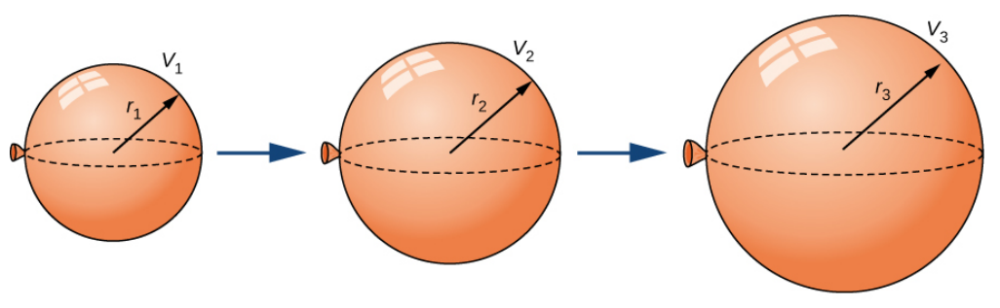

:index:`Related Rates`
======================

Discussion & Definitions
------------------------

If two related quantities are changing over time, the rates at which the quantities change are related. For example, if a balloon is being filled with air, both the radius of the balloon and the volume of the balloon are increasing.  So if we know how fast the air is being pumped into the balloon can we determine how fast the radius of the balloon is increasing?

    From Calculus Volume 1 by Edwin "Jed" Herman and Gilbert Strang

As an example, say we have a spherical balloon (above) and it is being filled with air at the constant rate of :math:`2 \; {\rm cm}^3/{\rm sec}.` How fast is the radius increasing when the radius of the balloon is 3 cm?

What we know is the rate the volume of the balloon is increasing, :math:`\frac{dV}{dt} = 2`.  We want to find the rate at which the radius is increasing, :math:`\frac{dr}{dt} = ?`.  In fact we want to find this rate at a specific point, when :math:`r = 3`.  So our variables that are of concern are the radius *r* and thw volume *V*.  If we can find an equation that relates these two variables then we are in business.  The volume equation of a sphere does just that,  :math:`V = \frac{4}{3} \pi r^3`.  Both *V* and *R* are assumed to be functions of time so we could go one step further and denote them as such, :math:`V(t) = \frac{4}{3} \pi (r(t))^3`.

Now we differentiate both sides of this equation with respect to time.  Be careful here, *r* is a function of time so when we differentiate :math:`(r(t))^3` we need to use the chain rule. The result is,

.. math::
    V'(t) = 4 \pi (r(t))^2 r'(t)

At this point we could finish the exercise by putting in what we know and solve for what we want.  We know that,

.. math::
    V'(t) = \frac{dV}{dt} = 2

and the point of interest is when :math:`r = 3`, that is, :math:`r(t) = 3`, note we do not need to find the actual time this happens.  Substituting these into our equation gives,

.. math::
    2 = 4 \cdot 3^2 \cdot \pi r'(t) = 36  \pi r'(t)

So

.. math::
    \frac{dr}{dt} = r'(t) = \frac{1}{18\pi}

We could have also taken our derivative and solved for :math:`r'(t)`

.. math::
    V'(t) & = 4 \pi (r(t))^2 r'(t) \\
    4 \pi (r(t))^2 r'(t) & = V'(t) \\
    r'(t) & = \frac{V'(t)}{4 \pi (r(t))^2}

Then when :math:`r(t) = 3`,

.. math::
    r'(t) = \frac{V'(t)}{4 \pi (r(t))^2} =  \frac{2}{4 \pi (3)^2} = \frac{1}{18\pi}

.. admonition:: Problem Solving: Related Rates

    #. Draw a picture and name all the variables and constants. Use *t* for time and assume that all variables are differentiable functions of *t*.
    #. Write down the numerical information (in terms of the variables and constants you have chosen).
    #. Write down what you are asked to find (usually a rate, expressed as a derivative).
    #. Write an equation that relates the variables. You may have to combine two or more equations to get a single equation that relates the variable whose rate you want to the variables whose rates you know.
    #. Differentiate the equation respect to *t*. Then solve the differentiated equation for the rate you want in terms of the rates and variables whose values you know.
    #. Evaluate. Use known values to find the unknown rate.

When it comes to using technology for related rates it can sometimes be more cumbersome to use the technology then it is to simply do it by hand.  It is possible but when it comes to substituting values in for the derivatives the syntax can be rather lengthy.  On the other hand, it can help with finding derivatives if the relation equation is lengthy.  While the one for the volume of a sphere is easy, we will go through the procedure.

Example: Inflating the Balloon
------------------------------

All we will do here is find the derivative of the right hand side of :math:`V(t) = \frac{4}{3} \pi (r(t))^3`.

CLAE
^^^^

Input the volume expression, use ``r(t)`` for ``r``.  This will tell CLAE that *r* is a function of *t*.

.. code-block:: console

    4/3*pi*r(t)^3

Select ``Calculus > Derivative``, variable *r*, order 1.  The result is,

.. math::
    4 \pi r^{2}{\left(t \right)} \frac{d}{d t} r{\left(t \right)}

Maxima
^^^^^^

Input the volume expression, use ``r(t)`` for ``r``.  This will tell Maxima that *r* is a function of *t*.

.. code-block:: console

    kill(all);
    V(t):=4/3*%pi*r(t)^3

Take the derivative,

.. code-block:: console

    diff(V(t),t)

The result is,

.. math::
    4 \pi r^{2}{\left(t \right)} \frac{d}{d t} r{\left(t \right)}

