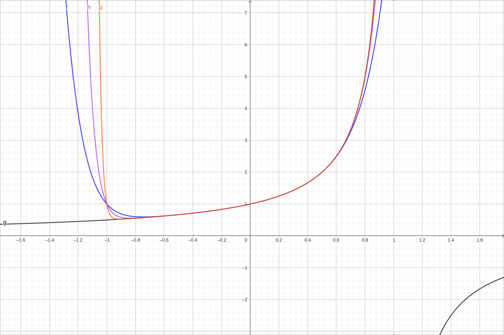
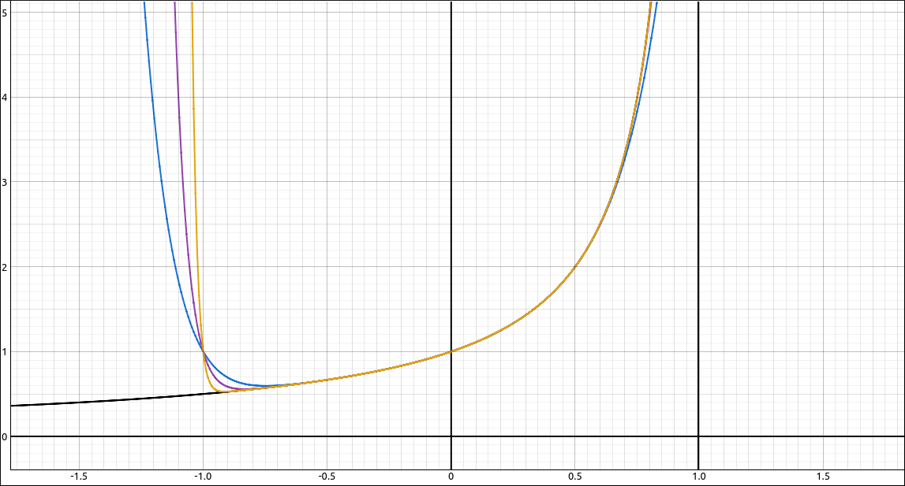
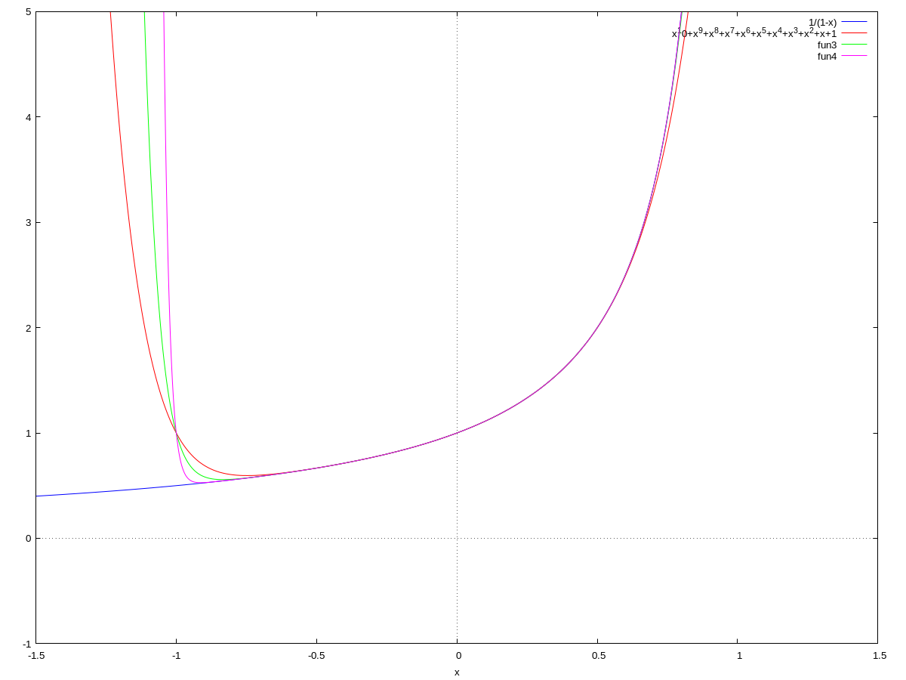

:index:`Functions as Power Series`
==================================

Discussion & Definitions
------------------------

We can think of a power series as an infinite degree polynomial, of course, we are not sure what that means.  We can consider it as a function,

.. math::
    f(x) = \sum_{n = 0}^\infty c_n (x - a)^n = c_0 + c_1 (x - a) + c_2 (x - a)^2 + c_3 (x - a)^3 + \cdots

The domain of the function :math:`f(x)` would be all values that can be substituted into *x* and we obtain a real number.  That is, the domain of :math:`f(x)` is the interval of convergence of the power series.  To evaluate the function we simply substitute the value for *x* and evaluate the series.  So,

.. math::
    f(b) = \sum_{n = 0}^\infty c_n (b - a)^n = c_0 + c_1 (b - a) + c_2 (b - a)^2 + c_3 (b - a)^3 + \cdots

One question is that since these power series look like (very) long polynomials, how much can we treat them as polynomials? The short answer is just about everything.  We can differentiate and integrate them term bu term, we can add them, multiply them, and even divide them.  All we need to do is be careful about the interval of convergence of the resulting series.

.. admonition:: Theorem: Term-by-Term Differentiation and Integration for Power Series

    Let :math:`f(x)` be defined as a power series,

    .. math::
        f(x) = \sum_{n = 0}^\infty c_n (x - a)^n = c_0 + c_1 (x - a) + c_2 (x - a)^2 + c_3 (x - a)^3 + \cdots

    with radius of convergence :math:`R > 0`.  Then :math:`f(x)` is differentiable (and thus continuous) on the interval :math:`(a - R, a + R)` and we can differentiate and integrate the power series term-by-term, specifically,

    .. math::
        f'(x) = \sum_{n = 1}^\infty n c_n (x - a)^{n-1} = c_1 + 2 c_2 (x - a) + 3 c_3 (x - a)^2 + \cdots

    .. math::
        \int f(x) \; dx = C + \sum_{n = 0}^\infty \frac{c_n (x - a)^{n+1}}{n+1} = C + c_0(x-a) + c_1 \frac{(x - a)^2}{2} + c_2 \frac{(x - a)^3}{3} + c_3 \frac{(x - a)^4}{4} + \cdots

    The radii of convergence of the derivative and integral power series are both :math:`R`.

.. admonition:: Theorem: Combining Power Series

    Let

    .. math::
        f(x) = \sum_{n = 0}^\infty c_n x^n \qquad {\rm and } \qquad g(x) = \sum_{n = 0}^\infty d_n x^n

    and let *I* be the common interval of convergence between the two series.

    1. :math:`\displaystyle f(x) \pm g(x) = \sum_{n = 0}^\infty (c_n \pm d_n) x^n` on *I*.
    2. For any integer :math:`m \geq 0` and any real number :math:`b`,  :math:`\displaystyle bx^m f(x) = \sum_{n = 0}^\infty bx^m c_n x^n = \sum_{n = 0}^\infty b c_n x^{n+m}` with the same interval of convergence as *f*.
    3. For any integer :math:`m \geq 0` and any real number :math:`b`,  :math:`\displaystyle f(bx^m) = \sum_{n = 0}^\infty c_n \left(bx^m\right)^n`, in this case the radius of convergence will change depending on :math:`bx^m.` Specifically, the convergence is for all *x* such that :math:`bx^m` is in the interval of convergence of *f*.

    4. :math:`\displaystyle f(x) g(x) = \left( \sum_{n = 0}^\infty c_n x^n \right) \left( \sum_{n = 0}^\infty d_n x^n \right) = \left( \sum_{n = 0}^\infty e_n x^n \right)` where :math:`\displaystyle e_n = \sum_{k = 0}^n c_n d_{n-k}` on *I*.

    Similar results hold for power series centered at :math:`x = a.`

.. note::

    We can also divide two power series using a variant of the long division process.  Usually we only want the first few terms of the series since this can be a lengthy process.  For this ew require that the constant term in the denominator is not 0 and state, without proof, that the quotient converges for sufficiently small radius.

Another similarity between power series and polynomials is in the uniqueness of the coefficients.  For polynomials, we know that two polynomials are equal if their degrees are the same and their corresponding coefficients are equal.  The same is true for power series.

.. admonition:: Theorem: Uniqueness of Power Series

    If

    .. math::
        \sum_{n = 0}^\infty c_n (x - a)^n = \sum_{n = 0}^\infty d_n (x - a)^n

    for all values of *x* in an open interval containing :math:`a` then :math:`c_n = d_n` for all :math:`n \geq 0`.

One of our goals in ths section and the section on Taylor Series is to represent functions we know, like :math:`\sin(x), \cos(x), e^x, \ldots` as power series.  There are many uses for using a power series representation of a function, for example,  approximating values, solving differential equations, and evaluating non-elementary integrals.

In most textbooks in this type of section will go back to the geometric series.  Recall that if :math:`|r| < 1`, we have,

.. math::
    a + ar + ar^2 + ar^3 + \cdots = \sum_{n = 1}^\infty ar^{n-1} = \frac{a }{1 - r}

If we substitute, 1 for *a* and *x* for *r* we get,

.. math::
    \frac{1}{1 - x} = \sum_{n = 1}^\infty x^{n-1} = \sum_{n = 0}^\infty x^n = 1 + x + x^2 + x^3 + \cdots

So on the interval :math:`(-1, 1)` we have a power series representation of the function :math:`\displaystyle \frac{1}{1 - x}`. Of course, the domain of the function is much larger than the interval of convergence of the series but the two only coincide when :math:`x \in (-1, 1).`

From here we can use the results above to derive power series for other functions.  For example, we can take,

.. math::
    \frac{1}{1 - x} = \sum_{n = 0}^\infty x^n = 1 + x + x^2 + x^3 + x^4 + \cdots

and differentiate both sides to get,

.. math::
    \frac{1}{\left(1 - x\right)^{2}} = \sum_{n = 1}^\infty n x^n = 1 + 2x + 3x^2 + 4x^3 + \cdots

We can also take the original equation and substitute :math:`-x` for :math:`x` to get,

.. math::
    \frac{1}{1 + x} = \sum_{n = 0}^\infty (-1)^n x^n = 1 - x + x^2 - x^3 + x^4 + \cdots

We can then take this equation and integrate both sides to get,

.. math::
    \ln(1+x) + C = \sum_{n = 0}^\infty (-1)^n \frac{x^{n+1}}{n+1} = x - \frac{x^2}{2} + \frac{x^3}{3} - \frac{x^4}{4} + \frac{x^5}{5} + \cdots

Then in this expression we can substitute :math:`x = 0` to get

.. math::
    \ln(1) + C = \sum_{n = 0}^\infty (-1)^n \frac{0^{n+1}}{n+1} = 0

Since :math:`\ln(1) = 0` we get :math:`C = 0` giving us,

.. math::
    \ln(1+x) = \sum_{n = 0}^\infty (-1)^n \frac{x^{n+1}}{n+1} = \sum_{n = 1}^\infty (-1)^{n+1} \frac{x^n}{n}

For another, take the original equation and substitute :math:`-x^2` for :math:`x` to get,

.. math::
    \frac{1}{1 + x^2} = \sum_{n = 0}^\infty (-1)^n x^{2n} = 1 - x^2 + x^4 - x^6 + x^8 + \cdots

Integrate both sides,

.. math::
    \tan^{-1}(x) + C = \sum_{n = 0}^\infty (-1)^n \frac{x^{2n+1}}{2n+1}

Again we will substitute :math:`x = 0` to get

.. math::
    \tan^{-1}(0) + C = \sum_{n = 0}^\infty (-1)^n \frac{0^{2n+1}}{2n+1} = 0

Since :math:`\tan^{-1}(0) = 0` we get :math:`C = 0` giving us,

.. math::
    \tan^{-1}(x) = \sum_{n = 0}^\infty (-1)^n \frac{x^{2n+1}}{2n+1}

There are many others you can derive from this same process. 

Example: Visualizing :math:`\frac{1}{1 - x} = \sum_{n = 0}^\infty x^n` on :math:`(-1, 1)`
-----------------------------------------------------------------------------------------

In this example we will graph the function :math:`\frac{1}{1 - x}` along with partial sums of :math:`\displaystyle \sum_{n = 0}^\infty x^n` to see the convergence of the series to the curve on the interval :math:`(-1, 1).`

GeoGebra
^^^^^^^^

Input the function itself,

.. code-block:: console

    1/(1-x)

Now we will graph some partial sums.  Input the following three expressions in three new cells,

.. code-block:: console

    Sum(x^n,n,0,10)

.. code-block:: console

    Sum(x^n,n,0,20)

.. code-block:: console

    Sum(x^n,n,0,50)

We get the following graph,

    Convergence of :math:`\sum_{n = 0}^\infty x^n`

The blue curve is the degree 10 approximation, the purple curve is the degree 20 curve, and the orange curve is the degree 50 curve.  As you can see the curves are approaching the curve of the function, the dark grey curve on the interval :math:`(-1, 1).`

CLAE
^^^^

Input the function,

.. code-block:: console

    1/(1 - x)

To do the partial sums first input the general nth term

.. code-block:: console

    x^n

Now select the nth term expression, then select ``Calculus > Sums > Sum``, variable *n*, beginning index 0, ending index 10.  This will produce the degree 10 approximation.  Do the same for the degree 20 and 50 by replacing the 10 with 20 and 50 respectively.  Graph the function along with the three approximations to get the following plot.

    Convergence of :math:`\sum_{n = 0}^\infty x^n`

The blue curve is the degree 10 approximation, the purple curve is the degree 20 curve, and the orange curve is the degree 50 curve.  As you can see the curves are approaching the curve of the function, the black curve on the interval :math:`(-1, 1).`

Maxima
^^^^^^

In Maxima, we can create the approximating polynomials with the sum command,

.. code-block:: console

    c1:sum(x^n,n,0,10);

.. code-block:: console

    c2:sum(x^n,n,0,20);

.. code-block:: console

    c3:sum(x^n,n,0,50);

Then graph the three curves and the function with,

.. code-block:: console

    wxplot2d([1/(1-x), c1, c2, c3], [x,-1.5, 1.5], [y, -1, 5]);

The result is the following graph,

    Convergence of :math:`\sum_{n = 0}^\infty x^n`

The orange curve is the degree 10 approximation, the green curve is the degree 20 curve, and the purple curve is the degree 50 curve.  As you can see the curves are approaching the curve of the function, the blue curve on the interval :math:`(-1, 1).`

Example: Power Series in CLAE
-----------------------------

The underlying computer algebra system in CLAE, SymPy, has some facilities for determining functions from power series expansions.  For example, input the general nth term,

.. code-block:: console

    x^n

Now select, ``Calculus > Sums > Sum``, input *n* for the variable, beginning index of 0, and an ending index of ``oo`` (our symbol for :math:`\infty`).

The result is,

.. math::
    \begin{cases} \frac{1}{1 - x} & \text{for}\: \left|{x}\right| < 1 \\\sum_{n=0}^{\infty} x^{n} & \text{otherwise} \end{cases}

which shows that on :math:`(-1, 1)` the series converges to :math:`\frac{1}{1 - x}` and outside that it cannot determine the sum (since it diverges).

If we do the same with ``x^n/n!`` we get the result :math:`e^x`.  Also, if we do the same with ``(-1)^n*n*x^(n - 1)`` the result is

.. math::
    \begin{cases} - \frac{1}{\left(x + 1\right)^{2}} & \text{for}\: \left|{x}\right| < 1 \\\sum_{n=0}^{\infty} \left(-1\right)^{n} n x^{n - 1} & \text{otherwise} \end{cases}

SymPy cannot recognize all series expansions but is still very powerful in this respect.  Pedagogically, this may be giving the user a little too much, use this functionality as works best for you.
