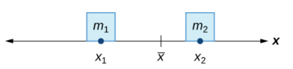
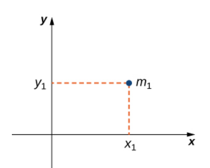
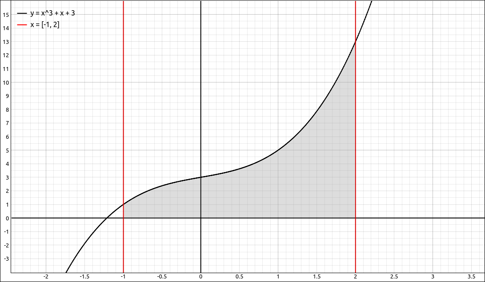
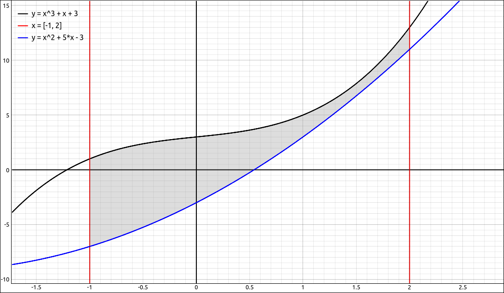
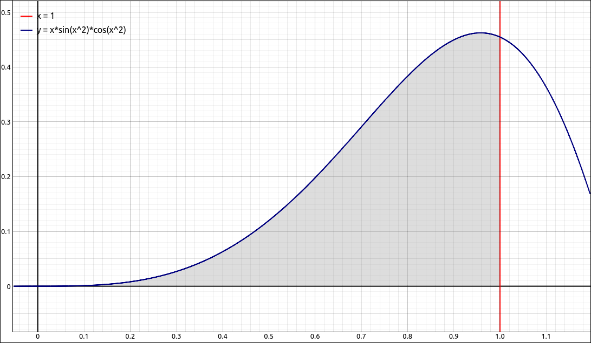
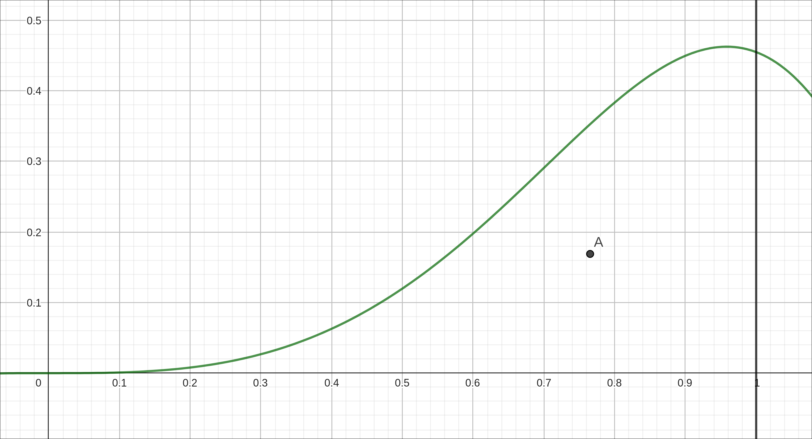
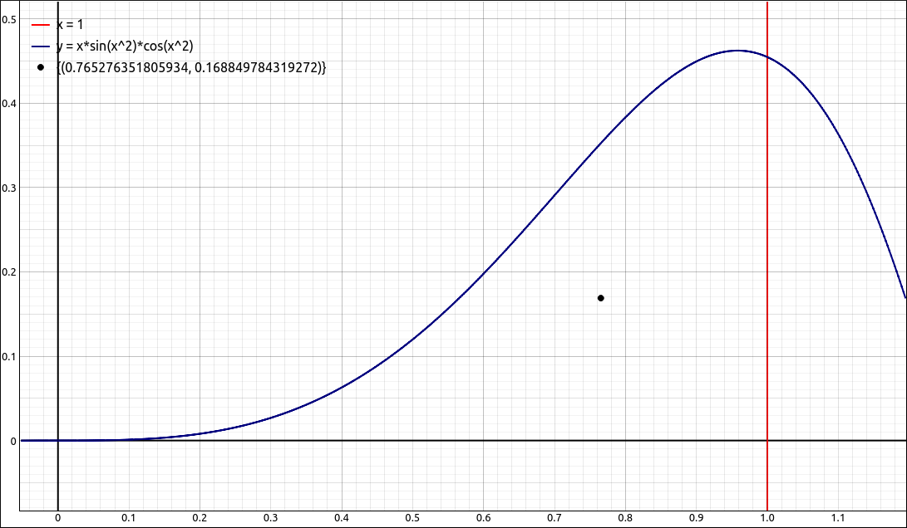

:index:`Moments and Centers of Mass`
====================================

Discussion & Definitions
------------------------

Given two masses :math:`m_1` and :math:`m_2` at positions :math:`x_1` and :math:`x_2` respectively, we would like to find the point :math:`\bar{x}` where the system would balance.

    Center of Mass Visualization

Solving this is relatively straightforward, we simply need to solve the equation, :math:`m_1|x_1 - \bar{x}| = m_2|x_2 - \bar{x}|.`  A little algebra gives us,

.. math::
    \bar{x} = \frac{m_1x_1 + m_2x_2}{m_1+m_2}

The numerator :math:`m_1x_1 + m_2x_2` is called the **moment** of the system, the denominator :math:`m_1+m_2` is the total mass of the system, and :math:`\bar{x}` is the balance point or the **center of mass** of the system.

This concept can easily be extended to *n* point masses at *n* locations on the *x*-axis.

.. admonition:: Theorem: Center of Mass of Objects on a Line

    Let :math:`m_1`, :math:`m_2`, ..., :math:`m_n` be point masses placed on a number line at points :math:`x_1`, :math:`x_2`, ..., :math:`x_n`  respectively, and let  :math:`m = \sum_{i = 1}^n m_i` denote the total mass of the system.  Then, the moment of the system with respect to the origin is given by

    .. math::
        M = \sum_{i = 1}^n m_ix_i

    and the center of mass of the system is given by

    .. math::
        \bar{x} = \frac{M}{m} = \frac{\sum_{i = 1}^n m_ix_i}{\sum_{i = 1}^n m_i}

We can move this up to two dimensions fairly easily. Say we have a point mass at the point :math:`(x_1, y_1)`.

    2-D Center of Mass Visualization

Then the moment :math:`M_x` of the mass with respect to the *x*-axis is given by :math:`M_x = m_1y_1` and the moment :math:`M_y` with respect to the *y*-axis is given by :math:`M_y = m_1x_1`.  Note the slightly confusing notation on this.  The *x*-coordinate of the point is used to calculate the moment with respect to the *y*-axis, and vice versa. The reason is that the *x*-coordinate gives the distance from the point mass to the *y*-axis, and the *y*-coordinate gives the distance to the *x*-axis.

.. admonition:: Theorem: Center of Mass of Objects in a Plane

    Let :math:`m_1`, :math:`m_2`, ..., :math:`m_n` be point masses in the *xy*-plane at points :math:`(x_1, y_1)`, :math:`(x_2, y_2)`, ..., :math:`(x_n, y_n)`  respectively, and let  :math:`m = \sum_{i = 1}^n m_i` denote the total mass of the system.  Then the moments :math:`M_x` and :math:`M_y` of the system with respect to the *x*-axis and *y*-axis, respectively, are given by

    .. math::
        M_x = \sum_{i = 1}^n m_iy_i \qquad {\rm and} \qquad M_y = \sum_{i = 1}^n m_ix_i

    and the center of mass of the system, :math:`(\bar{x}, \bar{y})` is given by

    .. math::
        \bar{x} = \frac{M_y}{m} = \frac{\sum_{i = 1}^n m_ix_i}{\sum_{i = 1}^n m_i} \qquad {\rm and} \qquad \bar{y} = \frac{M_x}{m} = \frac{\sum_{i = 1}^n m_iy_i}{\sum_{i = 1}^n m_i}

Our next step in this development is to extend this to an infinite number of point masses.  Really a thin plate of material with a constant density, like a metal or plastic sheet with some shape.  We consider the sheet to be infinitely thin as to be two-dimensional, these are called **laminas**.  We will look at two types of laminas in this section, more complex regions require a different approach.  These will be regions that are bounded by a curve, the *x*-axis and two vertical lines at :math:`x = a` and :math:`x = b.`

    Lamina of Type I

or regions that are bounded by two curves, and two vertical lines at :math:`x = a` and :math:`x = b.`

    Lamina of Type II

The geometric center of a region is called its the **centroid**. Since we have assumed the density of the lamina is constant, the center of mass of the lamina depends only on the shape of the corresponding region in the plane; it does not depend on the density. In this case, the center of mass of the lamina corresponds is exactly the centroid.

We will leave the derivation of the moments and centers of mass to your textbook and just give the final resulting formulas.  For the first type of region we have,

.. admonition:: Theorem: Center of Mass of a Lamina in the *xy*-Plane

    Let :math:`R` denote a region bounded above by the graph of a continuous function :math:`f(x)`, below by the *x*-axis, and on the left and right by the lines :math:`x = a` and :math:`x = b`, respectively. Let :math:`\rho` denote the density of the associated lamina. Then,

    i. The mass of the lamina is

    .. math::
        m = \rho \int_a^b f(x) \; dx

    ii. The moments :math:`M_x` and :math:`M_y` of the lamina with respect to the *x*-axis and *y*-axis, respectively, are

    .. math::
        M_x = \frac{\rho}{2} \int_a^b (f(x))^2 \; dx \qquad {\rm and} \qquad M_y = \rho \int_a^b x f(x) \; dx

    iii. The coordinates of the center of mass :math:`(\bar{x}, \bar{y})` are

    .. math::
        \bar{x} = \frac{M_y}{m} = \frac{\rho \int_a^b x f(x) \; dx}{\rho \int_a^b f(x) \; dx}  = \frac{\int_a^b x f(x) \; dx}{\int_a^b f(x) \; dx}

    and

    .. math::
        \bar{y} = \frac{M_x}{m} = \frac{\frac{\rho}{2} \int_a^b (f(x))^2 \; dx}{\rho \int_a^b f(x) \; dx} = \frac{\frac{1}{2} \int_a^b (f(x))^2 \; dx}{\int_a^b f(x) \; dx}

    Note that the density :math:`\rho` cancels in both expressions, so our center of mass depends only on the geometry of the region.

For the second type of region the formulas change in a very predictable manner.

.. admonition:: Theorem: Center of Mass of a Lamina Bounded by Two Functions

    Let :math:`R` denote a region bounded above by the graph of a continuous function :math:`f(x)`, below by the graph of a continuous function :math:`g(x)`, and on the left and right by the lines :math:`x = a` and :math:`x = b`, respectively. Let :math:`\rho` denote the density of the associated lamina. Then,

    i. The mass of the lamina is

    .. math::
        m = \rho \int_a^b f(x) - g(x) \; dx

    ii. The moments :math:`M_x` and :math:`M_y` of the lamina with respect to the *x*-axis and *y*-axis, respectively, are

    .. math::
        M_x = \frac{\rho}{2} \int_a^b (f(x))^2 - (g(x))^2 \; dx \qquad {\rm and} \qquad M_y = \rho \int_a^b x (f(x) - g(x)) \; dx

    iii. The coordinates of the center of mass :math:`(\bar{x}, \bar{y})` are

    .. math::
        \bar{x} = \frac{M_y}{m} = \frac{\rho \int_a^b x (f(x) - g(x)) \; dx}{\rho \int_a^b f(x) - g(x) \; dx}  = \frac{\int_a^b x (f(x) - g(x)) \; dx}{\int_a^b f(x) - g(x) \; dx}

    and

    .. math::
        \bar{y} = \frac{M_x}{m} = \frac{\frac{\rho}{2} \int_a^b (f(x))^2 - (g(x))^2 \; dx}{\rho \int_a^b f(x) - g(x) \; dx} = \frac{\frac{1}{2} \int_a^b (f(x))^2 - (g(x))^2 \; dx}{\int_a^b f(x) - g(x) \; dx}

    Note that the density :math:`\rho` again cancels in both expressions, so our center of mass depends only on the geometry of the region.

Example: :math:`f(x) = x \sin{\left(x^{2} \right)} \cos{\left(x^{2} \right)}` on :math:`[0, 1]`
-----------------------------------------------------------------------------------------------

Find the center of mass of the region bounded by :math:`f(x) = x \sin{\left(x^{2} \right)} \cos{\left(x^{2} \right)}` and the *x*-axis on the interval :math:`[0, 1]`.

    :math:`f(x) = x \sin{\left(x^{2} \right)} \cos{\left(x^{2} \right)}` on :math:`[0, 1]`

GeoGebra
^^^^^^^^

Input the function,

.. code-block:: console

    x sin(x^2) cos(x^2)

Find the denominator for the center coordinates, that is, the mass without the density.

.. code-block:: console

    Integral(f,0,1)

The result is 0.17702.  Now find :math:`M_y`.

.. code-block:: console

    Integral(x f(x),0,1)

The result is 0.13547.  Now find :math:`M_x`.

.. code-block:: console

    Integral(f(x)^2/2,0,1)

The result is 0.02989.  Finally take the ratios for the center of mass, :math:`(0.76528, 0.16885).`  Graphing the region and the center of mass point,

    :math:`f(x) = x \sin{\left(x^{2} \right)} \cos{\left(x^{2} \right)}` on :math:`[0, 1]` with Center of Mass

CLAE
^^^^

Input the function,

.. code-block:: console

    f(x):=x*sin(x^2)*cos(x^2)

Find the denominator for the center coordinates, that is, the mass without the density,  ``Calculus > Definite Integral``, bounds 0 and 1.  The result is,

.. math::
    \frac{1}{4} - \frac{\cos^{2}{\left(1 \right)}}{4}

which approximates to 0.177018354568393.  Now find :math:`M_y`.  Input ``x * f(x)`` into the CAS and then do  ``Calculus > Definite Integral``, bounds 0 and 1, on the result.  The result is,

.. math::
    \frac{5 \cos{\left(2 \right)} \Gamma\left(- \frac{5}{4}\right)}{32 \Gamma\left(- \frac{1}{4}\right)} - \frac{5 \sqrt{\pi} C\left(\frac{2}{\sqrt{\pi}}\right) \Gamma\left(- \frac{5}{4}\right)}{64 \Gamma\left(- \frac{1}{4}\right)}

which approximates to 0.135467960586789.  Now find :math:`M_x`. Input ``1/2 * f(x)^2`` into the CAS and then do  ``Calculus > Definite Integral``, bounds 0 and 1, on the result.  The result is,

.. math::
    \frac{\int\limits_{0}^{1} x^{2} \sin^{2}{\left(x^{2} \right)} \cos^{2}{\left(x^{2} \right)}\, dx}{2}

which approximates to 0.0298895109894256.  Finally take the ratios for the center of mass, :math:`\left[ 0.765276351805934, \  0.168849784319272\right].`  Graphing the region and the center of mass point,

    :math:`f(x) = x \sin{\left(x^{2} \right)} \cos{\left(x^{2} \right)}` on :math:`[0, 1]` with Center of Mass

Maxima
^^^^^^

Input the function,

.. code-block:: console

    kill(all);
    f(x):=x*sin(x^2)*cos(x^2)

Find the denominator for the center coordinates, that is, the mass without the density,

.. code-block:: console

    den:integrate(f(x),x,0,1)

The result is,

.. math::
    \frac{1}{4}-\frac{{{\cos{(1)}}^{2}}}{4}\mbox{}

Now find :math:`M_y`.

.. code-block:: console

    My:integrate(x*f(x),x,0,1)

The result is,

.. math::
    -\operatorname{(}\sqrt{{\pi} } \left( \left( \% i-1\right)  \operatorname{erf}\left( \% i+1\right) +\left( \% i+1\right)  \operatorname{erf}\left( \% i-1\right) +\left( -\% i-1\right)  \operatorname{erf}\left( \sqrt{2} \sqrt{-\% i}\right) +\left( \% i-1\right)  \operatorname{erf}\left( {{\left( -1\right) }^{\frac{1}{4}}} \sqrt{2}\right) \right) +16 \cos{(2)}\operatorname{)}/128\mbox{}

Now find :math:`M_x`.

.. code-block:: console

    Mx:integrate((1/2)*f(x)^2,x,0,1)

The result is,

.. math::
   1.953125 {{10}^{-4}} \operatorname{(}\sqrt{{\pi} } \operatorname{(}\left( 3 \sqrt{2} \% i+3 \sqrt{2}\right)  \operatorname{erf}\left( \sqrt{2} \% i+\sqrt{2}\right) +\left( 3 \sqrt{2} \% i-3 \sqrt{2}\right)  \operatorname{erf}\left( \sqrt{2} \% i-\sqrt{2}\right) +\left( 3 \sqrt{2}-3 \sqrt{2} \% i\right)  \operatorname{erf}\left( 2 \sqrt{-\% i}\right) + \left( 3 \sqrt{2} \% i+3 \sqrt{2}\right)  \operatorname{erf}\left( 2 {{\left( -1\right) }^{\frac{1}{4}}}\right) \operatorname{)}-96 \sin{(4)}+256\operatorname{)}\mbox{}

.. code-block:: console

    xbar:My/den;
    ybar:Mx/den;

These are exact solutions but are a bit on the messy side, we can do the process using romberg in place of integrate to keep everything numerical.  That is,

.. code-block:: console

    den:romberg(f(x),x,0,1);
    My:romberg(x*f(x),x,0,1);
    Mx:romberg((1/2)*f(x)^2,x,0,1);
    xbar:My/den;
    ybar:Mx/den;

And our center of mass is, :math:`\left[ 0.7652763510601504, \  0.1688497747453694\right].`
