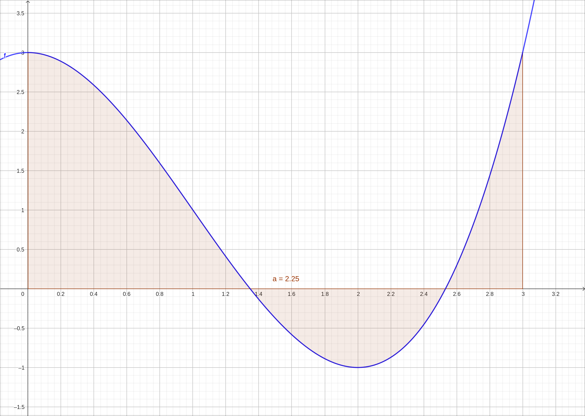

:index:`The Definite Integral`
==============================

Discussion & Definitions
------------------------

At the end of the previous section we defined the area under the curve as the limit of a Riemann sum.

.. admonition:: Definition: Area Under a Curve

    Let :math:`f(x)` be a continuous, nonnegative function on an interval :math:`[a, b]`, and let :math:`\sum_{i = 1}^n f(x^*_{i}) \Delta x` be a Riemann sum for :math:`f(x).` Then, the area under the curve :math:`y = f(x)` on :math:`[a, b]` is given by

    .. math::
        A = \lim_{n \to \infty} \sum_{i = 1}^n f(x^*_{i}) \Delta x

We are going to extend this a little by removing the restriction of the function being nonnegative and no longer calling it an area but the **definite integral**.

.. admonition:: Definition: The Definite Integral

    If :math:`f(x)` is a function defined on an interval :math:`[a, b]`, the definite integral of :math:`f` from :math:`a` to :math:`b` is given by

    .. math::
        \int_a^b f(x) \; dx = \lim_{n \to \infty} \sum_{i = 1}^n f(x^*_{i}) \Delta x

    provided the limit exists. If this limit exists, the function :math:`f(x)` is said to be integrable on :math:`[a, b],` or is an integrable function.

The numbers :math:`a` and :math:`b` are *x*-values and are called the **limits of integration**, a is the **lower limit** and :math:`b` is the **upper limit**.  We call the function :math:`f(x)` the **integrand**, and the *dx* indicates that :math:`f(x)` is a function with respect to :math:`x`, and is called the variable of integration.

.. admonition:: Theorem: Continuous Functions Are Integrable

    If :math:`f(x)` is continuous on :math:`[a, b]`, then :math:`f` is integrable on :math:`[a, b].`

Note that functions that are not continuous on may still be integrable, depending on the nature of the discontinuities. For example, functions with a finite number of jump discontinuities on a closed interval are integrable.

Now let's get back to our area interpretation.  Since we removed the restriction that the function is nonnegative the limit of the Riemann sum (and hence the integral) is not the area under the curve, it is the net signed area of the function, which means that it is the area above the *x*-axis minus the area below the *x*-axis.

    Net Area Visualization

So if :math:`f(x)` is an integrable function defined on an interval :math:`[a, b,` and if  :math:`A_1` represent the area between :math:`f(x)` and the *x*-axis that lies above the axis and if  :math:`A_2` represent the area between :math:`f(x)` and the *x*-axis that lies below the axis. Then, the net signed area between :math:`f(x)` and the *x*-axis is given by,

.. math::
    \int_a^b f(x) \; dx = A_1 - A_2

Also, the total area between :math:`f(x)` and the *x*-axis is given by,

.. math::
    \int_a^b \left| f(x) \right| \; dx = A_1 + A_2

As we saw in the previous section the calculation of the definite integral by definition (the Riemann sum on the right hand side) is difficult in general and we will have better calculation procedures in the next section.  But even without the direct calculation we can list several properties of the definite integral just by thinking of it as a net area.

Properties of the Definite Integral
^^^^^^^^^^^^^^^^^^^^^^^^^^^^^^^^^^^

In the following properties we assume that the functions are differentiable over all implied intervals.

.. math::

    \int_a^a f(x) \; dx & = 0 \\
    \int_a^b f(x) \; dx & = -\int_b^a f(x) \; dx \\
    \int_a^b f(x) + g(x) \; dx & = \int_a^b f(x) \; dx + \int_a^b g(x) \; dx \\
    \int_a^b f(x) - g(x) \; dx & = \int_a^b f(x) \; dx - \int_a^b g(x) \; dx \\
    \int_a^b c f(x) \; dx & = c \int_a^b f(x) \; dx \\
    \int_a^b f(x) \; dx & = \int_a^c f(x) \; dx + \int_c^b f(x) \; dx \\

There are also several comparison theorems, again simply by considering areas,

If :math:`f(x) \geq 0` on the interval :math:`[a, b]` then

.. math::
    \int_a^b f(x) \; dx \geq 0

If :math:`f(x) \geq g(x)` on the interval :math:`[a, b]` then

.. math::
    \int_a^b f(x) \; dx \geq \int_a^b g(x) \; dx

If :math:`m` and :math:`M` are constants such that :math:`m \leq f(x) \leq M` on the interval :math:`[a, b]` then

.. math::
    m (b-a) \leq \int_a^b f(x) \; dx \leq M (b-a)

Example: :math:`f(x) = x^3 - 3x^2+3` on :math:`[0,3]`
-----------------------------------------------------

In this example we will compute the exact value of

.. math::
    \int_0^3 x^3 - 3x^2+3 \; dx

using the definition of the integral.

CLAE
^^^^

We will use the right endpoint formula for the Riemann sum, any can be used so we simply chose one.  Our function is :math:`f(x) = x^3 - 3x^2+3`, the interval :math:`[a, b] = [0, 3]`, :math:`\Delta x = \frac{b-a}{n} = \frac{3}{n}`, and :math:`x_i = a + i \Delta x = \frac{3i}{n}.`  So our area is

.. math::
    A = \lim_{n \to \infty} \sum_{i = 1}^n f(x^*_{i}) \Delta x = \lim_{n \to \infty} \sum_{i = 1}^n \left( \left( \frac{3i}{n} \right)^3 - 3\left( \frac{3i}{n} \right)^2+3 \right) \frac{1}{n}

Input the function,

.. code-block:: console

    x^3 - 3*x^2 + 3

Now evaluate this at :math:`\frac{3i}{n}` with ``Algebra > Evaluate``, variable is *x*, expression is ``3*i/n``.  The result will be

.. math::
    \frac{27 i^{3}}{n^{3}} - \frac{27 i^{2}}{n^{2}} + 3

If we assume that this is in ``R2`` we can input ``R2*3/n`` into the CAS and get the expression for :math:`f(x^*_{i}) \Delta x`, which is

.. math::
    \frac{\frac{81 i^{3}}{n^{3}} - \frac{81 i^{2}}{n^{2}} + 9}{n}

which simplifies to

.. math::
    \frac{81 i^{3} - 81 i^{2} n + 9 n^{3}}{n^{4}}

Now we take the sum, ``Calculus > Sum > Sum``, variable *i*, beginning index 1, ending index ``n``.  The result is,

.. math::
    9 - \frac{27 n^{3} + \frac{81 n^{2}}{2} + \frac{27 n}{2}}{n^{3}} + \frac{\frac{81 n^{4}}{4} + \frac{81 n^{3}}{2} + \frac{81 n^{2}}{4}}{n^{4}}

which simplifies to

.. math::
    \frac{9}{4} + \frac{27}{4 n^{2}}

Now take the limit of this expression as :math:`n \to \infty` with ``Calculus > Limit``, variable *n*, limit point ``oo``, and the result is, :math:`\frac{9}{4} = 2.25.`  So

.. math::
    \int_0^3 x^3 - 3x^2+3 \; dx = \frac{9}{4}

