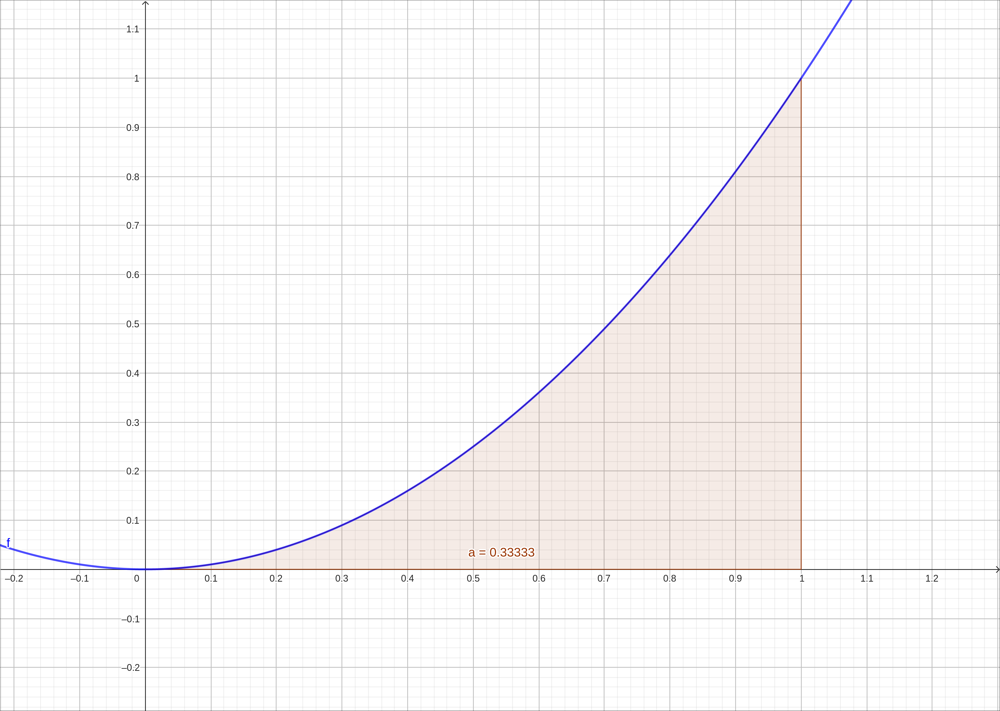
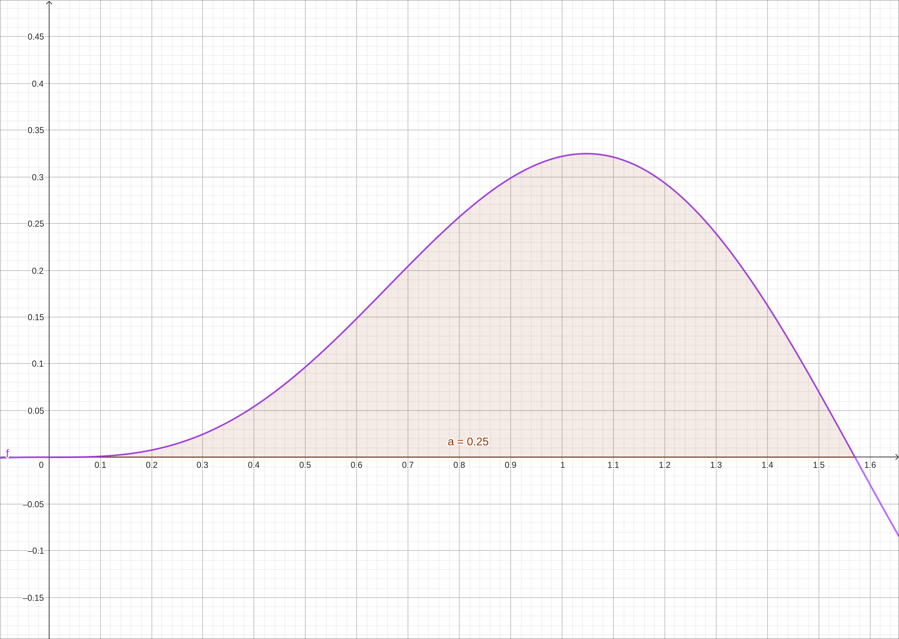

:index:`The Fundamental Theorem of Calculus`
============================================

Discussion & Definitions
------------------------

The Fundamental Theorem of Calculus, as its name implies, is one of the most important theorems in Calculus and frankly one of the most important theorems in the past millennia.  We will not prove the theorem here, most textbooks prove the theorem or outline a proof of the theorem.  The theorem comes in two parts.  The first part is a formulation of what we have observed in the previous section, that integration and differentiation are inverse operations of each other.

.. admonition:: Theorem: The Fundamental Theorem of Calculus, Part 1

    If :math:`f(x)` is continuous over an interval :math:`[a, b]`, and the function :math:`F(x)` is defined by

    .. math::
        F(x) = \int_a^x f(t) \; dt

    then :math:`F'(x) = f(x)` over :math:`[a, b].`

The second part is also known as the **integral evaluation theorem**.  Thus far in our discussion the only way that we can calculate a definite integral is as a limit of a Riemann sum, which we know is difficult to do even with simple integrands.  This theorem gives us an alternative approach to calculating definite integrals that is far easier and more powerful to implement.  The second part is an easy consequence of the first.

.. admonition:: Theorem: The Fundamental Theorem of Calculus, Part 2

    If :math:`f` is continuous over the interval :math:`[a, b]`, and :math:`F(x)` is any antiderivative of :math:`f(x)`, then

    .. math::
        \int_a^b f(x) \; dx = F(b) − F(a).

Example: :math:`\int_0^1 x^2 \; dx`
-----------------------------------

We will start upt with a fairly simple example, :math:`\int_0^1 x^2 \; dx.`  By The Fundamental Theorem of Calculus, Part 2, it is :math:`F(1) − F(0)`, where :math:`F(x)` is any antiderivative of :math:`x^2.`  Using the formulas from the antiderivative section we know that an antiderivative of :math:`x^2` is :math:`\frac{x^{3}}{3}.` So

.. math::
    \int_0^1 x^2 \; dx = F(1) − F(0) = \frac{1^{3}}{3} - \frac{0^{3}}{3} = \frac{1}{3}

Since finding the definite integral is a much used process, as with finding the indefinite integral, most CAS include a function to do it all for you.  Im most cases the CAS does not show you the antiderivative it uses but does the entire calculation. We will show both methods.

GeoGebra
^^^^^^^^

Input the function,

.. code-block:: console

    x^2

In a new cell start typing then select ``Integral``, input ``f, 0, 1``.  This will return 0.33333 and also give a nice image of the area being calculated.

    :math:`f(x) = x^2`

To go through the calculation by Part 2 we can first find the antiderivative and then do the substitutions.  Select a new cell and input ``Integral(f)``.  GeoGebra should return :math:`g(x) = \frac{x^{3}}{3}.`  Now in a new cell input ``g(1) - g(0)``.  This should return the exact solution of :math:`\frac{1}{3}.`

CLAE
^^^^

Input the function,

.. code-block:: console

    x^2

Select the function and then select ``Calculus > Definite Integral``, variable *x*, lower bound 0, and upper bound 1. The result will be :math:`\frac{1}{3}.`

Using the Part 2 approach, select the function, then select ``Calculus > Indefinite Integral``, variable *x*.  The result will be :math:`\frac{x^{3}}{3}`.  For convenience we will define this as a function, assuming that the indefinite integral is in cell ``R3``, input ``F(x):=R3`` into the CAS.  Then input ``F(1) - F(0)`` into the cas for the final result of :math:`\frac{1}{3}`.

Maxima
^^^^^^

Input the function,

.. code-block:: console

    kill(all);
    f(x):=x^2

Then to do the definite integral run,

.. code-block:: console

    integrate(f(x),x,0,1)

In general, this command is ``integrate(fct,var,lb,ub)`` with fct being the function, var is the variable of integration, lb is the lower bound, and ub is the upper bound.

Using the Part 2 method, find the indefinite integral with,

.. code-block:: console

    idef:integrate(f(x),x)

Turn it into a function with,

.. code-block:: console

    F(x):=''idef

Then complete the calculation with,

.. code-block:: console

    F(1)-F(0)

Example: :math:`\int_0^{\pi/2} \sin^{3}{\left(x \right)} \cos{\left(x \right)} \; dx`
-------------------------------------------------------------------------------------

Although we have not discussed the technique for the antiderivative of this integrand we can simply let the machine do it.

GeoGebra
^^^^^^^^

Input the function,

.. code-block:: console

    sin(x)^3 cos(x)

Then input ``Integral(f, 0, pi/2)``, the result will be 0.25 with the following image,

    :math:`f(x) = \sin(x)^3 \cos(x)`

To go through the calculation by Part 2 we can first find the antiderivative and then do the substitutions.  Select a new cell and input ``Integral(f)``.  GeoGebra should return :math:`g(x) = \frac{\sin^{4}{\left(x \right)}}{4}.`  Now in a new cell input ``g(pi/2) - g(0)``.  This should return the exact solution of :math:`\frac{1}{4}.`

CLAE
^^^^

Input the function,

.. code-block:: console

    sin(x)^3*cos(x)

Select the function and then select ``Calculus > Definite Integral``, variable *x*, lower bound 0, and upper bound pi/2. The result will be :math:`\frac{1}{4}.`

Using the Part 2 approach, select the function, then select ``Calculus > Indefinite Integral``, variable *x*.  The result will be :math:`\frac{\sin^{4}{\left(x \right)}}{4}`.  For convenience we will define this as a function, assuming that the indefinite integral is in cell ``R3``, input ``F(x):=R3`` into the CAS.  Then input ``F(pi/2) - F(0)`` into the cas for the final result of :math:`\frac{1}{4}`.

Maxima
^^^^^^

Input the function,

.. code-block:: console

    kill(all);
    f(x):=sin(x)^3*cos(x)

Then to do the definite integral run,

.. code-block:: console

    integrate(f(x),x,0,%pi/2)

Using the Part 2 method, find the indefinite integral with,

.. code-block:: console

    idef:integrate(f(x),x)

Turn it into a function with,

.. code-block:: console

    F(x):=''idef

Then complete the calculation with,

.. code-block:: console

    F(%pi/2)-F(0)

Example: Extending The Fundamental Theorem of Calculus, Part 1
---------------------------------------------------------------

The Fundamental Theorem of Calculus, Part 1 can be rewritten as,

.. math::
    \frac{d}{dx} \left( \int_a^x f(t) \; dt \right) = f(x)

What if the upper bound is not just *x*? What if the lower bound is *x* and the upper bound is a constant?  What if both the lower and upper bounds are functions of *x*?  We can answer all of these questions by applying the chain rule to the derivative in the equation above but we will let the power of the CAS develop the formulas for us.

CLAE
^^^^

Input a general function,

.. code-block:: console

    f(t)

CLAE will treat this as a general function of *t*.  First we will start off with The Fundamental Theorem of Calculus, Part 1 as is,

Select ``Calculus > Definite Integral``, variable is *t*, lower bound is 0, upper bound is *x*.  CLAE will return,

.. math::
    \int\limits_{0}^{x} f{\left(t \right)}\, dt

Now select ``Calculus > Derivative``, variable is *x*, it will return :math:`f(x)` which we expected from Part 1.

Now let's explore different bounds.  Select the ``f(t)``, then select ``Calculus > Definite Integral``, variable is *t*, lower bound is 0, upper bound is *g(x)*.  CLAE will return,

.. math::
    \int\limits_{0}^{g{\left(x \right)}} f{\left(t \right)}\, dt

Now select ``Calculus > Derivative``, variable is *x*, it will return,

.. math::
    f{\left(g{\left(x \right)} \right)} \frac{d}{d x} g{\left(x \right)}

So the general formula is,

.. math::
    \frac{d}{dx} \left( \int_a^{g(x)} f(t) \; dt \right) = f{\left(g{\left(x \right)} \right)} \frac{d}{d x} g{\left(x \right)}

Can you see where the chain rule was used here?  Now repeat the process using ``g(x)`` as the lower bound and 0 as the upper bound, the final result should show,

.. math::
    \frac{d}{dx} \left( \int_{g(x)}^a f(t) \; dt \right) = - f{\left(g{\left(x \right)} \right)} \frac{d}{d x} g{\left(x \right)}

Can you see what property was used here?  Finally do the same with a lower bound of ``g(x)`` and an upper bound of ``h(x)``.

.. math::
    \frac{d}{dx} \left( \int_{g(x)}^{h(x)} f(t) \; dt \right) = f{\left(h{\left(x \right)} \right)} \frac{d}{d x} h{\left(x \right)}- f{\left(g{\left(x \right)} \right)} \frac{d}{d x} g{\left(x \right)}

Can you follow the steps through to what was done at each step?

Maxima
^^^^^^

In Maxima we can do all the steps at once.  For example,

.. code-block:: console

    diff(integrate(f(t),t,0,x), x)

will return :math:`f(x)` and is Part 1.  Now run the following,

.. code-block:: console

    diff(integrate(f(t),t,0,g(x)), x)

.. code-block:: console

    diff(integrate(f(t),t,g(x),0), x)

.. code-block:: console

    diff(integrate(f(t),t,g(x),h(x)), x)

The first shows,

.. math::
    \frac{d}{dx} \left( \int_a^{g(x)} f(t) \; dt \right) = f{\left(g{\left(x \right)} \right)} \frac{d}{d x} g{\left(x \right)}

Can you see where the chain rule was used here?  The second one shows,

.. math::
    \frac{d}{dx} \left( \int_{g(x)}^a f(t) \; dt \right) = - f{\left(g{\left(x \right)} \right)} \frac{d}{d x} g{\left(x \right)}

Can you see what property was used here?  Finally, the last shows,

.. math::
    \frac{d}{dx} \left( \int_{g(x)}^{h(x)} f(t) \; dt \right) = f{\left(h{\left(x \right)} \right)} \frac{d}{d x} h{\left(x \right)}- f{\left(g{\left(x \right)} \right)} \frac{d}{d x} g{\left(x \right)}

Can you follow the steps through to what was done at each step?
