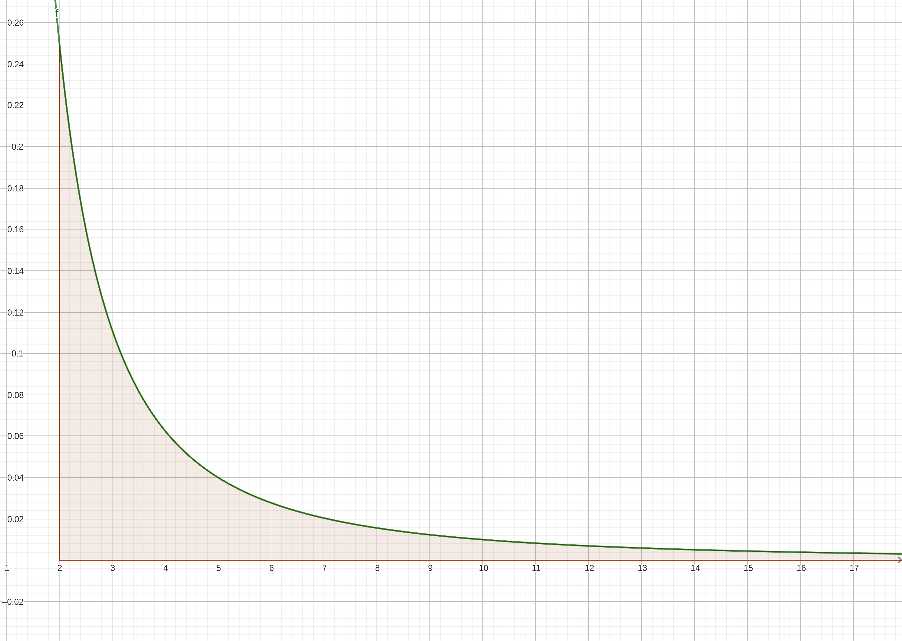
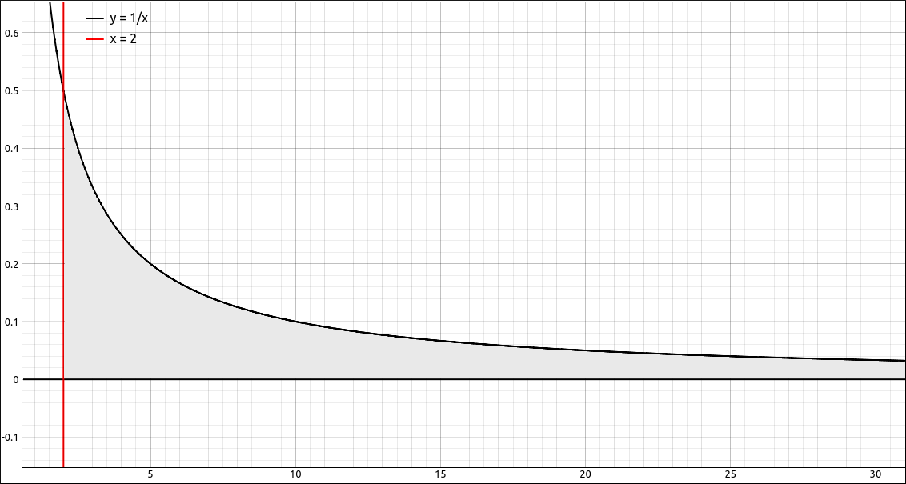
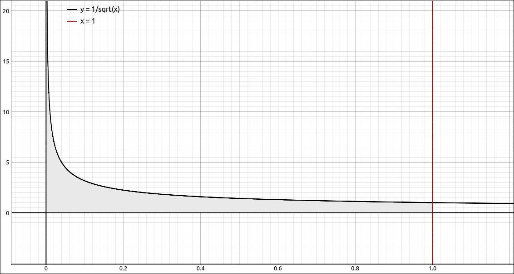
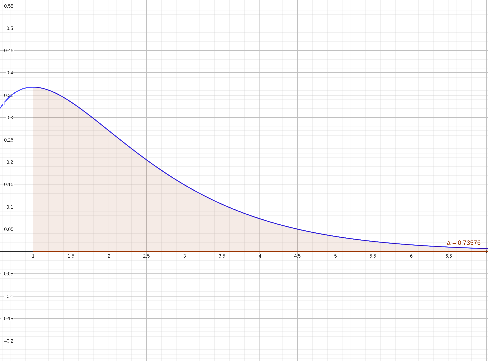
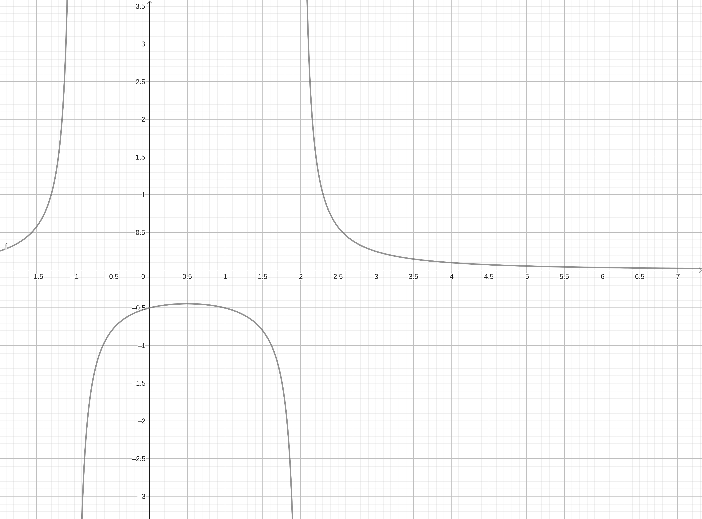
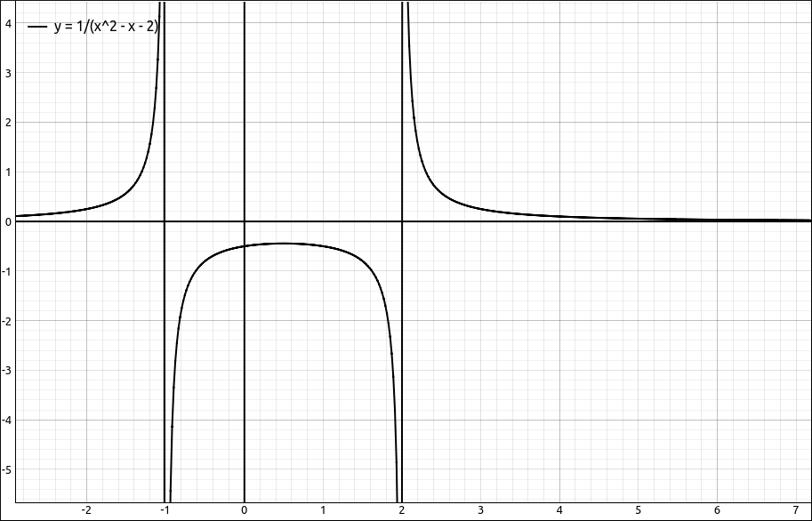

:index:`Improper Integrals`
===========================

Discussion & Definitions
------------------------

There are basically two types of improper integrals, integrating over an infinite interval or integrating over a region where the function is discontinuous, usually where there is a vertical asymptote to the function.  In both cases the region bounded by the function and the curve is infinite but surprisingly it can have finite area.

We will start out with integrating over an infinite interval, that is, if one or both of the bounds are :math:`\pm \infty`.

.. admonition:: Definition: Improper Integral over an Infinite Interval

    1. If a function :math:`f(x)` is continuous over an interval of the form :math:`[a, \infty)`. Then

    .. math::
        \int_a^{\infty} f(x) \; dx = \lim_{t \to \infty} \int_a^t f(x) \; dx

    provided this limit exists.

    2. If a function :math:`f(x)` is continuous over an interval of the form :math:`(-\infty, a]`. Then

    .. math::
        \int_{-\infty}^{a} f(x) \; dx = \lim_{t \to -\infty} \int_t^a f(x) \; dx

    provided this limit exists.

    In each case, if the limit exists, then the **improper integral** is said to converge. If the limit does not exist, then
    the improper integral is said to diverge.

    3. If a function :math:`f(x)` is continuous over the interval :math:`(-\infty, \infty)`. Then

    .. math::
        \int_{-\infty}^{\infty} f(x) \; dx = \int_{-\infty}^{a} f(x) \; dx + \int_a^{\infty} f(x) \; dx = \lim_{t \to -\infty} \int_t^a f(x) \; dx + \lim_{t \to \infty} \int_a^t f(x) \; dx

    for any real number :math:`a`, provided that both of the limits exists.  If either limit does not exist then the integral diverges, even if the other does exist.

.. note::

    Be careful,

    .. math::
        \int_{-\infty}^{\infty} f(x) \; dx \neq \lim_{t \to \infty} \int_{-t}^{t} f(x) \; dx

For example,

.. math::
    \int_2^{\infty} \frac{1}{x^2} \; dx = \lim_{t \to \infty} \int_2^t \frac{1}{x^2} \; dx = \lim_{t \to \infty} \frac{1}{2} - \frac{1}{t} = \frac{1}{2}

    :math:`f(x) = \frac{1}{x^2}`

On the other hand,

.. math::
    \int_2^{\infty} \frac{1}{x} \; dx = \lim_{t \to \infty} \int_2^t \frac{1}{x} \; dx = \lim_{t \to \infty} \ln{\left(t \right)} - \ln{\left(2 \right)} = \infty

    :math:`f(x) = \frac{1}{x}`

Now let's look at the other type, where the function is discontinuous on the interval being integrated over. For example, if we take the function :math:`f(x) = \frac{1}{\sqrt{x}}`, can we integrate from 0 to 1?

    :math:`f(x) = \frac{1}{\sqrt{x}}`

.. admonition:: Definition: Improper Integral Over a Discontinuity

    1. If :math:`f(x)` be continuous over :math:`[a, b)`. Then,

    .. math::
        \int_a^b f(x) \; dx = \lim_{t \to b^-} \int_a^t f(x) \; dx

    if the limit exists.

    2. If :math:`f(x)` be continuous over :math:`(a, b]`. Then,

    .. math::
        \int_a^b f(x) \; dx = \lim_{t \to a^+} \int_t^b f(x) \; dx

    if the limit exists.

    In each case, if the limit exists, then the improper integral is said to converge. If the limit does not exist, then
    the improper integral is said to diverge.

    3. If :math:`f(x)` be continuous over :math:`[a, b]` except for possibly one point :math:`c` in :math:`(a, b)`. Then,

    .. math::
        \int_a^b f(x) \; dx = \int_a^c f(x) \; dx + \int_c^b f(x) \; dx = \lim_{t \to c^-} \int_a^t f(x) \; dx + \lim_{t \to c^+} \int_t^b f(x) \; dx

    provided that both of the limits exists.  If either limit does not exist then the integral diverges, even if the other does exist.

For example, take the function :math:`f(x) = \frac{1}{\sqrt{x}}`,

.. math::
    \int_0^1 \frac{1}{\sqrt{x}} \; dx = \lim_{t \to 0^+} \int_t^1 \frac{1}{\sqrt{x}} \; dx = \lim_{t \to 0^+} 2 - 2 \sqrt{t} = 2

On the other hand,

.. math::
    \int_0^{1} \frac{1}{x} \; dx = \lim_{t \to 0^+} \int_t^1 \frac{1}{x} \; dx = \lim_{t \to 0^+} - \ln{\left(t \right)} = \infty

In many cases finding an exact value for an improper integral can be difficult.  In these cases is it sometimes sufficient to simply determine if an improper integral converges or diverges.

.. admonition:: Theorem: Comparison Theorem for Improper Integrals

    If :math:`f(x)` and :math:`g(x)` are continuous on :math:`[a, \infty)` and :math:`0 \leq f(x) \leq g(x)` for :math:`x \leq a`.  Then

    1. If

    .. math::
        \int_a^{\infty} g(x) \; dx

    converges, then so does

    .. math::
        \int_a^{\infty} f(x) \; dx

    and

    .. math::
        \int_a^{\infty} f(x) \; dx \leq \int_a^{\infty} g(x) \; dx

    2. If

    .. math::
        \int_a^{\infty} f(x) \; dx

    diverges, then so does

    .. math::
        \int_a^{\infty} g(x) \; dx

A quick word about computer algebra systems and improper integrals in general.  Most computer algebra systems will determine if a definite integral is improper in the process of calculating the integral and take the appropriate limits. So you rarely need to go to the lengths of the limit yourself when doing these on the machine.

Example: :math:`\int_1^{\infty} x e^{-x} \; dx`
------------------------------------------------

GeoGebra
^^^^^^^^

Input the function,

.. code-block:: console

    x e^(-x)

then in a new cell type in ``Integral(f, 1, infinity)``. The result is approximate of 0.73576 and it gives you a nice picture of the area.

    :math:`f(x) = x e^{-x}`

CLAE
^^^^

Input the function,

.. code-block:: console

    x * E^(-x)

Now select ``Calculus > Definite Integral``, variable *x*, lower bound is 1, upper bound is ``oo``.  The result is :math:`\frac{2}{e}` which approximates to 0.735758882342885.

We could also have done this by definition.  If we select the function then select ``Calculus > Definite Integral``, variable *x*, lower bound is 1, upper bound is ``t``. We would get the result,

.. math::
    \left(- t - 1\right) e^{- t} + \frac{2}{e}

Then is we select, ``Calculus > Limit``, variable *t*, limit point ``oo`` we would get the same result of :math:`\frac{2}{e}.`

Maxima
^^^^^^

Input the function,

.. code-block:: console

    kill(all);
    f(x):=x * %e^(-x)

then integrate with,

.. code-block:: console

    integrate(f(x), x, 1, inf);

The result is a bit strange, ``gamma_incomplete(2,1)``.  When you approximate this you get 0.7357588823428847.  We could also do this one by definition and maybe get a better exact solution. First do the integral from 1 to ``t`` with,

.. code-block:: console

    de:integrate(f(x), x, 1, t)

then take the limit,

.. code-block:: console

    limit(de, t, inf);

and we end up with :math:`2 {{\% e}^{-1}}`.

Example: :math:`\int_0^{\infty} \sin(x) \; dx`
------------------------------------------------

This integral will diverge since,

.. math::
    \int_0^t \sin(x) \; dx = 1 - \cos{\left(t \right)}

and

.. math::
    \lim_{t \to \infty} 1 - \cos{\left(t \right)}

does not exist.  Let's see how our computer algebra systems deal with this one.

GeoGebra
^^^^^^^^

Input the function,

.. code-block:: console

    sin(x)

then in a new cell type in ``Integral(f, 0, infinity)``. The result is ``?``, which GeoGebra uses for a number of things, in general, it means that it could not do the integral.

CLAE
^^^^

Input the function,

.. code-block:: console

    sin(x)

Now select ``Calculus > Definite Integral``, variable *x*, lower bound is 0, upper bound is ``oo``.  The result is :math:`\left\langle 0, 2\right\rangle` which is what CLAE does with limits that oscillate between two numbers.

Maxima
^^^^^^

We will not bother with the function and just go to the integral,

.. code-block:: console

    integrate(sin(x), x, 0, inf)

The result is,

.. math::
    \int_{0}^{\infty }{\left. \sin{(x)}dx\right.}

saying that Maxima could not do the integral.

Example: :math:`\int_0^{1} \frac{1}{\sqrt{x}} \; dx`
----------------------------------------------------

GeoGebra
^^^^^^^^

Input the function,

.. code-block:: console

    1/sqrt(x)

then in a new cell type in ``Integral(f, 0, 1)``. The result is ``?``, which GeoGebra uses for a number of things, in general, it means that it could not do the integral.  In general, GeoGebra does not evaluate improper integrals of this type very well.

CLAE
^^^^

Input the function,

.. code-block:: console

    1/sqrt(x)

Now select ``Calculus > Definite Integral``, variable *x*, lower bound is 0, upper bound is 1.  The result is 2.

Maxima
^^^^^^

We will not bother with the function and just go to the integral,

.. code-block:: console

    integrate(1/sqrt(x), x, 0, 1)

The result is 2.

Example: :math:`\int_{-\infty}^{\infty} \frac{e^x}{1 + e^{2x}} \; dx`
---------------------------------------------------------------------

GeoGebra
^^^^^^^^

Input the function,

.. code-block:: console

    e^x/(1+e^(2x))

then in a new cell type in ``Integral(f, -infinity, infinity)``. The result is 1.5708.

CLAE
^^^^

Input the function,

.. code-block:: console

    E^x/(1+E^(2*x))

Now select ``Calculus > Definite Integral``, variable *x*, lower bound is ``-oo``, upper bound is ``oo``.  The result is,

.. math::
    \int\limits_{-\infty}^{\infty} \frac{e^{x}}{e^{2 x} + 1}\, dx

which approximates to 1.5707963267949.  Now this was with the course techniques turned off, if we do the same integral with the course techniques turned on we get the exact answer, :math:`\frac{\pi}{2}.`

Maxima
^^^^^^

Input the function,

.. code-block:: console

    kill(all);
    f(x):=%e^x/(1+%e^(2*x))

Then integrate with,

.. code-block:: console

    integrate(f(x), x, -inf, inf);

The result is :math:`\frac{\pi}{2}.`

Example: :math:`\int_{0}^{4} \frac{1}{x^{2} - x - 2} \; dx`
-----------------------------------------------------------

GeoGebra
^^^^^^^^

Input the function,

.. code-block:: console

    1/(x^2 - x - 2)

then in a new cell type in ``Integral(f, 0, 4)``. The result is ``?``.  If we look at the graph,

    :math:`f(x) = \frac{1}{x^{2} - x - 2}`

we can see that there is a discontinuity at :math:`x = 2`.  If we then go back to the definition and look at the integrals,

.. math::

    \int_{0}^{2} \frac{1}{x^{2} - x - 2} \; dx \quad {\rm and } \quad \int_{2}^{4} \frac{1}{x^{2} - x - 2} \; dx

In GeoGebra, both ``Integral(f, 0, 2)`` and ``Integral(f, 2, 4)`` give us ``?`` which is not enough information.

CLAE
^^^^

Input the function,

.. code-block:: console

    1/(x^2 - x - 2)

Now select ``Calculus > Definite Integral``, variable *x*, lower bound is ``0``, upper bound is ``4``.  The result is nan, which stands for "not a number".  This is a good indication that the integral diverges.  Graphing the function shows that there is an asymptote inside the integral bounds.  We could, of course, factor the denominator as well.

    :math:`f(x) = \frac{1}{x^{2} - x - 2}`

If we redo the definite integral from 0 to 2, we get the result, :math:`-\infty - \frac{i \pi}{3}`, which is an interesting output but does indicate that the integral diverges.  Similarly if we redo the integral from 2 to 4 we get :math:`\infty`.  So we know the integral diverges.

Maxima
^^^^^^

Again we will be lazy and just to the integral,

.. code-block:: console

    integrate(1/(x^2 - x - 2), x, 0, 4);

the result is,

.. math::
    {\rm Principal \; Value}

    -\frac{\log{(5)}}{3}\mbox{}

You should have the feel here that something is not quite right.  If we change this to the integral from 0 to 2 we get,

.. code-block:: maxima

    defint: integral is divergent.
    -- an error. To debug this try: debugmode(true);

confirming that the integral diverges.
