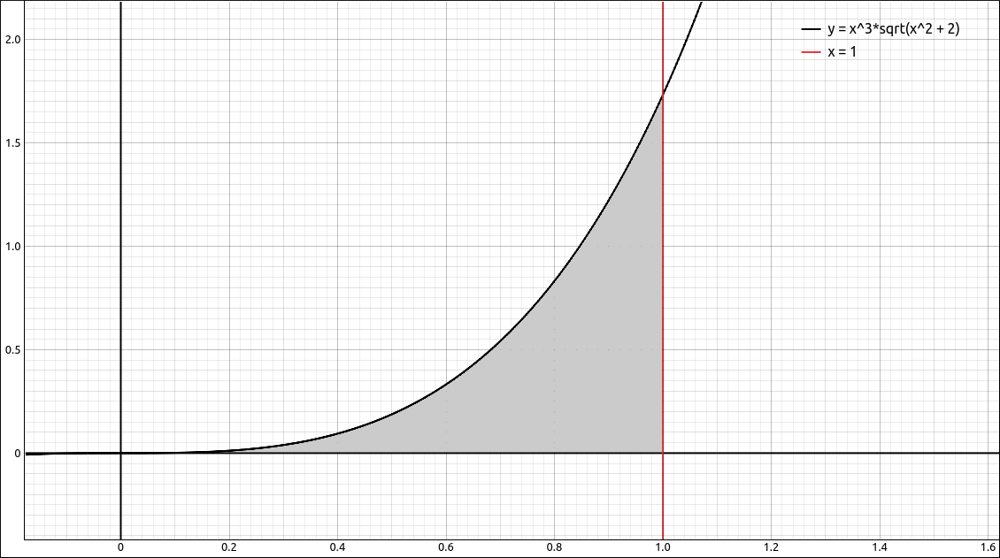

:index:`Techniques of Integration`
==================================

Discussion & Definitions
------------------------

Techniques of integration are simply processes for integrating functions depending on the form of the function.  These include,

- Substitution
- Integration by Parts
- Trigonometric Integrals
- Trigonometric Substitution
- Partial Fractions

Most Calculus textbooks will devote a chapter of more to these techniques.  With the advent and incorporation of computer algebra systems into college-level Calculus classes, how much emphasis is placed on these techniques varies from professor to professor.  Some will go over all the techniques as they did before the use of computer algebra systems and others will rely more on the machine to do their dirty work.  Since ths set of tutorials is geared more toward the use of GeoGebra, CLAE, and Maxima in the Calculus sequence we will not go over the techniques here but leave it to your professor and textbook for details.  We will recap the integration commands here and go over a few examples using the technology.

One thing to keep in mind is that although all of these methods are written into the CAS software we ae using, each implementation is different.  So you may do the integrals in all three packages and get three seemingly different results.  In fact, some might return a result when others do not. These solutions may even be different then what you got when you did them by hand.

One way to check if two solutions are equivalent is to take their difference, either by hand or on the machine.  If the difference is a constant (not necessarily zero) then the two solutions are equivalent.  It might be hard for you, or the machine, to simplify the difference down to a constant.  Another alternative is to let the machine graph the difference, if you get a horizontal line then you know (or at least you are fairly sure) that the difference is a constant and hence the solutions are equivalent.

Example :math:`\int \frac{x}{1 + e^{- x^{2}}} \; dx`
----------------------------------------------------

GeoGebra
^^^^^^^^

Input the function,

.. code-block:: console

    x/(1 + exp(-x^2))

Then in a new cell type in ``Integrate(f)`` and the result will be,

.. math::
    \frac{x^{2}}{2} + \frac{\ln{\left(1 + e^{- x^{2}} \right)}}{2}

CLAE
^^^^

Input the function,

.. code-block:: console

    x/(1 + exp(-x^2))

Then select ``Calculus > Indefinite Integral``, variable *x*, and turn the course techniques on.   The result is,

.. math::
    \frac{x^{2}}{2} + \frac{\ln{\left(1 + e^{- x^{2}} \right)}}{2}

Maxima
^^^^^^

Input the function,

.. code-block:: console

    kill(all);
    f(x):=x/(1 + exp(-x^2))

Then integrate with

.. code-block:: console

    integrate(f(x), x)

The result is,

.. math::
    \frac{\log{\left( {{\% e}^{-{{x}^{2}}}}+1\right) }+{{x}^{2}}}{2}\mbox{}

.. note::

    In all three cases we can see that each of these solutions are identical.

Example :math:`\int \frac{1}{\sin{\left(x \right)} + 1} \; dx`
--------------------------------------------------------------

GeoGebra
^^^^^^^^

Using the method in the first example, find

.. math::
    \int \frac{1}{\sin{\left(x \right)} + 1} \; dx

The result will be,

.. math::
    - \frac{2}{\tan{\left(\frac{x}{2} \right)} + 1}

CLAE
^^^^

Using the method in the first example, find

.. math::
    \int \frac{1}{\sin{\left(x \right)} + 1} \; dx

The result will be,

.. math::
    - \frac{2}{\tan{\left(\frac{x}{2} \right)} + 1}

Maxima
^^^^^^

Using the method in the first example, find

.. math::
    \int \frac{1}{\sin{\left(x \right)} + 1} \; dx

The result will be,

.. math::
    -\frac{2}{\frac{\sin{(x)}}{\cos{(x)}+1}+1}\mbox{}

.. note::

    The results from GeoGebra and CLAE are identical but there is a slight difference with the output of Maxima.  If we take the difference between the CLAE/GeoGebra and Maxima outputs,

    .. code-block:: console

        -2/(tan(x/2) + 1) + 2/(1 + sin(x)/(cos(x) + 1))

    If we put this back into GeoGebra you will notice that the graph is a horizontal line at 0, good indication that these are equivalent.  In GeoGebra, if you input ``Simplify`` and then the above function it does simplify to 0.  In CLAE, if you graph this function you will get a horizontal line at 0.  In Maxima, it takes a few simplification steps,

    .. code-block:: console

        sd:-2/(tan(x/2) + 1) + 2/(1 + sin(x)/(cos(x) + 1));
        sd2:ratsimp(sd);
        sd3:trigsimp(sd2);
        sd4:trigreduce(sd3);

    .. math::
        \frac{2}{\frac{\sin{(x)}}{\cos{(x)}+1}+1}-\frac{2}{\tan{\left( \frac{x}{2}\right) }+1}\mbox{}

    .. math::
        -\frac{2 \sin{(x)}-2 \tan{\left( \frac{x}{2}\right) } \cos{(x)}-2 \tan{\left( \frac{x}{2}\right) }}{\left( \tan{\left( \frac{x}{2}\right) }+1\right)  \sin{(x)}+\left( \tan{\left( \frac{x}{2}\right) }+1\right)  \cos{(x)}+\tan{\left( \frac{x}{2}\right) }+1}\mbox{}

    .. math::
        -\frac{2 \cos{\left( \frac{x}{2}\right) } \sin{(x)}-2 \sin{\left( \frac{x}{2}\right) } \cos{(x)}-2 \sin{\left( \frac{x}{2}\right) }}{\left( \sin{\left( \frac{x}{2}\right) }+\cos{\left( \frac{x}{2}\right) }\right)  \sin{(x)}+\left( \sin{\left( \frac{x}{2}\right) }+\cos{\left( \frac{x}{2}\right) }\right)  \cos{(x)}+\sin{\left( \frac{x}{2}\right) }+\cos{\left( \frac{x}{2}\right) }}\mbox{}

    .. math::
        0\mbox{}

Example :math:`\int_0^1 x^{3} \sqrt{x^{2} + 2} \; dx`
-----------------------------------------------------

In this example we will find the indefinite integral of

.. math::
    \int x^{3} \sqrt{x^{2} + 2} \; dx

as well as the definite integral,

.. math::
    \int_0^1 x^{3} \sqrt{x^{2} + 2} \; dx

The shaded region below,

    :math:`f(x) = \sqrt{x^{2} + 2}`

GeoGebra
^^^^^^^^

Using the above method for the indefinite integral we get.

.. math::
    \frac{\left(x^{2} + 2\right)^{\frac{5}{2}}}{5} - \frac{2 \left(x^{2} + 2\right)^{\frac{3}{2}}}{3}

For the definite integral, we use the command ``Integrate(f, 0, 1)`` and get the approximation, 0.40784.

CLAE
^^^^

Using the above method for the indefinite integral we get.

.. math::
    \frac{\sqrt{x^{2} + 2} \left(3 x^{4} + 2 x^{2} - 8\right)}{15}

For the definite integral we select ``Calculus > Definite Integral``, variable *x*, lower bound 0 and upper bound 1, we get,

.. math::
    - \frac{\sqrt{3}}{5} + \frac{8 \sqrt{2}}{15}

which approximates to 0.407837071751875.

Maxima
^^^^^^

In Maxima we can do this in one input, or you can run each of these lines separately,

.. code-block:: console

    kill(all);
    f(x):=x^3*sqrt(x^2 + 2);
    integrate(f(x), x);
    integrate(f(x), x, 0, 1);

The results are,

.. math::
    \operatorname{f}(x)\operatorname{:=}{{x}^{3}} \sqrt{{{x}^{2}}+2}\mbox{}

.. math::
    \frac{{{x}^{2}} {{\left( {{x}^{2}}+2\right) }^{\frac{3}{2}}}}{5}-\frac{4 {{\left( {{x}^{2}}+2\right) }^{\frac{3}{2}}}}{15}\mbox{}

.. math::
    \frac{{{2}^{\frac{7}{2}}}}{15}-\frac{\sqrt{3}}{5}\mbox{}

Example :math:`\int \frac{1}{3 \sin{\left(x \right)} + 4 \cos{\left(x \right)}} \; dx`
--------------------------------------------------------------------------------------

GeoGebra
^^^^^^^^

Input the function,

.. code-block:: console

    1/(3 sin(x)+4 cos(x))

In a new cell type in ``Integral(f)``, the result is,

.. math::
    - \frac{\ln{\left(\left|{\tan{\left(\frac{x}{2} \right)} - 2}\right| \right)}}{5} + \frac{\ln{\left(\left|{2 \tan{\left(\frac{x}{2} \right)} + 1}\right| \right)}}{5}

CLAE
^^^^

Input the function,

.. code-block:: console

    1/(3*sin(x) + 4*cos(x))

Then select ``Calculus > Indefinite Integral``, variable *x*, and leave the course techniques off.   The result is,

.. math::
    - \frac{\ln{\left(\tan{\left(\frac{x}{2} \right)} - 2 \right)}}{5} + \frac{\ln{\left(2 \tan{\left(\frac{x}{2} \right)} + 1 \right)}}{5}

Maxima
^^^^^^

Input the function,

.. code-block:: console

    kill(all);
    f(x):=1/(3*sin(x) + 4*cos(x))

then integrate with,

.. code-block:: console

    integrate(f(x), x);

the result is

.. math::
    2 \left( \frac{\log{\left( \frac{2 \sin{(x)}}{\cos{(x)}+1}+1\right) }}{10}-\frac{\log{\left( \frac{\sin{(x)}}{\cos{(x)}+1}-2\right) }}{10}\right) \mbox{}

Example :math:`\int \sin^{6}{\left(x \right)} \cos^{4}{\left(x \right)} \; dx`
------------------------------------------------------------------------------

GeoGebra
^^^^^^^^

Input the function,

.. code-block:: console

    sin(x)^6 cos(x)^4

In a new cell type in ``Integral(f)``, the result is,

.. math::
    \frac{3 x}{256} - \frac{\sin{\left(2 x \right)}}{512} - \frac{\sin{\left(4 x \right)}}{256} + \frac{\sin{\left(6 x \right)}}{1024} + \frac{\sin{\left(8 x \right)}}{2048} - \frac{\sin{\left(10 x \right)}}{5120}

CLAE
^^^^

Input the function,

.. code-block:: console

    sin(x)^6*cos(x)^4

Then select ``Calculus > Indefinite Integral``, variable *x*, and leave the course techniques off.   The result is,

.. math::
    \frac{3 x}{256} - \frac{\left(1 - \cos{\left(2 x \right)}\right)^{4} \sin{\left(2 x \right)}}{320} + \frac{11 \left(1 - \cos{\left(2 x \right)}\right)^{3} \sin{\left(2 x \right)}}{1280} - \frac{\left(1 - \cos{\left(2 x \right)}\right)^{2} \sin{\left(2 x \right)}}{1280} - \frac{\sin{\left(2 x \right)}}{128} + \frac{\sin{\left(4 x \right)}}{1024}

and with the course techniques on,

.. math::
    \frac{3 x}{256} - \frac{\sin^{5}{\left(2 x \right)}}{320} - \frac{\sin{\left(4 x \right)}}{256} + \frac{\sin{\left(8 x \right)}}{2048}

Maxima
^^^^^^

Input the function,

.. code-block:: console

    kill(all);
    f(x):=sin(x)^6*cos(x)^4

then integrate with,

.. code-block:: console

    integrate(f(x), x);

the result is

.. math::
    \frac{\frac{\frac{\frac{\sin{\left( 8 x\right) }}{2}+4 x}{8}-\frac{\sin{\left( 4 x\right) }}{2}+x}{4}-\frac{{{\sin{\left( 2 x\right) }}^{5}}}{10}}{32}\mbox{}

simplifying gives,

.. math::
    \frac{5 \sin{\left( 8 x\right) }-40 \sin{\left( 4 x\right) }-32 {{\sin{\left( 2 x\right) }}^{5}}+120 x}{10240}\mbox{}

Example :math:`\int_0^{\pi/2} \frac{\sin^{n}{\left(x \right)}}{\sin^{n}{\left(x \right)} + \cos^{n}{\left(x \right)}} \; dx`
----------------------------------------------------------------------------------------------------------------------------

This was taken from Thomas' Calculus Early Transcendentals Thirteenth Edition

The goal is to find

.. math::
    \int_0^{\pi/2} \frac{\sin^{n}{\left(x \right)}}{\sin^{n}{\left(x \right)} + \cos^{n}{\left(x \right)}} \; dx

where :math:`n` is an arbitrary positive integer.

Their first question was, does your CAS find the result?  If we put this into CLAE and do the definite integral with course techniques selected the integral comes back to us (unevaluated) fairly quickly.  With the course techniques unselected the program worked on it until it exhausted my computer's memory.  In Maxima it asked a question about the value of :math:`n-1` and then returned the integral also unevaluated.

The next question was to evaluate the integral when :math:`n = 1, 2, 3, 5, {\rm \; and \;} 7`.

CLAE
^^^^

Input the function,

.. code-block:: console

    sin(x)^n/(sin(x)^n + cos(x)^n)

Use ``Algebra > Evaluate``, with the variable *n* and the expression 1.  This returns,

.. math::
    \frac{\sin{\left(x \right)}}{\sin{\left(x \right)} + \cos{\left(x \right)}}

Now do the definite integral from 0 to :math:`\pi/2` and the result is :math:`\pi/4`.

Do the same with :math:`n = 2, 3, 4, 5, 6, {\rm \; and \;} 7`.  With :math:`n = 2, 3, 4, {\rm \; and \;} 6` the results are all :math:`\pi/4`.  With :math:`n = 5` the course techniques on gave us,

.. math::
    - 10 \int\limits_{0}^{\frac{\pi}{2}} \frac{\sin{\left(x \right)}}{16 \sin^{5}{\left(x \right)} + 16 \cos^{5}{\left(x \right)}}\, dx + 16 \int\limits_{0}^{\frac{\pi}{2}} \frac{\sin^{5}{\left(x \right)}}{16 \sin^{5}{\left(x \right)} + 16 \cos^{5}{\left(x \right)}}\, dx + 10 \int\limits_{0}^{\frac{\pi}{2}} \frac{\sin{\left(x \right)}}{10 \sin{\left(x \right)} - 5 \sin{\left(3 x \right)} + \sin{\left(5 x \right)} + 10 \cos{\left(x \right)} + 5 \cos{\left(3 x \right)} + \cos{\left(5 x \right)}}\, dx

which approximates to 0.785398163397448, the approximation of :math:`\pi/4`.  With the course techniques off gave us,

.. math::
    \frac{105 \sqrt{5} \pi}{-940 + 420 \sqrt{5}} - \frac{235 \pi}{-940 + 420 \sqrt{5}}

which simplifies to the exact value of :math:`\pi/4`.

With :math:`n = 7` the course techniques on gave us,

.. math::
    - 35 \int\limits_{0}^{\frac{\pi}{2}} \frac{\sin{\left(x \right)}}{64 \sin^{7}{\left(x \right)} + 64 \cos^{7}{\left(x \right)}}\, dx + 64 \int\limits_{0}^{\frac{\pi}{2}} \frac{\sin^{7}{\left(x \right)}}{64 \sin^{7}{\left(x \right)} + 64 \cos^{7}{\left(x \right)}}\, dx + 35 \int\limits_{0}^{\frac{\pi}{2}} \frac{\sin{\left(x \right)}}{35 \sin{\left(x \right)} - 21 \sin{\left(3 x \right)} + 7 \sin{\left(5 x \right)} - \sin{\left(7 x \right)} + 35 \cos{\left(x \right)} + 21 \cos{\left(3 x \right)} + 7 \cos{\left(5 x \right)} + \cos{\left(7 x \right)}}\, dx

which approximates to 0.785398163397448, the approximation of :math:`\pi/4`. With the course techniques off the program ran for some time without producing a result.

Hence our guess would be

.. math::
    \int_0^{\pi/2} \frac{\sin^{n}{\left(x \right)}}{\sin^{n}{\left(x \right)} + \cos^{n}{\left(x \right)}} \; dx = \frac{\pi}{4}

Maxima
^^^^^^

Input the function,

.. code-block:: console

    kill(all);
    f(x,n):=sin(x)^n/(sin(x)^n + cos(x)^n)

Note that we declared this as a function of two variables. This will make it easy to substitute values into *n* and do the integral at the same time.  For :math:`n = 1` we can run,

.. code-block:: console

    integrate(f(x,1), x, 0, %pi/2)

The result is :math:`\pi/4`.  Now change the ``f(x,1)`` to ``f(x,2)``, ``f(x,3)``, ..., ``f(x,7)`` and rerun the integral.

With :math:`n = 2`, it returns an error.

With :math:`n = 3`, it returns :math:`\frac{\log{(4)}}{3}-\frac{2 \log{(2)}}{3}+\frac{{\pi} }{4}` which we can simplify in our heads to :math:`\pi/4`.

With :math:`n = 4`, it returns :math:`\pi/4`.

With :math:`n = 5`, it returns the integral. unevaluated.

With :math:`n = 6`, it returns :math:`\pi/4`.

With :math:`n = 7`, it returns the integral. unevaluated.

This would be a bit more of a leap of faith but our guess might be

.. math::
    \int_0^{\pi/2} \frac{\sin^{n}{\left(x \right)}}{\sin^{n}{\left(x \right)} + \cos^{n}{\left(x \right)}} \; dx = \frac{\pi}{4}

Another, probably better, guess would be that there is a difference depending on the value of *n* since at the end of our examination above the even exponents return :math:`\pi/4` and the odds come out unevaluated. If we check :math:`n = 8`, it too comes back unevaluated.

The Mathematics
^^^^^^^^^^^^^^^

This exercise was developed to show that even modern computer algebra systems have their limitations and that with a little human ingenuity we can solve this in general by hand more efficiently.

If we do a *u*-substitution of :math:`u = \pi/2 - x`, :math:`du = - dx`, so :math:`dx = -du`, and :math:`x = \pi/2 - u` which gives,

.. math::
    \int_0^{\pi/2} \frac{\sin^{n}{\left(x \right)}}{\sin^{n}{\left(x \right)} + \cos^{n}{\left(x \right)}} \; dx & =
    \int_{\pi/2}^0 \frac{\sin^{n}{\left(\pi/2 - u \right)}}{\sin^{n}{\left(\pi/2 - u \right)} + \cos^{n}{\left(\pi/2 - u \right)}} \; (-du) \\
    & = -\int_{\pi/2}^0 \frac{\cos^{n}{\left(u \right)}}{\cos^{n}{\left(u \right)} + \sin^{n}{\left(u \right)}} \; du \\
    & = \int_0^{\pi/2} \frac{\cos^{n}{\left(u \right)}}{\sin^{n}{\left(u \right)} + \cos^{n}{\left(u \right)}} \; du \\
    & = \int_0^{\pi/2} \frac{\cos^{n}{\left(x \right)}}{\sin^{n}{\left(x \right)} + \cos^{n}{\left(x \right)}} \; dx \\

so if we let

.. math::
    I = \int_0^{\pi/2} \frac{\sin^{n}{\left(x \right)}}{\sin^{n}{\left(x \right)} + \cos^{n}{\left(x \right)}} \; dx

we get

.. math::
    2I & = \int_0^{\pi/2} \frac{\sin^{n}{\left(x \right)}}{\sin^{n}{\left(x \right)} + \cos^{n}{\left(x \right)}} \; dx + \int_0^{\pi/2} \frac{\cos^{n}{\left(x \right)}}{\sin^{n}{\left(x \right)} + \cos^{n}{\left(x \right)}} \; dx \\
    & = \int_0^{\pi/2} \frac{\sin^{n}{\left(x \right) + \cos^{n}{\left(x \right)}}}{\sin^{n}{\left(x \right)} + \cos^{n}{\left(x \right)}} \; dx \\
    & = \int_0^{\pi/2} 1 \; dx = \frac{\pi}{2}

Hence

.. math::
    I = \int_0^{\pi/2} \frac{\sin^{n}{\left(x \right)}}{\sin^{n}{\left(x \right)} + \cos^{n}{\left(x \right)}} \; dx= \frac{\pi}{4}

