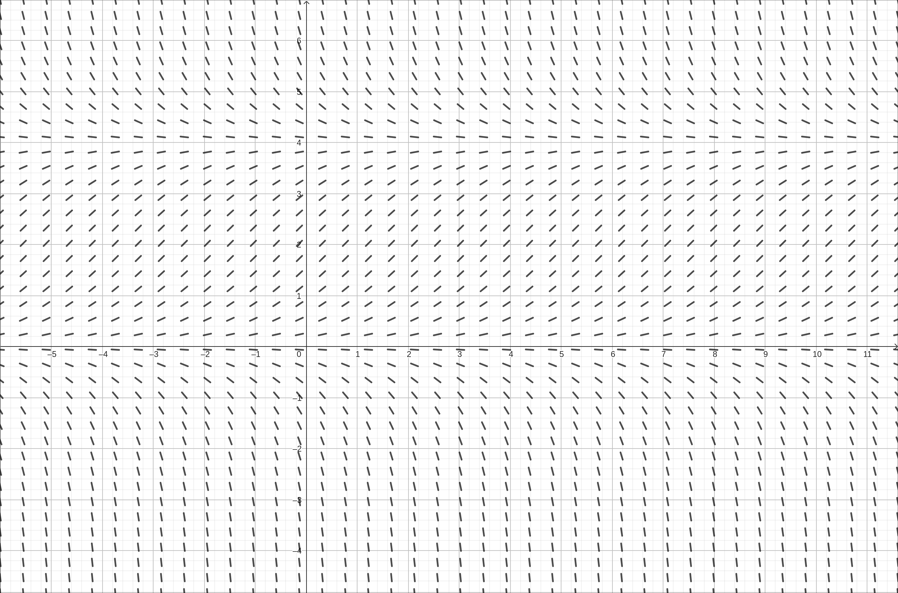
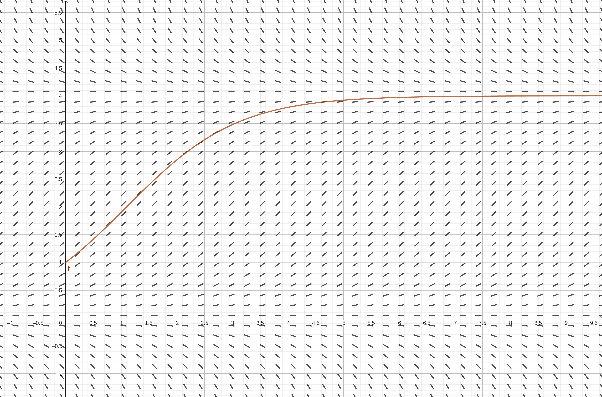
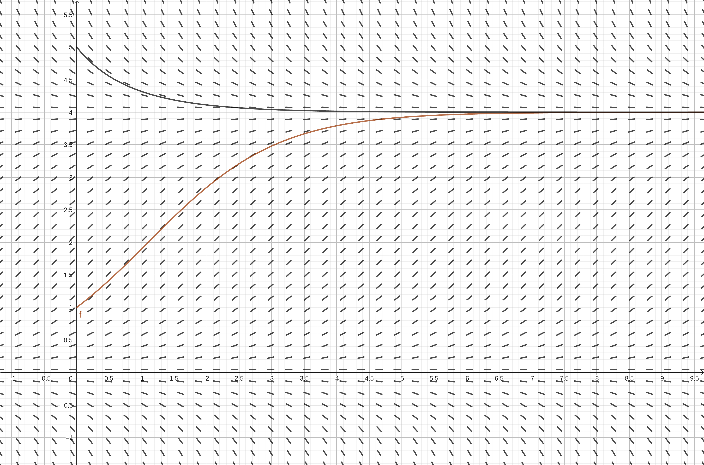
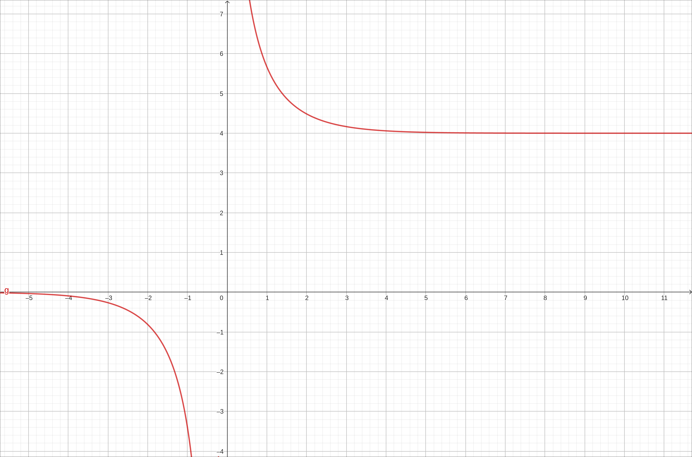
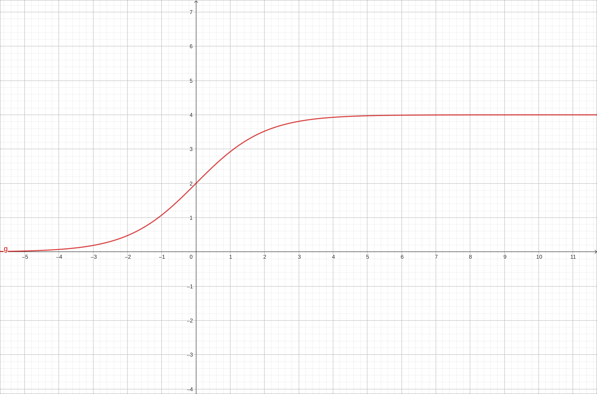
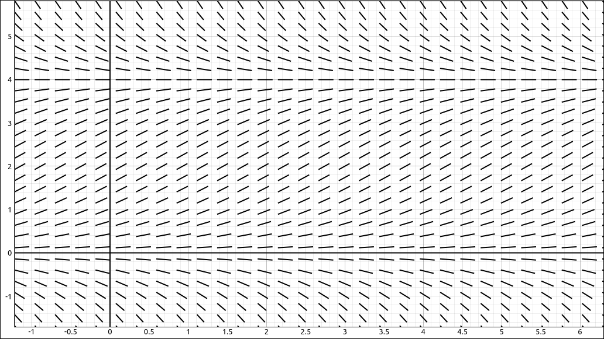
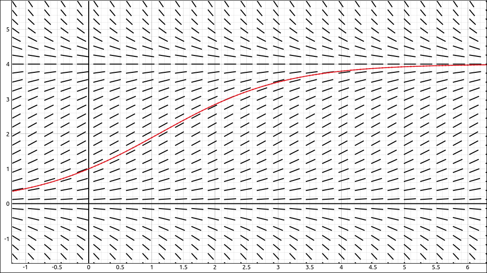
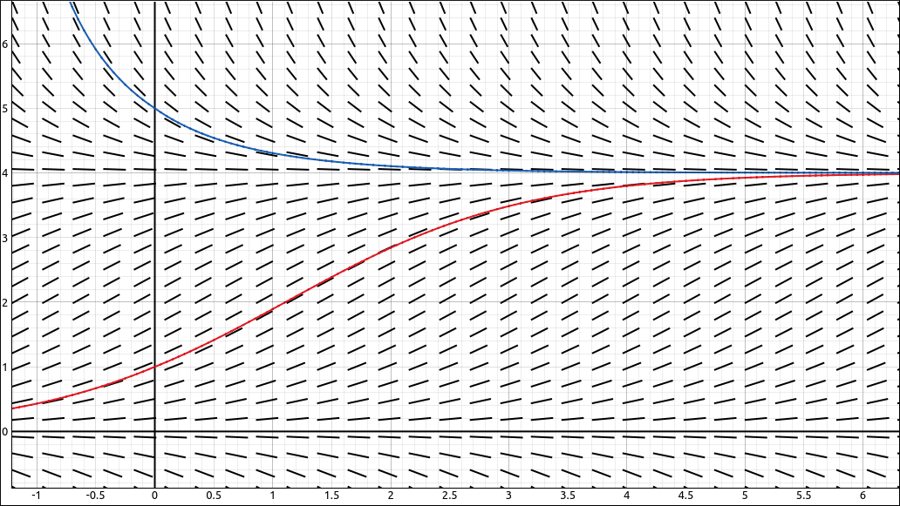
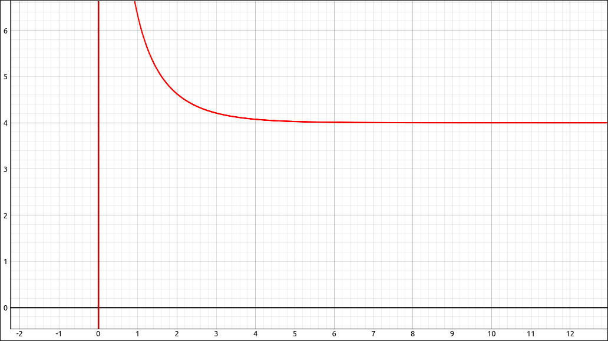
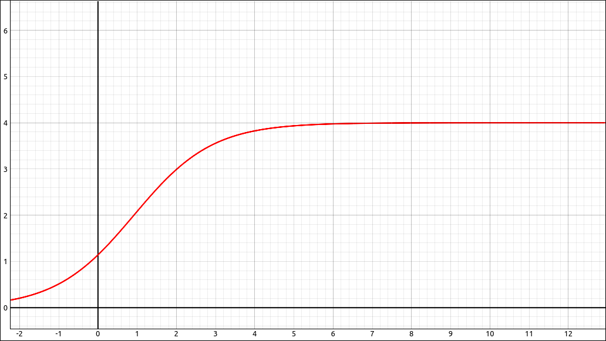

:index:`The Logistic Equation`
==============================

Discussion & Definitions
------------------------

One problem with exponential growth is that it does not take into consideration a limitation on the size of the quantity.  Population is a good example, while when a population is relatively small it will experience exponential growth, a population size is restricted by its environment. For example, food, water, living space, and other resources can limit the size of a population.  So as the population size grows and gets close to an environmental limit the growth rate will usually decrease.  So instead of using an exponential growth equation,

.. math::
    \frac{dP}{dt} = r P

we will add in a factor that will decrease to 0 as the population size gets close to the environmental maximum for the population.

.. math::
    \frac{dP}{dt} = r P \left( 1 - \frac{P}{M} \right)

Here

- *P* is the population size.
- *r* is the growth rate of the population. The growth constant *r* usually takes into consideration the birth and death rates but none of the other factors, and it can be interpreted as a net (birth minus death) percent growth rate per unit time.
- *M* is the maximum environmental size of the population, which is called the population **carrying capacity**.

The solution to the logistic equation can take on several different forms, one form of the solution is,

.. math::
    P(t) = \frac{M}{1+A e^{-kt}} \qquad {\rm with } \qquad A = \frac{M - P_0}{P_0}

where :math:`P_0` is the size of the population at time :math:`t = 0.`

Example: Solving the Logistic Equation
--------------------------------------

In this example we will look at solving the logistic equation using both exact methods and numerical methods.

GeoGebra
^^^^^^^^

Direction Fields and Euler's Method
"""""""""""""""""""""""""""""""""""

Input the expression on the right hand side,

.. code-block:: console

    a(x, y) = r*y*(1-y/m)

Note that we must include the ``a(x,y)`` or GeoGebra will not know that this is an expression in two variables.  Also note that GeoGebra automatically put in sliders for *r* and *m*. Now in a new cell input ``SlopeField(a)``.  Zoom in a bit and set m to about 4 and you will see,

    Slope Field of a(x, y) = r*y*(1-y/m)

Now we will include the Euler curve starting at :math:`(0, 1).` In a new cell input,

.. code-block:: console

    SolveODE(a,0,1,20,0.01)

This will give us,

    Slope Field and Euler Curve of a(x, y) = r*y*(1-y/m)

Note that this is the type of graph you will get when the population starts below the carrying capacity.  If the population starts above the carrying capacity, then our growth factor becomes a decay factor.

Now we will include a second Euler curve starting at :math:`(0, 5).` In a new cell input,

.. code-block:: console

    SolveODE(a,0,5,20,0.01)

This will give us,

    Slope Field and Euler Curves of a(x, y) = r*y*(1-y/m)

Exact Solution
""""""""""""""

Input the expression on the right hand side,

.. code-block:: console

    a(x, y) = r*y*(1-y/m)

Note that we must include the ``a(x,y)`` or GeoGebra will not know that this is an expression in two variables.  Now in a new cell input ``SolveODE(a)``.  This will create another slider that is linked to the constant in front of the exponential portion of the exact solution.  If that slider is set to a positive number then the graph looks like,

    ODE Solution

Which represents the situation when the population size starts above the carrying capacity. If that slider is set to a negative number then the graph looks like,

    ODE Solution

Which represents the situation when the population size starts below the carrying capacity.

CLAE
^^^^

Direction Fields and Euler's Method
"""""""""""""""""""""""""""""""""""

Input the right hand side of the logistic differential equation,

.. code-block:: console

    r*y*(1 - y/M)

Click and drag this over to the graphics window and change the type to Direction Field.  Zoom in a bit and set M to about 4 and you will see,

    Direction Field of :math:`r y \left(1 - \frac{y}{M} \right)`

Now we will include the Euler curve starting at :math:`(0, 1).` Duplicate the direction field object with ``Edit > Duplicate Object`` from the 2-D Graphics Menu.  Change type to Euler's Method Curve, the color to red, and the initial point to :math:`(0, 1)`. At this point you should see,

    Direction Field of :math:`r y \left(1 - \frac{y}{M} \right)`  with Euler's Method Curve

Note that this is the type of graph you will get when the population starts below the carrying capacity.  If the population starts above the carrying capacity, then our growth factor becomes a decay factor.

Now we will include a second Euler curve starting at :math:`(0, 5).` Duplicate the Euler Curve object with ``Edit > Duplicate Object`` from the 2-D Graphics Menu.  Change the color and the initial point to :math:`(0, 5)`. At this point you should see,

    Direction Field of :math:`r y \left(1 - \frac{y}{M} \right)`  with Euler's Method Curves

Exact Solution
""""""""""""""

Input the logistic differential equation,

.. code-block:: console

    f(t).diff(t) - r*f(t)*(1 - f(t)/M)

Now select ``Calculus > Solve ODE``, the result is,

.. math::
    f{\left(t \right)} = \frac{M e^{C_{1} M + r t}}{e^{C_{1} M + r t} - 1}

This is another for for the solution.  Extract the right hand side with ``Algebra > Equations > Right Hand Side``.

.. math::
    \frac{M e^{C_{1} M + r t}}{e^{C_{1} M + r t} - 1}

We will manipulate this expression a little before graphing it.  Select ``Algebra > Evaluate``, in the variable put ``E^(C1*M)`` and in the expression input ``A``.  Note that the evaluator is a bit more versatile than just evaluating variables but does more of a general substitution.

.. math::
    \frac{A M e^{r t}}{A e^{r t} - 1}

Click and drag this over to the graph and you will get a slider for *A*.  If *A* is positive we get,

    ODE Solution

which is the situation when the initial population is above the carrying capacity and if *A* is negative we get the situation when the initial population is below the carrying capacity.

    ODE Solution
